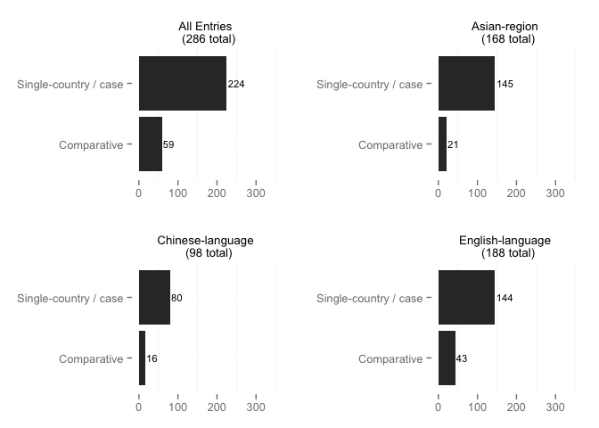
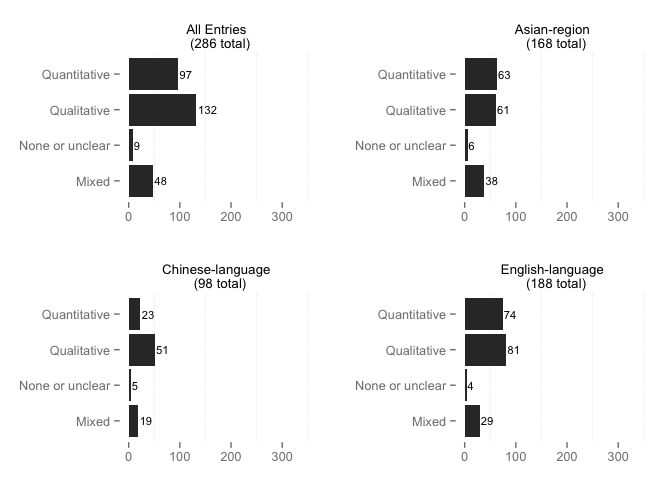
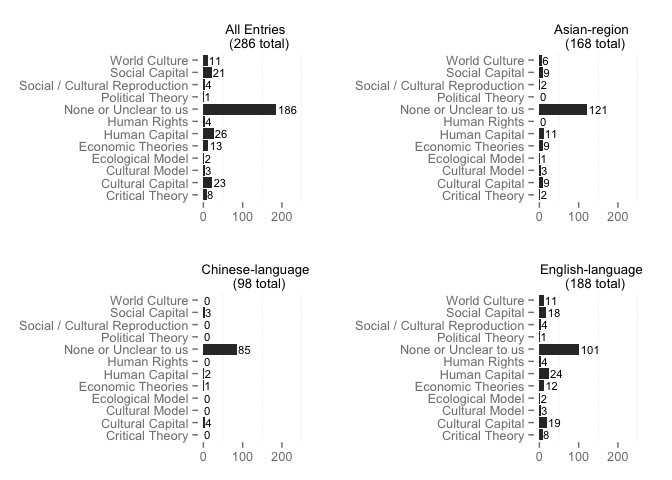
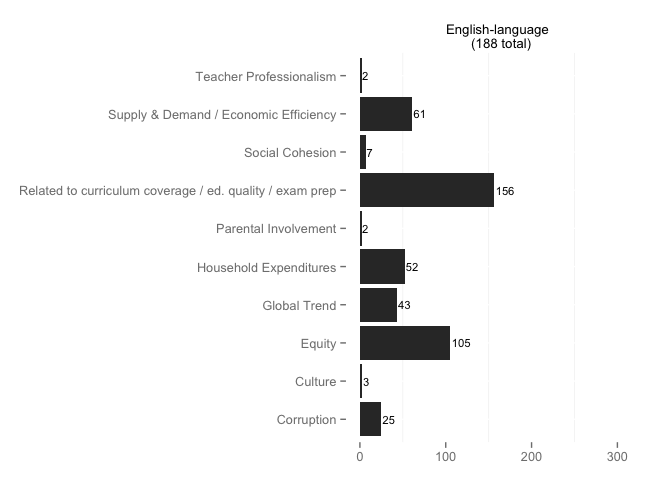
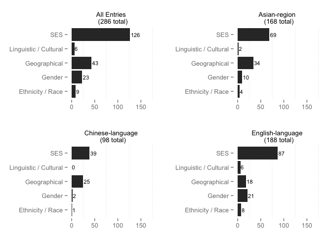
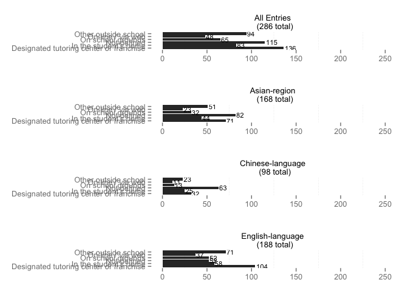
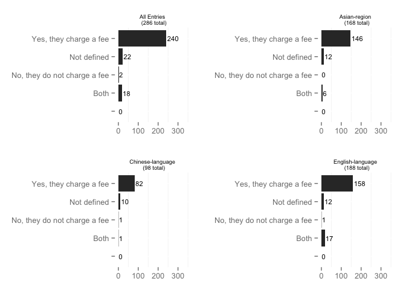
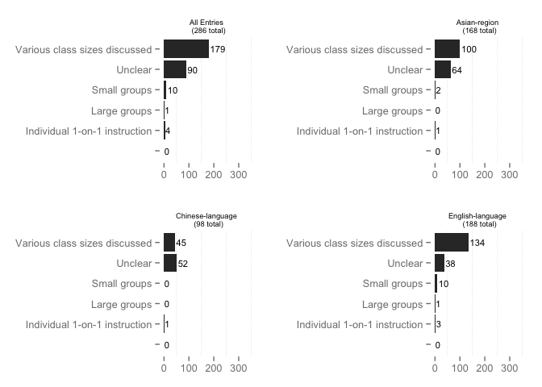
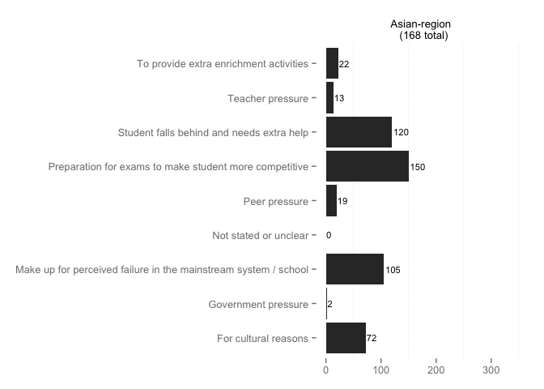
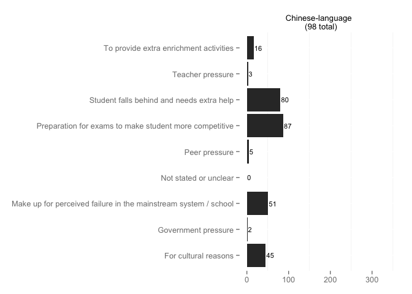

# Descriptives

### TOTAL NUMBER OF PUBLICATIONS: 286
<!-- This number includes 153 articles with duplicate ID numbers (0 Chinese-language, 2 English-language). A full list of duplicate articles can be found [here](https://github.com/MikeRussellMcK/PTAnalysis/blob/master/Markdown%20and%20Output/Duplicates.md). -->
Document was last updated on 2015-01-22 06:53:14.

Throughout this document the data are divided four ways:

* **All Entries or Private** - This dataset includes all rows in the database
* **All Asia** - Using the region column for reference, this dataset includes all articles with Central Asia, East Asia, South Asia, or Southeast Asia selected. Includes both Chinese- and English-language articles.
* **All Chinese** - Using the publication language column for reference, this dataset includes only those articles with Chinese-languge selected. All regions are included.
* **All English** - Using the publication language column for reference, this dataset includes only those articles with English-languge selected. All regions are included.

**Others** lists include entries from all articles. 

## Publication Details

### Type of Publication

 

### Publisher
<table>
<caption>Counts</caption>
 <thead>
  <tr>
   <th align="left"> Var1 </th>
   <th align="right"> Freq </th>
  </tr>
 </thead>
<tbody>
  <tr>
   <td align="left"> 
Asian Economic Journal </td>
   <td align="right"> 1 </td>
  </tr>
  <tr>
   <td align="left">   Research in Teaching   </td>
   <td align="right"> 1 </td>
  </tr>
  <tr>
   <td align="left">  Anthropology and Education Quarterly </td>
   <td align="right"> 1 </td>
  </tr>
  <tr>
   <td align="left">  École des hautes études commerciales, Institut dè́conomie appliquée. </td>
   <td align="right"> 1 </td>
  </tr>
  <tr>
   <td align="left">  University of Hawai'i </td>
   <td align="right"> 1 </td>
  </tr>
  <tr>
   <td align="left">  Walden University </td>
   <td align="right"> 1 </td>
  </tr>
  <tr>
   <td align="left"> AASA Journal of Scholarship and Practice </td>
   <td align="right"> 1 </td>
  </tr>
  <tr>
   <td align="left"> Action in Teacher Education </td>
   <td align="right"> 1 </td>
  </tr>
  <tr>
   <td align="left"> ADB </td>
   <td align="right"> 1 </td>
  </tr>
  <tr>
   <td align="left"> American Educational Research Journal </td>
   <td align="right"> 1 </td>
  </tr>
  <tr>
   <td align="left"> American Journal of Education </td>
   <td align="right"> 1 </td>
  </tr>
  <tr>
   <td align="left"> American Journal of Sociology </td>
   <td align="right"> 1 </td>
  </tr>
  <tr>
   <td align="left"> Anhui University </td>
   <td align="right"> 1 </td>
  </tr>
  <tr>
   <td align="left"> Asia Pacific Education Review </td>
   <td align="right"> 17 </td>
  </tr>
  <tr>
   <td align="left"> BRAC Center </td>
   <td align="right"> 1 </td>
  </tr>
  <tr>
   <td align="left"> British Educational Research Journal </td>
   <td align="right"> 1 </td>
  </tr>
  <tr>
   <td align="left"> British Journal of Sociology of Education </td>
   <td align="right"> 1 </td>
  </tr>
  <tr>
   <td align="left"> Canadian Journal of Sociology </td>
   <td align="right"> 1 </td>
  </tr>
  <tr>
   <td align="left"> Canadian Review of Sociology </td>
   <td align="right"> 1 </td>
  </tr>
  <tr>
   <td align="left"> Capital Normal University University </td>
   <td align="right"> 1 </td>
  </tr>
  <tr>
   <td align="left"> Career Horizon </td>
   <td align="right"> 1 </td>
  </tr>
  <tr>
   <td align="left"> Central China Normal University </td>
   <td align="right"> 5 </td>
  </tr>
  <tr>
   <td align="left"> Childhood Education </td>
   <td align="right"> 1 </td>
  </tr>
  <tr>
   <td align="left"> China Educational Technology & Equipment </td>
   <td align="right"> 1 </td>
  </tr>
  <tr>
   <td align="left"> China-Today Forum </td>
   <td align="right"> 1 </td>
  </tr>
  <tr>
   <td align="left"> Chinese Education and Society </td>
   <td align="right"> 1 </td>
  </tr>
  <tr>
   <td align="left"> Chinese Educational Economic year conference  </td>
   <td align="right"> 1 </td>
  </tr>
  <tr>
   <td align="left"> Chongqing Normal University </td>
   <td align="right"> 1 </td>
  </tr>
  <tr>
   <td align="left"> Columbia University </td>
   <td align="right"> 2 </td>
  </tr>
  <tr>
   <td align="left"> Comparative Education </td>
   <td align="right"> 1 </td>
  </tr>
  <tr>
   <td align="left"> Comparative Education Review </td>
   <td align="right"> 4 </td>
  </tr>
  <tr>
   <td align="left"> Compare </td>
   <td align="right"> 3 </td>
  </tr>
  <tr>
   <td align="left"> Contemporary Educational Science </td>
   <td align="right"> 1 </td>
  </tr>
  <tr>
   <td align="left"> Distance Education </td>
   <td align="right"> 1 </td>
  </tr>
  <tr>
   <td align="left"> East China Normal University </td>
   <td align="right"> 2 </td>
  </tr>
  <tr>
   <td align="left"> Economic Development and Cultural Change </td>
   <td align="right"> 1 </td>
  </tr>
  <tr>
   <td align="left"> Economic Review </td>
   <td align="right"> 1 </td>
  </tr>
  <tr>
   <td align="left"> Economics of Education Review </td>
   <td align="right"> 7 </td>
  </tr>
  <tr>
   <td align="left"> Education & Economy </td>
   <td align="right"> 5 </td>
  </tr>
  <tr>
   <td align="left"> Education and Urban Society </td>
   <td align="right"> 1 </td>
  </tr>
  <tr>
   <td align="left"> Education Economics </td>
   <td align="right"> 2 </td>
  </tr>
  <tr>
   <td align="left"> Education Research  </td>
   <td align="right"> 1 </td>
  </tr>
  <tr>
   <td align="left"> Education Research Monthly </td>
   <td align="right"> 2 </td>
  </tr>
  <tr>
   <td align="left"> Education Teaching Forum </td>
   <td align="right"> 1 </td>
  </tr>
  <tr>
   <td align="left"> Educational Evaluation and Policy Analysis </td>
   <td align="right"> 3 </td>
  </tr>
  <tr>
   <td align="left"> Educational Policy </td>
   <td align="right"> 1 </td>
  </tr>
  <tr>
   <td align="left"> Educational Research and Evaluation: An International Journal on Theory and Practice </td>
   <td align="right"> 1 </td>
  </tr>
  <tr>
   <td align="left"> Educational Studies </td>
   <td align="right"> 1 </td>
  </tr>
  <tr>
   <td align="left"> Educational Studies in Mathematics </td>
   <td align="right"> 1 </td>
  </tr>
  <tr>
   <td align="left"> Eighteenth-Century Life </td>
   <td align="right"> 1 </td>
  </tr>
  <tr>
   <td align="left"> Elementary & Secondary Schooling Abroad </td>
   <td align="right"> 2 </td>
  </tr>
  <tr>
   <td align="left"> European Commission </td>
   <td align="right"> 1 </td>
  </tr>
  <tr>
   <td align="left"> European Education </td>
   <td align="right"> 1 </td>
  </tr>
  <tr>
   <td align="left"> European Journal of Psychology of Education </td>
   <td align="right"> 1 </td>
  </tr>
  <tr>
   <td align="left"> European Sociological Review </td>
   <td align="right"> 1 </td>
  </tr>
  <tr>
   <td align="left"> Frontiers of Education in China </td>
   <td align="right"> 2 </td>
  </tr>
  <tr>
   <td align="left"> Future and Development  </td>
   <td align="right"> 1 </td>
  </tr>
  <tr>
   <td align="left"> Guangxi Normal University </td>
   <td align="right"> 2 </td>
  </tr>
  <tr>
   <td align="left"> Guangzhou University  </td>
   <td align="right"> 1 </td>
  </tr>
  <tr>
   <td align="left"> Guide of Science and Education  </td>
   <td align="right"> 1 </td>
  </tr>
  <tr>
   <td align="left"> Guide to Business  </td>
   <td align="right"> 1 </td>
  </tr>
  <tr>
   <td align="left"> Harvard International Review </td>
   <td align="right"> 1 </td>
  </tr>
  <tr>
   <td align="left"> Harvard University </td>
   <td align="right"> 1 </td>
  </tr>
  <tr>
   <td align="left"> History of Education </td>
   <td align="right"> 1 </td>
  </tr>
  <tr>
   <td align="left"> Hubei University </td>
   <td align="right"> 1 </td>
  </tr>
  <tr>
   <td align="left"> Hunan Normal University </td>
   <td align="right"> 2 </td>
  </tr>
  <tr>
   <td align="left"> Institut für Ethnologie und Afrikastudie </td>
   <td align="right"> 1 </td>
  </tr>
  <tr>
   <td align="left"> Institute for the Study of Labor, Bonn, Germany </td>
   <td align="right"> 3 </td>
  </tr>
  <tr>
   <td align="left"> International Education Journal </td>
   <td align="right"> 1 </td>
  </tr>
  <tr>
   <td align="left"> International Education Studies </td>
   <td align="right"> 1 </td>
  </tr>
  <tr>
   <td align="left"> International J. Soc. Sci. & Education </td>
   <td align="right"> 1 </td>
  </tr>
  <tr>
   <td align="left"> International Journal of Educational Development </td>
   <td align="right"> 3 </td>
  </tr>
  <tr>
   <td align="left"> International Journal of Humanities and Social Science </td>
   <td align="right"> 1 </td>
  </tr>
  <tr>
   <td align="left"> International Perspectives on Education and Society </td>
   <td align="right"> 11 </td>
  </tr>
  <tr>
   <td align="left"> International Review of Education </td>
   <td align="right"> 2 </td>
  </tr>
  <tr>
   <td align="left"> Introduction of Business  </td>
   <td align="right"> 1 </td>
  </tr>
  <tr>
   <td align="left"> Jiangsu Education Research </td>
   <td align="right"> 1 </td>
  </tr>
  <tr>
   <td align="left"> Jiangxi Education </td>
   <td align="right"> 1 </td>
  </tr>
  <tr>
   <td align="left"> Jiangxi Normal University  </td>
   <td align="right"> 1 </td>
  </tr>
  <tr>
   <td align="left"> Jiannan Literature </td>
   <td align="right"> 2 </td>
  </tr>
  <tr>
   <td align="left"> Jilin University </td>
   <td align="right"> 2 </td>
  </tr>
  <tr>
   <td align="left"> Journal for Educational Research Online </td>
   <td align="right"> 3 </td>
  </tr>
  <tr>
   <td align="left"> Journal of Asia Pacific Communication </td>
   <td align="right"> 1 </td>
  </tr>
  <tr>
   <td align="left"> Journal of Changzhou College of Education    </td>
   <td align="right"> 1 </td>
  </tr>
  <tr>
   <td align="left"> Journal of Chengdu University(Educational Sciences Edition)  </td>
   <td align="right"> 1 </td>
  </tr>
  <tr>
   <td align="left"> Journal of Curriculum Studies </td>
   <td align="right"> 2 </td>
  </tr>
  <tr>
   <td align="left"> Journal of Education for Students </td>
   <td align="right"> 1 </td>
  </tr>
  <tr>
   <td align="left"> Journal of Education for Students Placed at Risk </td>
   <td align="right"> 1 </td>
  </tr>
  <tr>
   <td align="left"> Journal of Guangxi University for Nationalities  </td>
   <td align="right"> 1 </td>
  </tr>
  <tr>
   <td align="left"> Journal of Guangxi vocational and technical college   </td>
   <td align="right"> 1 </td>
  </tr>
  <tr>
   <td align="left"> Journal of Hangzhou College of Education    </td>
   <td align="right"> 1 </td>
  </tr>
  <tr>
   <td align="left"> Journal of Hebei Normal Univerisity(Educational Science Version) </td>
   <td align="right"> 1 </td>
  </tr>
  <tr>
   <td align="left"> Journal of Henan Science and Technology University </td>
   <td align="right"> 1 </td>
  </tr>
  <tr>
   <td align="left"> Journal of Hetian Teachers College </td>
   <td align="right"> 1 </td>
  </tr>
  <tr>
   <td align="left"> Journal of Huangshi Education College </td>
   <td align="right"> 1 </td>
  </tr>
  <tr>
   <td align="left"> Journal of Hubei University of Education </td>
   <td align="right"> 1 </td>
  </tr>
  <tr>
   <td align="left"> Journal of Inner Mongolia Normal Univerisity(Educational Science Version) </td>
   <td align="right"> 1 </td>
  </tr>
  <tr>
   <td align="left"> Journal of International and Comparative Education </td>
   <td align="right"> 1 </td>
  </tr>
  <tr>
   <td align="left"> Journal of Japanese studies </td>
   <td align="right"> 2 </td>
  </tr>
  <tr>
   <td align="left"> Journal of Negro Education </td>
   <td align="right"> 1 </td>
  </tr>
  <tr>
   <td align="left"> Journal of Research in Rural Education </td>
   <td align="right"> 1 </td>
  </tr>
  <tr>
   <td align="left"> Journal of Schooling Studies </td>
   <td align="right"> 1 </td>
  </tr>
  <tr>
   <td align="left"> Journal of Schooling Studies  </td>
   <td align="right"> 1 </td>
  </tr>
  <tr>
   <td align="left"> Journal of Teaching and Management </td>
   <td align="right"> 3 </td>
  </tr>
  <tr>
   <td align="left"> Journal of Weifang University </td>
   <td align="right"> 1 </td>
  </tr>
  <tr>
   <td align="left"> Journal of Youth Studies </td>
   <td align="right"> 2 </td>
  </tr>
  <tr>
   <td align="left"> KDI School of Public Policy and Management </td>
   <td align="right"> 1 </td>
  </tr>
  <tr>
   <td align="left"> KEDI Journal of Educational Policy </td>
   <td align="right"> 2 </td>
  </tr>
  <tr>
   <td align="left"> London Review of Education </td>
   <td align="right"> 1 </td>
  </tr>
  <tr>
   <td align="left"> Loyola Marymount University </td>
   <td align="right"> 1 </td>
  </tr>
  <tr>
   <td align="left"> Management of Middle & Primary School  </td>
   <td align="right"> 1 </td>
  </tr>
  <tr>
   <td align="left"> Massey University </td>
   <td align="right"> 1 </td>
  </tr>
  <tr>
   <td align="left"> Master's Thesis of Liaoning Normal University  </td>
   <td align="right"> 1 </td>
  </tr>
  <tr>
   <td align="left"> Nanjing Normal University </td>
   <td align="right"> 3 </td>
  </tr>
  <tr>
   <td align="left"> Network of Education Policy Centers </td>
   <td align="right"> 1 </td>
  </tr>
  <tr>
   <td align="left"> Northeast Normal University </td>
   <td align="right"> 1 </td>
  </tr>
  <tr>
   <td align="left"> Northwest Normal University </td>
   <td align="right"> 2 </td>
  </tr>
  <tr>
   <td align="left"> Northwest Population Journal </td>
   <td align="right"> 1 </td>
  </tr>
  <tr>
   <td align="left"> Ohio State University </td>
   <td align="right"> 1 </td>
  </tr>
  <tr>
   <td align="left"> Open Society Foundations </td>
   <td align="right"> 1 </td>
  </tr>
  <tr>
   <td align="left"> Orbis Scholae </td>
   <td align="right"> 1 </td>
  </tr>
  <tr>
   <td align="left"> Oriental Enterprise Culture </td>
   <td align="right"> 1 </td>
  </tr>
  <tr>
   <td align="left"> OSI </td>
   <td align="right"> 1 </td>
  </tr>
  <tr>
   <td align="left"> Oxford Bulletin of Economics and Statistics </td>
   <td align="right"> 1 </td>
  </tr>
  <tr>
   <td align="left"> Oxford Review of Education </td>
   <td align="right"> 2 </td>
  </tr>
  <tr>
   <td align="left"> Peabody Journal of Education </td>
   <td align="right"> 1 </td>
  </tr>
  <tr>
   <td align="left"> Pennsylvania State University </td>
   <td align="right"> 3 </td>
  </tr>
  <tr>
   <td align="left"> Phi Delta Kappan </td>
   <td align="right"> 1 </td>
  </tr>
  <tr>
   <td align="left"> Procedia-Social and Behavioral Sciences </td>
   <td align="right"> 1 </td>
  </tr>
  <tr>
   <td align="left"> Reading Improvement </td>
   <td align="right"> 1 </td>
  </tr>
  <tr>
   <td align="left"> Research in Comparative and International Education </td>
   <td align="right"> 1 </td>
  </tr>
  <tr>
   <td align="left"> Research in Sociology of Education </td>
   <td align="right"> 1 </td>
  </tr>
  <tr>
   <td align="left"> Research On Education Tsinghua University </td>
   <td align="right"> 2 </td>
  </tr>
  <tr>
   <td align="left"> Research Papers in Education </td>
   <td align="right"> 1 </td>
  </tr>
  <tr>
   <td align="left"> Review of Market Integration </td>
   <td align="right"> 1 </td>
  </tr>
  <tr>
   <td align="left"> Routledge </td>
   <td align="right"> 1 </td>
  </tr>
  <tr>
   <td align="left"> Russian Education and Society </td>
   <td align="right"> 4 </td>
  </tr>
  <tr>
   <td align="left"> Sense Publishers </td>
   <td align="right"> 15 </td>
  </tr>
  <tr>
   <td align="left"> Shangdong Normal University </td>
   <td align="right"> 2 </td>
  </tr>
  <tr>
   <td align="left"> Shanghai Normal University  </td>
   <td align="right"> 1 </td>
  </tr>
  <tr>
   <td align="left"> Shanghai Research on Education </td>
   <td align="right"> 2 </td>
  </tr>
  <tr>
   <td align="left"> Shanxi Financial University </td>
   <td align="right"> 1 </td>
  </tr>
  <tr>
   <td align="left"> Shenzhou Education </td>
   <td align="right"> 1 </td>
  </tr>
  <tr>
   <td align="left"> Social Forces </td>
   <td align="right"> 3 </td>
  </tr>
  <tr>
   <td align="left"> Sociological Forum </td>
   <td align="right"> 1 </td>
  </tr>
  <tr>
   <td align="left"> Sociology of Education </td>
   <td align="right"> 5 </td>
  </tr>
  <tr>
   <td align="left"> Studies of Finance and Accounting in Education  </td>
   <td align="right"> 1 </td>
  </tr>
  <tr>
   <td align="left"> Study of Educational History </td>
   <td align="right"> 1 </td>
  </tr>
  <tr>
   <td align="left"> Survey of Education  </td>
   <td align="right"> 1 </td>
  </tr>
  <tr>
   <td align="left"> Teacher's Education Research </td>
   <td align="right"> 1 </td>
  </tr>
  <tr>
   <td align="left"> Teachers College Record </td>
   <td align="right"> 1 </td>
  </tr>
  <tr>
   <td align="left"> TESOL Quarterly </td>
   <td align="right"> 1 </td>
  </tr>
  <tr>
   <td align="left"> The Developing Economies </td>
   <td align="right"> 1 </td>
  </tr>
  <tr>
   <td align="left"> The Journal of Policy Reform </td>
   <td align="right"> 1 </td>
  </tr>
  <tr>
   <td align="left"> The Science Education Article Collects </td>
   <td align="right"> 3 </td>
  </tr>
  <tr>
   <td align="left"> The Study of New Curriculum </td>
   <td align="right"> 1 </td>
  </tr>
  <tr>
   <td align="left"> The University of Hong Kong </td>
   <td align="right"> 1 </td>
  </tr>
  <tr>
   <td align="left"> Theory and Practice of Education </td>
   <td align="right"> 4 </td>
  </tr>
  <tr>
   <td align="left"> Theory Into Practice </td>
   <td align="right"> 1 </td>
  </tr>
  <tr>
   <td align="left"> UNESCO </td>
   <td align="right"> 4 </td>
  </tr>
  <tr>
   <td align="left"> Union Institute and University Graduate College </td>
   <td align="right"> 1 </td>
  </tr>
  <tr>
   <td align="left"> University of California, Los Angeles </td>
   <td align="right"> 1 </td>
  </tr>
  <tr>
   <td align="left"> University of Chicago Press  </td>
   <td align="right"> 1 </td>
  </tr>
  <tr>
   <td align="left"> University of Maryland </td>
   <td align="right"> 2 </td>
  </tr>
  <tr>
   <td align="left"> University of Minnesota </td>
   <td align="right"> 1 </td>
  </tr>
  <tr>
   <td align="left"> University of Pennsylvania </td>
   <td align="right"> 1 </td>
  </tr>
  <tr>
   <td align="left"> University of Pittsburgh </td>
   <td align="right"> 1 </td>
  </tr>
  <tr>
   <td align="left"> World Bank </td>
   <td align="right"> 3 </td>
  </tr>
  <tr>
   <td align="left"> World Education Information  </td>
   <td align="right"> 1 </td>
  </tr>
  <tr>
   <td align="left"> World Yearbook of Education </td>
   <td align="right"> 1 </td>
  </tr>
  <tr>
   <td align="left"> Yanbian University </td>
   <td align="right"> 1 </td>
  </tr>
  <tr>
   <td align="left"> Young Lives </td>
   <td align="right"> 1 </td>
  </tr>
  <tr>
   <td align="left"> Zhejiang Normal University </td>
   <td align="right"> 1 </td>
  </tr>
</tbody>
</table>

### Publication Year

 

### Publication Language

 

### Type of Research

 
    
#### Research Type Others:

| Private.ID|X.others....gsub.sprintf......s....s.....s.....paste.items..collapse.......... |Private.Reviewer |
|----------:|:------------------------------------------------------------------------------|:----------------|
|         60|Author designs theoretical model private tutoring                              |Mike             |
|        109|Theoretical                                                                    |Hang Duong       |
|         97|Secondary research                                                             |Damian Wyman     |

## Subjects and Approach

### Country or Countries Studied

<table>
<caption>Counts</caption>
 <thead>
  <tr>
   <th align="left"> Var1 </th>
   <th align="right"> Freq </th>
  </tr>
 </thead>
<tbody>
  <tr>
   <td align="left">  </td>
   <td align="right"> 0 </td>
  </tr>
  <tr>
   <td align="left"> Australia </td>
   <td align="right"> 2 </td>
  </tr>
  <tr>
   <td align="left"> Azerbaijan, Bosnia & Herzegovina, Croatia, Estonia, Georgia </td>
   <td align="right"> 1 </td>
  </tr>
  <tr>
   <td align="left"> Azerbaijan, Bosnia and Herzegovina, Croatia, Georgia, Lithuania, Mongolia, Poland, Slovakia, and Ukraine, Kazakhstan, Kyrgyzstan, and Tajikistan </td>
   <td align="right"> 1 </td>
  </tr>
  <tr>
   <td align="left"> Azerbaijan, Georgia, Ukraine, Croatia, Lithuania, B&H, Mongolia, Poland, Slovakia </td>
   <td align="right"> 1 </td>
  </tr>
  <tr>
   <td align="left"> Bangladesh </td>
   <td align="right"> 3 </td>
  </tr>
  <tr>
   <td align="left"> Bosnia & Herzegovina and Croatia </td>
   <td align="right"> 1 </td>
  </tr>
  <tr>
   <td align="left"> Brazil </td>
   <td align="right"> 2 </td>
  </tr>
  <tr>
   <td align="left"> British </td>
   <td align="right"> 1 </td>
  </tr>
  <tr>
   <td align="left"> Cambodia </td>
   <td align="right"> 4 </td>
  </tr>
  <tr>
   <td align="left"> Canada </td>
   <td align="right"> 6 </td>
  </tr>
  <tr>
   <td align="left"> China </td>
   <td align="right"> 80 </td>
  </tr>
  <tr>
   <td align="left"> Cyprus </td>
   <td align="right"> 1 </td>
  </tr>
  <tr>
   <td align="left"> Egypt </td>
   <td align="right"> 4 </td>
  </tr>
  <tr>
   <td align="left"> England </td>
   <td align="right"> 1 </td>
  </tr>
  <tr>
   <td align="left"> Europe </td>
   <td align="right"> 1 </td>
  </tr>
  <tr>
   <td align="left"> France </td>
   <td align="right"> 1 </td>
  </tr>
  <tr>
   <td align="left"> Georgia </td>
   <td align="right"> 1 </td>
  </tr>
  <tr>
   <td align="left"> Germany </td>
   <td align="right"> 2 </td>
  </tr>
  <tr>
   <td align="left"> global study </td>
   <td align="right"> 8 </td>
  </tr>
  <tr>
   <td align="left"> Great Britain </td>
   <td align="right"> 1 </td>
  </tr>
  <tr>
   <td align="left"> Greece </td>
   <td align="right"> 2 </td>
  </tr>
  <tr>
   <td align="left"> Greek </td>
   <td align="right"> 1 </td>
  </tr>
  <tr>
   <td align="left"> Hong Kong </td>
   <td align="right"> 6 </td>
  </tr>
  <tr>
   <td align="left"> Hong Kong, Macao, Korea, Japan, and Taiwan </td>
   <td align="right"> 1 </td>
  </tr>
  <tr>
   <td align="left"> India </td>
   <td align="right"> 1 </td>
  </tr>
  <tr>
   <td align="left"> India and Pakistan </td>
   <td align="right"> 1 </td>
  </tr>
  <tr>
   <td align="left"> Ireland </td>
   <td align="right"> 2 </td>
  </tr>
  <tr>
   <td align="left"> Italy </td>
   <td align="right"> 2 </td>
  </tr>
  <tr>
   <td align="left"> Japan </td>
   <td align="right"> 9 </td>
  </tr>
  <tr>
   <td align="left"> Japan, South Korea, and Cambodia </td>
   <td align="right"> 1 </td>
  </tr>
  <tr>
   <td align="left"> Jordan </td>
   <td align="right"> 1 </td>
  </tr>
  <tr>
   <td align="left"> Kazakhstan, Kyrgyzstan, Tajikistan </td>
   <td align="right"> 1 </td>
  </tr>
  <tr>
   <td align="left"> Kenya </td>
   <td align="right"> 1 </td>
  </tr>
  <tr>
   <td align="left"> Kuwait </td>
   <td align="right"> 1 </td>
  </tr>
  <tr>
   <td align="left"> Luxembourg </td>
   <td align="right"> 1 </td>
  </tr>
  <tr>
   <td align="left"> Malaysia </td>
   <td align="right"> 1 </td>
  </tr>
  <tr>
   <td align="left"> Maldives </td>
   <td align="right"> 1 </td>
  </tr>
  <tr>
   <td align="left"> Malta </td>
   <td align="right"> 1 </td>
  </tr>
  <tr>
   <td align="left"> Mauritius </td>
   <td align="right"> 1 </td>
  </tr>
  <tr>
   <td align="left"> Poland </td>
   <td align="right"> 1 </td>
  </tr>
  <tr>
   <td align="left"> Portugal </td>
   <td align="right"> 1 </td>
  </tr>
  <tr>
   <td align="left"> Romania </td>
   <td align="right"> 2 </td>
  </tr>
  <tr>
   <td align="left"> Russia </td>
   <td align="right"> 7 </td>
  </tr>
  <tr>
   <td align="left"> Scoland </td>
   <td align="right"> 1 </td>
  </tr>
  <tr>
   <td align="left"> Singapore </td>
   <td align="right"> 3 </td>
  </tr>
  <tr>
   <td align="left"> Slovenia </td>
   <td align="right"> 1 </td>
  </tr>
  <tr>
   <td align="left"> South Korea </td>
   <td align="right"> 18 </td>
  </tr>
  <tr>
   <td align="left"> South Korea and United States </td>
   <td align="right"> 1 </td>
  </tr>
  <tr>
   <td align="left"> South Korea, Taiwan, Romania, and Phillippines </td>
   <td align="right"> 1 </td>
  </tr>
  <tr>
   <td align="left"> Sri Lanka </td>
   <td align="right"> 1 </td>
  </tr>
  <tr>
   <td align="left"> Taiwan </td>
   <td align="right"> 2 </td>
  </tr>
  <tr>
   <td align="left"> the Phillipines </td>
   <td align="right"> 1 </td>
  </tr>
  <tr>
   <td align="left"> Trinidad and Tobago </td>
   <td align="right"> 1 </td>
  </tr>
  <tr>
   <td align="left"> Turkey </td>
   <td align="right"> 8 </td>
  </tr>
  <tr>
   <td align="left"> U.S. </td>
   <td align="right"> 21 </td>
  </tr>
  <tr>
   <td align="left"> U.S. and India </td>
   <td align="right"> 1 </td>
  </tr>
  <tr>
   <td align="left"> U.S. vs S.Korea </td>
   <td align="right"> 1 </td>
  </tr>
  <tr>
   <td align="left"> UK </td>
   <td align="right"> 3 </td>
  </tr>
  <tr>
   <td align="left"> Vietnam </td>
   <td align="right"> 6 </td>
  </tr>
</tbody>
</table>

### Region(s) Studied

 

#### Region(s) Others:

### Levels of Education Discussed

 

### Research Approach

 

#### ResearchApproach Others:

| Private.ID|X.others....gsub.sprintf......s....s.....s.....paste.ResearchApproachNames.. |Private.Reviewer |
|----------:|:----------------------------------------------------------------------------|:----------------|
|         60|Theoretical model                                                            |Mike             |

### Research Methods

 

### Was data set used?

 

#### What data set was used?

<table>
<caption>Counts</caption>
 <thead>
  <tr>
   <th align="left"> Var1 </th>
   <th align="right"> Freq </th>
  </tr>
 </thead>
<tbody>
  <tr>
   <td align="left">  </td>
   <td align="right"> 0 </td>
  </tr>
  <tr>
   <td align="left">  Data comes from a Chinese household expenditure survey in 2006. </td>
   <td align="right"> 1 </td>
  </tr>
  <tr>
   <td align="left">  Data for this study were drawn from the data of Korean Education & Employment Panel [KEEP], a nationally representative baseline survey conducted by the Korea Research Institute for 
Vocational Education and Training [KRIVET] in 2004. </td>
   <td align="right"> 1 </td>
  </tr>
  <tr>
   <td align="left">  the SAS Educational Value-Added Assessment System
(EVAAS) methodology and databases, which constitute core components of the
Tennessee Comprehensive Assessment Program (TCAP), were used for analyzing
provider effects in a highly rigorous manner.  </td>
   <td align="right"> 1 </td>
  </tr>
  <tr>
   <td align="left"> "Korean Education & Employment Panel (KEEP), a nationally representative baseline survey conducted by the Korea Research Institute for Vocational Education and Training in 2004, 9th graders, high school seniors, and vocational school seniors in 2004." p. 215. </td>
   <td align="right"> 1 </td>
  </tr>
  <tr>
   <td align="left"> (i) the 2006 Vietnam Household Living Standards Measurement Survey (VHLSS), (ii) the 19971998 Vietnam Living Standards Measurement Survey (VLSS), (iii) the 2008
Vietnam Household Testing Survey (VHTS) </td>
   <td align="right"> 1 </td>
  </tr>
  <tr>
   <td align="left"> 1,624 Form 3 and Form 6 students in Hong Kong and interviews with 105 students </td>
   <td align="right"> 1 </td>
  </tr>
  <tr>
   <td align="left"> 1,624 secondary students, 967 Grade 9 and 657 Grade 12

101 interviews
 </td>
   <td align="right"> 1 </td>
  </tr>
  <tr>
   <td align="left"> 1988 Family Expenditure Survey  </td>
   <td align="right"> 1 </td>
  </tr>
  <tr>
   <td align="left"> 1995 Social Stratification and Mobility survey (SSM). p.72  </td>
   <td align="right"> 1 </td>
  </tr>
  <tr>
   <td align="left"> 1998 Urban Household Expenditure Survey, Survey on Private Tutoring (1997) </td>
   <td align="right"> 1 </td>
  </tr>
  <tr>
   <td align="left"> 2005-2007 waves of the Korean Education Longitudinal Study (KELS), conducted by the Korean Educational Research Institute (KEDI), seventh graders in base year 2005, N=6,908 </td>
   <td align="right"> 1 </td>
  </tr>
  <tr>
   <td align="left"> 2005-2011 waves of the Korean Education Longitudinal Study and the Seoul Education Longitudinal Study (SELS), which began in 2010. </td>
   <td align="right"> 1 </td>
  </tr>
  <tr>
   <td align="left"> a national survey of 18,000 students o f grades 5 and 8 from 600 schools in 10 different regions in Egypt. </td>
   <td align="right"> 1 </td>
  </tr>
  <tr>
   <td align="left"> A survey of 2143 students and 2449 parents in Samara in Russia </td>
   <td align="right"> 1 </td>
  </tr>
  <tr>
   <td align="left"> achievement tests: Kentucky Core Content Test,  Predictive Assessment Series; surveys </td>
   <td align="right"> 1 </td>
  </tr>
  <tr>
   <td align="left"> Author created survey of schools </td>
   <td align="right"> 1 </td>
  </tr>
  <tr>
   <td align="left"> author's other research's database on English language learning and teaching </td>
   <td align="right"> 1 </td>
  </tr>
  <tr>
   <td align="left"> Chicago Public Schools student database 2007-2010 </td>
   <td align="right"> 1 </td>
  </tr>
  <tr>
   <td align="left"> data collected by author--Secondary 1-7, 630 pupils </td>
   <td align="right"> 1 </td>
  </tr>
  <tr>
   <td align="left"> data collected by author: 600 Kenyan households </td>
   <td align="right"> 1 </td>
  </tr>
  <tr>
   <td align="left"> Data comes from China Family Panel Studies in 2008 </td>
   <td align="right"> 1 </td>
  </tr>
  <tr>
   <td align="left"> Data comes from Chinese Urban Household Education and Employment survey in 2004, which include 4772 households and 4772 students. </td>
   <td align="right"> 1 </td>
  </tr>
  <tr>
   <td align="left"> Data comes from Chinese Urban Household Education and Employment Survey in 2004. </td>
   <td align="right"> 1 </td>
  </tr>
  <tr>
   <td align="left"> Data drawn from a national postal survey of 1136 supplementary schools in British. The survey (compiled from the National Resource Centre (NRC) for Supplementary Schools’ database) was conducted by a London research centre and built upon a previous survey undertaken with supplementary school community language teachers  </td>
   <td align="right"> 1 </td>
  </tr>
  <tr>
   <td align="left"> Educational Longitudinal Study of 2002-2006 conducted by the National Center for Education Statistics--Sample of US high school sophomores in 2002 through their senior years in 2004 and beyond (2006) </td>
   <td align="right"> 1 </td>
  </tr>
  <tr>
   <td align="left"> entrance test scores at UFPE, a major university in the Northeast of Brazil </td>
   <td align="right"> 1 </td>
  </tr>
  <tr>
   <td align="left"> German longitudinal study KESS (“Competencies and Attitudes of Students”) </td>
   <td align="right"> 1 </td>
  </tr>
  <tr>
   <td align="left"> Greek data set of 10% of 1999 university entrants  </td>
   <td align="right"> 1 </td>
  </tr>
  <tr>
   <td align="left"> Household Expenditure Survey (1994) </td>
   <td align="right"> 1 </td>
  </tr>
  <tr>
   <td align="left"> Household survey </td>
   <td align="right"> 1 </td>
  </tr>
  <tr>
   <td align="left"> interview freshmen in college, which include Chinese students and Korea students </td>
   <td align="right"> 1 </td>
  </tr>
  <tr>
   <td align="left"> interview tutors in private tutoring company. </td>
   <td align="right"> 1 </td>
  </tr>
  <tr>
   <td align="left"> Korean Education Longitudinal Study (KELS), conducted by the Korean Educational Research Institute (KEDI) </td>
   <td align="right"> 1 </td>
  </tr>
  <tr>
   <td align="left"> Korean Labor and Income Panel Study (KLIPS) </td>
   <td align="right"> 1 </td>
  </tr>
  <tr>
   <td align="left"> Korean National Assessment of Educational Achievement (NAEA) 2001. </td>
   <td align="right"> 1 </td>
  </tr>
  <tr>
   <td align="left"> Korean panel data
The Korean Labor and Income Panel Survey (KLIPS) data </td>
   <td align="right"> 1 </td>
  </tr>
  <tr>
   <td align="left"> Korean Youth Panel Survey (KYPS) </td>
   <td align="right"> 1 </td>
  </tr>
  <tr>
   <td align="left"> Longitudinal survey of high school students in Japan conducted by the Youth Research Institute in Tokyo in 1980 and 1982 </td>
   <td align="right"> 1 </td>
  </tr>
  <tr>
   <td align="left"> Malaysian Household Expenditure Survey 2004/2005 </td>
   <td align="right"> 1 </td>
  </tr>
  <tr>
   <td align="left"> Mathematics data for eighth-graders from TIMMS 2003 and PISA 2006 </td>
   <td align="right"> 1 </td>
  </tr>
  <tr>
   <td align="left"> Ministry of National Education </td>
   <td align="right"> 1 </td>
  </tr>
  <tr>
   <td align="left"> National Education Longitudinal Study (NESL) </td>
   <td align="right"> 1 </td>
  </tr>
  <tr>
   <td align="left"> National Survey conducted by the Environis polling firm in 1997 </td>
   <td align="right"> 1 </td>
  </tr>
  <tr>
   <td align="left"> observations, interviews </td>
   <td align="right"> 1 </td>
  </tr>
  <tr>
   <td align="left"> OSI </td>
   <td align="right"> 1 </td>
  </tr>
  <tr>
   <td align="left"> OSI student survey </td>
   <td align="right"> 1 </td>
  </tr>
  <tr>
   <td align="left"> OSI student survey (12,000 students surveyed in 12 countries) </td>
   <td align="right"> 1 </td>
  </tr>
  <tr>
   <td align="left"> PISA </td>
   <td align="right"> 2 </td>
  </tr>
  <tr>
   <td align="left"> PISA 2003 </td>
   <td align="right"> 1 </td>
  </tr>
  <tr>
   <td align="left"> primary data </td>
   <td align="right"> 2 </td>
  </tr>
  <tr>
   <td align="left"> primary data (ethnography) </td>
   <td align="right"> 1 </td>
  </tr>
  <tr>
   <td align="left"> primary data (survey of 1,170 parents, interview of 58 parents) </td>
   <td align="right"> 1 </td>
  </tr>
  <tr>
   <td align="left"> primary data from interview and survey </td>
   <td align="right"> 1 </td>
  </tr>
  <tr>
   <td align="left"> Researcher designed survey </td>
   <td align="right"> 1 </td>
  </tr>
  <tr>
   <td align="left"> School Leaver Survey, 2004; Schools Database, 1994 </td>
   <td align="right"> 1 </td>
  </tr>
  <tr>
   <td align="left"> Some information drawn from 72 teachers interviewed and 198 parents surveyed in Cambodia by author </td>
   <td align="right"> 1 </td>
  </tr>
  <tr>
   <td align="left"> survey administrated by the Turkish Higher Education Council, 2002 </td>
   <td align="right"> 1 </td>
  </tr>
  <tr>
   <td align="left"> Survey conducted by author </td>
   <td align="right"> 42 </td>
  </tr>
  <tr>
   <td align="left"> Survey conducted by author  </td>
   <td align="right"> 2 </td>
  </tr>
  <tr>
   <td align="left"> Survey conducted by author in Shandong province of China. </td>
   <td align="right"> 1 </td>
  </tr>
  <tr>
   <td align="left"> Survey conducted by author. </td>
   <td align="right"> 1 </td>
  </tr>
  <tr>
   <td align="left"> Survey conducted by Ministry of Education in Jordan in 2006 </td>
   <td align="right"> 1 </td>
  </tr>
  <tr>
   <td align="left"> Survey on the Status of Private Tutoring and the Study of the Policy Measures to
Reduce Private Tutoring Expenses conducted by Korean Education Development Institute (KEDI) in 2007 </td>
   <td align="right"> 1 </td>
  </tr>
  <tr>
   <td align="left"> Taiwan Education Panel Survey  </td>
   <td align="right"> 1 </td>
  </tr>
  <tr>
   <td align="left"> The data for this study came from three sources: 1) the National Survey on Learning Expenditure of Households (NSLEH) (1994, 1996, 1998, 2000, and 2002); 2) the National Household Expenditure Survey (NHES) (1984-2003); and 3) the original data of private school parents and local education committees collected in September-November 2004. </td>
   <td align="right"> 1 </td>
  </tr>
  <tr>
   <td align="left"> The empirical testing was confined to three premier secondary schools in Singapore. </td>
   <td align="right"> 1 </td>
  </tr>
  <tr>
   <td align="left"> The fieldwork began in August of 1985, after a pilot interview study of 12 ronin students in April
and May of 1985, and ended in August of 1986. In December 1985, self-administered
questionnaires were distributed to all ronin students attending classes in the yobiko at that
time. </td>
   <td align="right"> 1 </td>
  </tr>
  <tr>
   <td align="left"> the Korea Education Longitudinal Study (KELS) </td>
   <td align="right"> 1 </td>
  </tr>
  <tr>
   <td align="left"> the Korean Education and Employment Panel (KEEP) conducted by the Korea Research Institute for Vocational Education and Training (KRIVET) </td>
   <td align="right"> 1 </td>
  </tr>
  <tr>
   <td align="left"> the Korean Educational Longitudinal Survey (KELS) </td>
   <td align="right"> 1 </td>
  </tr>
  <tr>
   <td align="left"> the National Education Longitudinal Study and includes approximately 7,600 students who attended high school between 1990 and 1992. </td>
   <td align="right"> 1 </td>
  </tr>
  <tr>
   <td align="left"> This paper focuses on private tutoring in Hong Kong in 2011/2012. It draws on data collected through
questionnaires from students in Grades 9 and 12 </td>
   <td align="right"> 1 </td>
  </tr>
  <tr>
   <td align="left"> This research uses publicly released data sets, the Taiwan Education Panel
Survey (TEPS), which was collected in 2001 and 2003 (Chang 2003); TEPS
used a multistage stratified sampling method to survey 20,004 seventh-grade
students in 333 junior high schools. The sampled students were surveyed a
second time when they were in grade 9. </td>
   <td align="right"> 1 </td>
  </tr>
  <tr>
   <td align="left"> this study uses individual level quantitative data for India and Pakistan. For India, they study draws from the School Tells survey (2007-2008, 160 rural primary schools). For Pakistan, data from the 2010 Annual Status of Education Report (ASER) are used (rural regions, children aged 3-16, in 2010).  </td>
   <td align="right"> 1 </td>
  </tr>
  <tr>
   <td align="left"> three datasets from Cyprus Statistical Service, including 2000, 2003, 2009  </td>
   <td align="right"> 1 </td>
  </tr>
  <tr>
   <td align="left"> Three study data: 1. data comes from university rank. 2. data comes from a large, nationwide, cross-sectional study of private expenditures on shadow education for elementary, middle, and high school education conducted by KEDI in 2001. 3. data comes from a series of researches conducted by the KEDI (1977,1982, 1985, 1990,1995,1998).  </td>
   <td align="right"> 1 </td>
  </tr>
  <tr>
   <td align="left"> TIMSS </td>
   <td align="right"> 1 </td>
  </tr>
  <tr>
   <td align="left"> TIMSS 1995 8th grade teacher and student surveys </td>
   <td align="right"> 1 </td>
  </tr>
  <tr>
   <td align="left"> US National Education Longitudinal Survey </td>
   <td align="right"> 1 </td>
  </tr>
  <tr>
   <td align="left"> Various </td>
   <td align="right"> 1 </td>
  </tr>
  <tr>
   <td align="left"> Vietnam Household Living Standards Surveys </td>
   <td align="right"> 1 </td>
  </tr>
  <tr>
   <td align="left"> Vietnam Living Standards Survey </td>
   <td align="right"> 1 </td>
  </tr>
  <tr>
   <td align="left"> Vietnam Living Standards Surveys 1997-1998 and 1992-1993, from Vietnam’s Ministry of Education and Training. </td>
   <td align="right"> 1 </td>
  </tr>
  <tr>
   <td align="left"> World Bank data, survey of UNICEF officers </td>
   <td align="right"> 1 </td>
  </tr>
  <tr>
   <td align="left"> Young Lives survey </td>
   <td align="right"> 1 </td>
  </tr>
  <tr>
   <td align="left"> Young Lives' Older Cohort of Vietnamese Children (born in 1994), Round 2 Data (from 2006); Students were 12 years old </td>
   <td align="right"> 1 </td>
  </tr>
</tbody>
</table>

### Theoretical Framework

 

#### Theory Others:

<table>
 <thead>
  <tr>
   <th align="right"> Private.ID </th>
   <th align="left"> X.others....gsub.sprintf......s....s.....s.....paste.TheoryNames.. </th>
   <th align="left"> Private.Reviewer </th>
  </tr>
 </thead>
<tbody>
  <tr>
   <td align="right"> 50 </td>
   <td align="left"> System Theory </td>
   <td align="left"> Peggy </td>
  </tr>
  <tr>
   <td align="right"> 61 </td>
   <td align="left"> Parental Involvement  </td>
   <td align="left"> Peggy </td>
  </tr>
  <tr>
   <td align="right"> 71 </td>
   <td align="left"> Historical view </td>
   <td align="left"> Olga </td>
  </tr>
  <tr>
   <td align="right"> 124 </td>
   <td align="left"> Maslow's Hierarchy of Needs </td>
   <td align="left"> Xia Zhao </td>
  </tr>
  <tr>
   <td align="right"> 147 </td>
   <td align="left"> Structural Functionalism </td>
   <td align="left"> Xia Zhao </td>
  </tr>
  <tr>
   <td align="right"> 212 </td>
   <td align="left"> Actor-Network Theory </td>
   <td align="left"> Hang Duong </td>
  </tr>
  <tr>
   <td align="right"> 218 </td>
   <td align="left"> Organizational Field Approach </td>
   <td align="left"> Hang Duong </td>
  </tr>
  <tr>
   <td align="right"> 100 </td>
   <td align="left"> Teacher professionalism, Labor Process Theory, Trait Theory </td>
   <td align="left"> Damian Wyman </td>
  </tr>
  <tr>
   <td align="right"> 118 </td>
   <td align="left"> Various (edited book) </td>
   <td align="left"> Iveta </td>
  </tr>
  <tr>
   <td align="right"> 122 </td>
   <td align="left"> Critical Ethnography </td>
   <td align="left"> Iveta </td>
  </tr>
  <tr>
   <td align="right"> 168 </td>
   <td align="left"> Schein’s Conceptual Framework </td>
   <td align="left"> Peggy </td>
  </tr>
  <tr>
   <td align="right"> 209 </td>
   <td align="left"> Helmke’s (2009) offer-usage model of instructional effects (bw PT and aca achievements) </td>
   <td align="left"> Hang Duong </td>
  </tr>
</tbody>
</table>

### How is private tutoring framed in the publication?

    

#### Framed Others:

<table>
 <thead>
  <tr>
   <th align="right"> Private.ID </th>
   <th align="left"> X.others....gsub.sprintf......s....s.....s.....paste.FramedNames.. </th>
   <th align="left"> Private.Reviewer </th>
  </tr>
 </thead>
<tbody>
  <tr>
   <td align="right"> 218 </td>
   <td align="left"> Organizational Field Approach </td>
   <td align="left"> Hang Duong </td>
  </tr>
  <tr>
   <td align="right"> 125 </td>
   <td align="left"> Resistance  </td>
   <td align="left"> Iveta </td>
  </tr>
  <tr>
   <td align="right"> 110 </td>
   <td align="left"> Personal Learning Experience for College Students </td>
   <td align="left"> Xiaoran Yu </td>
  </tr>
  <tr>
   <td align="right"> 184 </td>
   <td align="left"> Lifelong learning </td>
   <td align="left"> Iveta </td>
  </tr>
</tbody>
</table>

#### If previous answer was equity, then please define equity concern here:

 

### How is private tutoring viewed in the article?

 

### Data drawn from the following stakeholders:

 

#### Stakeholder others:

<table>
 <thead>
  <tr>
   <th align="right"> Private.ID </th>
   <th align="left"> X.others....gsub.sprintf......s....s.....s.....paste.StakeholdersNames.. </th>
   <th align="left"> Private.Reviewer </th>
  </tr>
 </thead>
<tbody>
  <tr>
   <td align="right"> 13 </td>
   <td align="left"> Employers, Workers </td>
   <td align="left"> Mike </td>
  </tr>
  <tr>
   <td align="right"> 17 </td>
   <td align="left"> Juku operators </td>
   <td align="left"> Peggy </td>
  </tr>
  <tr>
   <td align="right"> 24 </td>
   <td align="left"> UNICEF officers </td>
   <td align="left"> Mike </td>
  </tr>
  <tr>
   <td align="right"> 46 </td>
   <td align="left"> tutors </td>
   <td align="left"> Olga </td>
  </tr>
  <tr>
   <td align="right"> 57 </td>
   <td align="left"> 

Designated tutoring
center or franchise 

 </td>
   <td align="left"> Olga </td>
  </tr>
  <tr>
   <td align="right"> 58 </td>
   <td align="left"> Schools </td>
   <td align="left"> Mike </td>
  </tr>
  <tr>
   <td align="right"> 62 </td>
   <td align="left"> Summary of previous research </td>
   <td align="left"> Olga </td>
  </tr>
  <tr>
   <td align="right"> 69 </td>
   <td align="left"> Census data </td>
   <td align="left"> Peggy </td>
  </tr>
  <tr>
   <td align="right"> 78 </td>
   <td align="left"> 

Designated tutoring
center or franchise 

 </td>
   <td align="left"> Olga </td>
  </tr>
  <tr>
   <td align="right"> 212 </td>
   <td align="left"> SES providers </td>
   <td align="left"> Hang Duong </td>
  </tr>
  <tr>
   <td align="right"> 175 </td>
   <td align="left"> unclear </td>
   <td align="left"> Peggy </td>
  </tr>
  <tr>
   <td align="right"> 180 </td>
   <td align="left"> local education committees </td>
   <td align="left"> Mike </td>
  </tr>
  <tr>
   <td align="right"> 56 </td>
   <td align="left"> N/A [] </td>
   <td align="left"> Hang Duong </td>
  </tr>
  <tr>
   <td align="right"> 159 </td>
   <td align="left"> Administrators </td>
   <td align="left"> Xia Zhao </td>
  </tr>
  <tr>
   <td align="right"> 154 </td>
   <td align="left"> N/A [] </td>
   <td align="left"> Iveta </td>
  </tr>
  <tr>
   <td align="right"> 151 </td>
   <td align="left"> N/A [], Administrators </td>
   <td align="left"> Iveta </td>
  </tr>
  <tr>
   <td align="right"> 128 </td>
   <td align="left"> N/A [], Administrators of SES centers </td>
   <td align="left"> Iveta </td>
  </tr>
  <tr>
   <td align="right"> 157 </td>
   <td align="left"> N/A [] </td>
   <td align="left"> Iveta </td>
  </tr>
  <tr>
   <td align="right"> 184 </td>
   <td align="left"> N/A [] </td>
   <td align="left"> Iveta </td>
  </tr>
  <tr>
   <td align="right"> 166 </td>
   <td align="left"> N/A [] </td>
   <td align="left"> Iveta </td>
  </tr>
  <tr>
   <td align="right"> 229 </td>
   <td align="left"> N/A [] </td>
   <td align="left"> Iveta </td>
  </tr>
  <tr>
   <td align="right"> 224 </td>
   <td align="left"> N/A [] </td>
   <td align="left"> Iveta </td>
  </tr>
  <tr>
   <td align="right"> 79 </td>
   <td align="left"> principals of schools that provide tutoring </td>
   <td align="left"> Hang Duong </td>
  </tr>
  <tr>
   <td align="right"> 156 </td>
   <td align="left"> principals of schools that receive Supplemental Educational Services of NCLB </td>
   <td align="left"> Hang Duong </td>
  </tr>
  <tr>
   <td align="right"> 170 </td>
   <td align="left"> N/A [] </td>
   <td align="left"> Hang Duong </td>
  </tr>
  <tr>
   <td align="right"> 176 </td>
   <td align="left"> superintendents and principals </td>
   <td align="left"> Xiaoran Yu </td>
  </tr>
</tbody>
</table>

## Definition of Private Tutoring

### What is taught during private tutoring?

 

#### WhatTaught others:

<table>
 <thead>
  <tr>
   <th align="right"> Private.ID </th>
   <th align="left"> X.others....gsub.sprintf......s....s.....s.....paste.WhatTaughtNames.. </th>
   <th align="left"> Private.Reviewer </th>
  </tr>
 </thead>
<tbody>
  <tr>
   <td align="right"> 135 </td>
   <td align="left"> African-American cultural classes </td>
   <td align="left"> Mike </td>
  </tr>
</tbody>
</table>

### Where does private tutoring occur?

 

#### WhereOccur others:

<table>
 <thead>
  <tr>
   <th align="right"> Private.ID </th>
   <th align="left"> X.others....gsub.sprintf......s....s.....s.....paste.WhereOccurNames.. </th>
   <th align="left"> Private.Reviewer </th>
  </tr>
 </thead>
<tbody>
  <tr>
   <td align="right"> 194 </td>
   <td align="left"> Shopping malls </td>
   <td align="left"> Olga </td>
  </tr>
  <tr>
   <td align="right"> 91 </td>
   <td align="left"> cultural centers </td>
   <td align="left"> Peggy </td>
  </tr>
  <tr>
   <td align="right"> 170 </td>
   <td align="left"> juku is a "private tutoring school" </td>
   <td align="left"> Hang Duong </td>
  </tr>
</tbody>
</table>

### Who provides tutoring services?

 

#### WhoProvides others:

<table>
 <thead>
  <tr>
   <th align="right"> Private.ID </th>
   <th align="left"> X.others....gsub.sprintf......s....s.....s.....paste.WhoProvidesNames.. </th>
   <th align="left"> Private.Reviewer </th>
  </tr>
 </thead>
<tbody>
  <tr>
   <td align="right"> 57 </td>
   <td align="left"> business leaders, not professional teachers </td>
   <td align="left"> Olga </td>
  </tr>
  <tr>
   <td align="right"> 191 </td>
   <td align="left"> the study focused more on demand rather than supply </td>
   <td align="left"> Olga </td>
  </tr>
  <tr>
   <td align="right"> 99 </td>
   <td align="left"> experts in the field </td>
   <td align="left"> Hang Duong </td>
  </tr>
</tbody>
</table>

### Does the teacher charge for private tutoring?

 

### How large are the tutoring classes?

 

### How large is the tutoring operation?
 

#### OperationSize others:

<table>
 <thead>
  <tr>
   <th align="right"> Private.ID </th>
   <th align="left"> X.others....gsub.sprintf......s....s.....s.....paste.OperationSizeNames.. </th>
   <th align="left"> Private.Reviewer </th>
  </tr>
 </thead>
<tbody>
  <tr>
   <td align="right"> 175 </td>
   <td align="left"> school  </td>
   <td align="left"> Peggy </td>
  </tr>
  <tr>
   <td align="right"> 110 </td>
   <td align="left"> university </td>
   <td align="left"> Xiaoran Yu </td>
  </tr>
</tbody>
</table>

### Why are students taking private tutoring?
    

#### WhyTaking others:

<table>
 <thead>
  <tr>
   <th align="right"> Private.ID </th>
   <th align="left"> X.others....gsub.sprintf......s....s.....s.....paste.WhyTakingNames.. </th>
   <th align="left"> Private.Reviewer </th>
  </tr>
 </thead>
<tbody>
  <tr>
   <td align="right"> 36 </td>
   <td align="left"> Socializing effect (if you pay, both girls and boys can study together) </td>
   <td align="left"> Olga </td>
  </tr>
  <tr>
   <td align="right"> 87 </td>
   <td align="left"> supplement low teacher salaries </td>
   <td align="left"> Iveta </td>
  </tr>
  <tr>
   <td align="right"> 118 </td>
   <td align="left"> influenced by tutoring center's propaganda </td>
   <td align="left"> Xia Zhao </td>
  </tr>
  <tr>
   <td align="right"> 155 </td>
   <td align="left"> Parents do not want to their children lose on the startline </td>
   <td align="left"> Xia Zhao </td>
  </tr>
  <tr>
   <td align="right"> 108 </td>
   <td align="left"> "The parents are unable to help their children’s study" </td>
   <td align="left"> Hang Duong </td>
  </tr>
  <tr>
   <td align="right"> 120 </td>
   <td align="left"> to provide structured time outside of school </td>
   <td align="left"> Iveta </td>
  </tr>
  <tr>
   <td align="right"> 123 </td>
   <td align="left"> Academic coaching aimed at raising motivation to study and identify professional goals </td>
   <td align="left"> Iveta </td>
  </tr>
  <tr>
   <td align="right"> 208 </td>
   <td align="left"> parents’ beliefs about the importance of striving for achievement and their sense of efficacy in helping their child with schoolwork </td>
   <td align="left"> Hang Duong </td>
  </tr>
  <tr>
   <td align="right"> 94 </td>
   <td align="left"> parents' investment </td>
   <td align="left"> Hang Duong </td>
  </tr>
  <tr>
   <td align="right"> 116 </td>
   <td align="left"> , </td>
   <td align="left"> Xiaoran Yu </td>
  </tr>
  <tr>
   <td align="right"> 150 </td>
   <td align="left"> To prepare for the future profession </td>
   <td align="left"> Iveta </td>
  </tr>
  <tr>
   <td align="right"> 157 </td>
   <td align="left"> , </td>
   <td align="left"> Iveta </td>
  </tr>
</tbody>
</table>

## Additional Details
<table>
 <thead>
  <tr>
   <th align="right"> Private.ID </th>
   <th align="left"> Private.AddDetails </th>
   <th align="left"> Private.Reviewer </th>
  </tr>
 </thead>
<tbody>
  <tr>
   <td align="right"> 4 </td>
   <td align="left"> mentions the Confusion heritage culture, which stresses effort for self-improvement rather than acceptance of in-born abilities and existing circumstances (p. 618) - "such cultural traits are arguably one reason why tutoring has been particularly evident in East Asia" p.618 </td>
   <td align="left"> Peggy </td>
  </tr>
  <tr>
   <td align="right"> 6 </td>
   <td align="left"> "there is clear evidence that shadow education is part of the institutional character of mass schooling." (p. 12)

"the data illustrate the general notion that national and cross-national patterns of shadow education lead to an important institutional perspective on modern schooling. The widespread prevalence of shadow education and the intensity of its use in schooling processes of students and families dramatically underscores the degree to which education increasingly dominates the structure of childhood and child-rearing... As schooling becomes  the primary institution for the generation of knowledge and its transmission to generations of children in the form of achievement, one may expect the continued growth in outside-school activities that are specially aimed at child's performance within schools. (p. 13)

As mass schooling as a world  norm continues to intensify the importance of schooling, shadow education itself becomes an institutionalized component of mass education that grows and expands. (p. 14)

"shadow education loosens the boundaries between public control of education and private education activities" (p. 14)

"...education policymakers should appreciate the ability of widespread shadow education to add a significant non-public component to the process without the production of full-scale private schools. This has the potential to change the governance structure of education by introducing private services to a wider host of families and students, hence merging families and private educational resources into new institutional arrangements" (14).
 </td>
   <td align="left"> Iveta </td>
  </tr>
  <tr>
   <td align="right"> 8 </td>
   <td align="left"> "anecdotal evidence suggests that shadow education has become a common phenomenon in developing countries, especially those that utilize central examination systems” p.139 </td>
   <td align="left"> Peggy </td>
  </tr>
  <tr>
   <td align="right"> 10 </td>
   <td align="left"> High SES families are more likely to use tutoring (p. 456); discussion of the role of SATs in getting into universities </td>
   <td align="left"> Iveta </td>
  </tr>
  <tr>
   <td align="right"> 11 </td>
   <td align="left"> Examines a difference between private and public (tuition-free) tutoring (eg., in libraries, self-help, etc.) and concludes that private tutoring is more effective in preparing for tests and therefore less affordable to low-income, African American families. It therefore contributes to racial inequalities. </td>
   <td align="left"> Iveta </td>
  </tr>
  <tr>
   <td align="right"> 13 </td>
   <td align="left"> Focused on employer provided ed </td>
   <td align="left"> Mike </td>
  </tr>
  <tr>
   <td align="right"> 14 </td>
   <td align="left"> The article discusses methodological challenges and the need for better comparative data

"the shadow appears to have expanded and become denser" (14, 13)  </td>
   <td align="left"> Peggy </td>
  </tr>
  <tr>
   <td align="right"> 16 </td>
   <td align="left"> The study was conducted to evaluate if South Korea's HSEP (high school equalization policy) helps to eliminate shadow education.  Larger question of the study was to consider how policymakers can respond to growing shadow education system.

"The results of this study show that the HSEP
to some extent contributes to reduce household expenditures
on shadow education, particularly benefiting lower
income families, suggesting that the government interventions
and educational policies may help to bridge the
gap in shadow education opportunities" p.94 </td>
   <td align="left"> Peggy </td>
  </tr>
  <tr>
   <td align="right"> 18 </td>
   <td align="left"> critiques the use of the definition of private tutoring by Buchmann et al. and argues that "private" should be more narrowly defined and not include anything that happens in the public space (e.g., library) </td>
   <td align="left"> Iveta </td>
  </tr>
  <tr>
   <td align="right"> 21 </td>
   <td align="left"> shadow education provides more opportunities for learning in a
world where more learning is demanded by an ever more
complex job market. It is an easy step from here to assume
that shadow education serves a valuable collective purpose
and even helps to meet unmet demand for more education,
as public education seems to lag behind. (21, 39)   The practice of
shadow education spreads worldwide because the schooled
society spreads worldwide; the use of shadow education is
motivated by the dominant logic of educational expansion
in all its forms. p.40 </td>
   <td align="left"> Iveta </td>
  </tr>
  <tr>
   <td align="right"> 25 </td>
   <td align="left"> Private tutoring is only one small part of a larger report on private costs of schooling. </td>
   <td align="left"> Mike </td>
  </tr>
  <tr>
   <td align="right"> 33 </td>
   <td align="left"> Paper argues that mother's aspirations play a key role in amount of tutoring and level of tutoring </td>
   <td align="left"> Olga </td>
  </tr>
  <tr>
   <td align="right"> 41 </td>
   <td align="left"> Measures benefits of private tutoring (control group) for cognitive and motivational development (study conducted by psychologists) </td>
   <td align="left"> Olga </td>
  </tr>
  <tr>
   <td align="right"> 42 </td>
   <td align="left"> Article discusses private tutoring from the standpoint of teachers who find private tutoring space as the only space where they can regain their professional authority and status in the context of accountability reforms during the post-socialist transformations. </td>
   <td align="left"> Iveta </td>
  </tr>
  <tr>
   <td align="right"> 50 </td>
   <td align="left"> "private tutoring systems function as parasitic systems" (50)

"the private tutoring system is a potentially illusory prey which hides itself with shadows, smoke, and mirrors. Its precarious position between the education system and the economic system forces it to feed on a self-supporting discourse of "educational anxiety" and support technologies of control such as examinations and pedagogies which increase anxiety for its own survival as a fuan sangyo (Japanese) or "insecurity industry" (50) </td>
   <td align="left"> Peggy </td>
  </tr>
  <tr>
   <td align="right"> 51 </td>
   <td align="left"> Focused on "Developing countries" </td>
   <td align="left"> Olga </td>
  </tr>
  <tr>
   <td align="right"> 57 </td>
   <td align="left"> The article talks about franchised private tutoring businesses.  </td>
   <td align="left"> Olga </td>
  </tr>
  <tr>
   <td align="right"> 61 </td>
   <td align="left"> the mainstream system randomizes high school assignment.  therefore, parents have very little control over school selection.  private tutoring is viewed as offering tailored instruction, something that the schools cannot do.

"In contrast to
the highly standardized public education, parents
can ‘‘buy out’’ private tutoring and intervene to
tailor curriculum and instruction to the specific
needs of their children." p.17

"anecdotal evidence suggests that shadow education has become a common phenomenon in developing countries, especially those that utilize central examination systems” p.7 </td>
   <td align="left"> Peggy </td>
  </tr>
  <tr>
   <td align="right"> 71 </td>
   <td align="left"> Historical account looking at 1700s </td>
   <td align="left"> Olga </td>
  </tr>
  <tr>
   <td align="right"> 80 </td>
   <td align="left"> Focused only on LDCs </td>
   <td align="left"> Olga </td>
  </tr>
  <tr>
   <td align="right"> 84 </td>
   <td align="left"> PT increases test scores signifinactly. </td>
   <td align="left"> Iveta </td>
  </tr>
  <tr>
   <td align="right"> 85 </td>
   <td align="left"> an analysis of private tutoring ads, with an analysis of teacher profiles and PT subjects advertized  </td>
   <td align="left"> Iveta </td>
  </tr>
  <tr>
   <td align="right"> 87 </td>
   <td align="left"> private tutoring is a continuation of a public curriculum, rather than supplementary (87, p. 68) - PT is not remedial or supplementary </td>
   <td align="left"> Iveta </td>
  </tr>
  <tr>
   <td align="right"> 88 </td>
   <td align="left"> "In the Philippines and Romania, private tutoring is generally a means of compensation for limited schooling opportunities that is derived from individual needs for academic remediation. Private tutoring in these countries is more popular among low-achieving students and more related to the quality of school education. p. 137. 

"In contrast, in Korea and Taiwan, private tutoring is more closely associated with academic enrichment needs, parental pressure, and the local community's socioeconomic circumstances.  Private tutoring in these countries is largely provided for high-achieving students for enrichment or for college preparation purposes regardless of the quality of school education."  p.137

 </td>
   <td align="left"> Peggy </td>
  </tr>
  <tr>
   <td align="right"> 98 </td>
   <td align="left"> Peer pressure </td>
   <td align="left"> Xia Zhao </td>
  </tr>
  <tr>
   <td align="right"> 128 </td>
   <td align="left"> Parents cannot help their children's study because of low education background. </td>
   <td align="left"> Xia Zhao </td>
  </tr>
  <tr>
   <td align="right"> 132 </td>
   <td align="left"> Goverment policy stimulates students have in private tutoring. </td>
   <td align="left"> Xia Zhao </td>
  </tr>
  <tr>
   <td align="right"> 141 </td>
   <td align="left"> Girls who have private tutoring are more than boys because parents think girls are good at study. </td>
   <td align="left"> Xia Zhao </td>
  </tr>
  <tr>
   <td align="right"> 212 </td>
   <td align="left"> this book is about the SES industry in the NCLB policy </td>
   <td align="left"> Hang Duong </td>
  </tr>
  <tr>
   <td align="right"> 215 </td>
   <td align="left"> This article is mainly concerned with research methodology of PT </td>
   <td align="left"> Hang Duong </td>
  </tr>
  <tr>
   <td align="right"> 218 </td>
   <td align="left"> Supplementary edu in Canada has occurred not by shadowing Canadian public schools, but by remaining on the periphery of the broader organizational field, and by having a relative weak impact on schooling, stratification, and socialization processes (p.164) </td>
   <td align="left"> Hang Duong </td>
  </tr>
  <tr>
   <td align="right"> 219 </td>
   <td align="left"> Overall the research suggests that, perhaps we should not worry overly much about
the inequalities brought by private tutoring as, yet again, the market shows itself to less efficient than some hope it to be and that others might fear it is (p.172) </td>
   <td align="left"> Hang Duong </td>
  </tr>
  <tr>
   <td align="right"> 220 </td>
   <td align="left"> this study is about the supplemental educational services (SES) program of the No Child Left Behind (NCLB) Act in the United States: This government- sponsored tutoring is particularly an interesting case in which privately funded tutoring is increasingly integrated into a public policy. As a result, private tutoring once used by wealthy students becomes available to
poor students through a public subsidy (p.193) </td>
   <td align="left"> Hang Duong </td>
  </tr>
  <tr>
   <td align="right"> 221 </td>
   <td align="left"> a complex combination of parents’ fears and perceptions of poor school quality push German students and their parents into the supplementary education sector (p.218) </td>
   <td align="left"> Hang Duong </td>
  </tr>
  <tr>
   <td align="right"> 222 </td>
   <td align="left"> In order to enhance school quality, policymakers are blurring older distinctions
between public and private organizations. However, it may be that these policy goals for supplementary educational services are undercut by the very markets that are used to deliver the services. (p.242) </td>
   <td align="left"> Hang Duong </td>
  </tr>
  <tr>
   <td align="right"> 223 </td>
   <td align="left"> family resources: economic, social, and cultural capital affect the use of SE (p.254): Families with more cultural capital purchase more education for their children and
make more educational investments. </td>
   <td align="left"> Hang Duong </td>
  </tr>
  <tr>
   <td align="right"> 103 </td>
   <td align="left"> Those who can't afford it don't have the same opportunity-human rights and social justice issues </td>
   <td align="left"> Damian Wyman </td>
  </tr>
  <tr>
   <td align="right"> 118 </td>
   <td align="left"> Authors defined region of study as Mediterranean </td>
   <td align="left"> Iveta </td>
  </tr>
  <tr>
   <td align="right"> 119 </td>
   <td align="left"> Authors defined region of study as Mediterranean </td>
   <td align="left"> Iveta </td>
  </tr>
  <tr>
   <td align="right"> 120 </td>
   <td align="left"> quote from a teacher: "somewhere along the ling in the last 20 years we have become a society and educational system that does not value or foster equal opportunities and equality. I do not know where we lost that" .... "you cannot enter capitalism and expect that education will be left out of it" p. 23 (reflecting on the transition to market) </td>
   <td align="left"> Iveta </td>
  </tr>
  <tr>
   <td align="right"> 122 </td>
   <td align="left"> Across class boundaries, tutoring is regarded as a positional good: parents invest in it in order to provide their children with a competitive advantage... the educational in itself is devalued" (p. 67)

The mere fact of having studied in the public system rather than the private schools constitutes a stigma and is taken as a indicative of a student's lower class background" (p. 71) </td>
   <td align="left"> Iveta </td>
  </tr>
  <tr>
   <td align="right"> 124 </td>
   <td align="left"> Constitutional right to free education for all citizens is practically ineffective (p. 104) </td>
   <td align="left"> Iveta </td>
  </tr>
  <tr>
   <td align="right"> 125 </td>
   <td align="left"> Private tutoring is an outcome of the absence of adequate provisions in public schools to assure equal opportunities for all students. p. 126 </td>
   <td align="left"> Iveta </td>
  </tr>
  <tr>
   <td align="right"> 126 </td>
   <td align="left"> PT is "the invisible purchase of educational privilege by some parents" (p. 142) </td>
   <td align="left"> Iveta </td>
  </tr>
  <tr>
   <td align="right"> 166 </td>
   <td align="left"> PT reflects greater emphasis on materialism (p. 175). PT has become a service industry targeting individuals who aspire- and who can pay - for more. (p. 175) </td>
   <td align="left"> Iveta </td>
  </tr>
  <tr>
   <td align="right"> 130 </td>
   <td align="left"> PT acts as a sorting out mechanism (p. 201). The demand for PT increased because of the mismatch between curriculum reform (based on competencies) and high-stakes exams (based on facts). Authors defined region of study as Mediterranean. </td>
   <td align="left"> Iveta </td>
  </tr>
  <tr>
   <td align="right"> 131 </td>
   <td align="left"> private tutoring as a hegemonic and anti-hegemonic space </td>
   <td align="left"> Iveta </td>
  </tr>
  <tr>
   <td align="right"> 137 </td>
   <td align="left"> Cultural, language, and religious education for Indian families in England </td>
   <td align="left"> Mike </td>
  </tr>
  <tr>
   <td align="right"> 152 </td>
   <td align="left"> SES under NCLB policy </td>
   <td align="left"> Hang Duong </td>
  </tr>
  <tr>
   <td align="right"> 160 </td>
   <td align="left"> both private tutoring classes and public tutoring classes are found to increase students' uni entrance scores significantly (p.56).  </td>
   <td align="left"> Hang Duong </td>
  </tr>
  <tr>
   <td align="right"> 178 </td>
   <td align="left"> Looks at African Caribbean and Irish ethnic supplementary programs </td>
   <td align="left"> Mike </td>
  </tr>
  <tr>
   <td align="right"> 185 </td>
   <td align="left"> no significant perfomance advantage accruing to involvement in private tuition in Ireland (p.465) </td>
   <td align="left"> Hang Duong </td>
  </tr>
  <tr>
   <td align="right"> 208 </td>
   <td align="left"> several psychological factors come into play as parents make choices about supporting their children’s schoolwork at home and deciding whether to employ private tutors: parents’ beliefs about the importance of striving for achievement, the value they place on academic achievement,
their sense of efficacy in helping their child with schoolwork, the intellectual and financial resources the family is able to provide, and the demands made by their child and by the education system (p.31) </td>
   <td align="left"> Hang Duong </td>
  </tr>
  <tr>
   <td align="right"> 209 </td>
   <td align="left"> Looking at the neutral effects of private tutoring on the students’ marks and test achievement, this study gives no indication that private tutoring is an important mediator to convert economic capital into educational advantages and increase social disparities in academic achievement. Political initiatives aiming to subsidize private tutoring to support underachievers in school (Bray, 2009), should therefore be critically evaluated (p.58) </td>
   <td align="left"> Hang Duong </td>
  </tr>
  <tr>
   <td align="right"> 91 </td>
   <td align="left"> "Parents believe that the benefits from private tutoring are much more important than its economic costs, because it may eliminate a larger problem: failure." p.111 </td>
   <td align="left"> Peggy </td>
  </tr>
  <tr>
   <td align="right"> 56 </td>
   <td align="left"> "The Kumon method is controversial and occupies a special niche in  the rich, variegated world of Japanese education" p.88 </td>
   <td align="left"> Hang Duong </td>
  </tr>
  <tr>
   <td align="right"> 151 </td>
   <td align="left"> focus on the NCLB supplementary education services and critiques the privatization of public education </td>
   <td align="left"> Iveta </td>
  </tr>
  <tr>
   <td align="right"> 128 </td>
   <td align="left"> Critique of hidden privatization of public education in the US (book) </td>
   <td align="left"> Iveta </td>
  </tr>
  <tr>
   <td align="right"> 229 </td>
   <td align="left"> "Private online tutoring allows teachers from all over Russia to enter a nationwide marketplace and to compete for students in a new, previ- ously unavailable manner." (p. 79)

The narratives included in the advertisements of online private tutoring promote "the idea of competition and the necessity of investing in self-improvement" (Kozar, 2014, p. 92) </td>
   <td align="left"> Iveta </td>
  </tr>
  <tr>
   <td align="right"> 134 </td>
   <td align="left"> taking PT does NOT in fact yield a net advantage in terms of grades for upper secondary students (p.18) </td>
   <td align="left"> Hang Duong </td>
  </tr>
  <tr>
   <td align="right"> 79 </td>
   <td align="left"> "there has been official recognition that expanded access to education has come at the expense of quality" (p.51) </td>
   <td align="left"> Hang Duong </td>
  </tr>
  <tr>
   <td align="right"> 156 </td>
   <td align="left"> "no achievement advantages for the SES participants (students) on state-mandated test scores in reading and mathematics" (p.21) </td>
   <td align="left"> Hang Duong </td>
  </tr>
  <tr>
   <td align="right"> 170 </td>
   <td align="left"> "Seeing exams as somehow measuring the most important qualities of a person is about as narrow and faded an approach to education as is offered to young people anywhere. This outlook cannot be blamed on juku entirely. University exams are the heart of the problem. Yet juku epitomize this world view" (p.241) </td>
   <td align="left"> Hang Duong </td>
  </tr>
</tbody>
</table>
