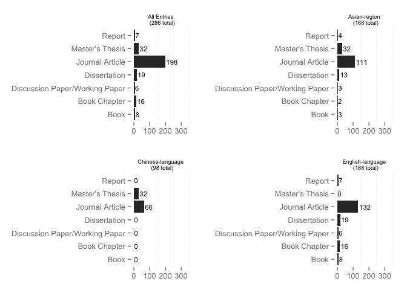
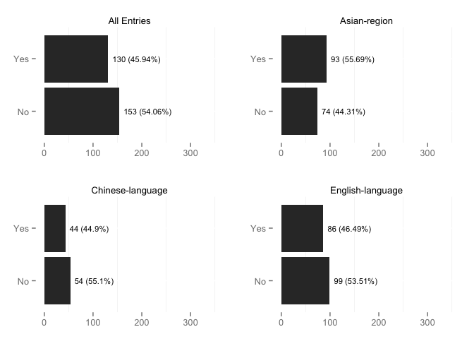
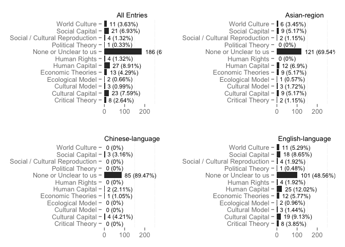
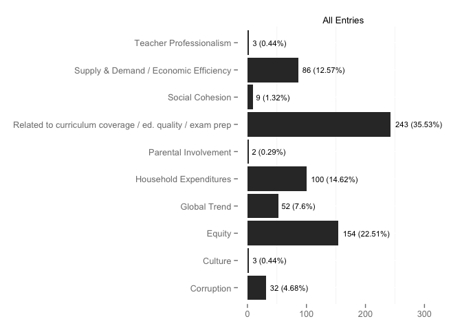
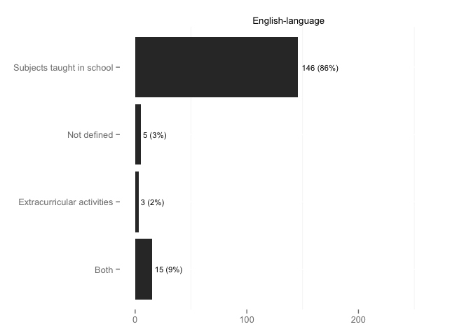
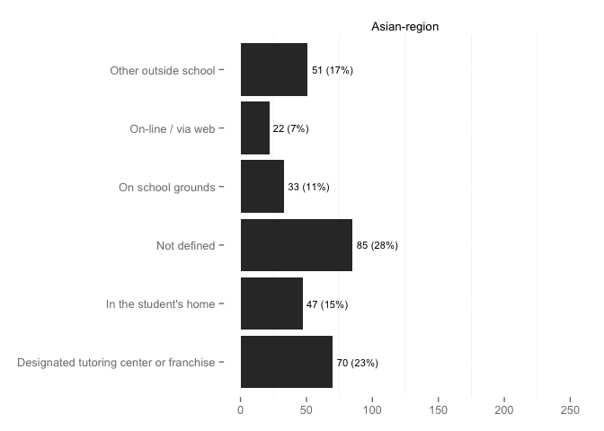
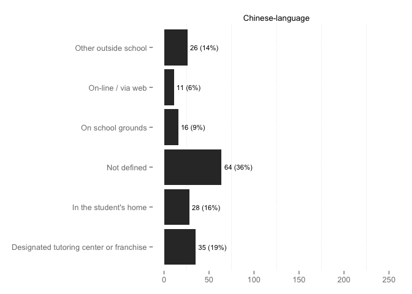
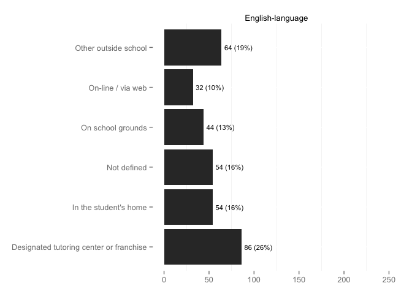
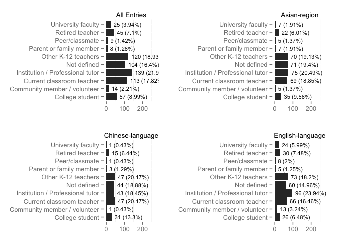

# All Entries Descriptives

### TOTAL NUMBER OF ARTICLES: 301

## Publication Details

### Type of Publication

 

### Publisher

### Publication Year

    

### Publication Language

 

### Type of Research

 
    
#### Research Type Others:

|Private.ID |X.others....gsub.sprintf......s....s.....s.....paste.items..collapse.......... |Private.Reviewer |
|:----------|:------------------------------------------------------------------------------|:----------------|
|60         |Author designs theoretical model private tutoring                              |Mike             |
|86         |secondary analysis of primary information                                      |Hang Duong       |
|101e       |secondary analysis of primary information                                      |Hang Duong       |
|104e       |secondary analysis of primary information                                      |Hang Duong       |
|109e       | + Theoretical???                                                              |Hang Duong       |
|95e        |analysis paper on primary data                                                 |Hang Duong       |
|96e        |Analysis based on theoretical approaches                                       |Hang Duong       |
|97e        |Secondary research                                                             |Damian Wyman     |

## Subjects and Approach

### Country or Countries Studied

<table>
<caption>Counts</caption>
 <thead>
  <tr>
   <th align="left"> Var1 </th>
   <th align="right"> Freq </th>
  </tr>
 </thead>
<tbody>
  <tr>
   <td align="left">  </td>
   <td align="right"> 0 </td>
  </tr>
  <tr>
   <td align="left"> Albania, Georgia, Lithuania </td>
   <td align="right"> 1 </td>
  </tr>
  <tr>
   <td align="left"> Australia </td>
   <td align="right"> 2 </td>
  </tr>
  <tr>
   <td align="left"> Azerbaijan, Bosnia and Herzegovina, Croatia, Georgia, Lithuania, Mongolia, Poland, Slovakia, and Ukraine, Kazakhstan, Kyrgyzstan, and Tajikistan </td>
   <td align="right"> 1 </td>
  </tr>
  <tr>
   <td align="left"> Azerbaijan, Georgia, Ukraine, Croatia, Lithuania, B&H, Mongolia, Poland, Slovakia </td>
   <td align="right"> 1 </td>
  </tr>
  <tr>
   <td align="left"> Bangladesh </td>
   <td align="right"> 2 </td>
  </tr>
  <tr>
   <td align="left"> Bangladesh  </td>
   <td align="right"> 1 </td>
  </tr>
  <tr>
   <td align="left"> Bosnia & Herzegovina and Croatia </td>
   <td align="right"> 1 </td>
  </tr>
  <tr>
   <td align="left"> Brazil </td>
   <td align="right"> 2 </td>
  </tr>
  <tr>
   <td align="left"> British </td>
   <td align="right"> 1 </td>
  </tr>
  <tr>
   <td align="left"> Cambodia </td>
   <td align="right"> 4 </td>
  </tr>
  <tr>
   <td align="left"> Canada </td>
   <td align="right"> 5 </td>
  </tr>
  <tr>
   <td align="left"> China </td>
   <td align="right"> 90 </td>
  </tr>
  <tr>
   <td align="left"> Cyprus </td>
   <td align="right"> 1 </td>
  </tr>
  <tr>
   <td align="left"> Egypt </td>
   <td align="right"> 5 </td>
  </tr>
  <tr>
   <td align="left"> England </td>
   <td align="right"> 1 </td>
  </tr>
  <tr>
   <td align="left"> Europe </td>
   <td align="right"> 1 </td>
  </tr>
  <tr>
   <td align="left"> Examples: USA and India </td>
   <td align="right"> 1 </td>
  </tr>
  <tr>
   <td align="left"> France </td>
   <td align="right"> 1 </td>
  </tr>
  <tr>
   <td align="left"> Georgia </td>
   <td align="right"> 1 </td>
  </tr>
  <tr>
   <td align="left"> Germany </td>
   <td align="right"> 2 </td>
  </tr>
  <tr>
   <td align="left"> global study </td>
   <td align="right"> 9 </td>
  </tr>
  <tr>
   <td align="left"> Great Britain </td>
   <td align="right"> 1 </td>
  </tr>
  <tr>
   <td align="left"> Greece </td>
   <td align="right"> 2 </td>
  </tr>
  <tr>
   <td align="left"> Greek </td>
   <td align="right"> 1 </td>
  </tr>
  <tr>
   <td align="left"> Hong Kong </td>
   <td align="right"> 8 </td>
  </tr>
  <tr>
   <td align="left"> Hong Kong, Macao, Korea, Japan, and Taiwan </td>
   <td align="right"> 1 </td>
  </tr>
  <tr>
   <td align="left"> India </td>
   <td align="right"> 1 </td>
  </tr>
  <tr>
   <td align="left"> Ireland </td>
   <td align="right"> 1 </td>
  </tr>
  <tr>
   <td align="left"> Italy </td>
   <td align="right"> 3 </td>
  </tr>
  <tr>
   <td align="left"> Japan </td>
   <td align="right"> 10 </td>
  </tr>
  <tr>
   <td align="left"> Japan, South Korea, and Cambodia </td>
   <td align="right"> 1 </td>
  </tr>
  <tr>
   <td align="left"> Jordan </td>
   <td align="right"> 1 </td>
  </tr>
  <tr>
   <td align="left"> Kazakhstan, Kyrgyzstan, Tajikistan </td>
   <td align="right"> 1 </td>
  </tr>
  <tr>
   <td align="left"> Kenya </td>
   <td align="right"> 1 </td>
  </tr>
  <tr>
   <td align="left"> Korea </td>
   <td align="right"> 2 </td>
  </tr>
  <tr>
   <td align="left"> Korea, Taiwan, Romania, and Phillippines </td>
   <td align="right"> 1 </td>
  </tr>
  <tr>
   <td align="left"> Korea, US </td>
   <td align="right"> 1 </td>
  </tr>
  <tr>
   <td align="left"> Kuwait </td>
   <td align="right"> 1 </td>
  </tr>
  <tr>
   <td align="left"> Luxembourg </td>
   <td align="right"> 1 </td>
  </tr>
  <tr>
   <td align="left"> Malaysia </td>
   <td align="right"> 1 </td>
  </tr>
  <tr>
   <td align="left"> Maldives </td>
   <td align="right"> 1 </td>
  </tr>
  <tr>
   <td align="left"> Malta </td>
   <td align="right"> 1 </td>
  </tr>
  <tr>
   <td align="left"> Poland </td>
   <td align="right"> 1 </td>
  </tr>
  <tr>
   <td align="left"> Portugal </td>
   <td align="right"> 1 </td>
  </tr>
  <tr>
   <td align="left"> Romania </td>
   <td align="right"> 2 </td>
  </tr>
  <tr>
   <td align="left"> Russia </td>
   <td align="right"> 1 </td>
  </tr>
  <tr>
   <td align="left"> S.Korea </td>
   <td align="right"> 1 </td>
  </tr>
  <tr>
   <td align="left"> Scoland </td>
   <td align="right"> 1 </td>
  </tr>
  <tr>
   <td align="left"> Singapore </td>
   <td align="right"> 2 </td>
  </tr>
  <tr>
   <td align="left"> Slovenia </td>
   <td align="right"> 1 </td>
  </tr>
  <tr>
   <td align="left"> South Korea </td>
   <td align="right"> 16 </td>
  </tr>
  <tr>
   <td align="left"> South Korea and United States </td>
   <td align="right"> 1 </td>
  </tr>
  <tr>
   <td align="left"> Sri Lanka </td>
   <td align="right"> 2 </td>
  </tr>
  <tr>
   <td align="left"> Taiwan </td>
   <td align="right"> 2 </td>
  </tr>
  <tr>
   <td align="left"> the Phillipines </td>
   <td align="right"> 1 </td>
  </tr>
  <tr>
   <td align="left"> Trinidad and Tobago </td>
   <td align="right"> 1 </td>
  </tr>
  <tr>
   <td align="left"> Turkey </td>
   <td align="right"> 8 </td>
  </tr>
  <tr>
   <td align="left"> UK </td>
   <td align="right"> 3 </td>
  </tr>
  <tr>
   <td align="left"> United States </td>
   <td align="right"> 5 </td>
  </tr>
  <tr>
   <td align="left"> US </td>
   <td align="right"> 5 </td>
  </tr>
  <tr>
   <td align="left"> US vs S.Korea </td>
   <td align="right"> 1 </td>
  </tr>
  <tr>
   <td align="left"> US, Korea, Japan </td>
   <td align="right"> 1 </td>
  </tr>
  <tr>
   <td align="left"> USA </td>
   <td align="right"> 6 </td>
  </tr>
  <tr>
   <td align="left"> Vietnam </td>
   <td align="right"> 6 </td>
  </tr>
</tbody>
</table>

### Region(s) Studied

 

#### Region(s) Others:

|Private.ID |X.others....gsub.sprintf......s....s.....s.....paste.items..collapse.......... |Private.Reviewer |
|:----------|:------------------------------------------------------------------------------|:----------------|
|51         |"Developing countries"                                                         |Olga             |
|171        |North Europe                                                                   |Xiaoran Yu       |
|118e       |Mediterranean                                                                  |Iveta            |
|119e       |Mediterranean                                                                  |Iveta            |
|131e       |Mediterranean                                                                  |Iveta            |

### Levels of Education Discussed

 

#### EdLevel Others:

|Private.ID |X.others....gsub.sprintf......s....s.....s.....paste.EdLevelNames.. |Private.Reviewer |
|:----------|:-------------------------------------------------------------------|:----------------|
|76         |grades 7-9                                                          |Olga             |
|183        |not clear                                                           |Xia Zhao         |
|99e        |not clear                                                           |Hang Duong       |

### Research Approach

 

#### ResearchApproach Others:

|Private.ID |X.others....gsub.sprintf......s....s.....s.....paste.ResearchApproachNames.. |Private.Reviewer |
|:----------|:----------------------------------------------------------------------------|:----------------|
|60         |Theoretical model                                                            |Mike             |
|109e       |Theoretical/conceptual, proposal a model                                     |Hang Duong       |
|218        |single country but some comparisons were made                                |Hang Duong       |

### Research Methods

 

### Was data set used?

 

#### What data set was used?

### Theoretical Framework

 

#### Theory Others:

<table>
 <thead>
  <tr>
   <th align="left"> Private.ID </th>
   <th align="left"> X.others....gsub.sprintf......s....s.....s.....paste.TheoryNames.. </th>
   <th align="left"> Private.Reviewer </th>
  </tr>
 </thead>
<tbody>
  <tr>
   <td align="left"> 4 </td>
   <td align="left"> Cultural model </td>
   <td align="left"> Peggy </td>
  </tr>
  <tr>
   <td align="left"> 7 </td>
   <td align="left"> Institutional approach </td>
   <td align="left"> Olga </td>
  </tr>
  <tr>
   <td align="left"> 12 </td>
   <td align="left"> Allocation theory of education (Bourdieu and Passeron, 1977) </td>
   <td align="left"> Iveta </td>
  </tr>
  <tr>
   <td align="left"> 16 </td>
   <td align="left"> None or Unclear, family expenditure </td>
   <td align="left"> Peggy </td>
  </tr>
  <tr>
   <td align="left"> 39 </td>
   <td align="left"> Cultural model </td>
   <td align="left"> Peggy </td>
  </tr>
  <tr>
   <td align="left"> 42 </td>
   <td align="left"> teacher professionalism (critical theory) </td>
   <td align="left"> Iveta </td>
  </tr>
  <tr>
   <td align="left"> 46 </td>
   <td align="left"> Institutional theory </td>
   <td align="left"> Olga </td>
  </tr>
  <tr>
   <td align="left"> 47 </td>
   <td align="left"> critical theory </td>
   <td align="left"> Iveta </td>
  </tr>
  <tr>
   <td align="left"> 48 </td>
   <td align="left"> Critical theory </td>
   <td align="left"> Iveta </td>
  </tr>
  <tr>
   <td align="left"> 50 </td>
   <td align="left"> systems theory </td>
   <td align="left"> Peggy </td>
  </tr>
  <tr>
   <td align="left"> 51 </td>
   <td align="left"> Economic theory </td>
   <td align="left"> Olga </td>
  </tr>
  <tr>
   <td align="left"> 59 </td>
   <td align="left"> Social Reproduction </td>
   <td align="left"> Mike </td>
  </tr>
  <tr>
   <td align="left"> 61 </td>
   <td align="left"> Parental involvement  </td>
   <td align="left"> Peggy </td>
  </tr>
  <tr>
   <td align="left"> 70 </td>
   <td align="left"> conceptual framework (sociological perspective and public policy perspective) </td>
   <td align="left"> Olga </td>
  </tr>
  <tr>
   <td align="left"> 71 </td>
   <td align="left"> None or Unclear, Historical view </td>
   <td align="left"> Olga </td>
  </tr>
  <tr>
   <td align="left"> 72 </td>
   <td align="left"> None or Unclear, economic theories </td>
   <td align="left"> Olga </td>
  </tr>
  <tr>
   <td align="left"> 87 </td>
   <td align="left"> Discusses in relation to EFA & free access to education </td>
   <td align="left"> Iveta </td>
  </tr>
  <tr>
   <td align="left"> 93 </td>
   <td align="left"> Huge gap between urban and rural areas </td>
   <td align="left"> Xia Zhao </td>
  </tr>
  <tr>
   <td align="left"> 94 </td>
   <td align="left"> Huge gap between urban and rural areas </td>
   <td align="left"> Xia Zhao </td>
  </tr>
  <tr>
   <td align="left"> 98 </td>
   <td align="left"> Huge gap between urban and rural areas </td>
   <td align="left"> Xia Zhao </td>
  </tr>
  <tr>
   <td align="left"> 108 </td>
   <td align="left"> Education equity </td>
   <td align="left"> Xia Zhao </td>
  </tr>
  <tr>
   <td align="left"> 124 </td>
   <td align="left"> Maslow's hierarchy of needs theory ; Theories of Motivation. </td>
   <td align="left"> Xia Zhao </td>
  </tr>
  <tr>
   <td align="left"> 147 </td>
   <td align="left"> Structural functionalism </td>
   <td align="left"> Xia Zhao </td>
  </tr>
  <tr>
   <td align="left"> 185 </td>
   <td align="left"> Neoliberalism </td>
   <td align="left"> Xia Zhao </td>
  </tr>
  <tr>
   <td align="left"> 100e </td>
   <td align="left"> Teacher professionalism; research highlighting the phenomenon of private tutoring, a “background” practice, which has grown into a parallel system of education in many countries </td>
   <td align="left"> Damian Wyman </td>
  </tr>
  <tr>
   <td align="left"> 105e </td>
   <td align="left"> Game Theory and Nash equilibrium </td>
   <td align="left"> Damian Wyman </td>
  </tr>
  <tr>
   <td align="left"> 107e </td>
   <td align="left"> the education production function </td>
   <td align="left"> Damian Wyman </td>
  </tr>
  <tr>
   <td align="left"> 109e </td>
   <td align="left"> Presents model of private tutoring in which demand comes from poor school infrastructure and teacher "shirking"
??? </td>
   <td align="left"> Hang Duong </td>
  </tr>
  <tr>
   <td align="left"> 114e </td>
   <td align="left"> Maslow's hierarchy of needs </td>
   <td align="left"> Olga </td>
  </tr>
  <tr>
   <td align="left"> 142e </td>
   <td align="left"> game theory </td>
   <td align="left"> Xiaoran Yu </td>
  </tr>
  <tr>
   <td align="left"> 190e </td>
   <td align="left"> Bronfenbrenner's (1979) ecological model of human development </td>
   <td align="left"> Olga </td>
  </tr>
  <tr>
   <td align="left"> 191e </td>
   <td align="left"> Screening theory, theory about demand for PT by James (1987) </td>
   <td align="left"> Olga </td>
  </tr>
  <tr>
   <td align="left"> 192e </td>
   <td align="left"> the standard microeconomic theory of supply and demand and educational production function </td>
   <td align="left"> Olga </td>
  </tr>
  <tr>
   <td align="left"> 193e </td>
   <td align="left"> econometric frameworks </td>
   <td align="left"> Olga </td>
  </tr>
  <tr>
   <td align="left"> 197e </td>
   <td align="left">  status competition  theory and institutional theory </td>
   <td align="left"> Xia Zhao </td>
  </tr>
  <tr>
   <td align="left"> 198e </td>
   <td align="left"> status competition theory and institutional theory </td>
   <td align="left"> Xia Zhao </td>
  </tr>
  <tr>
   <td align="left"> 200e </td>
   <td align="left"> social stratification </td>
   <td align="left"> Xia Zhao </td>
  </tr>
  <tr>
   <td align="left"> 209e </td>
   <td align="left"> Helmke’s (2009) offer-usage model of instructional effects (bw PT and aca achievements) </td>
   <td align="left"> Hang Duong </td>
  </tr>
  <tr>
   <td align="left"> 96e </td>
   <td align="left"> Game Theory; Thurow's Job Competition Model; Spence's Market Signaling Model
 </td>
   <td align="left"> Hang Duong </td>
  </tr>
  <tr>
   <td align="left"> 61 </td>
   <td align="left"> parent involvement  </td>
   <td align="left"> Xia Zhao </td>
  </tr>
  <tr>
   <td align="left"> 118e </td>
   <td align="left"> Various (edited book) </td>
   <td align="left"> Iveta </td>
  </tr>
  <tr>
   <td align="left"> 122e </td>
   <td align="left"> Critical ethnography </td>
   <td align="left"> Iveta </td>
  </tr>
  <tr>
   <td align="left"> 218 </td>
   <td align="left"> organizational field approach </td>
   <td align="left"> Hang Duong </td>
  </tr>
  <tr>
   <td align="left"> 222 </td>
   <td align="left"> neolibralism </td>
   <td align="left"> Hang Duong </td>
  </tr>
  <tr>
   <td align="left"> 212 </td>
   <td align="left"> actor-network theory </td>
   <td align="left"> Hang Duong </td>
  </tr>
  <tr>
   <td align="left"> 136e </td>
   <td align="left"> Bourdieu’s theory of social capital and cultural reproduction </td>
   <td align="left"> Olga </td>
  </tr>
  <tr>
   <td align="left"> 204 </td>
   <td align="left"> marketization/privatization of education </td>
   <td align="left"> Hang Duong </td>
  </tr>
  <tr>
   <td align="left"> 173e </td>
   <td align="left"> Functionalist and Institutionalist </td>
   <td align="left"> Peggy </td>
  </tr>
  <tr>
   <td align="left"> 172e </td>
   <td align="left"> Cultural institutional  </td>
   <td align="left"> Peggy </td>
  </tr>
  <tr>
   <td align="left"> 114e </td>
   <td align="left"> Privatization of education </td>
   <td align="left"> Peggy </td>
  </tr>
  <tr>
   <td align="left"> 168e </td>
   <td align="left"> Schein’s conceptual framework </td>
   <td align="left"> Peggy </td>
  </tr>
</tbody>
</table>

### How is private tutoring framed in the publication?

    

#### Framed Others:

<table>
 <thead>
  <tr>
   <th align="left"> Private.ID </th>
   <th align="left"> X.others....gsub.sprintf......s....s.....s.....paste.FramedNames.. </th>
   <th align="left"> Private.Reviewer </th>
  </tr>
 </thead>
<tbody>
  <tr>
   <td align="left"> 7 </td>
   <td align="left"> Efficency </td>
   <td align="left"> Olga </td>
  </tr>
  <tr>
   <td align="left"> 13 </td>
   <td align="left"> Efficency </td>
   <td align="left"> Mike </td>
  </tr>
  <tr>
   <td align="left"> 15 </td>
   <td align="left"> racial differences East Asian youth versus other </td>
   <td align="left"> Peggy </td>
  </tr>
  <tr>
   <td align="left"> 21 </td>
   <td align="left"> perceived failure of public system/ Global trend </td>
   <td align="left"> Iveta </td>
  </tr>
  <tr>
   <td align="left"> 27 </td>
   <td align="left"> Social Cohesion </td>
   <td align="left"> Mike </td>
  </tr>
  <tr>
   <td align="left"> 30 </td>
   <td align="left"> Household expendures </td>
   <td align="left"> Mike </td>
  </tr>
  <tr>
   <td align="left"> 34 </td>
   <td align="left"> Commercialization/privatization of education </td>
   <td align="left"> Olga </td>
  </tr>
  <tr>
   <td align="left"> 39 </td>
   <td align="left"> cultural and socio-cultural </td>
   <td align="left"> Peggy </td>
  </tr>
  <tr>
   <td align="left"> 42 </td>
   <td align="left"> teacher status  </td>
   <td align="left"> Iveta </td>
  </tr>
  <tr>
   <td align="left"> 43 </td>
   <td align="left"> 

 </td>
   <td align="left"> Iveta </td>
  </tr>
  <tr>
   <td align="left"> 47 </td>
   <td align="left"> resistance to Western reforms </td>
   <td align="left"> Iveta </td>
  </tr>
  <tr>
   <td align="left"> 48 </td>
   <td align="left"> site of resistance to global reforms </td>
   <td align="left"> Iveta </td>
  </tr>
  <tr>
   <td align="left"> 51 </td>
   <td align="left"> Efficency </td>
   <td align="left"> Olga </td>
  </tr>
  <tr>
   <td align="left"> 52 </td>
   <td align="left"> Efficency, Response to market demand </td>
   <td align="left"> Mike </td>
  </tr>
  <tr>
   <td align="left"> 61 </td>
   <td align="left"> parental involvement </td>
   <td align="left"> Peggy </td>
  </tr>
  <tr>
   <td align="left"> 62 </td>
   <td align="left"> Efficency </td>
   <td align="left"> Olga </td>
  </tr>
  <tr>
   <td align="left"> 70 </td>
   <td align="left"> Efficency, After-school program was designed to reduce private tutoring </td>
   <td align="left"> Olga </td>
  </tr>
  <tr>
   <td align="left"> 72 </td>
   <td align="left"> Social Cohesion, gender rights </td>
   <td align="left"> Olga </td>
  </tr>
  <tr>
   <td align="left"> 78 </td>
   <td align="left"> Efficency </td>
   <td align="left"> Olga </td>
  </tr>
  <tr>
   <td align="left"> 107 </td>
   <td align="left"> Social Cohesion </td>
   <td align="left"> Xia Zhao </td>
  </tr>
  <tr>
   <td align="left"> 110 </td>
   <td align="left"> family relationship </td>
   <td align="left"> Xia Zhao </td>
  </tr>
  <tr>
   <td align="left"> 112 </td>
   <td align="left"> Social Cohesion </td>
   <td align="left"> Xia Zhao </td>
  </tr>
  <tr>
   <td align="left"> 144 </td>
   <td align="left"> the relationship between teachers and students </td>
   <td align="left"> Xia Zhao </td>
  </tr>
  <tr>
   <td align="left"> 100e </td>
   <td align="left"> Social Cohesion </td>
   <td align="left"> Damian Wyman </td>
  </tr>
  <tr>
   <td align="left"> 108e </td>
   <td align="left"> global trend </td>
   <td align="left"> Hang Duong </td>
  </tr>
  <tr>
   <td align="left"> 109e </td>
   <td align="left"> Related to curriculum coverage / ed. quality / Global trend </td>
   <td align="left"> Hang Duong </td>
  </tr>
  <tr>
   <td align="left"> 113e </td>
   <td align="left"> Social Cohesion </td>
   <td align="left"> Hang Duong </td>
  </tr>
  <tr>
   <td align="left"> 194e </td>
   <td align="left"> economic </td>
   <td align="left"> Olga </td>
  </tr>
  <tr>
   <td align="left"> 208e </td>
   <td align="left"> parent's role/ duty </td>
   <td align="left"> Hang Duong </td>
  </tr>
  <tr>
   <td align="left"> 96e </td>
   <td align="left"> Social Cohesionglobal trend </td>
   <td align="left"> Hang Duong </td>
  </tr>
  <tr>
   <td align="left"> 125e </td>
   <td align="left"> resistance  </td>
   <td align="left"> Iveta </td>
  </tr>
  <tr>
   <td align="left"> 218 </td>
   <td align="left"> on the periphery of the broader organizational field of edu. </td>
   <td align="left"> Hang Duong </td>
  </tr>
  <tr>
   <td align="left"> 220 </td>
   <td align="left"> publicly funded after-school tutoring for low-achieving stu </td>
   <td align="left"> Hang Duong </td>
  </tr>
  <tr>
   <td align="left"> 212 </td>
   <td align="left"> publicly funded after-school tutoring for low-achieving stu </td>
   <td align="left"> Hang Duong </td>
  </tr>
  <tr>
   <td align="left"> 160e </td>
   <td align="left"> / Holdhold expenditure </td>
   <td align="left"> Hang Duong </td>
  </tr>
  <tr>
   <td align="left"> 161e </td>
   <td align="left"> / Culture </td>
   <td align="left"> Hang Duong </td>
  </tr>
  <tr>
   <td align="left"> 137e </td>
   <td align="left"> Social Cohesion </td>
   <td align="left"> Mike </td>
  </tr>
</tbody>
</table>

#### If previous answer was equity, then please define equity concern here:

<table>
 <thead>
  <tr>
   <th align="left"> Private.ID </th>
   <th align="left"> Private.EquityDefine </th>
   <th align="left"> Private.Reviewer </th>
  </tr>
 </thead>
<tbody>
  <tr>
   <td align="left"> 2 </td>
   <td align="left"> SES, rural/urban </td>
   <td align="left"> Iveta </td>
  </tr>
  <tr>
   <td align="left"> 3 </td>
   <td align="left"> futures decided on school achievement--and the private tutoring--type and quality received </td>
   <td align="left"> Peggy </td>
  </tr>
  <tr>
   <td align="left"> 5 </td>
   <td align="left"> socio-economic </td>
   <td align="left"> Olga </td>
  </tr>
  <tr>
   <td align="left"> 8 </td>
   <td align="left"> the use of social and cultural capital to counteract financial capital deficits </td>
   <td align="left"> Peggy </td>
  </tr>
  <tr>
   <td align="left"> 10 </td>
   <td align="left"> SES, race </td>
   <td align="left"> Iveta </td>
  </tr>
  <tr>
   <td align="left"> 11 </td>
   <td align="left"> race </td>
   <td align="left"> Iveta </td>
  </tr>
  <tr>
   <td align="left"> 24 </td>
   <td align="left"> Increased burden on poorest families </td>
   <td align="left"> Mike </td>
  </tr>
  <tr>
   <td align="left"> 27 </td>
   <td align="left"> Income disparity & ability to pay for tutoring  </td>
   <td align="left"> Mike </td>
  </tr>
  <tr>
   <td align="left"> 30 </td>
   <td align="left"> Rich vs poor, English spoken in the home vs homes without English  </td>
   <td align="left"> Mike </td>
  </tr>
  <tr>
   <td align="left"> 37 </td>
   <td align="left"> SES </td>
   <td align="left"> Iveta </td>
  </tr>
  <tr>
   <td align="left"> 47 </td>
   <td align="left"> rural/urban, gender, SES </td>
   <td align="left"> Iveta </td>
  </tr>
  <tr>
   <td align="left"> 48 </td>
   <td align="left"> SES, gender, rural/urban </td>
   <td align="left"> Iveta </td>
  </tr>
  <tr>
   <td align="left"> 49 </td>
   <td align="left"> Gender, SES, rural/urban </td>
   <td align="left"> Iveta </td>
  </tr>
  <tr>
   <td align="left"> 50 </td>
   <td align="left"> "private tutoring systems are necessary to challenge the myths of equality and education and to problematize the past and future miracles of East Asian economic development..." p.22 </td>
   <td align="left"> Peggy </td>
  </tr>
  <tr>
   <td align="left"> 54 </td>
   <td align="left"> SES, rural/urban, gender </td>
   <td align="left"> Iveta </td>
  </tr>
  <tr>
   <td align="left"> 55 </td>
   <td align="left"> gender equity </td>
   <td align="left"> Iveta </td>
  </tr>
  <tr>
   <td align="left"> 59 </td>
   <td align="left"> Gender (PT advantages girls), class/income </td>
   <td align="left"> Mike </td>
  </tr>
  <tr>
   <td align="left"> 61 </td>
   <td align="left"> "growing influence of socioeconomic background on academic achievement might be realted to the recent trends in economic inequality and the resulting socioeconomic gap in private tutoring (Byun and Kim, 2010)." p.18 </td>
   <td align="left"> Peggy </td>
  </tr>
  <tr>
   <td align="left"> 63 </td>
   <td align="left"> Socioeconomic </td>
   <td align="left"> Olga </td>
  </tr>
  <tr>
   <td align="left"> 64 </td>
   <td align="left"> Income </td>
   <td align="left"> Mike </td>
  </tr>
  <tr>
   <td align="left"> 73 </td>
   <td align="left"> socioeconomic </td>
   <td align="left"> Olga </td>
  </tr>
  <tr>
   <td align="left"> 75 </td>
   <td align="left"> "High-income families can afford greater quantities and better qualities of tutoring than middle- income and low-income families" (p. 67). </td>
   <td align="left"> Damian Wyman </td>
  </tr>
  <tr>
   <td align="left"> 77 </td>
   <td align="left"> advantages families with more education and wealth </td>
   <td align="left"> Peggy </td>
  </tr>
  <tr>
   <td align="left"> 80 </td>
   <td align="left"> socioeconomic </td>
   <td align="left"> Olga </td>
  </tr>
  <tr>
   <td align="left"> 83 </td>
   <td align="left"> rural/urban, gender, SES </td>
   <td align="left"> Iveta </td>
  </tr>
  <tr>
   <td align="left"> 84 </td>
   <td align="left"> Gender, SES </td>
   <td align="left"> Iveta </td>
  </tr>
  <tr>
   <td align="left"> 85 </td>
   <td align="left"> SES </td>
   <td align="left"> Iveta </td>
  </tr>
  <tr>
   <td align="left"> 86 </td>
   <td align="left"> "Children from well-off families are more likely to be able to afford better-quality tutoring. This implies that they are more likely to acquire exam-taking skills and to achieve higher scores, which in turn lead to better careers and higher future incomes (p. 1)."
"these findings also draw attention to the role that private tutoring plays in exacerbating inequality, a consequence of the fact that more affluent households can afford to send their children for private tutoring, while others cannot" p.13 </td>
   <td align="left"> Hang Duong </td>
  </tr>
  <tr>
   <td align="left"> 88 </td>
   <td align="left"> "Private tutoring also exacerbates school inequalities, as it tends to be more strongly demanded and more easily available in high-SES schools than in low-SES schools" (p. 128). </td>
   <td align="left"> Peggy </td>
  </tr>
  <tr>
   <td align="left"> 89 </td>
   <td align="left"> "shadow education is a stratifying force behind the facade that stresses equality of opportunity through fee-free education." p.27 </td>
   <td align="left"> Peggy </td>
  </tr>
  <tr>
   <td align="left"> 91 </td>
   <td align="left"> social equality and the  chance to have education </td>
   <td align="left"> Xia Zhao </td>
  </tr>
  <tr>
   <td align="left"> 92 </td>
   <td align="left"> expand social class gap and social inequity </td>
   <td align="left"> Xia Zhao </td>
  </tr>
  <tr>
   <td align="left"> 93 </td>
   <td align="left"> The  chance to have private tutoring is not the same. It may expand social inequity. </td>
   <td align="left"> Xia Zhao </td>
  </tr>
  <tr>
   <td align="left"> 94 </td>
   <td align="left"> The  chance to have private tutoring is not the same. It may expand social inequity. </td>
   <td align="left"> Xia Zhao </td>
  </tr>
  <tr>
   <td align="left"> 94 </td>
   <td align="left"> competition for educational resources </td>
   <td align="left"> Xiaoran Yu </td>
  </tr>
  <tr>
   <td align="left"> 95 </td>
   <td align="left">  It is unfair for the students who do not have private tutoring. </td>
   <td align="left"> Xia Zhao </td>
  </tr>
  <tr>
   <td align="left"> 97 </td>
   <td align="left"> expand social class gap and social inequity </td>
   <td align="left"> Xia Zhao </td>
  </tr>
  <tr>
   <td align="left"> 98 </td>
   <td align="left"> expand social class gap and social inequity </td>
   <td align="left"> Xia Zhao </td>
  </tr>
  <tr>
   <td align="left"> 99 </td>
   <td align="left"> First, private tutoring can increase students' human capital so that it is good to increase social equity. However, the  chance to have private tutoring is not the same. It may expand social inequity. </td>
   <td align="left"> Xia Zhao </td>
  </tr>
  <tr>
   <td align="left"> 104 </td>
   <td align="left"> The  chance to have private tutoring is not the same. It may expand social inequity. </td>
   <td align="left"> Xia Zhao </td>
  </tr>
  <tr>
   <td align="left"> 105 </td>
   <td align="left"> expand social class gap and social inequity </td>
   <td align="left"> Xia Zhao </td>
  </tr>
  <tr>
   <td align="left"> 107 </td>
   <td align="left"> expand social class gap and social inequity </td>
   <td align="left"> Xia Zhao </td>
  </tr>
  <tr>
   <td align="left"> 108 </td>
   <td align="left"> expand social class gap and social inequity </td>
   <td align="left"> Xia Zhao </td>
  </tr>
  <tr>
   <td align="left"> 108 </td>
   <td align="left"> rural and urban </td>
   <td align="left"> Xiaoran Yu </td>
  </tr>
  <tr>
   <td align="left"> 109 </td>
   <td align="left"> The  chance to have private tutoring is not the same. It may expand social inequity. </td>
   <td align="left"> Xia Zhao </td>
  </tr>
  <tr>
   <td align="left"> 110 </td>
   <td align="left"> The  chance to have private tutoring is not the same. It may expand social inequity. </td>
   <td align="left"> Xia Zhao </td>
  </tr>
  <tr>
   <td align="left"> 112 </td>
   <td align="left"> The  chance to have private tutoring is not the same. It may expand social inequity. </td>
   <td align="left"> Xia Zhao </td>
  </tr>
  <tr>
   <td align="left"> 113 </td>
   <td align="left"> expand social class gap and social inequity </td>
   <td align="left"> Xia Zhao </td>
  </tr>
  <tr>
   <td align="left"> 114 </td>
   <td align="left"> expand social class gap and social inequity </td>
   <td align="left"> Xia Zhao </td>
  </tr>
  <tr>
   <td align="left"> 117 </td>
   <td align="left"> expand social class gap and social inequity </td>
   <td align="left"> Xia Zhao </td>
  </tr>
  <tr>
   <td align="left"> 118 </td>
   <td align="left"> expand social class gap and social inequity </td>
   <td align="left"> Xia Zhao </td>
  </tr>
  <tr>
   <td align="left"> 120 </td>
   <td align="left"> expand social class gap and social inequity </td>
   <td align="left"> Xia Zhao </td>
  </tr>
  <tr>
   <td align="left"> 121 </td>
   <td align="left"> expand social class gap and social inequity </td>
   <td align="left"> Xia Zhao </td>
  </tr>
  <tr>
   <td align="left"> 123 </td>
   <td align="left"> The  chance to have private tutoring is not the same. It may expand social inequity. </td>
   <td align="left"> Xia Zhao </td>
  </tr>
  <tr>
   <td align="left"> 125 </td>
   <td align="left"> expand social class gap and social inequity </td>
   <td align="left"> Xia Zhao </td>
  </tr>
  <tr>
   <td align="left"> 128 </td>
   <td align="left"> First, private tutoring can increase students' human capital so that it is good to increase social equity. However, the  chance to have private tutoring is not the same. It may expand social inequity. </td>
   <td align="left"> Xia Zhao </td>
  </tr>
  <tr>
   <td align="left"> 130 </td>
   <td align="left"> expand social class gap and social inequity </td>
   <td align="left"> Xia Zhao </td>
  </tr>
  <tr>
   <td align="left"> 131 </td>
   <td align="left"> The  chance to have private tutoring is not the same. It may expand social inequity. </td>
   <td align="left"> Xia Zhao </td>
  </tr>
  <tr>
   <td align="left"> 133 </td>
   <td align="left"> The  chance to have private tutoring is not the same. It may expand social inequity. </td>
   <td align="left"> Xia Zhao </td>
  </tr>
  <tr>
   <td align="left"> 134 </td>
   <td align="left"> The  chance to have private tutoring is not the same. It may expand social inequity. </td>
   <td align="left"> Xia Zhao </td>
  </tr>
  <tr>
   <td align="left"> 135 </td>
   <td align="left"> The  chance to have private tutoring is not the same. It may expand social inequity. </td>
   <td align="left"> Xia Zhao </td>
  </tr>
  <tr>
   <td align="left"> 136 </td>
   <td align="left"> The  chance to have private tutoring is not the same. It may expand social inequity. </td>
   <td align="left"> Xia Zhao </td>
  </tr>
  <tr>
   <td align="left"> 138 </td>
   <td align="left"> The  chance to have private tutoring is not the same. It may expand social inequity. </td>
   <td align="left"> Xia Zhao </td>
  </tr>
  <tr>
   <td align="left"> 139 </td>
   <td align="left"> expand social class gap and social inequity </td>
   <td align="left"> Xia Zhao </td>
  </tr>
  <tr>
   <td align="left"> 141 </td>
   <td align="left"> expand social glass gap; The  </td>
   <td align="left"> Xia Zhao </td>
  </tr>
  <tr>
   <td align="left"> 142 </td>
   <td align="left"> Some poor families cannot stand the private tutoring fees for Children so that it may lead to education inequity. </td>
   <td align="left"> Xia Zhao </td>
  </tr>
  <tr>
   <td align="left"> 143 </td>
   <td align="left"> It may reduce education inequity, but also bring new inequity problems. </td>
   <td align="left"> Xia Zhao </td>
  </tr>
  <tr>
   <td align="left"> 146 </td>
   <td align="left"> expand social class gap </td>
   <td align="left"> Xia Zhao </td>
  </tr>
  <tr>
   <td align="left"> 147 </td>
   <td align="left"> there is a huge educational resource gap between urban and rural areas </td>
   <td align="left"> Xia Zhao </td>
  </tr>
  <tr>
   <td align="left"> 150 </td>
   <td align="left"> private tutoring can improve students' academic achievements so that it may reduce the gap between students in rural areas and urban city </td>
   <td align="left"> Xia Zhao </td>
  </tr>
  <tr>
   <td align="left"> 151 </td>
   <td align="left"> increase social class gap </td>
   <td align="left"> Xia Zhao </td>
  </tr>
  <tr>
   <td align="left"> 153 </td>
   <td align="left"> there is a huge educational resource gap between urban and rural areas. </td>
   <td align="left"> Xia Zhao </td>
  </tr>
  <tr>
   <td align="left"> 160 </td>
   <td align="left"> Reduce social class gap  </td>
   <td align="left"> Xia Zhao </td>
  </tr>
  <tr>
   <td align="left"> 161 </td>
   <td align="left"> Enhance lower-class students' education opportunity </td>
   <td align="left"> Xia Zhao </td>
  </tr>
  <tr>
   <td align="left"> 161 </td>
   <td align="left"> benefit poor student by through free tutoring </td>
   <td align="left"> Xiaoran Yu </td>
  </tr>
  <tr>
   <td align="left"> 165 </td>
   <td align="left"> The private tutoring institutions can promote the development of education equity </td>
   <td align="left"> Xia Zhao </td>
  </tr>
  <tr>
   <td align="left"> 165 </td>
   <td align="left"> educational resource distribution, students receive equal quality of education </td>
   <td align="left"> Xiaoran Yu </td>
  </tr>
  <tr>
   <td align="left"> 171 </td>
   <td align="left"> private tutoring leads to social inequity, which include the educational chance etc.  </td>
   <td align="left"> Xia Zhao </td>
  </tr>
  <tr>
   <td align="left"> 171 </td>
   <td align="left"> unequal access and outcomes, racial inequity, psychological inequity, gender inequity, influence on public school system </td>
   <td align="left"> Xiaoran Yu </td>
  </tr>
  <tr>
   <td align="left"> 176 </td>
   <td align="left"> students in rural areas cannot have the same educational chance as urban students in private tutoring. </td>
   <td align="left"> Xia Zhao </td>
  </tr>
  <tr>
   <td align="left"> 178 </td>
   <td align="left"> students in urban areas have more chance to have private tutoring.  </td>
   <td align="left"> Xia Zhao </td>
  </tr>
  <tr>
   <td align="left"> 180 </td>
   <td align="left"> private tutoring can expand the education inequity because students from lower class, from rural areas cannot get the same educational chance as students in higher class and urban areas. </td>
   <td align="left"> Xia Zhao </td>
  </tr>
  <tr>
   <td align="left"> 185 </td>
   <td align="left"> use neoliberalism to explain education equity. Parents have right to choose their children's education. </td>
   <td align="left"> Xia Zhao </td>
  </tr>
  <tr>
   <td align="left"> 187 </td>
   <td align="left"> unfair to students from poor family </td>
   <td align="left"> Xia Zhao </td>
  </tr>
  <tr>
   <td align="left"> 188 </td>
   <td align="left"> The chance to have private tutoring is not the same because of the SES, parents education background. It is unfair to students who do not join in private tutoirng at school. </td>
   <td align="left"> Xia Zhao </td>
  </tr>
  <tr>
   <td align="left"> 100e </td>
   <td align="left"> Lower socioeconomic classes can't afford the private tutoring, leading to inequity of opportunity compared to wealthier students. </td>
   <td align="left"> Damian Wyman </td>
  </tr>
  <tr>
   <td align="left"> 101e </td>
   <td align="left"> "The private tuition classes may increase the social inequalities (income gap, race gap, ethnicity gap...) and damage the purpose of free education policy" (p.20) </td>
   <td align="left"> Hang Duong </td>
  </tr>
  <tr>
   <td align="left"> 102e </td>
   <td align="left"> "High-income families can afford greater quantities and better qualities of tutoring than middle-income and low-income families." p.416  </td>
   <td align="left"> Peggy </td>
  </tr>
  <tr>
   <td align="left"> 103e </td>
   <td align="left"> "Shadow education, if left to market forces, is likely to perpetuate and increase social inequalities since higher-income households are able more easily than lower-income households to afford both superior quality and greater amounts of private tutoring. This pattern also of course applies in regular schooling: rich families can send their children to types of private schools that are out of reach for poor families. However, as shadow education has expanded, middle-income and low-income families have found themselves forced to invest in private tutoring alongside public provision that is supposedly egalitarian." p.489 </td>
   <td align="left"> Damian Wyman </td>
  </tr>
  <tr>
   <td align="left"> 104e </td>
   <td align="left"> "tutoring may also have important equity  implications, as it may be more affordable to children belonging to richer households. Moreover,  for poor households that are already resource-constrained, tutoring can affect the enrollment and  dropout decisions of their children given that it represents a substantial education cost" p.4 </td>
   <td align="left"> Hang Duong </td>
  </tr>
  <tr>
   <td align="left"> 105e </td>
   <td align="left"> "tutoring may also cause unfair distribution of educational opportunity between students in different economic situations" p.280 </td>
   <td align="left"> Damian Wyman </td>
  </tr>
  <tr>
   <td align="left"> 108e </td>
   <td align="left"> "Without aiming an equitable society to a large extent where education provisions have strong role in its construction and changing social, political and educational policies in the same direction, one cannot equally reach the benefit of education provision to all" (p.16)
students of better schools, well-performing students, children of educated parents and well-off families make use of tutoring; this results in inequities in school performance and job market </td>
   <td align="left"> Hang Duong </td>
  </tr>
  <tr>
   <td align="left"> 109e </td>
   <td align="left"> Parental income inequality then directly transmits inequality into their offsprings’ educational achievements.
"For reasons of equity and affordability, schooling should be free and uniform at least up to the secondary level" (p. 375). </td>
   <td align="left"> Hang Duong </td>
  </tr>
  <tr>
   <td align="left"> 112d </td>
   <td align="left"> SES </td>
   <td align="left"> Iveta </td>
  </tr>
  <tr>
   <td align="left"> 113e </td>
   <td align="left"> The emphasis on “inclusive growth” by the Asian Development Bank (2010)  recognizes the importance of including equity in economic agendas. p.71 </td>
   <td align="left"> Hang Duong </td>
  </tr>
  <tr>
   <td align="left"> 115e </td>
   <td align="left"> The  broader finding that poor children suffer poorer learning outcomes calls for more equity in both  the provision and the quality of primary level education. p.633 </td>
   <td align="left"> Hang Duong </td>
  </tr>
  <tr>
   <td align="left"> 142e </td>
   <td align="left"> uneven distribution of educational resources that exist between regions, urban and rural areas, at different levels, and at the same type of institution within a particular area </td>
   <td align="left"> Xiaoran Yu </td>
  </tr>
  <tr>
   <td align="left"> 146e </td>
   <td align="left"> market for private tutoring reproduces social inequalities in the mainstream education system. Family  income was found to have a positive influence on both participation probability and expenditure of private tutoring </td>
   <td align="left"> Xiaoran Yu </td>
  </tr>
  <tr>
   <td align="left"> 188e </td>
   <td align="left"> Symbolically, the yobiko is functional for the society as a whole. It legitimises the college entrance examination as a symbol of opportunity. In so doing, it provides the society with stability and legitimacy for social stratification. </td>
   <td align="left"> Xiaoran Yu </td>
  </tr>
  <tr>
   <td align="left"> 191e </td>
   <td align="left"> Socioeconomic  </td>
   <td align="left"> Olga </td>
  </tr>
  <tr>
   <td align="left"> 192e </td>
   <td align="left"> social inequality </td>
   <td align="left"> Olga </td>
  </tr>
  <tr>
   <td align="left"> 198e </td>
   <td align="left"> it leads to social inequality </td>
   <td align="left"> Xia Zhao </td>
  </tr>
  <tr>
   <td align="left"> 203e </td>
   <td align="left"> In Ghana, the  main inequities that contribute to education stratification include socioeconomic, gender,  rural-urban, and north-south inequities.  </td>
   <td align="left"> Xia Zhao </td>
  </tr>
  <tr>
   <td align="left"> 91e </td>
   <td align="left"> "Parents lacking financial resources often cannot turn to private tutoring, which may further decrease their social status if their children are unable to further their careers and education." p.113 </td>
   <td align="left"> Peggy </td>
  </tr>
  <tr>
   <td align="left"> 92e </td>
   <td align="left"> "f  the national  policy  is  committed  to  equality  of  opportunity,  then  the  balance  between  the  school  system  and  PT-E  will  need  to be  redressed" (p.303) </td>
   <td align="left"> Hang Duong </td>
  </tr>
  <tr>
   <td align="left"> 95e </td>
   <td align="left"> "policymakers and researchers ought to be concerned about the equity implications particularly along economic and gender lines ñof a large-scale tutoring system" p.9
"Since it is only high expenditure on tutoring that pays off, our results have significant ramifications for thinking about ... educational equity (p. 3)." There's concern about "equity implications - particularly along economic and gender lines - of a large-scale tutoring system in Turkey (p. 9)." Females and children in less affluent families receive less tutoring. </td>
   <td align="left"> Hang Duong </td>
  </tr>
  <tr>
   <td align="left"> 96e </td>
   <td align="left"> "In South Korean society, negative effects of PT are seen in terms of equity and social  cohesion in that PT potentially aggravates educational disparities across different income  brackets by giving partial access to extra resources of education and information" p.2; "PT can bring about a great inequality between households with different income levels due to variations in  marginal substitution rates between PT and other goods" p.10 </td>
   <td align="left"> Hang Duong </td>
  </tr>
  <tr>
   <td align="left"> 97e </td>
   <td align="left"> Those in poor households are unable to afford private tutoring, which leads to lower levels of satisfaction in life. The policy proposed is to improve the public education system so that all are served equally. </td>
   <td align="left"> Damian Wyman </td>
  </tr>
  <tr>
   <td align="left"> 99e </td>
   <td align="left"> "private tutoring in the Philippines was also found to intensify social stratification" (20)
Education is known to promote social mobility and therefore contributes to improving equity (Orbeta, 2005). This situation eventually prompts parents to seek for their children, a competitive edge over their peers through tutorial services as their financial resources allow. Those at the lower portion of the socioeconomic strata fear of being left behind if they do not receive tutoring (Bray, 2006; Paviot et al., 2008). In the process, major issues of equity are involved. Since future life chances in most settings are closely linked to achievement in education systems, students’ future employment may be significantly shaped by whether they have undergone tutoring (Kim, 2004).
 </td>
   <td align="left"> Hang Duong </td>
  </tr>
  <tr>
   <td align="left"> 61 </td>
   <td align="left">  Higher SES parents who have more economic and human resources are probably more likely than lower SES parents to succeed in finding and affording high-quality pri- vate tutoring for their children, which in turn likely influences their children’s academic perfor- mance.  </td>
   <td align="left"> Xia Zhao </td>
  </tr>
  <tr>
   <td align="left"> 10 </td>
   <td align="left"> Students From the most advantaged Families are significantly more likely to enroll in private courses. </td>
   <td align="left"> Xia Zhao </td>
  </tr>
  <tr>
   <td align="left"> 15 </td>
   <td align="left"> SES inequality leads to unequal opportunities of private tutoring </td>
   <td align="left"> Xia Zhao </td>
  </tr>
  <tr>
   <td align="left"> 118e </td>
   <td align="left"> SES, gender </td>
   <td align="left"> Iveta </td>
  </tr>
  <tr>
   <td align="left"> 120e </td>
   <td align="left"> SES </td>
   <td align="left"> Iveta </td>
  </tr>
  <tr>
   <td align="left"> 121e </td>
   <td align="left"> SES </td>
   <td align="left"> Iveta </td>
  </tr>
  <tr>
   <td align="left"> 122e </td>
   <td align="left"> SES, gender </td>
   <td align="left"> Iveta </td>
  </tr>
  <tr>
   <td align="left"> 123e </td>
   <td align="left"> SES </td>
   <td align="left"> Iveta </td>
  </tr>
  <tr>
   <td align="left"> 124e </td>
   <td align="left"> SES, gender, rural/urban </td>
   <td align="left"> Iveta </td>
  </tr>
  <tr>
   <td align="left"> 125e </td>
   <td align="left"> SES </td>
   <td align="left"> Iveta </td>
  </tr>
  <tr>
   <td align="left"> 126e </td>
   <td align="left"> SES </td>
   <td align="left"> Iveta </td>
  </tr>
  <tr>
   <td align="left"> 127e </td>
   <td align="left"> SES </td>
   <td align="left"> Iveta </td>
  </tr>
  <tr>
   <td align="left"> 214 </td>
   <td align="left"> the spatial equity issues in the distribution of Supplementary edu centers and secondary schools among the provinces of Turkey (p.26) </td>
   <td align="left"> Hang Duong </td>
  </tr>
  <tr>
   <td align="left"> 129e </td>
   <td align="left"> SES, rural/urban </td>
   <td align="left"> Iveta </td>
  </tr>
  <tr>
   <td align="left"> 130e </td>
   <td align="left"> SES </td>
   <td align="left"> Iveta </td>
  </tr>
  <tr>
   <td align="left"> 131e </td>
   <td align="left"> SES, gender, rural/urban </td>
   <td align="left"> Iveta </td>
  </tr>
  <tr>
   <td align="left"> 216 </td>
   <td align="left"> given the disparities in attendance at tutoring classes between rich and poor, urban and rural, and ethnic majority groups and minority groups, the concern about inequalities in access to tutoring seems to be indeed justified (p.117) </td>
   <td align="left"> Hang Duong </td>
  </tr>
  <tr>
   <td align="left"> 217 </td>
   <td align="left"> supplementary education is a result of quality deficiencies and inequity </td>
   <td align="left"> Hang Duong </td>
  </tr>
  <tr>
   <td align="left"> 221 </td>
   <td align="left"> In the German case with its structured school system supplementary education creates even more difference and with it  probably  more social inequality p.218. </td>
   <td align="left"> Hang Duong </td>
  </tr>
  <tr>
   <td align="left"> 222 </td>
   <td align="left"> both SES in the US and ASP in SK aim to address the negative consequences of inequitable schooling </td>
   <td align="left"> Hang Duong </td>
  </tr>
  <tr>
   <td align="left"> 223 </td>
   <td align="left"> SE can be an “unequalizer.” (p.246) </td>
   <td align="left"> Hang Duong </td>
  </tr>
  <tr>
   <td align="left"> 212 </td>
   <td align="left"> NCLB policy is originally intended to enhance equity and opportunities in edu </td>
   <td align="left"> Hang Duong </td>
  </tr>
  <tr>
   <td align="left"> 160e </td>
   <td align="left"> the importance of providing public tutoring classes, which was a policy implemented just a few years ago in attempt to compensate the large advantage students coming from wealthier families had over students coming from poorer environments (p.50) </td>
   <td align="left"> Hang Duong </td>
  </tr>
  <tr>
   <td align="left"> 90e </td>
   <td align="left"> social </td>
   <td align="left"> Olga </td>
  </tr>
  <tr>
   <td align="left"> 132e </td>
   <td align="left"> social  </td>
   <td align="left"> Olga </td>
  </tr>
  <tr>
   <td align="left"> 136e </td>
   <td align="left"> ethnic/social </td>
   <td align="left"> Olga </td>
  </tr>
  <tr>
   <td align="left"> 153e </td>
   <td align="left"> Socioeconomic </td>
   <td align="left"> Olga </td>
  </tr>
  <tr>
   <td align="left"> 204 </td>
   <td align="left"> PT can be seen as unethical in that it contributes to weakening  the public system and has a negative impact on educational equity p.71 </td>
   <td align="left"> Hang Duong </td>
  </tr>
  <tr>
   <td align="left"> 171e </td>
   <td align="left"> "the exacerbation of inequalities in education" p.103 </td>
   <td align="left"> Peggy </td>
  </tr>
  <tr>
   <td align="left"> 117e </td>
   <td align="left"> rich vs poor </td>
   <td align="left"> Mike </td>
  </tr>
  <tr>
   <td align="left"> 178e </td>
   <td align="left"> Traditional public ed system not meeting cultural needs of disadvantaged groups </td>
   <td align="left"> Mike </td>
  </tr>
  <tr>
   <td align="left"> 180e </td>
   <td align="left"> Wealth </td>
   <td align="left"> Mike </td>
  </tr>
</tbody>
</table>

### How is private tutoring viewed in the article?

 

### Data drawn from the following stakeholders:

 

#### Stakeholder others:

<table>
 <thead>
  <tr>
   <th align="left"> Private.ID </th>
   <th align="left"> X.others....gsub.sprintf......s....s.....s.....paste.StakeholdersNames.. </th>
   <th align="left"> Private.Reviewer </th>
  </tr>
 </thead>
<tbody>
  <tr>
   <td align="left"> 2 </td>
   <td align="left"> : documents </td>
   <td align="left"> Iveta </td>
  </tr>
  <tr>
   <td align="left"> 4 </td>
   <td align="left"> general public, principals, vice-principals, and school inspectors </td>
   <td align="left"> Peggy </td>
  </tr>
  <tr>
   <td align="left"> 8 </td>
   <td align="left"> Parents/household </td>
   <td align="left"> Peggy </td>
  </tr>
  <tr>
   <td align="left"> 17 </td>
   <td align="left"> Juku operators </td>
   <td align="left"> Peggy </td>
  </tr>
  <tr>
   <td align="left"> 24 </td>
   <td align="left"> UNICEF officers </td>
   <td align="left"> Mike </td>
  </tr>
  <tr>
   <td align="left"> 39 </td>
   <td align="left"> principals, academic scholars,principals, and tutorial school heads </td>
   <td align="left"> Peggy </td>
  </tr>
  <tr>
   <td align="left"> 50 </td>
   <td align="left"> Parents/houeholds </td>
   <td align="left"> Peggy </td>
  </tr>
  <tr>
   <td align="left"> 58 </td>
   <td align="left"> Schools </td>
   <td align="left"> Mike </td>
  </tr>
  <tr>
   <td align="left"> 69 </td>
   <td align="left"> Census data </td>
   <td align="left"> Peggy </td>
  </tr>
  <tr>
   <td align="left"> 86 </td>
   <td align="left"> parents/
household </td>
   <td align="left"> Hang Duong </td>
  </tr>
  <tr>
   <td align="left"> 137 </td>
   <td align="left"> educator </td>
   <td align="left"> Xia Zhao </td>
  </tr>
  <tr>
   <td align="left"> 138 </td>
   <td align="left"> educator </td>
   <td align="left"> Xia Zhao </td>
  </tr>
  <tr>
   <td align="left"> 213 </td>
   <td align="left"> primary observation data </td>
   <td align="left"> Hang Duong </td>
  </tr>
  <tr>
   <td align="left"> 104e </td>
   <td align="left"> primary dataset </td>
   <td align="left"> Hang Duong </td>
  </tr>
  <tr>
   <td align="left"> 190e </td>
   <td align="left"> school administrators </td>
   <td align="left"> Olga </td>
  </tr>
  <tr>
   <td align="left"> 191e </td>
   <td align="left"> School leaders </td>
   <td align="left"> Olga </td>
  </tr>
  <tr>
   <td align="left"> 195e </td>
   <td align="left"> Administrators </td>
   <td align="left"> Olga </td>
  </tr>
  <tr>
   <td align="left"> 197e </td>
   <td align="left"> school administrator </td>
   <td align="left"> Xia Zhao </td>
  </tr>
  <tr>
   <td align="left"> 203e </td>
   <td align="left"> policy implemeners </td>
   <td align="left"> Xia Zhao </td>
  </tr>
  <tr>
   <td align="left"> 95e </td>
   <td align="left"> primary data </td>
   <td align="left"> Hang Duong </td>
  </tr>
  <tr>
   <td align="left"> 99e </td>
   <td align="left"> school administrators </td>
   <td align="left"> Hang Duong </td>
  </tr>
  <tr>
   <td align="left"> 67 </td>
   <td align="left"> principles </td>
   <td align="left"> Xia Zhao </td>
  </tr>
  <tr>
   <td align="left"> 212 </td>
   <td align="left"> SES providers </td>
   <td align="left"> Hang Duong </td>
  </tr>
  <tr>
   <td align="left"> 90e </td>
   <td align="left"> school principals </td>
   <td align="left"> Olga </td>
  </tr>
  <tr>
   <td align="left"> 153e </td>
   <td align="left"> Head teachers </td>
   <td align="left"> Olga </td>
  </tr>
  <tr>
   <td align="left"> 204 </td>
   <td align="left"> Educational entrepreneurs; student’s parents, friends and colleagues </td>
   <td align="left"> Hang Duong </td>
  </tr>
  <tr>
   <td align="left"> 173e </td>
   <td align="left"> Administrators </td>
   <td align="left"> Peggy </td>
  </tr>
  <tr>
   <td align="left"> 137e </td>
   <td align="left"> Author's observations </td>
   <td align="left"> Mike </td>
  </tr>
  <tr>
   <td align="left"> 168e </td>
   <td align="left"> principals </td>
   <td align="left"> Peggy </td>
  </tr>
  <tr>
   <td align="left"> 175e </td>
   <td align="left"> unclear </td>
   <td align="left"> Peggy </td>
  </tr>
  <tr>
   <td align="left"> 178e </td>
   <td align="left"> Case study observations </td>
   <td align="left"> Mike </td>
  </tr>
  <tr>
   <td align="left"> 180e </td>
   <td align="left"> local education committees </td>
   <td align="left"> Mike </td>
  </tr>
  <tr>
   <td align="left"> 155e </td>
   <td align="left"> principals, administrators, policy documents </td>
   <td align="left"> Hang Duong </td>
  </tr>
  <tr>
   <td align="left"> 210 </td>
   <td align="left"> Publics school administrators and managers of tutoring centers </td>
   <td align="left"> Mike </td>
  </tr>
</tbody>
</table>

## Definition of Private Tutoring

### What is taught during private tutoring?

    

#### Stakeholder others:

<table>
 <thead>
  <tr>
   <th align="left"> Private.ID </th>
   <th align="left"> X.others....gsub.sprintf......s....s.....s.....paste.WhatTaughtNames.. </th>
   <th align="left"> Private.Reviewer </th>
  </tr>
 </thead>
<tbody>
  <tr>
   <td align="left"> 71 </td>
   <td align="left"> Extracurricular activities (Dance, art, sports, music) </td>
   <td align="left"> Olga </td>
  </tr>
  <tr>
   <td align="left"> 135e </td>
   <td align="left"> African-American cultural classes </td>
   <td align="left"> Mike </td>
  </tr>
  <tr>
   <td align="left"> 137e </td>
   <td align="left"> Extracurricular activities (Dance, art, sports, music) </td>
   <td align="left"> Mike </td>
  </tr>
  <tr>
   <td align="left"> 178e </td>
   <td align="left"> Extracurricular activities (Dance, art, sports, music) </td>
   <td align="left"> Mike </td>
  </tr>
</tbody>
</table>

### Where does private tutoring occur?

    

#### Stakeholder others:

<table>
 <thead>
  <tr>
   <th align="left"> Private.ID </th>
   <th align="left"> X.others....gsub.sprintf......s....s.....s.....paste.WhereOccurNames.. </th>
   <th align="left"> Private.Reviewer </th>
  </tr>
 </thead>
<tbody>
  <tr>
   <td align="left"> 2 </td>
   <td align="left"> Outside school (e.g. at the teacher's home) </td>
   <td align="left"> Iveta </td>
  </tr>
  <tr>
   <td align="left"> 3 </td>
   <td align="left"> Other outside school (e.g. teacher's home, coffee shop, library) </td>
   <td align="left"> Peggy </td>
  </tr>
  <tr>
   <td align="left"> 4 </td>
   <td align="left"> Other outside school (e.g. teacher's home, coffee shop, library) </td>
   <td align="left"> Peggy </td>
  </tr>
  <tr>
   <td align="left"> 5 </td>
   <td align="left"> Other outside school (e.g. teacher's home, coffee shop, library) </td>
   <td align="left"> Olga </td>
  </tr>
  <tr>
   <td align="left"> 6 </td>
   <td align="left"> Outside school (e.g. at the teacher's home) </td>
   <td align="left"> Iveta </td>
  </tr>
  <tr>
   <td align="left"> 7 </td>
   <td align="left"> Outside school (e.g. at the teacher's home) </td>
   <td align="left"> Olga </td>
  </tr>
  <tr>
   <td align="left"> 11 </td>
   <td align="left"> Other outside school (e.g. teacher's home, coffee shop, library) </td>
   <td align="left"> Iveta </td>
  </tr>
  <tr>
   <td align="left"> 12 </td>
   <td align="left"> Other outside school (e.g. teacher's home, coffee shop, library) </td>
   <td align="left"> Iveta </td>
  </tr>
  <tr>
   <td align="left"> 13 </td>
   <td align="left"> Workplace </td>
   <td align="left"> Mike </td>
  </tr>
  <tr>
   <td align="left"> 14 </td>
   <td align="left"> Other outside school (e.g. teacher's home, coffee shop, library) </td>
   <td align="left"> Peggy </td>
  </tr>
  <tr>
   <td align="left"> 15 </td>
   <td align="left"> Outside school (e.g. at the teacher's home) </td>
   <td align="left"> Peggy </td>
  </tr>
  <tr>
   <td align="left"> 16 </td>
   <td align="left"> Outside school (e.g. at the teacher's home) </td>
   <td align="left"> Peggy </td>
  </tr>
  <tr>
   <td align="left"> 18 </td>
   <td align="left"> Other outside school (e.g. teacher's home, coffee shop, library) </td>
   <td align="left"> Iveta </td>
  </tr>
  <tr>
   <td align="left"> 24 </td>
   <td align="left"> Other outside school (e.g. teacher's home, coffee shop, library) </td>
   <td align="left"> Mike </td>
  </tr>
  <tr>
   <td align="left"> 30 </td>
   <td align="left"> Other outside school (e.g. teacher's home, coffee shop, library), Tutoring Center </td>
   <td align="left"> Mike </td>
  </tr>
  <tr>
   <td align="left"> 36 </td>
   <td align="left"> Outside school (e.g. at the teacher's home) </td>
   <td align="left"> Olga </td>
  </tr>
  <tr>
   <td align="left"> 37 </td>
   <td align="left"> Other outside school (e.g. teacher's home, coffee shop, library) </td>
   <td align="left"> Iveta </td>
  </tr>
  <tr>
   <td align="left"> 41 </td>
   <td align="left"> Outside school (e.g. at the teacher's home) </td>
   <td align="left"> Olga </td>
  </tr>
  <tr>
   <td align="left"> 41 </td>
   <td align="left"> Outside school (e.g. at the teacher's home) </td>
   <td align="left"> Olga </td>
  </tr>
  <tr>
   <td align="left"> 43 </td>
   <td align="left"> Outside school (e.g. at the teacher's home) </td>
   <td align="left"> Iveta </td>
  </tr>
  <tr>
   <td align="left"> 48 </td>
   <td align="left"> Outside school (e.g. at the teacher's home) </td>
   <td align="left"> Iveta </td>
  </tr>
  <tr>
   <td align="left"> 49 </td>
   <td align="left"> Outside school (e.g. at the teacher's home) </td>
   <td align="left"> Iveta </td>
  </tr>
  <tr>
   <td align="left"> 50 </td>
   <td align="left"> Outside school (e.g. at the teacher's home) </td>
   <td align="left"> Peggy </td>
  </tr>
  <tr>
   <td align="left"> 51 </td>
   <td align="left"> Outside school (e.g. at the teacher's home) </td>
   <td align="left"> Olga </td>
  </tr>
  <tr>
   <td align="left"> 53 </td>
   <td align="left"> Other outside school (e.g. teacher's home, coffee shop, library) </td>
   <td align="left"> Iveta </td>
  </tr>
  <tr>
   <td align="left"> 54 </td>
   <td align="left"> Outside school (e.g. at the teacher's home) </td>
   <td align="left"> Iveta </td>
  </tr>
  <tr>
   <td align="left"> 57 </td>
   <td align="left"> Outside school (e.g. at the teacher's home)in "learning centres" </td>
   <td align="left"> Olga </td>
  </tr>
  <tr>
   <td align="left"> 63 </td>
   <td align="left"> Other outside school (e.g. teacher's home, coffee shop, library) </td>
   <td align="left"> Olga </td>
  </tr>
  <tr>
   <td align="left"> 69 </td>
   <td align="left"> Other outside school (e.g. teacher's home, coffee shop, library) </td>
   <td align="left"> Peggy </td>
  </tr>
  <tr>
   <td align="left"> 70 </td>
   <td align="left"> Outside school (e.g. at the teacher's home) </td>
   <td align="left"> Olga </td>
  </tr>
  <tr>
   <td align="left"> 72 </td>
   <td align="left"> Outside school (e.g. at the teacher's home) </td>
   <td align="left"> Olga </td>
  </tr>
  <tr>
   <td align="left"> 75 </td>
   <td align="left"> Other outside school (e.g. teacher's home, coffee shop, library) </td>
   <td align="left"> Damian Wyman </td>
  </tr>
  <tr>
   <td align="left"> 77 </td>
   <td align="left"> Other outside school (e.g. teacher's home, coffee shop, library) </td>
   <td align="left"> Peggy </td>
  </tr>
  <tr>
   <td align="left"> 78 </td>
   <td align="left"> Cram schools </td>
   <td align="left"> Olga </td>
  </tr>
  <tr>
   <td align="left"> 81 </td>
   <td align="left"> Outside school (e.g. at the teacher's home) </td>
   <td align="left"> Olga </td>
  </tr>
  <tr>
   <td align="left"> 83 </td>
   <td align="left"> Outside school (e.g. at the teacher's home) </td>
   <td align="left"> Iveta </td>
  </tr>
  <tr>
   <td align="left"> 85 </td>
   <td align="left"> Outside school (e.g. at the teacher's home) </td>
   <td align="left"> Iveta </td>
  </tr>
  <tr>
   <td align="left"> 86 </td>
   <td align="left"> Other outside school (e.g. teacher's home, coffee shop, library) </td>
   <td align="left"> Hang Duong </td>
  </tr>
  <tr>
   <td align="left"> 89 </td>
   <td align="left"> Other outside school (e.g. teacher's home, coffee shop, library) </td>
   <td align="left"> Peggy </td>
  </tr>
  <tr>
   <td align="left"> 90 </td>
   <td align="left"> Other outside school (e.g. teacher's home, coffee shop, library) </td>
   <td align="left"> Xiaoran Yu </td>
  </tr>
  <tr>
   <td align="left"> 91 </td>
   <td align="left"> Other outside school (e.g. teacher's home, coffee shop, library) </td>
   <td align="left"> Xia Zhao </td>
  </tr>
  <tr>
   <td align="left"> 91 </td>
   <td align="left"> Other outside school (e.g. teacher's home, coffee shop, library) </td>
   <td align="left"> Xiaoran Yu </td>
  </tr>
  <tr>
   <td align="left"> 93 </td>
   <td align="left"> Other outside school (e.g. teacher's home, coffee shop, library) </td>
   <td align="left"> Xia Zhao </td>
  </tr>
  <tr>
   <td align="left"> 93 </td>
   <td align="left"> Other outside school (e.g. teacher's home, coffee shop, library) </td>
   <td align="left"> Xiaoran Yu </td>
  </tr>
  <tr>
   <td align="left"> 94 </td>
   <td align="left"> Other outside school (e.g. teacher's home, coffee shop, library) </td>
   <td align="left"> Xia Zhao </td>
  </tr>
  <tr>
   <td align="left"> 103 </td>
   <td align="left"> Other outside school (e.g. teacher's home, coffee shop, library) </td>
   <td align="left"> Xia Zhao </td>
  </tr>
  <tr>
   <td align="left"> 106 </td>
   <td align="left"> Other outside school (e.g. teacher's home, coffee shop, library) </td>
   <td align="left"> Xiaoran Yu </td>
  </tr>
  <tr>
   <td align="left"> 108 </td>
   <td align="left"> Other outside school (e.g. teacher's home, coffee shop, library) </td>
   <td align="left"> Xia Zhao </td>
  </tr>
  <tr>
   <td align="left"> 108 </td>
   <td align="left"> Other outside school (e.g. teacher's home, coffee shop, library) </td>
   <td align="left"> Xiaoran Yu </td>
  </tr>
  <tr>
   <td align="left"> 109 </td>
   <td align="left"> Other outside school (e.g. teacher's home, coffee shop, library) </td>
   <td align="left"> Xia Zhao </td>
  </tr>
  <tr>
   <td align="left"> 113 </td>
   <td align="left"> Other outside school (e.g. teacher's home, coffee shop, library) </td>
   <td align="left"> Xia Zhao </td>
  </tr>
  <tr>
   <td align="left"> 115 </td>
   <td align="left"> Other outside school (e.g. teacher's home, coffee shop, library) </td>
   <td align="left"> Xia Zhao </td>
  </tr>
  <tr>
   <td align="left"> 120 </td>
   <td align="left"> Other outside school (e.g. teacher's home, coffee shop, library) </td>
   <td align="left"> Xia Zhao </td>
  </tr>
  <tr>
   <td align="left"> 121 </td>
   <td align="left"> Other outside school (e.g. teacher's home, coffee shop, library) </td>
   <td align="left"> Xia Zhao </td>
  </tr>
  <tr>
   <td align="left"> 125 </td>
   <td align="left"> Other outside school (e.g. teacher's home, coffee shop, library) </td>
   <td align="left"> Xia Zhao </td>
  </tr>
  <tr>
   <td align="left"> 126 </td>
   <td align="left"> Other outside school (e.g. teacher's home, coffee shop, library) </td>
   <td align="left"> Xia Zhao </td>
  </tr>
  <tr>
   <td align="left"> 129 </td>
   <td align="left"> Other outside school (e.g. teacher's home, coffee shop, library) </td>
   <td align="left"> Xia Zhao </td>
  </tr>
  <tr>
   <td align="left"> 130 </td>
   <td align="left"> Other outside school (e.g. teacher's home, coffee shop, library) </td>
   <td align="left"> Xia Zhao </td>
  </tr>
  <tr>
   <td align="left"> 132 </td>
   <td align="left"> Other outside school (e.g. teacher's home, coffee shop, library) </td>
   <td align="left"> Xia Zhao </td>
  </tr>
  <tr>
   <td align="left"> 133 </td>
   <td align="left"> Other outside school (e.g. teacher's home, coffee shop, library) </td>
   <td align="left"> Xia Zhao </td>
  </tr>
  <tr>
   <td align="left"> 137 </td>
   <td align="left"> Other outside school (e.g. teacher's home, coffee shop, library) </td>
   <td align="left"> Xia Zhao </td>
  </tr>
  <tr>
   <td align="left"> 141 </td>
   <td align="left"> Other outside school (e.g. teacher's home, coffee shop, library) </td>
   <td align="left"> Xia Zhao </td>
  </tr>
  <tr>
   <td align="left"> 142 </td>
   <td align="left"> Other outside school (e.g. teacher's home, coffee shop, library) </td>
   <td align="left"> Xia Zhao </td>
  </tr>
  <tr>
   <td align="left"> 153 </td>
   <td align="left"> Other outside school (e.g. teacher's home, coffee shop, library) </td>
   <td align="left"> Xia Zhao </td>
  </tr>
  <tr>
   <td align="left"> 161 </td>
   <td align="left"> Other outside school (e.g. teacher's home, coffee shop, library) </td>
   <td align="left"> Xiaoran Yu </td>
  </tr>
  <tr>
   <td align="left"> 163 </td>
   <td align="left"> Other outside school (e.g. teacher's home, coffee shop, library) </td>
   <td align="left"> Xiaoran Yu </td>
  </tr>
  <tr>
   <td align="left"> 165 </td>
   <td align="left"> Other outside school (e.g. teacher's home, coffee shop, library) </td>
   <td align="left"> Xiaoran Yu </td>
  </tr>
  <tr>
   <td align="left"> 168 </td>
   <td align="left"> Other outside school (e.g. teacher's home, coffee shop, library) </td>
   <td align="left"> Xiaoran Yu </td>
  </tr>
  <tr>
   <td align="left"> 169 </td>
   <td align="left"> Other outside school (e.g. teacher's home, coffee shop, library) </td>
   <td align="left"> Xiaoran Yu </td>
  </tr>
  <tr>
   <td align="left"> 170 </td>
   <td align="left"> Other outside school (e.g. teacher's home, coffee shop, library) </td>
   <td align="left"> Xiaoran Yu </td>
  </tr>
  <tr>
   <td align="left"> 173 </td>
   <td align="left"> Other outside school (e.g. teacher's home, coffee shop, library) </td>
   <td align="left"> Xiaoran Yu </td>
  </tr>
  <tr>
   <td align="left"> 177 </td>
   <td align="left"> Other outside school (e.g. teacher's home, coffee shop, library) </td>
   <td align="left"> Xia Zhao </td>
  </tr>
  <tr>
   <td align="left"> 180 </td>
   <td align="left"> Other outside school (e.g. teacher's home, coffee shop, library) </td>
   <td align="left"> Xia Zhao </td>
  </tr>
  <tr>
   <td align="left"> 183 </td>
   <td align="left"> Other outside school (e.g. teacher's home, coffee shop, library) </td>
   <td align="left"> Xiaoran Yu </td>
  </tr>
  <tr>
   <td align="left"> 100e </td>
   <td align="left"> Other outside school (e.g. teacher's home, coffee shop, library) </td>
   <td align="left"> Damian Wyman </td>
  </tr>
  <tr>
   <td align="left"> 101e </td>
   <td align="left"> Other outside school (e.g. teacher's home, coffee shop, library) </td>
   <td align="left"> Hang Duong </td>
  </tr>
  <tr>
   <td align="left"> 102e </td>
   <td align="left"> Other outside school (e.g. teacher's home, coffee shop, library) </td>
   <td align="left"> Peggy </td>
  </tr>
  <tr>
   <td align="left"> 103e </td>
   <td align="left"> Other outside school (e.g. teacher's home, coffee shop, library) </td>
   <td align="left"> Damian Wyman </td>
  </tr>
  <tr>
   <td align="left"> 106e </td>
   <td align="left"> Other outside school (e.g. teacher's home, coffee shop, library) </td>
   <td align="left"> Peggy </td>
  </tr>
  <tr>
   <td align="left"> 108e </td>
   <td align="left"> Other outside school (e.g. teacher's home, coffee shop, library) </td>
   <td align="left"> Hang Duong </td>
  </tr>
  <tr>
   <td align="left"> 194e </td>
   <td align="left"> Other outside school (e.g. teacher's home, coffee shop, library), shopping malls </td>
   <td align="left"> Olga </td>
  </tr>
  <tr>
   <td align="left"> 196e </td>
   <td align="left"> Other outside school (e.g. teacher's home, coffee shop, library) </td>
   <td align="left"> Olga </td>
  </tr>
  <tr>
   <td align="left"> 91e </td>
   <td align="left"> Other outside school (e.g. teacher's home, coffee shop, library), cultural centers </td>
   <td align="left"> Peggy </td>
  </tr>
  <tr>
   <td align="left"> 92e </td>
   <td align="left"> Other outside school (e.g. teacher's home, coffee shop, library) </td>
   <td align="left"> Hang Duong </td>
  </tr>
  <tr>
   <td align="left"> 67 </td>
   <td align="left"> Other outside school (e.g. teacher's home, coffee shop, library) </td>
   <td align="left"> Xia Zhao </td>
  </tr>
  <tr>
   <td align="left"> 118e </td>
   <td align="left"> Other outside school (e.g. teacher's home, coffee shop, library) </td>
   <td align="left"> Iveta </td>
  </tr>
  <tr>
   <td align="left"> 119e </td>
   <td align="left"> Other outside school (e.g. teacher's home, coffee shop, library) </td>
   <td align="left"> Iveta </td>
  </tr>
  <tr>
   <td align="left"> 120e </td>
   <td align="left"> Other outside school (e.g. teacher's home, coffee shop, library) </td>
   <td align="left"> Iveta </td>
  </tr>
  <tr>
   <td align="left"> 122e </td>
   <td align="left"> Other outside school (e.g. teacher's home, coffee shop, library) </td>
   <td align="left"> Iveta </td>
  </tr>
  <tr>
   <td align="left"> 123e </td>
   <td align="left"> Other outside school (e.g. teacher's home, coffee shop, library) </td>
   <td align="left"> Iveta </td>
  </tr>
  <tr>
   <td align="left"> 124e </td>
   <td align="left"> Other outside school (e.g. teacher's home, coffee shop, library) </td>
   <td align="left"> Iveta </td>
  </tr>
  <tr>
   <td align="left"> 131e </td>
   <td align="left"> Other outside school (e.g. teacher's home, coffee shop, library) </td>
   <td align="left"> Iveta </td>
  </tr>
  <tr>
   <td align="left"> 217 </td>
   <td align="left"> Other outside school (e.g. teacher's home, coffee shop, library) </td>
   <td align="left"> Hang Duong </td>
  </tr>
  <tr>
   <td align="left"> 218 </td>
   <td align="left"> Other outside school (e.g. teacher's home, coffee shop, library) </td>
   <td align="left"> Hang Duong </td>
  </tr>
  <tr>
   <td align="left"> 219 </td>
   <td align="left"> Other outside school (e.g. teacher's home, coffee shop, library) </td>
   <td align="left"> Hang Duong </td>
  </tr>
  <tr>
   <td align="left"> 221 </td>
   <td align="left"> Other outside school (e.g. teacher's home, coffee shop, library) </td>
   <td align="left"> Hang Duong </td>
  </tr>
  <tr>
   <td align="left"> 222 </td>
   <td align="left"> Other outside school (e.g. teacher's home, coffee shop, library) </td>
   <td align="left"> Hang Duong </td>
  </tr>
  <tr>
   <td align="left"> 90e </td>
   <td align="left"> Other outside school (e.g. teacher's home, coffee shop, library) </td>
   <td align="left"> Olga </td>
  </tr>
  <tr>
   <td align="left"> 132e </td>
   <td align="left"> Other outside school (e.g. teacher's home, coffee shop, library) </td>
   <td align="left"> Olga </td>
  </tr>
  <tr>
   <td align="left"> 168e </td>
   <td align="left"> Other outside school (e.g. teacher's home, coffee shop, library) </td>
   <td align="left"> Peggy </td>
  </tr>
  <tr>
   <td align="left"> 146e </td>
   <td align="left"> Other outside school (e.g. teacher's home, coffee shop, library) </td>
   <td align="left"> Peggy </td>
  </tr>
</tbody>
</table>

### Who provides tutoring services?

 

#### WhoProvides others:

<table>
 <thead>
  <tr>
   <th align="left"> Private.ID </th>
   <th align="left"> X.others....gsub.sprintf......s....s.....s.....paste.WhoProvidesNames.. </th>
   <th align="left"> Private.Reviewer </th>
  </tr>
 </thead>
<tbody>
  <tr>
   <td align="left"> 2 </td>
   <td align="left"> Classroom teacherProfessional tutor </td>
   <td align="left"> Iveta </td>
  </tr>
  <tr>
   <td align="left"> 6 </td>
   <td align="left"> not defined </td>
   <td align="left"> Iveta </td>
  </tr>
  <tr>
   <td align="left"> 7 </td>
   <td align="left"> Professional tutor </td>
   <td align="left"> Olga </td>
  </tr>
  <tr>
   <td align="left"> 8 </td>
   <td align="left"> Professional tutor </td>
   <td align="left"> Peggy </td>
  </tr>
  <tr>
   <td align="left"> 13 </td>
   <td align="left"> Professional tutor </td>
   <td align="left"> Mike </td>
  </tr>
  <tr>
   <td align="left"> 14 </td>
   <td align="left"> Professional tutor, University professor </td>
   <td align="left"> Peggy </td>
  </tr>
  <tr>
   <td align="left"> 15 </td>
   <td align="left"> Professional tutor </td>
   <td align="left"> Peggy </td>
  </tr>
  <tr>
   <td align="left"> 16 </td>
   <td align="left"> Professional tutor </td>
   <td align="left"> Peggy </td>
  </tr>
  <tr>
   <td align="left"> 34 </td>
   <td align="left"> Professional tutor </td>
   <td align="left"> Olga </td>
  </tr>
  <tr>
   <td align="left"> 36 </td>
   <td align="left"> Classroom teacher </td>
   <td align="left"> Olga </td>
  </tr>
  <tr>
   <td align="left"> 41 </td>
   <td align="left"> Professional tutor </td>
   <td align="left"> Olga </td>
  </tr>
  <tr>
   <td align="left"> 41 </td>
   <td align="left"> Professional tutor </td>
   <td align="left"> Olga </td>
  </tr>
  <tr>
   <td align="left"> 43 </td>
   <td align="left"> Classroom teacherProfessional tutor, University professor </td>
   <td align="left"> Iveta </td>
  </tr>
  <tr>
   <td align="left"> 46 </td>
   <td align="left"> Professional tutor </td>
   <td align="left"> Olga </td>
  </tr>
  <tr>
   <td align="left"> 47 </td>
   <td align="left"> Classroom teacher </td>
   <td align="left"> Iveta </td>
  </tr>
  <tr>
   <td align="left"> 48 </td>
   <td align="left"> Classroom teacher </td>
   <td align="left"> Iveta </td>
  </tr>
  <tr>
   <td align="left"> 49 </td>
   <td align="left"> Classroom teacherProfessional tutor, University professor </td>
   <td align="left"> Iveta </td>
  </tr>
  <tr>
   <td align="left"> 51 </td>
   <td align="left"> Classroom teacherProfessional tutor, University professor </td>
   <td align="left"> Olga </td>
  </tr>
  <tr>
   <td align="left"> 54 </td>
   <td align="left"> Classroom teacherProfessional tutor, University professor </td>
   <td align="left"> Iveta </td>
  </tr>
  <tr>
   <td align="left"> 57 </td>
   <td align="left"> Professional tutor, business leaders, not professional teachers </td>
   <td align="left"> Olga </td>
  </tr>
  <tr>
   <td align="left"> 61 </td>
   <td align="left"> Professional tutor </td>
   <td align="left"> Peggy </td>
  </tr>
  <tr>
   <td align="left"> 62 </td>
   <td align="left"> "learning centers" </td>
   <td align="left"> Olga </td>
  </tr>
  <tr>
   <td align="left"> 66 </td>
   <td align="left"> Professional tutor </td>
   <td align="left"> Olga </td>
  </tr>
  <tr>
   <td align="left"> 68 </td>
   <td align="left"> Classroom teacher </td>
   <td align="left"> Olga </td>
  </tr>
  <tr>
   <td align="left"> 70 </td>
   <td align="left"> Professional tutor </td>
   <td align="left"> Olga </td>
  </tr>
  <tr>
   <td align="left"> 71 </td>
   <td align="left"> Professional tutor </td>
   <td align="left"> Olga </td>
  </tr>
  <tr>
   <td align="left"> 72 </td>
   <td align="left"> Professional tutor </td>
   <td align="left"> Olga </td>
  </tr>
  <tr>
   <td align="left"> 77 </td>
   <td align="left"> Classroom teacherUniversity professor </td>
   <td align="left"> Peggy </td>
  </tr>
  <tr>
   <td align="left"> 78 </td>
   <td align="left"> Professional tutor </td>
   <td align="left"> Olga </td>
  </tr>
  <tr>
   <td align="left"> 80 </td>
   <td align="left"> Classroom teacher </td>
   <td align="left"> Olga </td>
  </tr>
  <tr>
   <td align="left"> 81 </td>
   <td align="left"> Professional tutor </td>
   <td align="left"> Olga </td>
  </tr>
  <tr>
   <td align="left"> 83 </td>
   <td align="left"> Classroom teacherProfessional tutor </td>
   <td align="left"> Iveta </td>
  </tr>
  <tr>
   <td align="left"> 85 </td>
   <td align="left"> Professional tutor, University professor </td>
   <td align="left"> Iveta </td>
  </tr>
  <tr>
   <td align="left"> 87 </td>
   <td align="left"> Classroom teacher </td>
   <td align="left"> Iveta </td>
  </tr>
  <tr>
   <td align="left"> 91 </td>
   <td align="left"> Classroom teacher </td>
   <td align="left"> Xia Zhao </td>
  </tr>
  <tr>
   <td align="left"> 91 </td>
   <td align="left"> Classroom teacher </td>
   <td align="left"> Xia Zhao </td>
  </tr>
  <tr>
   <td align="left"> 93 </td>
   <td align="left"> Classroom teacher </td>
   <td align="left"> Xia Zhao </td>
  </tr>
  <tr>
   <td align="left"> 94 </td>
   <td align="left"> Classroom teacher </td>
   <td align="left"> Xia Zhao </td>
  </tr>
  <tr>
   <td align="left"> 95 </td>
   <td align="left"> Classroom teacher </td>
   <td align="left"> Xia Zhao </td>
  </tr>
  <tr>
   <td align="left"> 100 </td>
   <td align="left"> Classroom teachers </td>
   <td align="left"> Xia Zhao </td>
  </tr>
  <tr>
   <td align="left"> 103 </td>
   <td align="left"> Classroom teacher </td>
   <td align="left"> Xia Zhao </td>
  </tr>
  <tr>
   <td align="left"> 107 </td>
   <td align="left"> Classroom teachers </td>
   <td align="left"> Xia Zhao </td>
  </tr>
  <tr>
   <td align="left"> 108 </td>
   <td align="left"> Classroom teachers and secondary school student </td>
   <td align="left"> Xia Zhao </td>
  </tr>
  <tr>
   <td align="left"> 109 </td>
   <td align="left"> Classroom teachers etc. </td>
   <td align="left"> Xia Zhao </td>
  </tr>
  <tr>
   <td align="left"> 110 </td>
   <td align="left"> Classroom teachers, retired teachers etc. </td>
   <td align="left"> Xia Zhao </td>
  </tr>
  <tr>
   <td align="left"> 111 </td>
   <td align="left"> Classroom teacher </td>
   <td align="left"> Xia Zhao </td>
  </tr>
  <tr>
   <td align="left"> 112 </td>
   <td align="left"> Classroom teacher </td>
   <td align="left"> Xia Zhao </td>
  </tr>
  <tr>
   <td align="left"> 113 </td>
   <td align="left"> Classroom teachers </td>
   <td align="left"> Xia Zhao </td>
  </tr>
  <tr>
   <td align="left"> 114 </td>
   <td align="left"> Classroom teachers, retired teachers etc. </td>
   <td align="left"> Xia Zhao </td>
  </tr>
  <tr>
   <td align="left"> 117 </td>
   <td align="left"> Classroom teachers, retired teachers etc. </td>
   <td align="left"> Xia Zhao </td>
  </tr>
  <tr>
   <td align="left"> 120 </td>
   <td align="left"> Classroom teacher </td>
   <td align="left"> Xia Zhao </td>
  </tr>
  <tr>
   <td align="left"> 122 </td>
   <td align="left"> Classroom teachers </td>
   <td align="left"> Xia Zhao </td>
  </tr>
  <tr>
   <td align="left"> 123 </td>
   <td align="left"> Classroom teacher </td>
   <td align="left"> Xia Zhao </td>
  </tr>
  <tr>
   <td align="left"> 124 </td>
   <td align="left"> Classroom teachers, retired teachers etc. </td>
   <td align="left"> Xia Zhao </td>
  </tr>
  <tr>
   <td align="left"> 125 </td>
   <td align="left"> Classroom teachers </td>
   <td align="left"> Xia Zhao </td>
  </tr>
  <tr>
   <td align="left"> 126 </td>
   <td align="left"> Classroom teachers, retired teachers etc. </td>
   <td align="left"> Xia Zhao </td>
  </tr>
  <tr>
   <td align="left"> 127 </td>
   <td align="left"> s, retired teachers etc. </td>
   <td align="left"> Xia Zhao </td>
  </tr>
  <tr>
   <td align="left"> 128 </td>
   <td align="left"> Classroom teachers, retired teachers etc. </td>
   <td align="left"> Xia Zhao </td>
  </tr>
  <tr>
   <td align="left"> 129 </td>
   <td align="left"> Classroom teachers; Relatives or friendsf </td>
   <td align="left"> Xia Zhao </td>
  </tr>
  <tr>
   <td align="left"> 130 </td>
   <td align="left"> Classroom teachers </td>
   <td align="left"> Xia Zhao </td>
  </tr>
  <tr>
   <td align="left"> 132 </td>
   <td align="left"> Classroom teachers, retired teachers etc. </td>
   <td align="left"> Xia Zhao </td>
  </tr>
  <tr>
   <td align="left"> 133 </td>
   <td align="left"> Classroom teacher </td>
   <td align="left"> Xia Zhao </td>
  </tr>
  <tr>
   <td align="left"> 136 </td>
   <td align="left"> Classroom teacher </td>
   <td align="left"> Xia Zhao </td>
  </tr>
  <tr>
   <td align="left"> 137 </td>
   <td align="left"> Classroom teachers, retired teachers etc. </td>
   <td align="left"> Xia Zhao </td>
  </tr>
  <tr>
   <td align="left"> 138 </td>
   <td align="left"> Classroom teachers, retired teachers etc. </td>
   <td align="left"> Xia Zhao </td>
  </tr>
  <tr>
   <td align="left"> 140 </td>
   <td align="left"> Classroom teachercollege students, retired teachers </td>
   <td align="left"> Xia Zhao </td>
  </tr>
  <tr>
   <td align="left"> 142 </td>
   <td align="left"> Classroom teacher </td>
   <td align="left"> Xia Zhao </td>
  </tr>
  <tr>
   <td align="left"> 149 </td>
   <td align="left"> Classroom teachercollege students and retired teachers </td>
   <td align="left"> Xia Zhao </td>
  </tr>
  <tr>
   <td align="left"> 153 </td>
   <td align="left"> Classroom teacher </td>
   <td align="left"> Xia Zhao </td>
  </tr>
  <tr>
   <td align="left"> 157 </td>
   <td align="left"> Classroom teacher </td>
   <td align="left"> Xia Zhao </td>
  </tr>
  <tr>
   <td align="left"> 158 </td>
   <td align="left"> Classroom teacher </td>
   <td align="left"> Xia Zhao </td>
  </tr>
  <tr>
   <td align="left"> 159 </td>
   <td align="left"> Classroom teacher </td>
   <td align="left"> Xia Zhao </td>
  </tr>
  <tr>
   <td align="left"> 160 </td>
   <td align="left"> Classroom teachercollege students </td>
   <td align="left"> Xia Zhao </td>
  </tr>
  <tr>
   <td align="left"> 191e </td>
   <td align="left"> the study focused more on demand rather than supply </td>
   <td align="left"> Olga </td>
  </tr>
  <tr>
   <td align="left"> 192e </td>
   <td align="left"> self-employed teachers </td>
   <td align="left"> Olga </td>
  </tr>
  <tr>
   <td align="left"> 99e </td>
   <td align="left"> experts in the field </td>
   <td align="left"> Hang Duong </td>
  </tr>
</tbody>
</table>
