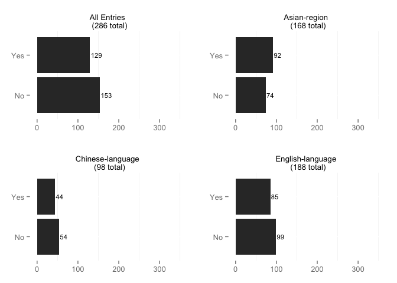

# All Entries Descriptives

### TOTAL NUMBER OF ARTICLES: 301

## Publication Details

### Type of Publication

 

### Publisher

### Publication Year

    

### Publication Language

 

### Type of Research

 
    
#### Research Type Others:

|Private.ID |X.others....gsub.sprintf......s....s.....s.....paste.items..collapse.......... |Private.Reviewer |
|:----------|:------------------------------------------------------------------------------|:----------------|
|60         |Author designs theoretical model private tutoring                              |Mike             |
|86         |secondary analysis of primary information                                      |Hang Duong       |
|101e       |secondary analysis of primary information                                      |Hang Duong       |
|104e       |secondary analysis of primary information                                      |Hang Duong       |
|109e       | + Theoretical???                                                              |Hang Duong       |
|95e        |analysis paper on primary data                                                 |Hang Duong       |
|96e        |Analysis based on theoretical approaches                                       |Hang Duong       |
|97e        |Secondary research                                                             |Damian Wyman     |

## Subjects and Approach

### Country or Countries Studied

<table>
<caption>Counts</caption>
 <thead>
  <tr>
   <th align="left"> Var1 </th>
   <th align="right"> Freq </th>
  </tr>
 </thead>
<tbody>
  <tr>
   <td align="left">  </td>
   <td align="right"> 0 </td>
  </tr>
  <tr>
   <td align="left"> Albania, Georgia, Lithuania </td>
   <td align="right"> 1 </td>
  </tr>
  <tr>
   <td align="left"> Australia </td>
   <td align="right"> 2 </td>
  </tr>
  <tr>
   <td align="left"> Azerbaijan, Bosnia and Herzegovina, Croatia, Georgia, Lithuania, Mongolia, Poland, Slovakia, and Ukraine, Kazakhstan, Kyrgyzstan, and Tajikistan </td>
   <td align="right"> 1 </td>
  </tr>
  <tr>
   <td align="left"> Azerbaijan, Georgia, Ukraine, Croatia, Lithuania, B&H, Mongolia, Poland, Slovakia </td>
   <td align="right"> 1 </td>
  </tr>
  <tr>
   <td align="left"> Bangladesh </td>
   <td align="right"> 2 </td>
  </tr>
  <tr>
   <td align="left"> Bangladesh  </td>
   <td align="right"> 1 </td>
  </tr>
  <tr>
   <td align="left"> Bosnia & Herzegovina and Croatia </td>
   <td align="right"> 1 </td>
  </tr>
  <tr>
   <td align="left"> Brazil </td>
   <td align="right"> 2 </td>
  </tr>
  <tr>
   <td align="left"> British </td>
   <td align="right"> 1 </td>
  </tr>
  <tr>
   <td align="left"> Cambodia </td>
   <td align="right"> 4 </td>
  </tr>
  <tr>
   <td align="left"> Canada </td>
   <td align="right"> 5 </td>
  </tr>
  <tr>
   <td align="left"> China </td>
   <td align="right"> 90 </td>
  </tr>
  <tr>
   <td align="left"> Cyprus </td>
   <td align="right"> 1 </td>
  </tr>
  <tr>
   <td align="left"> Egypt </td>
   <td align="right"> 5 </td>
  </tr>
  <tr>
   <td align="left"> England </td>
   <td align="right"> 1 </td>
  </tr>
  <tr>
   <td align="left"> Europe </td>
   <td align="right"> 1 </td>
  </tr>
  <tr>
   <td align="left"> Examples: USA and India </td>
   <td align="right"> 1 </td>
  </tr>
  <tr>
   <td align="left"> France </td>
   <td align="right"> 1 </td>
  </tr>
  <tr>
   <td align="left"> Georgia </td>
   <td align="right"> 1 </td>
  </tr>
  <tr>
   <td align="left"> Germany </td>
   <td align="right"> 2 </td>
  </tr>
  <tr>
   <td align="left"> global study </td>
   <td align="right"> 9 </td>
  </tr>
  <tr>
   <td align="left"> Great Britain </td>
   <td align="right"> 1 </td>
  </tr>
  <tr>
   <td align="left"> Greece </td>
   <td align="right"> 2 </td>
  </tr>
  <tr>
   <td align="left"> Greek </td>
   <td align="right"> 1 </td>
  </tr>
  <tr>
   <td align="left"> Hong Kong </td>
   <td align="right"> 8 </td>
  </tr>
  <tr>
   <td align="left"> Hong Kong, Macao, Korea, Japan, and Taiwan </td>
   <td align="right"> 1 </td>
  </tr>
  <tr>
   <td align="left"> India </td>
   <td align="right"> 1 </td>
  </tr>
  <tr>
   <td align="left"> Ireland </td>
   <td align="right"> 1 </td>
  </tr>
  <tr>
   <td align="left"> Italy </td>
   <td align="right"> 3 </td>
  </tr>
  <tr>
   <td align="left"> Japan </td>
   <td align="right"> 10 </td>
  </tr>
  <tr>
   <td align="left"> Japan, South Korea, and Cambodia </td>
   <td align="right"> 1 </td>
  </tr>
  <tr>
   <td align="left"> Jordan </td>
   <td align="right"> 1 </td>
  </tr>
  <tr>
   <td align="left"> Kazakhstan, Kyrgyzstan, Tajikistan </td>
   <td align="right"> 1 </td>
  </tr>
  <tr>
   <td align="left"> Kenya </td>
   <td align="right"> 1 </td>
  </tr>
  <tr>
   <td align="left"> Korea </td>
   <td align="right"> 2 </td>
  </tr>
  <tr>
   <td align="left"> Korea, Taiwan, Romania, and Phillippines </td>
   <td align="right"> 1 </td>
  </tr>
  <tr>
   <td align="left"> Korea, US </td>
   <td align="right"> 1 </td>
  </tr>
  <tr>
   <td align="left"> Kuwait </td>
   <td align="right"> 1 </td>
  </tr>
  <tr>
   <td align="left"> Luxembourg </td>
   <td align="right"> 1 </td>
  </tr>
  <tr>
   <td align="left"> Malaysia </td>
   <td align="right"> 1 </td>
  </tr>
  <tr>
   <td align="left"> Maldives </td>
   <td align="right"> 1 </td>
  </tr>
  <tr>
   <td align="left"> Malta </td>
   <td align="right"> 1 </td>
  </tr>
  <tr>
   <td align="left"> Poland </td>
   <td align="right"> 1 </td>
  </tr>
  <tr>
   <td align="left"> Portugal </td>
   <td align="right"> 1 </td>
  </tr>
  <tr>
   <td align="left"> Romania </td>
   <td align="right"> 2 </td>
  </tr>
  <tr>
   <td align="left"> Russia </td>
   <td align="right"> 1 </td>
  </tr>
  <tr>
   <td align="left"> S.Korea </td>
   <td align="right"> 1 </td>
  </tr>
  <tr>
   <td align="left"> Scoland </td>
   <td align="right"> 1 </td>
  </tr>
  <tr>
   <td align="left"> Singapore </td>
   <td align="right"> 2 </td>
  </tr>
  <tr>
   <td align="left"> Slovenia </td>
   <td align="right"> 1 </td>
  </tr>
  <tr>
   <td align="left"> South Korea </td>
   <td align="right"> 16 </td>
  </tr>
  <tr>
   <td align="left"> South Korea and United States </td>
   <td align="right"> 1 </td>
  </tr>
  <tr>
   <td align="left"> Sri Lanka </td>
   <td align="right"> 2 </td>
  </tr>
  <tr>
   <td align="left"> Taiwan </td>
   <td align="right"> 2 </td>
  </tr>
  <tr>
   <td align="left"> the Phillipines </td>
   <td align="right"> 1 </td>
  </tr>
  <tr>
   <td align="left"> Trinidad and Tobago </td>
   <td align="right"> 1 </td>
  </tr>
  <tr>
   <td align="left"> Turkey </td>
   <td align="right"> 8 </td>
  </tr>
  <tr>
   <td align="left"> UK </td>
   <td align="right"> 3 </td>
  </tr>
  <tr>
   <td align="left"> United States </td>
   <td align="right"> 5 </td>
  </tr>
  <tr>
   <td align="left"> US </td>
   <td align="right"> 5 </td>
  </tr>
  <tr>
   <td align="left"> US vs S.Korea </td>
   <td align="right"> 1 </td>
  </tr>
  <tr>
   <td align="left"> US, Korea, Japan </td>
   <td align="right"> 1 </td>
  </tr>
  <tr>
   <td align="left"> USA </td>
   <td align="right"> 6 </td>
  </tr>
  <tr>
   <td align="left"> Vietnam </td>
   <td align="right"> 6 </td>
  </tr>
</tbody>
</table>

### Region(s) Studied

 

#### Region(s) Others:

|Private.ID |X.others....gsub.sprintf......s....s.....s.....paste.items..collapse.......... |Private.Reviewer |
|:----------|:------------------------------------------------------------------------------|:----------------|
|51         |"Developing countries"                                                         |Olga             |
|171        |North Europe                                                                   |Xiaoran Yu       |
|118e       |Mediterranean                                                                  |Iveta            |
|119e       |Mediterranean                                                                  |Iveta            |
|131e       |Mediterranean                                                                  |Iveta            |

### Levels of Education Discussed

 

#### EdLevel Others:

|Private.ID |X.others....gsub.sprintf......s....s.....s.....paste.EdLevelNames.. |Private.Reviewer |
|:----------|:-------------------------------------------------------------------|:----------------|
|76         |grades 7-9                                                          |Olga             |
|183        |not clear                                                           |Xia Zhao         |
|99e        |not clear                                                           |Hang Duong       |

### Research Approach

 

#### ResearchApproach Others:

|Private.ID |X.others....gsub.sprintf......s....s.....s.....paste.ResearchApproachNames.. |Private.Reviewer |
|:----------|:----------------------------------------------------------------------------|:----------------|
|7          |Single-case                                                                  |Olga             |
|8          |Single-case                                                                  |Peggy            |
|13         |Single-case                                                                  |Mike             |
|16         |Single-case                                                                  |Peggy            |
|21         |Single-case                                                                  |Iveta            |
|34         |Single-case                                                                  |Olga             |
|41         |Single-case                                                                  |Olga             |
|41         |Single-case                                                                  |Olga             |
|43         |Single-case                                                                  |Iveta            |
|46         |Single-case                                                                  |Olga             |
|47         |Single-case                                                                  |Iveta            |
|52         |Single-case                                                                  |Mike             |
|57         |Single-case                                                                  |Olga             |
|60         |Theoretical model                                                            |Mike             |
|66         |Single-case                                                                  |Olga             |
|71         |Single-case                                                                  |Olga             |
|78         |Single-case                                                                  |Olga             |
|81         |Single-case                                                                  |Olga             |
|82         |Single-case                                                                  |Mike             |
|84         |Single-case                                                                  |Iveta            |
|85         |Single-case                                                                  |Iveta            |
|87         |Single-case                                                                  |Iveta            |
|109e       |Theoretical/conceptual, proposal a model                                     |Hang Duong       |
|218        |single country but some comparisons were made                                |Hang Duong       |

### Research Methods

 

### Was Data Set Used?

 
