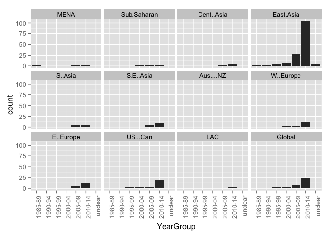
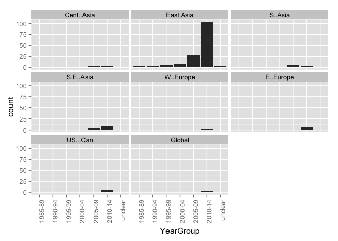
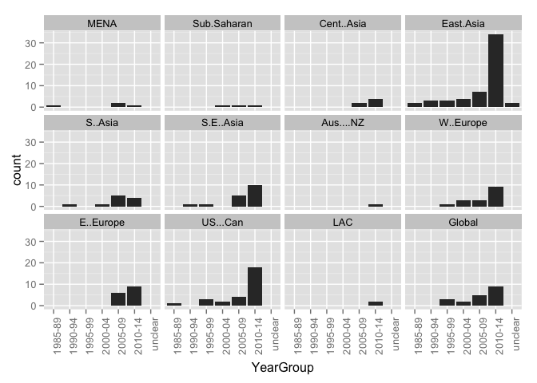

# Relationships

# Region by years (grouped)

## _Region by year group_ for all entries in the database:

### Graphs for all entries
 

### Counts for all entries

|        | MENA| Sub.Saharan| Cent..Asia| East.Asia| S..Asia| S.E..Asia| Aus....NZ| W..Europe| E..Europe| US...Can| LAC| Global|
|:-------|----:|-----------:|----------:|---------:|-------:|---------:|---------:|---------:|---------:|--------:|---:|------:|
|1985-89 |    1|           0|          0|         2|       0|         0|         0|         0|         0|        1|   0|      0|
|1990-94 |    0|           0|          0|         3|       1|         1|         0|         0|         0|        0|   0|      0|
|1995-99 |    0|           0|          0|         5|       0|         1|         0|         1|         0|        3|   0|      3|
|2000-04 |    0|           1|          0|         7|       1|         0|         0|         3|         0|        2|   0|      2|
|2005-09 |    2|           1|          2|        29|       5|         5|         0|         3|         6|        4|   0|      8|
|2010-14 |    1|           1|          4|       104|       4|        10|         1|        12|        13|       20|   2|     23|
|unclear |    0|           0|          0|         4|       0|         0|         0|         0|         0|        0|   0|      0|

### Percentages for all entries

|        |   MENA| Sub.Saharan| Cent..Asia| East.Asia| S..Asia| S.E..Asia| Aus....NZ| W..Europe| E..Europe| US...Can|    LAC| Global|
|:-------|------:|-----------:|----------:|---------:|-------:|---------:|---------:|---------:|---------:|--------:|------:|------:|
|1985-89 | 0.0033|      0.0000|     0.0000|    0.0066|  0.0000|    0.0000|    0.0000|    0.0000|    0.0000|   0.0033| 0.0000| 0.0000|
|1990-94 | 0.0000|      0.0000|     0.0000|    0.0099|  0.0033|    0.0033|    0.0000|    0.0000|    0.0000|   0.0000| 0.0000| 0.0000|
|1995-99 | 0.0000|      0.0000|     0.0000|    0.0166|  0.0000|    0.0033|    0.0000|    0.0033|    0.0000|   0.0099| 0.0000| 0.0099|
|2000-04 | 0.0000|      0.0033|     0.0000|    0.0232|  0.0033|    0.0000|    0.0000|    0.0099|    0.0000|   0.0066| 0.0000| 0.0066|
|2005-09 | 0.0066|      0.0033|     0.0066|    0.0960|  0.0166|    0.0166|    0.0000|    0.0099|    0.0199|   0.0132| 0.0000| 0.0265|
|2010-14 | 0.0033|      0.0033|     0.0132|    0.3444|  0.0132|    0.0331|    0.0033|    0.0397|    0.0430|   0.0662| 0.0066| 0.0762|
|unclear | 0.0000|      0.0000|     0.0000|    0.0132|  0.0000|    0.0000|    0.0000|    0.0000|    0.0000|   0.0000| 0.0000| 0.0000|

## _Region by year group_ for all Asian-region entries in the database:

### Graphs for all Asian-region entries
 

### Counts for all Asian-region entries

|        | MENA| Sub.Saharan| Cent..Asia| East.Asia| S..Asia| S.E..Asia| Aus....NZ| W..Europe| E..Europe| US...Can| LAC| Global|
|:-------|----:|-----------:|----------:|---------:|-------:|---------:|---------:|---------:|---------:|--------:|---:|------:|
|1985-89 |    0|           0|          0|         2|       0|         0|         0|         0|         0|        0|   0|      0|
|1990-94 |    0|           0|          0|         3|       1|         1|         0|         0|         0|        0|   0|      0|
|1995-99 |    0|           0|          0|         5|       0|         1|         0|         0|         0|        0|   0|      0|
|2000-04 |    0|           0|          0|         7|       1|         0|         0|         0|         0|        0|   0|      0|
|2005-09 |    0|           0|          2|        29|       5|         5|         0|         0|         1|        1|   0|      0|
|2010-14 |    0|           0|          4|       104|       4|        10|         0|         2|         6|        5|   0|      2|
|unclear |    0|           0|          0|         4|       0|         0|         0|         0|         0|        0|   0|      0|

### Percentages for all Asian-region entries

|        |   MENA| Sub.Saharan| Cent..Asia| East.Asia| S..Asia| S.E..Asia| Aus....NZ| W..Europe| E..Europe| US...Can|    LAC| Global|
|:-------|------:|-----------:|----------:|---------:|-------:|---------:|---------:|---------:|---------:|--------:|------:|------:|
|1985-89 | 0.0000|      0.0000|     0.0000|    0.0098|  0.0000|    0.0000|    0.0000|    0.0000|    0.0000|   0.0000| 0.0000| 0.0000|
|1990-94 | 0.0000|      0.0000|     0.0000|    0.0146|  0.0049|    0.0049|    0.0000|    0.0000|    0.0000|   0.0000| 0.0000| 0.0000|
|1995-99 | 0.0000|      0.0000|     0.0000|    0.0244|  0.0000|    0.0049|    0.0000|    0.0000|    0.0000|   0.0000| 0.0000| 0.0000|
|2000-04 | 0.0000|      0.0000|     0.0000|    0.0341|  0.0049|    0.0000|    0.0000|    0.0000|    0.0000|   0.0000| 0.0000| 0.0000|
|2005-09 | 0.0000|      0.0000|     0.0098|    0.1415|  0.0244|    0.0244|    0.0000|    0.0000|    0.0049|   0.0049| 0.0000| 0.0000|
|2010-14 | 0.0000|      0.0000|     0.0195|    0.5073|  0.0195|    0.0488|    0.0000|    0.0098|    0.0293|   0.0244| 0.0000| 0.0098|
|unclear | 0.0000|      0.0000|     0.0000|    0.0195|  0.0000|    0.0000|    0.0000|    0.0000|    0.0000|   0.0000| 0.0000| 0.0000|

## _Region by year group_ for all Chinese-language entries in the database:

### Graphs for all Chinese-language entries
 

### Counts for all Chinese-language entries

|        | MENA| Sub.Saharan| Cent..Asia| East.Asia| S..Asia| S.E..Asia| Aus....NZ| W..Europe| E..Europe| US...Can| LAC| Global|
|:-------|----:|-----------:|----------:|---------:|-------:|---------:|---------:|---------:|---------:|--------:|---:|------:|
|1995-99 |    0|           0|          0|         2|       0|         0|         0|         0|         0|        0|   0|      0|
|2000-04 |    0|           0|          0|         3|       0|         0|         0|         0|         0|        0|   0|      0|
|2005-09 |    0|           0|          0|        22|       0|         0|         0|         0|         0|        0|   0|      3|
|2010-14 |    0|           0|          0|        70|       0|         0|         0|         3|         4|        2|   0|     14|
|unclear |    0|           0|          0|         2|       0|         0|         0|         0|         0|        0|   0|      0|

### Percentages for all Chinese-language entries

|        |  MENA| Sub.Saharan| Cent..Asia| East.Asia| S..Asia| S.E..Asia| Aus....NZ| W..Europe| E..Europe| US...Can|   LAC| Global|
|:-------|-----:|-----------:|----------:|---------:|-------:|---------:|---------:|---------:|---------:|--------:|-----:|------:|
|1995-99 | 0.000|       0.000|      0.000|     0.016|   0.000|     0.000|     0.000|     0.000|     0.000|    0.000| 0.000|  0.000|
|2000-04 | 0.000|       0.000|      0.000|     0.024|   0.000|     0.000|     0.000|     0.000|     0.000|    0.000| 0.000|  0.000|
|2005-09 | 0.000|       0.000|      0.000|     0.176|   0.000|     0.000|     0.000|     0.000|     0.000|    0.000| 0.000|  0.024|
|2010-14 | 0.000|       0.000|      0.000|     0.560|   0.000|     0.000|     0.000|     0.024|     0.032|    0.016| 0.000|  0.112|
|unclear | 0.000|       0.000|      0.000|     0.016|   0.000|     0.000|     0.000|     0.000|     0.000|    0.000| 0.000|  0.000|

## _Region by year group_ for all English-language entries in the database:

### Graphs for all English-language entries
 

### Counts for all English-language entries

|        | MENA| Sub.Saharan| Cent..Asia| East.Asia| S..Asia| S.E..Asia| Aus....NZ| W..Europe| E..Europe| US...Can| LAC| Global|
|:-------|----:|-----------:|----------:|---------:|-------:|---------:|---------:|---------:|---------:|--------:|---:|------:|
|1985-89 |    1|           0|          0|         2|       0|         0|         0|         0|         0|        1|   0|      0|
|1990-94 |    0|           0|          0|         3|       1|         1|         0|         0|         0|        0|   0|      0|
|1995-99 |    0|           0|          0|         3|       0|         1|         0|         1|         0|        3|   0|      3|
|2000-04 |    0|           1|          0|         4|       1|         0|         0|         3|         0|        2|   0|      2|
|2005-09 |    2|           1|          2|         7|       5|         5|         0|         3|         6|        4|   0|      5|
|2010-14 |    1|           1|          4|        34|       4|        10|         1|         9|         9|       18|   2|      9|
|unclear |    0|           0|          0|         2|       0|         0|         0|         0|         0|        0|   0|      0|

### Percentages for all English-language entries

|        |   MENA| Sub.Saharan| Cent..Asia| East.Asia| S..Asia| S.E..Asia| Aus....NZ| W..Europe| E..Europe| US...Can|    LAC| Global|
|:-------|------:|-----------:|----------:|---------:|-------:|---------:|---------:|---------:|---------:|--------:|------:|------:|
|1985-89 | 0.0056|      0.0000|     0.0000|    0.0113|  0.0000|    0.0000|    0.0000|    0.0000|    0.0000|   0.0056| 0.0000| 0.0000|
|1990-94 | 0.0000|      0.0000|     0.0000|    0.0169|  0.0056|    0.0056|    0.0000|    0.0000|    0.0000|   0.0000| 0.0000| 0.0000|
|1995-99 | 0.0000|      0.0000|     0.0000|    0.0169|  0.0000|    0.0056|    0.0000|    0.0056|    0.0000|   0.0169| 0.0000| 0.0169|
|2000-04 | 0.0000|      0.0056|     0.0000|    0.0226|  0.0056|    0.0000|    0.0000|    0.0169|    0.0000|   0.0113| 0.0000| 0.0113|
|2005-09 | 0.0113|      0.0056|     0.0113|    0.0395|  0.0282|    0.0282|    0.0000|    0.0169|    0.0339|   0.0226| 0.0000| 0.0282|
|2010-14 | 0.0056|      0.0056|     0.0226|    0.1921|  0.0226|    0.0565|    0.0056|    0.0508|    0.0508|   0.1017| 0.0113| 0.0508|
|unclear | 0.0000|      0.0000|     0.0000|    0.0113|  0.0000|    0.0000|    0.0000|    0.0000|    0.0000|   0.0000| 0.0000| 0.0000|
