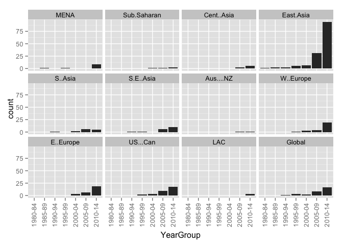
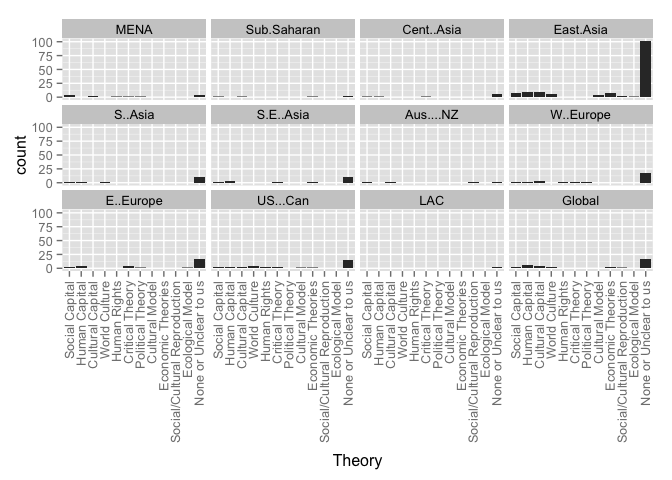
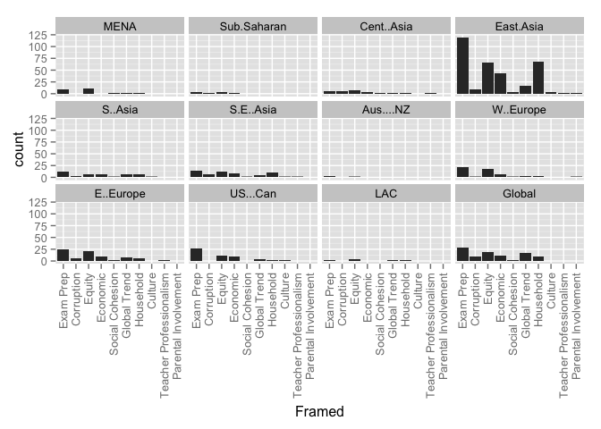
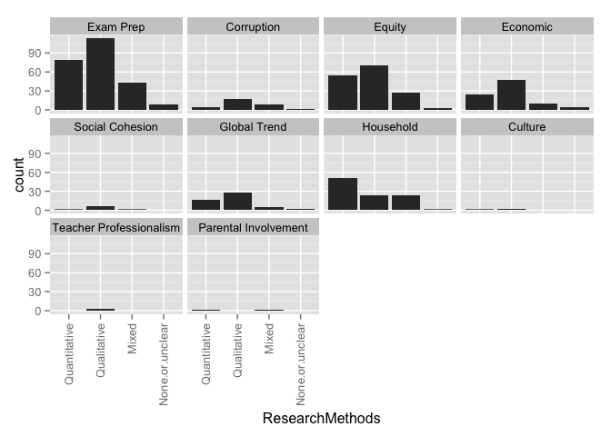
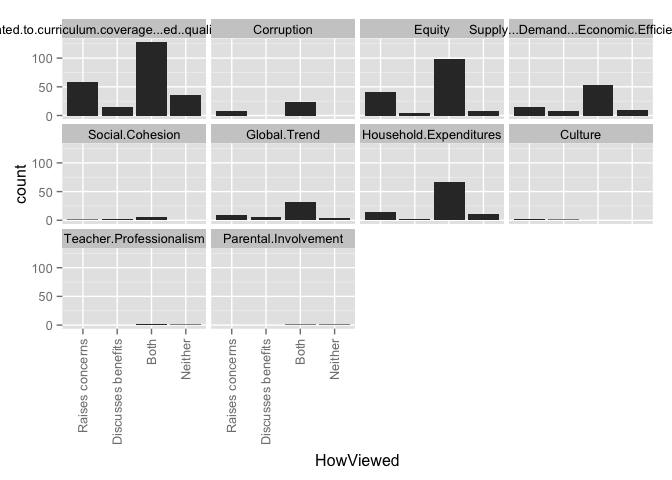
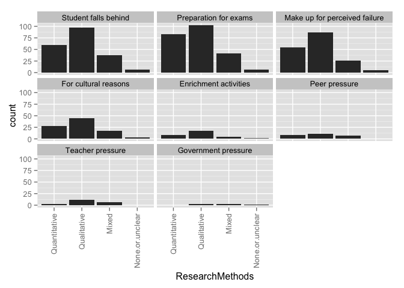

# Relationships for All Articles

### TOTAL NUMBER OF ARTICLES: 287
This number includes 2 articles with duplicate ID numbers. A full list of duplicate articles can be found [here](https://github.com/MikeRussellMcK/PTAnalysis/blob/master/Markdown%20and%20Output/Duplicates.md). 
Document was last updated on 2014-10-03 07:09:35.

# _Region by year group_ for all entries in the database:

### Graphs for all entries
 

### Counts for all entries

|        | MENA| Sub.Saharan| Cent..Asia| East.Asia| S..Asia| S.E..Asia| Aus....NZ| W..Europe| E..Europe| US...Can| LAC| Global|
|:-------|----:|-----------:|----------:|---------:|-------:|---------:|---------:|---------:|---------:|--------:|---:|------:|
|1985-89 |    1|           0|          0|         2|       0|         0|         0|         0|         0|        0|   0|      0|
|1990-94 |    0|           0|          0|         2|       1|         1|         0|         0|         0|        0|   0|      1|
|1995-99 |    1|           0|          0|         5|       0|         1|         0|         1|         0|        2|   0|      3|
|2000-04 |    0|           1|          0|         6|       2|         0|         0|         3|         3|        3|   0|      2|
|2005-09 |    0|           1|          2|        31|       6|         6|         1|         4|         6|        9|   0|      8|
|2010-14 |    9|           2|          5|        94|       5|        11|         1|        19|        19|       17|   3|     17|
|unclear |    0|           0|          0|         1|       0|         0|         0|         0|         0|        0|   0|      0|

# _Region by publication type_: 

### Graphs for all entries
 

### Counts for all entries

|                 | MENA| Sub.Saharan| Cent..Asia| East.Asia| S..Asia| S.E..Asia| Aus....NZ| W..Europe| E..Europe| US...Can| LAC| Global|
|:----------------|----:|-----------:|----------:|---------:|-------:|---------:|---------:|---------:|---------:|--------:|---:|------:|
|Book             |    1|           0|          3|         1|       1|         1|         0|         1|         3|        2|   0|      1|
|Book Chapter     |    5|           1|          1|         0|       0|         2|         0|         8|         5|        0|   0|      0|
|Discussion Paper |    0|           0|          0|         0|       0|         0|         0|         0|         2|        0|   0|      0|
|Dissertation     |    1|           1|          0|        10|       2|         1|         0|         0|         1|        2|   0|      1|
|Journal Article  |    3|           1|          2|        95|       8|        10|         2|        17|        15|       28|   3|     29|
|Master's Thesis  |    0|           0|          0|        32|       0|         0|         0|         0|         0|        0|   0|      0|
|Report           |    1|           0|          1|         2|       2|         2|         0|         1|         2|        0|   0|      0|
|Working Paper    |    0|           1|          0|         1|       1|         3|         0|         0|         0|        0|   0|      0|

# _Publication type by year group_ for all entries in the database:

### Graphs for all entries
 

### Counts for all entries

|        | Book| Book Chapter| Discussion Paper| Dissertation| Journal Article| Master's Thesis| Report| Working Paper|
|:-------|----:|------------:|----------------:|------------:|---------------:|---------------:|------:|-------------:|
|1985-89 |    0|            0|                0|            1|               2|               0|      0|             0|
|1990-94 |    0|            0|                0|            0|               5|               0|      0|             0|
|1995-99 |    0|            0|                0|            2|               9|               0|      2|             0|
|2000-04 |    0|            1|                0|            2|              15|               1|      0|             0|
|2005-09 |    3|            1|                2|            6|              48|               6|      1|             2|
|2010-14 |    4|           14|                0|            8|             117|              25|      4|             4|
|unclear |    0|            0|                0|            0|               1|               0|      0|             0|

# _Research type by region_ for all entries in the database

### Graphs for all entries
 

### Counts for all entries

|            | Original empirical| Review of other| Policy analysis| value|
|:-----------|------------------:|---------------:|---------------:|-----:|
|MENA        |                  8|               4|               0|     0|
|Sub.Saharan |                  3|               0|               1|     0|
|Cent..Asia  |                  5|               2|               1|     0|
|East.Asia   |                 89|              62|              11|     0|
|S..Asia     |                  7|               5|               1|     0|
|S.E..Asia   |                 13|               4|               2|     0|
|Aus....NZ   |                  1|               0|               0|     0|
|W..Europe   |                 15|              10|               1|     0|
|E..Europe   |                 19|               7|               5|     0|
|US...Can    |                 24|               5|               4|     0|
|LAC         |                  2|               2|               0|     0|
|Global      |                  9|              20|               0|     0|

# _Research type by year group_ for all entries in the database

### Graphs for all entries
 

### Counts for all entries

|        | Original.empirical.research| Review.of.other.research| Policy.analysis|
|:-------|---------------------------:|------------------------:|---------------:|
|1985-89 |                           3|                        0|               0|
|1990-94 |                           4|                        1|               0|
|1995-99 |                          11|                        2|               0|
|2000-04 |                          10|                        5|               2|
|2005-09 |                          44|                       21|               5|
|2010-14 |                         109|                       73|              13|
|unclear |                           1|                        0|               0|

# _Ed levels by region_ 

### Graphs for all entries
 

### Counts for all entries

|            | Pre-primary| Primary| Secondary| Tertiary| value|
|:-----------|-----------:|-------:|---------:|--------:|-----:|
|MENA        |           0|       8|        11|        0|     0|
|Sub.Saharan |           0|       1|         4|        0|     0|
|Cent..Asia  |           0|       5|         6|        0|     0|
|East.Asia   |           6|      99|       123|        3|     0|
|S..Asia     |           3|       8|        12|        0|     0|
|S.E..Asia   |           1|      18|        14|        0|     0|
|Aus....NZ   |           0|       0|         2|        0|     0|
|W..Europe   |           1|      19|        27|        2|     0|
|E..Europe   |           1|      16|        27|        6|     0|
|US...Can    |           3|      22|        29|        2|     0|
|LAC         |           0|       2|         3|        0|     0|
|Global      |           3|      28|        29|        0|     0|

# _Research approach by region_
### Graphs for all entries
 

### Counts for all entries

|            | Single-country| Comparative| value|
|:-----------|--------------:|-----------:|-----:|
|MENA        |              8|           3|     0|
|Sub.Saharan |              4|           0|     0|
|Cent..Asia  |              1|           6|     0|
|East.Asia   |            124|          15|     0|
|S..Asia     |              9|           5|     0|
|S.E..Asia   |             13|           6|     0|
|Aus....NZ   |              2|           0|     0|
|W..Europe   |             21|           6|     0|
|E..Europe   |             15|          13|     0|
|US...Can    |             27|           5|     0|
|LAC         |              3|           0|     0|
|Global      |              2|          27|     0|

# Research approach by year group
### Graphs for all entries
 

### Counts for all entries

|        | Single.country...case| Comparative|
|:-------|---------------------:|-----------:|
|1985-89 |                     3|           0|
|1990-94 |                     4|           1|
|1995-99 |                     9|           2|
|2000-04 |                    15|           4|
|2005-09 |                    55|          13|
|2010-14 |                   139|          36|
|unclear |                     1|           0|

# Research methods by year group
### Graphs for all entries
 

### Counts for all entries

|        | Mixed-methods| None or Unclear to us| Qualitative| Quantitative|
|:-------|-------------:|---------------------:|-----------:|------------:|
|1985-89 |             1|                     0|           1|            1|
|1990-94 |             1|                     0|           2|            2|
|1995-99 |             3|                     3|           2|            5|
|2000-04 |             2|                     0|          10|            7|
|2005-09 |            10|                     0|          27|           32|
|2010-14 |            30|                     6|          89|           51|
|unclear |             0|                     0|           1|            0|

# Research methods by region
### Graphs for all entries
 

### Counts for all entries

|            | Mixed-methods| None or Unclear to us| Qualitative| Quantitative|
|:-----------|-------------:|---------------------:|-----------:|------------:|
|MENA        |             1|                     0|           7|            3|
|Sub.Saharan |             0|                     0|           3|            1|
|Cent..Asia  |             3|                     0|           3|            1|
|East.Asia   |            29|                     5|          57|           50|
|S..Asia     |             3|                     1|           6|            4|
|S.E..Asia   |             3|                     0|           6|           10|
|Aus....NZ   |             0|                     0|           2|            0|
|W..Europe   |             2|                     0|          16|            9|
|E..Europe   |             3|                     1|          17|            7|
|US...Can    |             4|                     1|          18|            9|
|LAC         |             1|                     0|           1|            1|
|Global      |             1|                     2|          21|            7|

# Research methods by year group
### Graph for all entries
 

### Counts for all entries

|        | Mixed-methods| None or Unclear to us| Qualitative| Quantitative|
|:-------|-------------:|---------------------:|-----------:|------------:|
|1985-89 |             1|                     0|           1|            1|
|1990-94 |             1|                     0|           2|            2|
|1995-99 |             3|                     3|           2|            5|
|2000-04 |             2|                     0|          10|            7|
|2005-09 |            10|                     0|          27|           32|
|2010-14 |            30|                     6|          89|           51|
|unclear |             0|                     0|           1|            0|

# Research methods by publication type
### Graph for all entries
 

### Counts for all entries

|                 | Mixed-methods| None or Unclear to us| Qualitative| Quantitative|
|:----------------|-------------:|---------------------:|-----------:|------------:|
|Book             |             3|                     0|           5|            0|
|Book Chapter     |             1|                     0|          12|            3|
|Discussion Paper |             0|                     0|           0|            2|
|Dissertation     |             4|                     0|           4|           11|
|Journal Article  |            19|                     9|          95|           74|
|Master's Thesis  |            19|                     0|          12|            1|
|Report           |             2|                     0|           3|            2|
|Working Paper    |             0|                     0|           1|            5|

# Theoreortical framework by region
### Graphs for all entries
 

### Counts for all entries

|                      | MENA| Sub.Saharan| Cent..Asia| East.Asia| S..Asia| S.E..Asia| Aus....NZ| W..Europe| E..Europe| US...Can| LAC| Global|
|:---------------------|----:|-----------:|----------:|---------:|-------:|---------:|---------:|---------:|---------:|--------:|---:|------:|
|Social Capital        |    3|           1|          1|         7|       1|         2|         1|         2|         2|        3|   0|      2|
|Human Capital         |    0|           0|          1|         9|       1|         4|         0|         2|         4|        3|   0|      6|
|Cultural Capital      |    2|           1|          0|         7|       0|         0|         0|         4|         0|        3|   0|      4|
|World Culture         |    0|           0|          0|         1|       1|         0|         0|         0|         0|        1|   0|      3|
|Human Rights          |    1|           0|          0|         0|       0|         1|         0|         1|         0|        2|   0|      0|
|Critical Theory       |    1|           0|          1|         0|       0|         2|         0|         2|         4|        2|   0|      0|
|Political Theory      |    1|           0|          0|         0|       0|         0|         0|         1|         1|        0|   0|      0|
|None or Unclear to us |    4|           2|          5|        98|      11|        10|         1|        17|        17|       15|   3|     16|
|value                 |    0|           0|          0|         0|       0|         0|         0|         0|         0|        0|   0|      0|

# Theoreortical framework by year group
### Graphs for all entries
 

### Counts for all entries

|        | Social.Capital| Human.Capital| Cultural.Capital| World.Culture| Human.Rights| Critical.Theory| Political.Theory| None.or.Unclear.to.us|
|:-------|--------------:|-------------:|----------------:|-------------:|------------:|---------------:|----------------:|---------------------:|
|1985-89 |              0|             0|                0|             0|            0|               0|                0|                     2|
|1990-94 |              1|             0|                0|             0|            0|               0|                0|                     4|
|1995-99 |              0|             2|                0|             0|            1|               0|                0|                     9|
|2000-04 |              1|             3|                3|             1|            0|               0|                0|                    10|
|2005-09 |              4|             7|                4|             0|            1|               2|                0|                    42|
|2010-14 |             14|            15|               13|             3|            3|               5|                1|                   114|
|unclear |              0|             0|                0|             0|            0|               0|                0|                     0|

# Theoretical framework by research method
### Graphs for all entries
 

### Counts for all entries

|                      | Quantitative| Qualitative| Mixed| None.or.unclear|
|:---------------------|------------:|-----------:|-----:|---------------:|
|Social Capital        |           10|           9|     1|               0|
|Human Capital         |           14|           9|     3|               1|
|Cultural Capital      |            8|           9|     3|               0|
|World Culture         |            1|           1|     1|               1|
|Human Rights          |            2|           2|     1|               0|
|Critical Theory       |            0|           5|     3|               0|
|Political Theory      |            0|           1|     0|               0|
|None or Unclear to us |           52|          88|    36|               5|
|value                 |            0|           0|     0|               0|

# Theoretical framework by research approach
### Graphs for all entries
 

### Counts for all entries

|                      | Single.country...case| Comparative|
|:---------------------|---------------------:|-----------:|
|Social Capital        |                    15|           5|
|Human Capital         |                    20|           5|
|Cultural Capital      |                    14|           6|
|World Culture         |                     2|           2|
|Human Rights          |                     5|           0|
|Critical Theory       |                     6|           2|
|Political Theory      |                     0|           1|
|None or Unclear to us |                   147|          32|
|value                 |                     0|           0|

# Framing by region
### Graphs for all entries
 

### Counts for all entries

|                | MENA| Sub.Saharan| Cent..Asia| East.Asia| S..Asia| S.E..Asia| Aus....NZ| W..Europe| E..Europe| US...Can| LAC| Global|
|:---------------|----:|-----------:|----------:|---------:|-------:|---------:|---------:|---------:|---------:|--------:|---:|------:|
|Exam Prep       |   10|           4|          6|       120|      12|        14|         2|        21|        24|       25|   2|     28|
|Corruption      |    0|           1|          6|        10|       2|         6|         0|         1|         6|        0|   0|     10|
|Equity          |   11|           3|          7|        67|       7|        13|         1|        19|        20|       11|   3|     19|
|Economic        |    0|           1|          3|        42|       6|         9|         0|         7|         9|        9|   0|     11|
|Social Cohesion |    1|           0|          1|         3|       1|         1|         0|         1|         2|        0|   0|      2|
|Global Trend    |    2|           0|          2|        17|       6|         5|         0|         3|         7|        3|   2|     17|
|Household       |    1|           0|          2|        66|       6|        11|         0|         3|         5|        2|   1|      9|
|value           |    0|           0|          0|         0|       0|         0|         0|         0|         0|        0|   0|      0|

# Framing by year group
### Graphs for all entries
 

### Counts for all entries

|        | Related.to.curriculum.coverage...ed..quality...exam.prep| Corruption| Equity| Supply...Demand...Economic.Efficiency| Social.Cohesion| Global.Trend| Household.Expenditures|
|:-------|--------------------------------------------------------:|----------:|------:|-------------------------------------:|---------------:|------------:|----------------------:|
|1985-89 |                                                        3|          0|      2|                                     0|               1|            0|                      0|
|1990-94 |                                                        4|          0|      2|                                     1|               0|            0|                      2|
|1995-99 |                                                        8|          1|      4|                                     4|               0|            1|                      3|
|2000-04 |                                                       18|          0|      7|                                     4|               0|            5|                      4|
|2005-09 |                                                       59|         10|     41|                                    24|               3|           15|                     34|
|2010-14 |                                                      148|         21|     97|                                    50|               5|           30|                     56|
|unclear |                                                        1|          0|      1|                                     0|               0|            0|                      0|

# Framed by research method
### Graphs for all entries
 

### Counts for all entries

|                | Quantitative| Qualitative| Mixed| None.or.unclear|
|:---------------|------------:|-----------:|-----:|---------------:|
|Exam Prep       |           79|         111|    43|               8|
|Corruption      |            4|          17|     9|               2|
|Equity          |           54|          70|    28|               3|
|Economic        |           25|          45|     9|               4|
|Social Cohesion |            1|           7|     1|               0|
|Global Trend    |           17|          27|     5|               2|
|Household       |           52|          24|    22|               1|
|value           |            0|           0|     0|               0|

# Framed by research approach
### Graphs for all entries
 

### Counts for all entries

|                | Single.country...case| Comparative|
|:---------------|---------------------:|-----------:|
|Exam Prep       |                   189|          49|
|Corruption      |                    12|          20|
|Equity          |                   111|          43|
|Economic        |                    60|          22|
|Social Cohesion |                     5|           4|
|Global Trend    |                    27|          24|
|Household       |                    83|          16|
|value           |                     0|           0|

# Framed by theory
### Graphs for all entries
 

### Counts for all entries

|                                                         | Social Capital| Human Capital| Cultural Capital| World Culture| Human Rights| Critical Theory| Political Theory| None or Unclear to us| value|
|:--------------------------------------------------------|--------------:|-------------:|----------------:|-------------:|------------:|---------------:|----------------:|---------------------:|-----:|
|Related.to.curriculum.coverage...ed..quality...exam.prep |             15|            19|               18|             4|            4|               5|                1|                   157|     0|
|Corruption                                               |              2|             5|                0|             1|            1|               1|                0|                    20|     0|
|Equity                                                   |             14|            11|               13|             1|            4|               6|                1|                    93|     0|
|Supply...Demand...Economic.Efficiency                    |              8|            16|                4|             2|            1|               1|                0|                    49|     0|
|Social.Cohesion                                          |              3|             3|                1|             0|            0|               0|                0|                     4|     0|
|Global.Trend                                             |              3|             9|                4|             4|            0|               1|                0|                    27|     0|
|Household.Expenditures                                   |              6|             9|                5|             0|            0|               0|                0|                    68|     0|

# How Viewed by region
### Graphs for all entries
 

### Counts for all entries

|                   | MENA| Sub.Saharan| Cent..Asia| East.Asia| S..Asia| S.E..Asia| Aus....NZ| W..Europe| E..Europe| US...Can| LAC| Global|
|:------------------|----:|-----------:|----------:|---------:|-------:|---------:|---------:|---------:|---------:|--------:|---:|------:|
|Raises concerns    |    6|           1|          1|        28|       4|         3|         0|         6|         4|       14|   2|      1|
|Discusses benefits |    0|           0|          0|         7|       1|         3|         1|         4|         5|        4|   0|      3|
|Both               |    4|           2|          6|        78|       7|        11|         1|        15|        18|        8|   0|     24|
|Neither            |    0|           1|          0|        27|       2|         0|         0|         2|         1|        6|   0|      2|
|value              |    0|           0|          0|         0|       0|         0|         0|         0|         0|        0|   0|      0|

# How Viewed by year group
### Graphs for all entries
 

### Counts for all entries

|        | Raises.concerns| Discusses.benefits| Both| Neither|
|:-------|---------------:|------------------:|----:|-------:|
|1985-89 |               1|                  0|    1|       1|
|1990-94 |               0|                  0|    5|       0|
|1995-99 |               4|                  1|    6|       1|
|2000-04 |               5|                  5|    7|       2|
|2005-09 |               9|                  5|   44|       8|
|2010-14 |              47|                 10|   89|      28|
|unclear |               0|                  0|    1|       0|

# HowViewed by research method
### Graphs for all entries
 

### Counts for all entries

|                   | Quantitative| Qualitative| Mixed| None.or.unclear|
|:------------------|------------:|-----------:|-----:|---------------:|
|Raises concerns    |           22|          29|    13|               3|
|Discusses benefits |            8|          11|     2|               0|
|Both               |           53|          73|    23|               4|
|Neither            |           13|          17|     8|               2|
|value              |            0|           0|     0|               0|

# HowViewed by research approach
### Graphs for all entries
 

### Counts for all entries

|                   | Single.country...case| Comparative|
|:------------------|---------------------:|-----------:|
|Raises concerns    |                    61|           6|
|Discusses benefits |                    18|           3|
|Both               |                   106|          43|
|Neither            |                    37|           3|
|value              |                     0|           0|

# HowViewed by theory
### Graphs for all entries
 

### Counts for all entries

|                   | Social Capital| Human Capital| Cultural Capital| World Culture| Human Rights| Critical Theory| Political Theory| None or Unclear to us| value|
|:------------------|--------------:|-------------:|----------------:|-------------:|------------:|---------------:|----------------:|---------------------:|-----:|
|Raises.concerns    |              5|             5|                7|             0|            5|               4|                1|                    38|     0|
|Discusses.benefits |              1|             5|                2|             2|            0|               0|                0|                    12|     0|
|Both               |             13|            16|                8|             1|            0|               4|                0|                    97|     0|
|Neither            |              1|             1|                3|             1|            0|               0|                0|                    30|     0|

# How Viewed by Framed
### Graphs for all entries
 

### Counts for all entries

|                                                         | Raises concerns| Discusses benefits| Both| Neither| value|
|:--------------------------------------------------------|---------------:|------------------:|----:|-------:|-----:|
|Related.to.curriculum.coverage...ed..quality...exam.prep |              59|                 14|  127|      35|     0|
|Corruption                                               |               7|                  0|   24|       0|     0|
|Equity                                                   |              42|                  3|   99|       7|     0|
|Supply...Demand...Economic.Efficiency                    |              12|                  8|   53|       9|     0|
|Social.Cohesion                                          |               1|                  2|    6|       0|     0|
|Global.Trend                                             |               8|                  6|   32|       4|     0|
|Household.Expenditures                                   |              14|                  2|   67|      11|     0|

# Stakeholders by region
### Graphs for all entries
 

### Counts for all entries

|                      | MENA| Sub.Saharan| Cent..Asia| East.Asia| S..Asia| S.E..Asia| Aus....NZ| W..Europe| E..Europe| US...Can| LAC| Global|
|:---------------------|----:|-----------:|----------:|---------:|-------:|---------:|---------:|---------:|---------:|--------:|---:|------:|
|Non-tutor teachers    |    4|           0|          0|        24|       2|         3|         1|         2|         6|        4|   1|      1|
|Teachers who tutor    |    5|           2|          0|        38|       2|         4|         1|         3|         6|        7|   1|      1|
|Tutors                |    2|           1|          0|         6|       1|         0|         0|         2|         3|        3|   0|      0|
|Parents               |    5|           2|          1|        61|       3|         9|         1|         6|         6|       10|   1|      1|
|Students              |    5|           1|          4|        77|       7|         7|         2|        11|        11|       12|   2|      4|
|School admin          |    1|           0|          0|         9|       0|         1|         0|         0|         0|        2|   0|      0|
|Tutoring center admin |    0|           0|          0|         1|       0|         0|         0|         1|         0|        1|   0|      0|
|Academic scholar(s)   |    0|           0|          0|         3|       0|         0|         0|         0|         0|        0|   0|      0|
|Policymakers          |    1|           1|          0|         7|       0|         2|         0|         0|         2|        2|   0|      0|
|Documents             |    4|           0|          2|        45|       5|         3|         0|        13|        10|       10|   1|     24|
|value                 |    0|           0|          0|         0|       0|         0|         0|         0|         0|        0|   0|      0|

# Stakeholders by year group
### Graphs for all entries
 

### Counts for all entries

|        | Teachers.who.do.not.tutor| Teachers.who.tutor| Tutors.who.are.not.teachers| School.administrators| Tutoring.center.admin| Academic.scholars| Parents...household| Students| Policymakers| Documents|
|:-------|-------------------------:|------------------:|---------------------------:|---------------------:|---------------------:|-----------------:|-------------------:|--------:|------------:|---------:|
|1985-89 |                         1|                  2|                           0|                     0|                     0|                 0|                   0|        3|            0|         0|
|1990-94 |                         0|                  0|                           1|                     0|                     0|                 0|                   1|        3|            0|         1|
|1995-99 |                         3|                  4|                           0|                     1|                     0|                 0|                   4|        3|            3|         6|
|2000-04 |                         3|                  4|                           2|                     2|                     1|                 1|                   6|        9|            1|         5|
|2005-09 |                        12|                 17|                           3|                     4|                     2|                 1|                  25|       37|            1|        21|
|2010-14 |                        22|                 36|                          10|                     6|                     0|                 1|                  63|       78|            9|        67|
|unclear |                         0|                  0|                           0|                     0|                     0|                 0|                   0|        0|            0|         0|

# Stakeholders by theory
### Graphs for all entries
 

### Counts for all entries

|                      | Non-tutor teachers| Tutors who tutor| Tutors| Parents| Students| Policymakers| Documents| value|
|:---------------------|------------------:|----------------:|------:|-------:|--------:|------------:|---------:|-----:|
|Social.Capital        |                  2|                3|      0|       7|       10|            0|         4|     0|
|Human.Capital         |                  1|                3|      0|       9|       10|            1|         8|     0|
|Cultural.Capital      |                  3|                6|      2|       6|       10|            1|         5|     0|
|World.Culture         |                  0|                0|      0|       0|        1|            0|         3|     0|
|Human.Rights          |                  1|                2|      0|       2|        2|            0|         3|     0|
|Critical.Theory       |                  1|                1|      0|       1|        2|            1|         2|     0|
|Political.Theory      |                  0|                0|      0|       0|        0|            0|         1|     0|
|None.or.Unclear.to.us |                 22|               36|      9|      62|       81|            9|        70|     0|
|School.administrators |                  8|                9|      3|      10|       10|            3|         2|     0|
|Tutoring.center.admin |                  0|                2|      1|       1|        1|            1|         0|     0|
|Academic.scholars     |                  1|                3|      1|       3|        3|            2|         0|     0|

# WhatTaught by region
### Graphs for all entries
 

### Counts for all entries

|                 | MENA| Sub.Saharan| Cent..Asia| East.Asia| S..Asia| S.E..Asia| Aus....NZ| W..Europe| E..Europe| US...Can| LAC| Global|
|:----------------|----:|-----------:|----------:|---------:|-------:|---------:|---------:|---------:|---------:|--------:|---:|------:|
|School subjects  |   11|           3|          4|        85|      10|        11|         2|        20|        21|       25|   3|     22|
|Extracurriculars |    0|           0|          0|         0|       0|         0|         0|         3|         3|        0|   0|      0|
|Both             |    0|           1|          3|        49|       4|         6|         0|         4|         4|        5|   0|      7|
|Not defined      |    0|           0|          0|         7|       0|         2|         0|         0|         0|        1|   0|      2|
|value            |    0|           0|          0|         0|       0|         0|         0|         0|         0|        0|   0|      0|

WhatTaught by year group
### Graphs for all entries
 

### Counts for all entries

|        | Subjects.taught.in.school| Extracurricular.activities| Both| Not.defined|
|:-------|-------------------------:|--------------------------:|----:|-----------:|
|1985-89 |                         3|                          0|    0|           0|
|1990-94 |                         4|                          0|    1|           0|
|1995-99 |                         8|                          0|    2|           2|
|2000-04 |                        14|                          3|    2|           0|
|2005-09 |                        47|                          1|   19|           2|
|2010-14 |                       120|                          2|   46|           8|
|unclear |                         1|                          0|    0|           0|

# WhatTaught by theory
### Graphs for all entries
 

### Counts for all entries

|                      | School subjects| Extracurriculars| Both| Not defined| value|
|:---------------------|---------------:|----------------:|----:|-----------:|-----:|
|Social.Capital        |              12|                1|    6|           1|     0|
|Human.Capital         |              18|                3|    4|           2|     0|
|Cultural.Capital      |              12|                2|    6|           0|     0|
|World.Culture         |               4|                0|    0|           0|     0|
|Human.Rights          |               5|                0|    0|           0|     0|
|Critical.Theory       |               7|                0|    1|           0|     0|
|Political.Theory      |               1|                0|    0|           0|     0|
|None.or.Unclear.to.us |             116|                1|   53|          10|     0|

# WhereOccur by region
### Graphs for all entries
 

### Counts for all entries

|                  | MENA| Sub.Saharan| Cent..Asia| East.Asia| S..Asia| S.E..Asia| Aus....NZ| W..Europe| E..Europe| US...Can| LAC| Global|
|:-----------------|----:|-----------:|----------:|---------:|-------:|---------:|---------:|---------:|---------:|--------:|---:|------:|
|On school grounds |    4|           3|          6|        23|       3|         9|         1|         6|        12|        8|   1|     10|
|Designated center |    8|           1|          2|        63|       6|         8|         1|        16|        13|       24|   2|     12|
|Web               |    3|           0|          2|        21|       3|         3|         0|         6|         9|        7|   0|      9|
|Student's home    |    6|           2|          6|        36|       5|         7|         1|        10|        13|        8|   0|     11|
|Outside school    |    5|           0|          5|        41|       6|         5|         1|        11|        13|        9|   2|     14|
|Not defined       |    2|           1|          1|        69|       6|         8|         1|         8|         6|        4|   1|     14|
|value             |    0|           0|          0|         0|       0|         0|         0|         0|         0|        0|   0|      0|

# WhereOccur by year group
### Graphs for all entries
 

### Counts for all entries

|        | On.school.grounds| Designated.tutoring.center.or.franchise| On.line...via.web| In.the.student.s.home| Other.outside.school| Not.defined|
|:-------|-----------------:|---------------------------------------:|-----------------:|---------------------:|--------------------:|-----------:|
|1985-89 |                 0|                                       1|                 0|                     1|                    0|           2|
|1990-94 |                 1|                                       5|                 0|                     4|                    4|           0|
|1995-99 |                 2|                                       6|                 0|                     0|                    2|           7|
|2000-04 |                 4|                                      11|                 2|                     7|                    9|           2|
|2005-09 |                13|                                      21|                 5|                    16|                   19|          39|
|2010-14 |                45|                                      91|                40|                    56|                   60|          65|
|unclear |                 0|                                       1|                 0|                     0|                    0|           0|

# WhereOccur by theory
### Graphs for all entries
 

### Counts for all entries

|                      | On school grounds| Designated center| Web| Student's home| Outside school| Not defined| value|
|:---------------------|-----------------:|-----------------:|---:|--------------:|--------------:|-----------:|-----:|
|Social.Capital        |                 4|                10|   3|              8|              6|           7|     0|
|Human.Capital         |                 6|                17|   6|              6|              7|           6|     0|
|Cultural.Capital      |                 2|                14|   1|              6|              5|           5|     0|
|World.Culture         |                 2|                 2|   2|              2|              2|           0|     0|
|Human.Rights          |                 1|                 2|   0|              0|              1|           2|     0|
|Critical.Theory       |                 5|                 3|   3|              2|              3|           2|     0|
|Political.Theory      |                 1|                 1|   1|              1|              1|           0|     0|
|None.or.Unclear.to.us |                41|                82|  32|             57|             62|          79|     0|

# WhoProvides by region
### Graphs for all entries
 

### Counts for all entries

|                | MENA| Sub.Saharan| Cent..Asia| East.Asia| S..Asia| S.E..Asia| Aus....NZ| W..Europe| E..Europe| US...Can| LAC| Global|
|:---------------|----:|-----------:|----------:|---------:|-------:|---------:|---------:|---------:|---------:|--------:|---:|------:|
|Current teacher |    4|           3|          6|        54|       7|        12|         1|         6|        16|        2|   1|     22|
|Other k-12      |    5|           3|          6|        56|       8|        10|         1|         7|        17|        7|   1|     20|
|Retired teacher |    1|           0|          2|        19|       4|         3|         0|         7|         6|        2|   1|      9|
|Univ. faculty   |    1|           0|          2|         3|       3|         2|         0|         4|         8|        0|   0|      9|
|Professional    |    7|           1|          5|        65|       6|         7|         0|        15|        16|       16|   0|     19|
|Col. student    |    1|           0|          2|        32|       4|         3|         0|         7|         4|        2|   0|     12|
|Peer            |    2|           0|          1|         2|       4|         1|         0|         2|         2|        0|   0|      1|
|Family          |    0|           0|          1|         5|       3|         1|         0|         0|         0|        0|   0|      1|
|Community       |    0|           0|          1|         1|       5|         1|         0|         1|         1|        3|   0|      4|
|Not defined     |    2|           0|          1|        60|       5|         7|         1|        11|         8|       10|   2|      8|
|value           |    0|           0|          0|         0|       0|         0|         0|         0|         0|        0|   0|      0|

# WhoProvides by year group
### Graphs for all entries
 

### Counts for all entries

|        | Current.classroom.teacher| Other.K.12.teachers| Retired.teacher| University.faculty| Institution...Professional.tutor| College.student| Peer.classmate| Parent.or.family.member| Community.member...volunteer| Not.defined|
|:-------|-------------------------:|-------------------:|---------------:|------------------:|--------------------------------:|---------------:|--------------:|-----------------------:|----------------------------:|-----------:|
|1985-89 |                         1|                   1|               1|                  0|                                1|               1|              0|                       0|                            0|           1|
|1990-94 |                         1|                   2|               0|                  0|                                3|               0|              0|                       2|                            2|           0|
|1995-99 |                         5|                   3|               0|                  0|                                6|               0|              1|                       0|                            0|           2|
|2000-04 |                         6|                   7|               4|                  1|                               13|               2|              0|                       2|                            0|           4|
|2005-09 |                        32|                  31|              11|                  9|                               28|              11|              3|                       1|                            6|          29|
|2010-14 |                        68|                  75|              29|                 15|                               87|              43|              5|                       3|                            6|          68|
|unclear |                         0|                   1|               0|                  0|                                0|               0|              0|                       0|                            0|           0|

# WhoProvides by theory
### Graphs for all entries
 

### Counts for all entries

|                      | Current teacher| Other k-12| Retired teacher| Univ. faculty| Professional| Col. student| Peer| Family| Community| Not defined| value|
|:---------------------|---------------:|----------:|---------------:|-------------:|------------:|------------:|----:|------:|---------:|-----------:|-----:|
|Social.Capital        |               3|          4|               2|             3|           10|            2|    1|      1|         1|           9|     0|
|Human.Capital         |              10|         10|               5|             5|           16|            5|    1|      1|         3|           9|     0|
|Cultural.Capital      |               4|          6|               4|             2|           12|            3|    0|      0|         1|           8|     0|
|World.Culture         |               1|          1|               1|             0|            1|            1|    0|      0|         0|           3|     0|
|Human.Rights          |               1|          0|               0|             0|            2|            0|    0|      0|         0|           2|     0|
|Critical.Theory       |               4|          3|               2|             1|            3|            1|    0|      0|         0|           2|     0|
|Political.Theory      |               0|          0|               0|             0|            0|            0|    0|      0|         0|           1|     0|
|None.or.Unclear.to.us |              78|         81|              30|            16|           86|           42|    5|      7|         9|          66|     0|

# DoesCharge by region
### Graphs for all entries
 

### Counts for all entries

|                             | MENA| Sub.Saharan| Cent..Asia| East.Asia| S..Asia| S.E..Asia| Aus....NZ| W..Europe| E..Europe| US...Can| LAC| Global|
|:----------------------------|----:|-----------:|----------:|---------:|-------:|---------:|---------:|---------:|---------:|--------:|---:|------:|
|                             |    0|           0|          0|         0|       0|         0|         0|         0|         0|        0|   0|      0|
|Both                         |    1|           1|          2|         1|       4|         3|         1|         3|         2|        4|   0|      2|
|No, they do not charge a fee |    0|           0|          0|         0|       0|         0|         0|         0|         0|        2|   0|      0|
|Not defined                  |    1|           0|          0|        11|       1|         2|         0|         1|         1|        4|   0|      5|
|Yes, they charge a fee       |    9|           3|          5|       125|       9|        14|         1|        23|        25|       22|   3|     24|

# DoesCharge by year group
### Graphs for all entries
 

### Counts for all entries

|        |   | Both| No, they do not charge a fee| Not defined| Yes, they charge a fee|
|:-------|--:|----:|----------------------------:|-----------:|----------------------:|
|1985-89 |  0|    0|                            0|           0|                      3|
|1990-94 |  0|    0|                            0|           0|                      5|
|1995-99 |  0|    0|                            0|           3|                     10|
|2000-04 |  0|    1|                            0|           2|                     16|
|2005-09 |  0|    5|                            0|           5|                     59|
|2010-14 |  0|   12|                            2|          12|                    146|
|unclear |  0|    0|                            0|           0|                      1|

# DoesCharge by WhoProvides
### Graphs for all entries
 

### Counts for all entries

|                             | Current.classroom.teacher| Other.K.12.teachers| Retired.teacher| University.faculty| Institution...Professional.tutor| College.student| Peer.classmate| Parent.or.family.member| Community.member...volunteer| Not.defined|
|:----------------------------|-------------------------:|-------------------:|---------------:|------------------:|--------------------------------:|---------------:|--------------:|-----------------------:|----------------------------:|-----------:|
|                             |                         0|                   0|               0|                  0|                                0|               0|              0|                       0|                            0|           0|
|Both                         |                        12|                  12|               7|                  3|                                9|               4|              2|                       1|                            4|           4|
|No, they do not charge a fee |                         0|                   0|               0|                  0|                                0|               1|              0|                       0|                            1|           0|
|Not defined                  |                         8|                   6|               1|                  1|                                3|               4|              1|                       1|                            0|          13|
|Yes, they charge a fee       |                        93|                 102|              37|                 21|                              127|              48|              6|                       6|                            9|          83|

# ClassSize by Region
### Graphs for all entries
 

### Counts for all entries

|                              | MENA| Sub.Saharan| Cent..Asia| East.Asia| S..Asia| S.E..Asia| Aus....NZ| W..Europe| E..Europe| US...Can| LAC| Global|
|:-----------------------------|----:|-----------:|----------:|---------:|-------:|---------:|---------:|---------:|---------:|--------:|---:|------:|
|                              |    0|           0|          0|         0|       0|         0|         0|         0|         0|        0|   0|      0|
|Individual 1-on-1 instruction |    0|           0|          0|         1|       0|         0|         0|         1|         1|        1|   0|      0|
|Large groups                  |    0|           1|          0|         0|       0|         0|         0|         0|         0|        0|   0|      0|
|Small groups                  |    0|           0|          0|         0|       1|         1|         0|         2|         0|        5|   0|      1|
|Unclear                       |    2|           1|          1|        57|       4|         5|         0|         6|         4|        8|   1|      8|
|Various class sizes discussed |    9|           2|          6|        82|       9|        13|         2|        18|        23|       17|   2|     22|

# OperationSize by region
### Graphs for all entries
 

### Counts for all entries

|            | Not.defined.or.unclear| MENA| Sub.Saharan| Cent..Asia| East.Asia| S..Asia| S.E..Asia| Aus....NZ| W..Europe| E..Europe| US...Can| LAC| Global|
|:-----------|----------------------:|----:|-----------:|----------:|---------:|-------:|---------:|---------:|---------:|---------:|--------:|---:|------:|
|Individual  |                      0|    1|           0|          0|         4|       0|         3|         0|         2|         3|        1|   0|      2|
|Small firms |                      0|    2|           0|          0|         7|       0|         1|         0|         3|         1|        2|   0|      1|
|Large firm  |                      0|    1|           0|          0|         5|       0|         0|         0|         1|         1|        5|   0|      1|
|Various     |                      0|    9|           2|          7|        97|      11|        13|         2|        20|        24|       22|   2|     26|
|value       |                      0|    0|           0|          0|         0|       0|         0|         0|         0|         0|        0|   0|      0|

# Why Taking by region
### Graphs for all entries
 

### Counts for all entries

|                              | MENA| Sub.Saharan| Cent..Asia| East.Asia| S..Asia| S.E..Asia| Aus....NZ| W..Europe| E..Europe| US...Can| LAC| Global|
|:-----------------------------|----:|-----------:|----------:|---------:|-------:|---------:|---------:|---------:|---------:|--------:|---:|------:|
|Student falls behind          |    8|           3|          5|       104|      11|        12|         1|        16|        16|       26|   2|     25|
|Preparation for exams         |   10|           4|          6|       130|      13|        13|         1|        18|        21|       18|   3|     25|
|Make up for perceived failure |    8|           3|          7|        84|      12|        14|         0|        12|        15|       16|   1|     26|
|For cultural reasons          |    0|           0|          2|        64|       6|         8|         0|         5|         2|        4|   0|     14|
|Enrichment activities         |    0|           1|          2|        20|       4|         4|         0|         1|         5|        3|   0|      2|
|Peer pressure                 |    1|           0|          1|        17|       2|         2|         1|         3|         2|        0|   0|      4|
|Teacher pressure              |    2|           1|          1|        11|       2|         3|         0|         3|         4|        0|   0|      3|
|Not stated or unclear         |    1|           0|          0|         0|       0|         1|         0|         2|         2|        0|   0|      1|
|value                         |    0|           0|          0|         0|       0|         0|         0|         0|         0|        0|   0|      0|

# Why Taking by year group
### Graphs for all entries
 

### Counts for all entries

|        | Student.falls.behind.and.needs.extra.help| Preparation.for.exams.to.make.student.more.competitive| Make.up.for.perceived.failure.in.the.mainstream.system...school| For.cultural.reasons| To.provide.extra.enrichment.activities| Peer.pressure| Teacher.pressure| Not.stated.or.unclear|
|:-------|-----------------------------------------:|------------------------------------------------------:|---------------------------------------------------------------:|--------------------:|--------------------------------------:|-------------:|----------------:|---------------------:|
|1985-89 |                                         2|                                                      3|                                                               1|                    0|                                      0|             1|                1|                     0|
|1990-94 |                                         2|                                                      4|                                                               4|                    0|                                      0|             1|                1|                     0|
|1995-99 |                                         4|                                                      7|                                                               7|                    1|                                      1|             0|                1|                     1|
|2000-04 |                                        14|                                                     14|                                                              12|                    8|                                      3|             3|                0|                     0|
|2005-09 |                                        50|                                                     54|                                                              45|                   22|                                     11|             5|                2|                     1|
|2010-14 |                                       129|                                                    151|                                                              99|                   62|                                     18|            17|               16|                     3|
|unclear |                                         0|                                                      1|                                                               0|                    0|                                      0|             0|                0|                     0|

# WhyTaking by research method
### Graphs for all entries
 

### Counts for all entries

|                              | Quantitative| Qualitative| Mixed| None.or.unclear|
|:-----------------------------|------------:|-----------:|-----:|---------------:|
|Student falls behind          |           61|          98|    37|               6|
|Preparation for exams         |           83|         103|    41|               7|
|Make up for perceived failure |           53|          84|    26|               5|
|For cultural reasons          |           28|          44|    18|               3|
|Enrichment activities         |           10|          18|     4|               1|
|Peer pressure                 |            9|          11|     7|               0|
|Teacher pressure              |            3|          12|     6|               0|
|Not stated or unclear         |            0|           2|     2|               1|
|value                         |            0|           0|     0|               0|

# WhyTaking by research approach
### Graphs for all entries
 

### Counts for all entries

|                              | Single.country...case| Comparative|
|:-----------------------------|---------------------:|-----------:|
|Student falls behind          |                   154|          47|
|Preparation for exams         |                   184|          48|
|Make up for perceived failure |                   123|          43|
|For cultural reasons          |                    68|          25|
|Enrichment activities         |                    27|           6|
|Peer pressure                 |                    20|           7|
|Teacher pressure              |                    10|          11|
|Not stated or unclear         |                     3|           2|
|value                         |                     0|           0|

# WhyTaking by theory
### Graphs for all entries
 

### Counts for all entries

|                              | Social.Capital| Human.Capital| Cultural.Capital| World.Culture| Human.Rights| Critical.Theory| Political.Theory| None.or.Unclear.to.us|
|:-----------------------------|--------------:|-------------:|----------------:|-------------:|------------:|---------------:|----------------:|---------------------:|
|Student falls behind          |             13|            19|               13|             3|            1|               6|                1|                   129|
|Preparation for exams         |             16|            22|               18|             3|            3|               4|                1|                   149|
|Make up for perceived failure |             10|            17|                8|             3|            2|               5|                1|                   104|
|For cultural reasons          |              5|             8|               11|             0|            0|               0|                0|                    62|
|Enrichment activities         |              3|             5|                2|             0|            0|               0|                0|                    23|
|Peer pressure                 |              3|             3|                1|             1|            0|               1|                1|                    17|
|Teacher pressure              |              2|             3|                0|             1|            0|               1|                1|                    14|
|Not stated or unclear         |              0|             0|                0|             0|            0|               1|                0|                     3|
|value                         |             20|            27|               20|             4|            5|               8|                1|                   181|

# Why Taking by Framed
### Graphs for all entries
 

### Counts for all entries

|                                                         | Student falls behind| Preparation for exams| Make up for perceived failure| For cultural reasons| Enrichment activities| Peer pressure| Teacher pressure| Not stated or unclear| value|
|:--------------------------------------------------------|--------------------:|---------------------:|-----------------------------:|--------------------:|---------------------:|-------------:|----------------:|---------------------:|-----:|
|Related.to.curriculum.coverage...ed..quality...exam.prep |                  182|                   207|                           150|                   84|                    24|            26|               21|                     5|     0|
|Corruption                                               |                   26|                    27|                            21|                   13|                     6|             6|               10|                     1|     0|
|Equity                                                   |                  119|                   134|                           102|                   52|                    15|            16|               17|                     2|     0|
|Supply...Demand...Economic.Efficiency                    |                   60|                    72|                            58|                   34|                    11|             8|                7|                     0|     0|
|Social.Cohesion                                          |                    7|                     7|                             7|                    5|                     4|             1|                1|                     0|     0|
|Global.Trend                                             |                   42|                    45|                            36|                   20|                     7|             9|               11|                     0|     0|
|Household.Expenditures                                   |                   73|                    88|                            64|                   45|                    12|            14|               11|                     1|     0|
