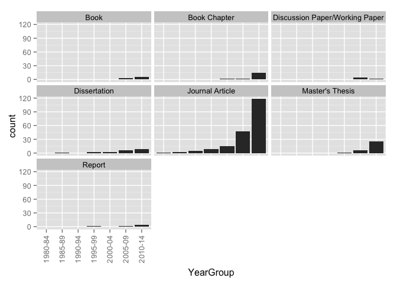
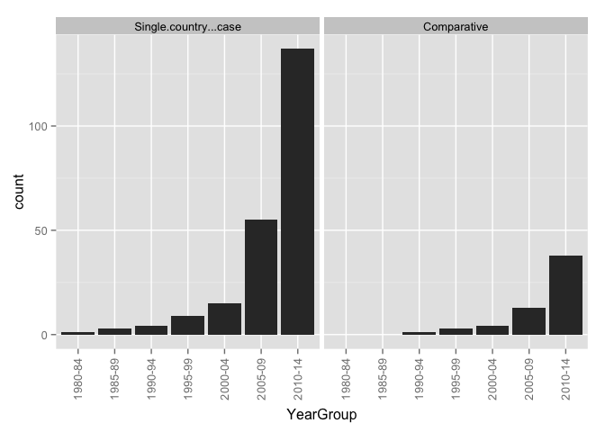
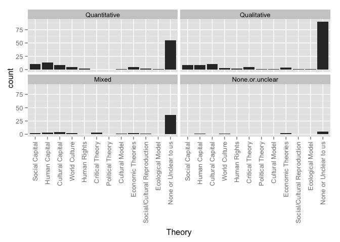
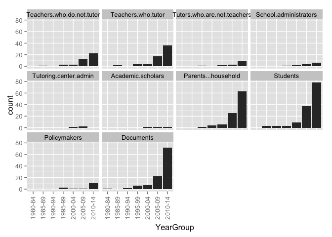
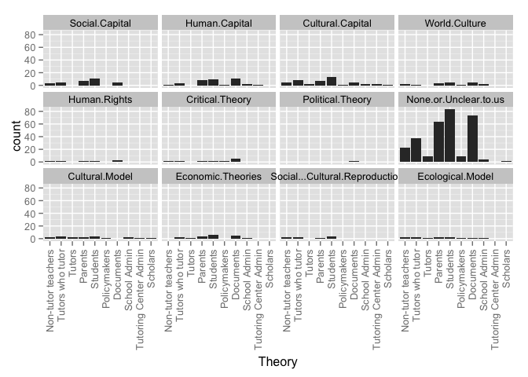
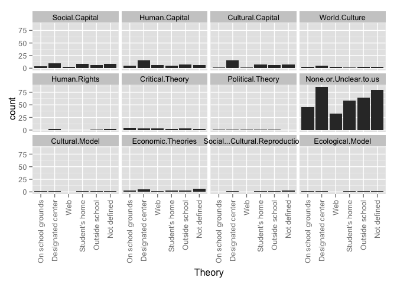
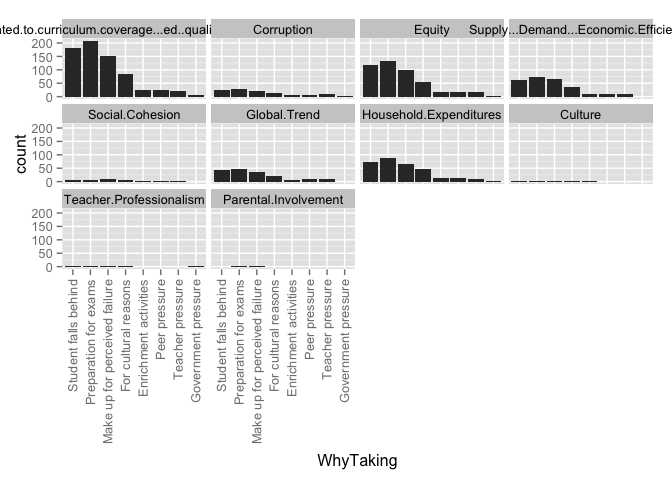

# Relationships for All Articles

### TOTAL NUMBER OF ARTICLES: 272
This number includes 10 articles with duplicate ID numbers. A full list of duplicate articles can be found [here](https://github.com/MikeRussellMcK/PTAnalysis/blob/master/Markdown%20and%20Output/Duplicates.md). 
Document was last updated on 2014-09-20 11:28:58.

# _Region by year group_ for all entries in the database:

### Graphs for all entries
 

### Counts for all entries

|        | MENA| Sub.Saharan| Cent..Asia| East.Asia| S..Asia| S.E..Asia| Aus....NZ| W..Europe| E..Europe| US...Can| LAC| Global|
|:-------|----:|-----------:|----------:|---------:|-------:|---------:|---------:|---------:|---------:|--------:|---:|------:|
|1985-89 |    1|           0|          0|         2|       0|         0|         0|         0|         0|        0|   0|      0|
|1990-94 |    0|           0|          0|         3|       1|         1|         0|         0|         0|        0|   0|      0|
|1995-99 |    1|           0|          0|         5|       0|         1|         0|         1|         0|        3|   0|      3|
|2000-04 |    0|           1|          0|         6|       2|         0|         0|         3|         0|        2|   0|      2|
|2005-09 |    1|           1|          2|        32|       5|         6|         1|         3|         6|        6|   0|      8|
|2010-14 |    9|           1|          4|        96|       4|        10|         1|        20|        15|       13|   3|     18|

# _Region by publication type_: 

### Graphs for all entries
 

### Counts for all entries

|                 | MENA| Sub.Saharan| Cent..Asia| East.Asia| S..Asia| S.E..Asia| Aus....NZ| W..Europe| E..Europe| US...Can| LAC| Global|
|:----------------|----:|-----------:|----------:|---------:|-------:|---------:|---------:|---------:|---------:|--------:|---:|------:|
|Book             |    1|           0|          3|         1|       1|         1|         0|         1|         2|        1|   0|      1|
|Book Chapter     |    5|           1|          1|         0|       0|         2|         0|         8|         5|        0|   0|      0|
|Discussion Paper |    0|           0|          0|         0|       0|         0|         0|         0|         2|        0|   0|      0|
|Dissertation     |    1|           1|          0|        10|       2|         1|         0|         0|         1|        1|   0|      1|
|Journal Article  |    3|           0|          2|        99|       7|        10|         2|        17|        10|       22|   3|     29|
|Master's Thesis  |    0|           0|          0|        32|       0|         0|         0|         0|         0|        0|   0|      0|
|Report           |    2|           0|          0|         1|       2|         1|         0|         1|         1|        0|   0|      0|
|Working Paper    |    0|           1|          0|         1|       0|         3|         0|         0|         0|        0|   0|      0|

# _Publication type by year group_ for all entries in the database:

### Graphs for all entries
 

### Counts for all entries

|        | Book| Book Chapter| Discussion Paper| Dissertation| Journal Article| Master's Thesis| Report| Working Paper|
|:-------|----:|------------:|----------------:|------------:|---------------:|---------------:|------:|-------------:|
|1985-89 |    0|            0|                0|            1|               2|               0|      0|             0|
|1990-94 |    0|            0|                0|            0|               5|               0|      0|             0|
|1995-99 |    0|            0|                0|            2|              10|               0|      2|             0|
|2000-04 |    0|            1|                0|            2|              11|               1|      0|             0|
|2005-09 |    3|            1|                2|            6|              44|               6|      2|             2|
|2010-14 |    3|           14|                0|            7|             114|              25|      3|             3|

# _Research type by region_ for all entries in the database

### Graphs for all entries
 

### Counts for all entries

|            | Original empirical| Review of other| Policy analysis| value|
|:-----------|------------------:|---------------:|---------------:|-----:|
|MENA        |                  9|               4|               0|     0|
|Sub.Saharan |                  2|               0|               1|     0|
|Cent..Asia  |                  5|               1|               1|     0|
|East.Asia   |                 88|              65|              11|     0|
|S..Asia     |                  6|               4|               1|     0|
|S.E..Asia   |                 13|               3|               2|     0|
|Aus....NZ   |                  1|               0|               0|     0|
|W..Europe   |                 14|              11|               1|     0|
|E..Europe   |                 15|               7|               2|     0|
|US...Can    |                 15|               6|               4|     0|
|LAC         |                  2|               2|               0|     0|
|Global      |                  8|              21|               0|     0|

# _Research type by year group_ for all entries in the database

### Graphs for all entries
 

### Counts for all entries

|        | Original.empirical.research| Review.of.other.research| Policy.analysis|
|:-------|---------------------------:|------------------------:|---------------:|
|1985-89 |                           3|                        0|               0|
|1990-94 |                           4|                        1|               0|
|1995-99 |                          12|                        2|               0|
|2000-04 |                           8|                        5|               0|
|2005-09 |                          39|                       22|               5|
|2010-14 |                         100|                       76|              12|

# _Ed levels by region_ 

### Graphs for all entries
 

### Counts for all entries

|            | Pre-primary| Primary| Secondary| Tertiary| value|
|:-----------|-----------:|-------:|---------:|--------:|-----:|
|MENA        |           0|       8|        12|        0|     0|
|Sub.Saharan |           0|       1|         3|        0|     0|
|Cent..Asia  |           0|       4|         5|        0|     0|
|East.Asia   |           6|      94|       118|        3|     0|
|S..Asia     |           2|       7|        10|        0|     0|
|S.E..Asia   |           1|      17|        13|        0|     0|
|Aus....NZ   |           0|       0|         2|        0|     0|
|W..Europe   |           1|      20|        27|        2|     0|
|E..Europe   |           1|      12|        19|        2|     0|
|US...Can    |           4|      14|        19|        2|     0|
|LAC         |           0|       2|         3|        0|     0|
|Global      |           3|      27|        29|        0|     0|

# _Research approach by region_
### Graphs for all entries
 

### Counts for all entries

|            | Single-country| Comparative| value|
|:-----------|--------------:|-----------:|-----:|
|MENA        |              9|           3|     0|
|Sub.Saharan |              3|           0|     0|
|Cent..Asia  |              1|           5|     0|
|East.Asia   |            126|          16|     0|
|S..Asia     |              9|           3|     0|
|S.E..Asia   |             13|           5|     0|
|Aus....NZ   |              2|           0|     0|
|W..Europe   |             20|           7|     0|
|E..Europe   |              9|          12|     0|
|US...Can    |             19|           5|     0|
|LAC         |              3|           0|     0|
|Global      |              2|          27|     0|

# Research approach by year group
### Graphs for all entries
 

### Counts for all entries

|        | Single.country...case| Comparative|
|:-------|---------------------:|-----------:|
|1985-89 |                     3|           0|
|1990-94 |                     5|           0|
|1995-99 |                    10|           2|
|2000-04 |                    11|           4|
|2005-09 |                    52|          13|
|2010-14 |                   133|          35|

# Research methods by year group
### Graphs for all entries
 

### Counts for all entries

|        | Mixed-methods| None or Unclear to us| Qualitative| Quantitative|
|:-------|-------------:|---------------------:|-----------:|------------:|
|1985-89 |             1|                     0|           1|            1|
|1990-94 |             1|                     0|           1|            3|
|1995-99 |             3|                     3|           2|            6|
|2000-04 |             2|                     0|           8|            5|
|2005-09 |             8|                     0|          28|           30|
|2010-14 |            30|                     9|          80|           50|

# Research methods by region
### Graphs for all entries
 

### Counts for all entries

|            | Mixed-methods| None or Unclear to us| Qualitative| Quantitative|
|:-----------|-------------:|---------------------:|-----------:|------------:|
|MENA        |             1|                     0|           7|            4|
|Sub.Saharan |             0|                     0|           2|            1|
|Cent..Asia  |             3|                     0|           2|            1|
|East.Asia   |            29|                     8|          56|           51|
|S..Asia     |             3|                     1|           5|            3|
|S.E..Asia   |             3|                     0|           5|           10|
|Aus....NZ   |             0|                     0|           2|            0|
|W..Europe   |             2|                     1|          16|            8|
|E..Europe   |             3|                     1|          11|            6|
|US...Can    |             1|                     1|          15|            7|
|LAC         |             1|                     0|           1|            1|
|Global      |             1|                     3|          20|            7|

# Research methods by year group
### Graph for all entries
 

### Counts for all entries

|        | Mixed-methods| None or Unclear to us| Qualitative| Quantitative|
|:-------|-------------:|---------------------:|-----------:|------------:|
|1985-89 |             1|                     0|           1|            1|
|1990-94 |             1|                     0|           1|            3|
|1995-99 |             3|                     3|           2|            6|
|2000-04 |             2|                     0|           8|            5|
|2005-09 |             8|                     0|          28|           30|
|2010-14 |            30|                     9|          80|           50|

# Research methods by publication type
### Graph for all entries
 

### Counts for all entries

|                 | Mixed-methods| None or Unclear to us| Qualitative| Quantitative|
|:----------------|-------------:|---------------------:|-----------:|------------:|
|Book             |             2|                     0|           4|            0|
|Book Chapter     |             1|                     0|          12|            3|
|Discussion Paper |             0|                     0|           0|            2|
|Dissertation     |             4|                     0|           3|           11|
|Journal Article  |            17|                    12|          87|           70|
|Master's Thesis  |            19|                     0|          12|            1|
|Report           |             2|                     0|           1|            4|
|Working Paper    |             0|                     0|           1|            4|

# Theoreortical framework by region
### Graphs for all entries
 

### Counts for all entries

|                      | MENA| Sub.Saharan| Cent..Asia| East.Asia| S..Asia| S.E..Asia| Aus....NZ| W..Europe| E..Europe| US...Can| LAC| Global|
|:---------------------|----:|-----------:|----------:|---------:|-------:|---------:|---------:|---------:|---------:|--------:|---:|------:|
|Social Capital        |    3|           1|          1|         7|       1|         2|         1|         2|         1|        2|   0|      2|
|Human Capital         |    0|           0|          1|         9|       1|         4|         0|         2|         0|        2|   0|      7|
|Cultural Capital      |    2|           1|          0|         7|       0|         0|         0|         3|         0|        3|   0|      4|
|World Culture         |    0|           0|          0|         1|       1|         0|         0|         0|         0|        1|   0|      4|
|Human Rights          |    1|           0|          0|         1|       0|         1|         0|         1|         0|        2|   0|      1|
|Critical Theory       |    1|           0|          1|         0|       0|         2|         0|         2|         3|        0|   0|      0|
|Political Theory      |    1|           0|          0|         1|       0|         0|         0|         2|         1|        0|   0|      0|
|None or Unclear to us |    5|           1|          4|        99|       9|         9|         1|        17|        16|       11|   3|     15|
|value                 |    0|           0|          0|         0|       0|         0|         0|         0|         0|        0|   0|      0|

# Theoreortical framework by year group
### Graphs for all entries
 

### Counts for all entries

|        | Social.Capital| Human.Capital| Cultural.Capital| World.Culture| Human.Rights| Critical.Theory| Political.Theory| None.or.Unclear.to.us|
|:-------|--------------:|-------------:|----------------:|-------------:|------------:|---------------:|----------------:|---------------------:|
|1985-89 |              0|             0|                0|             0|            0|               0|                0|                     2|
|1990-94 |              1|             0|                0|             0|            0|               0|                0|                     4|
|1995-99 |              0|             2|                1|             0|            1|               0|                0|                     9|
|2000-04 |              1|             0|                3|             1|            0|               0|                0|                     9|
|2005-09 |              5|             7|                3|             0|            1|               1|                0|                    41|
|2010-14 |             11|            14|               12|             4|            5|               4|                2|                   109|

# Theoretical framework by research method
### Graphs for all entries
 

### Counts for all entries

|                      | Quantitative| Qualitative| Mixed| None.or.unclear|
|:---------------------|------------:|-----------:|-----:|---------------:|
|Social Capital        |            9|           8|     1|               0|
|Human Capital         |           13|           5|     3|               2|
|Cultural Capital      |            8|           8|     3|               0|
|World Culture         |            1|           1|     1|               2|
|Human Rights          |            2|           2|     1|               2|
|Critical Theory       |            0|           4|     1|               0|
|Political Theory      |            0|           1|     0|               1|
|None or Unclear to us |           51|          83|    35|               5|
|value                 |            0|           0|     0|               0|

# Theoretical framework by research approach
### Graphs for all entries
 

### Counts for all entries

|                      | Single.country...case| Comparative|
|:---------------------|---------------------:|-----------:|
|Social Capital        |                    14|           4|
|Human Capital         |                    15|           6|
|Cultural Capital      |                    13|           6|
|World Culture         |                     2|           3|
|Human Rights          |                     6|           1|
|Critical Theory       |                     3|           2|
|Political Theory      |                     0|           2|
|None or Unclear to us |                   142|          30|
|value                 |                     0|           0|

# Framing by region
### Graphs for all entries
 

### Counts for all entries

|                | MENA| Sub.Saharan| Cent..Asia| East.Asia| S..Asia| S.E..Asia| Aus....NZ| W..Europe| E..Europe| US...Can| LAC| Global|
|:---------------|----:|-----------:|----------:|---------:|-------:|---------:|---------:|---------:|---------:|--------:|---:|------:|
|Exam Prep       |   11|           3|          5|       123|      11|        13|         2|        20|        19|       19|   2|     28|
|Corruption      |    0|           0|          5|        10|       1|         5|         0|         1|         6|        0|   0|     10|
|Equity          |   12|           2|          6|        68|       6|        12|         1|        19|        19|        9|   3|     20|
|Economic        |    0|           1|          2|        43|       5|         8|         0|         7|         6|        6|   0|     11|
|Social Cohesion |    1|           0|          1|         4|       1|         1|         0|         1|         1|        0|   0|      2|
|Global Trend    |    2|           0|          1|        18|       6|         4|         0|         3|         5|        2|   2|     17|
|Household       |    2|           0|          1|        66|       5|        10|         0|         3|         5|        1|   1|      9|
|value           |    0|           0|          0|         0|       0|         0|         0|         0|         0|        0|   0|      0|

# Framing by year group
### Graphs for all entries
 

### Counts for all entries

|        | Related.to.curriculum.coverage...ed..quality...exam.prep| Corruption| Equity| Supply...Demand...Economic.Efficiency| Social.Cohesion| Global.Trend| Household.Expenditures|
|:-------|--------------------------------------------------------:|----------:|------:|-------------------------------------:|---------------:|------------:|----------------------:|
|1985-89 |                                                        3|          0|      2|                                     0|               1|            0|                      0|
|1990-94 |                                                        4|          0|      2|                                     1|               0|            0|                      2|
|1995-99 |                                                        9|          1|      4|                                     4|               0|            1|                      3|
|2000-04 |                                                       15|          0|      7|                                     2|               0|            4|                      3|
|2005-09 |                                                       57|         10|     41|                                    23|               4|           16|                     36|
|2010-14 |                                                      143|         19|     96|                                    47|               4|           28|                     55|

# Framed by research method
### Graphs for all entries
 

### Counts for all entries

|                | Quantitative| Qualitative| Mixed| None.or.unclear|
|:---------------|------------:|-----------:|-----:|---------------:|
|Exam Prep       |           78|         101|    42|              10|
|Corruption      |            4|          15|     9|               2|
|Equity          |           54|          67|    26|               5|
|Economic        |           23|          41|     9|               4|
|Social Cohesion |            1|           7|     1|               0|
|Global Trend    |           18|          24|     5|               2|
|Household       |           52|          24|    22|               1|
|value           |            0|           0|     0|               0|

# Framed by research approach
### Graphs for all entries
 

### Counts for all entries

|                | Single.country...case| Comparative|
|:---------------|---------------------:|-----------:|
|Exam Prep       |                   180|          48|
|Corruption      |                    11|          19|
|Equity          |                   109|          42|
|Economic        |                    55|          21|
|Social Cohesion |                     5|           4|
|Global Trend    |                    26|          23|
|Household       |                    85|          14|
|value           |                     0|           0|

# Framed by theory
### Graphs for all entries
 

### Counts for all entries

|                                                         | Social Capital| Human Capital| Cultural Capital| World Culture| Human Rights| Critical Theory| Political Theory| None or Unclear to us| value|
|:--------------------------------------------------------|--------------:|-------------:|----------------:|-------------:|------------:|---------------:|----------------:|---------------------:|-----:|
|Related.to.curriculum.coverage...ed..quality...exam.prep |             15|            17|               17|             5|            6|               4|                1|                   151|     0|
|Corruption                                               |              2|             5|                0|             1|            1|               1|                0|                    18|     0|
|Equity                                                   |             14|            12|               12|             2|            5|               4|                2|                    93|     0|
|Supply...Demand...Economic.Efficiency                    |              6|            12|                3|             2|            1|               0|                0|                    48|     0|
|Social.Cohesion                                          |              3|             2|                1|             0|            0|               0|                0|                     4|     0|
|Global.Trend                                             |              3|             7|                3|             4|            0|               0|                0|                    27|     0|
|Household.Expenditures                                   |              7|             9|                5|             0|            0|               0|                0|                    67|     0|

# How Viewed by region
### Graphs for all entries
 

### Counts for all entries

|                   | MENA| Sub.Saharan| Cent..Asia| East.Asia| S..Asia| S.E..Asia| Aus....NZ| W..Europe| E..Europe| US...Can| LAC| Global|
|:------------------|----:|-----------:|----------:|---------:|-------:|---------:|---------:|---------:|---------:|--------:|---:|------:|
|Raises concerns    |    6|           0|          1|        30|       4|         3|         0|         6|         3|       10|   2|      1|
|Discusses benefits |    0|           0|          0|         7|       1|         3|         1|         4|         1|        3|   0|      3|
|Both               |    4|           2|          4|        79|       5|        10|         1|        15|        16|        7|   0|     24|
|Neither            |    1|           1|          0|        28|       2|         0|         0|         2|         0|        4|   0|      2|
|value              |    0|           0|          0|         0|       0|         0|         0|         0|         0|        0|   0|      0|

# How Viewed by year group
### Graphs for all entries
 

### Counts for all entries

|        | Raises.concerns| Discusses.benefits| Both| Neither|
|:-------|---------------:|------------------:|----:|-------:|
|1985-89 |               1|                  0|    1|       1|
|1990-94 |               0|                  0|    4|       1|
|1995-99 |               4|                  1|    7|       1|
|2000-04 |               5|                  2|    7|       1|
|2005-09 |               6|                  5|   45|       8|
|2010-14 |              46|                  8|   85|      27|

# HowViewed by research method
### Graphs for all entries
 

### Counts for all entries

|                   | Quantitative| Qualitative| Mixed| None.or.unclear|
|:------------------|------------:|-----------:|-----:|---------------:|
|Raises concerns    |           19|          28|    10|               5|
|Discusses benefits |            7|           7|     2|               0|
|Both               |           54|          68|    22|               5|
|Neither            |           13|          16|     8|               2|
|value              |            0|           0|     0|               0|

# HowViewed by research approach
### Graphs for all entries
 

### Counts for all entries

|                   | Single.country...case| Comparative|
|:------------------|---------------------:|-----------:|
|Raises concerns    |                    55|           7|
|Discusses benefits |                    13|           3|
|Both               |                   106|          39|
|Neither            |                    36|           3|
|value              |                     0|           0|

# HowViewed by theory
### Graphs for all entries
 

### Counts for all entries

|                   | Social Capital| Human Capital| Cultural Capital| World Culture| Human Rights| Critical Theory| Political Theory| None or Unclear to us| value|
|:------------------|--------------:|-------------:|----------------:|-------------:|------------:|---------------:|----------------:|---------------------:|-----:|
|Raises.concerns    |              6|             5|                6|             0|            6|               1|                2|                    35|     0|
|Discusses.benefits |              0|             1|                2|             2|            0|               0|                0|                    11|     0|
|Both               |             11|            16|                8|             2|            1|               4|                0|                    95|     0|
|Neither            |              1|             1|                3|             1|            0|               0|                0|                    29|     0|

# How Viewed by Framed
### Graphs for all entries
 

### Counts for all entries

|                                                         | Raises concerns| Discusses benefits| Both| Neither| value|
|:--------------------------------------------------------|---------------:|------------------:|----:|-------:|-----:|
|Related.to.curriculum.coverage...ed..quality...exam.prep |              55|                 11|  125|      34|     0|
|Corruption                                               |               6|                  0|   22|       0|     0|
|Equity                                                   |              41|                  3|   96|       8|     0|
|Supply...Demand...Economic.Efficiency                    |              11|                  6|   51|       8|     0|
|Social.Cohesion                                          |               2|                  1|    6|       0|     0|
|Global.Trend                                             |               9|                  5|   30|       4|     0|
|Household.Expenditures                                   |              16|                  2|   65|      11|     0|

# Stakeholders by region
### Graphs for all entries
 

### Counts for all entries

|                   | School.administrators| MENA| Sub.Saharan| Cent..Asia| East.Asia| S..Asia| S.E..Asia| Aus....NZ| W..Europe| E..Europe| US...Can| LAC| Global|
|:------------------|---------------------:|----:|-----------:|----------:|---------:|-------:|---------:|---------:|---------:|---------:|--------:|---:|------:|
|Non-tutor teachers |                     8|    5|           0|          0|        23|       2|         3|         1|         2|         5|        2|   1|      1|
|Teachers who tutor |                     9|    4|           1|          0|        38|       2|         4|         1|         2|         5|        4|   1|      1|
|Tutors             |                     3|    2|           1|          0|         6|       1|         0|         0|         2|         2|        1|   0|      0|
|Parents            |                    10|    5|           2|          1|        57|       3|         9|         1|         5|         4|        6|   1|      1|
|Students           |                    10|    5|           0|          4|        77|       4|         7|         2|         8|         7|        9|   2|      4|
|Policymakers       |                     3|    1|           1|          0|         7|       0|         2|         0|         0|         1|        1|   0|      0|
|Documents          |                     2|    4|           0|          2|        46|       4|         3|         0|        12|        10|        8|   1|     23|
|value              |                     0|    0|           0|          0|         0|       0|         0|         0|         0|         0|        0|   0|      0|

# Stakeholders by year group
### Graphs for all entries
 

### Counts for all entries

|        | Teachers.who.do.not.tutor| Teachers.who.tutor| Tutors.who.are.not.teachers| School.administrators| Parents...household| Students| Policymakers| Documents|
|:-------|-------------------------:|------------------:|---------------------------:|---------------------:|-------------------:|--------:|------------:|---------:|
|1985-89 |                         1|                  2|                           0|                     0|                   0|        3|            0|         0|
|1990-94 |                         0|                  0|                           1|                     0|                   1|        4|            0|         1|
|1995-99 |                         3|                  4|                           0|                     1|                   4|        4|            3|         5|
|2000-04 |                         3|                  4|                           2|                     2|                   4|        6|            1|         3|
|2005-09 |                        10|                 14|                           2|                     4|                  22|       31|            1|        19|
|2010-14 |                        21|                 32|                           8|                     5|                  58|       71|            8|        67|

# Stakeholders by theory
### Graphs for all entries
 

### Counts for all entries

|                      | Non-tutor teachers| Tutors who tutor| Tutors| Parents| Students| Policymakers| Documents| value|
|:---------------------|------------------:|----------------:|------:|-------:|--------:|------------:|---------:|-----:|
|Social.Capital        |                  2|                2|      0|       6|        9|            0|         5|     0|
|Human.Capital         |                  1|                2|      0|       7|        8|            1|         8|     0|
|Cultural.Capital      |                  3|                4|      2|       6|       10|            1|         4|     0|
|World.Culture         |                  0|                0|      0|       0|        1|            0|         4|     0|
|Human.Rights          |                  1|                2|      0|       2|        2|            0|         4|     0|
|Critical.Theory       |                  1|                1|      0|       0|        2|            0|         2|     0|
|Political.Theory      |                  0|                0|      0|       0|        0|            0|         2|     0|
|None.or.Unclear.to.us |                 20|               32|      7|      56|       71|            9|        65|     0|
|School.administrators |                  8|                9|      3|      10|       10|            3|         2|     0|

# WhatTaught by region
### Graphs for all entries
 

### Counts for all entries

|                 | MENA| Sub.Saharan| Cent..Asia| East.Asia| S..Asia| S.E..Asia| Aus....NZ| W..Europe| E..Europe| US...Can| LAC| Global|
|:----------------|----:|-----------:|----------:|---------:|-------:|---------:|---------:|---------:|---------:|--------:|---:|------:|
|School subjects  |   11|           2|          4|        89|      10|        11|         2|        20|        18|       20|   3|     21|
|Extracurriculars |    0|           0|          0|         0|       0|         0|         0|         3|         0|        0|   0|      0|
|Both             |    0|           1|          2|        48|       2|         5|         0|         4|         3|        2|   0|      8|
|Not defined      |    1|           0|          0|         7|       0|         2|         0|         0|         0|        1|   0|      2|
|value            |    0|           0|          0|         0|       0|         0|         0|         0|         0|        0|   0|      0|

WhatTaught by year group
### Graphs for all entries
 

### Counts for all entries

|        | Subjects.taught.in.school| Extracurricular.activities| Both| Not.defined|
|:-------|-------------------------:|--------------------------:|----:|-----------:|
|1985-89 |                         3|                          0|    0|           0|
|1990-94 |                         4|                          0|    1|           0|
|1995-99 |                         9|                          0|    2|           2|
|2000-04 |                        13|                          1|    1|           0|
|2005-09 |                        45|                          1|   17|           3|
|2010-14 |                       116|                          1|   44|           8|

# WhatTaught by theory
### Graphs for all entries
 

### Counts for all entries

|                      | School subjects| Extracurriculars| Both| Not defined| value|
|:---------------------|---------------:|----------------:|----:|-----------:|-----:|
|Social.Capital        |              13|                0|    4|           1|     0|
|Human.Capital         |              18|                0|    3|           2|     0|
|Cultural.Capital      |              12|                2|    5|           0|     0|
|World.Culture         |               4|                0|    1|           0|     0|
|Human.Rights          |               6|                0|    1|           0|     0|
|Critical.Theory       |               4|                0|    1|           0|     0|
|Political.Theory      |               2|                0|    0|           0|     0|
|None.or.Unclear.to.us |             112|                1|   49|          11|     0|

# WhereOccur by region
### Graphs for all entries
 

### Counts for all entries

|                  | MENA| Sub.Saharan| Cent..Asia| East.Asia| S..Asia| S.E..Asia| Aus....NZ| W..Europe| E..Europe| US...Can| LAC| Global|
|:-----------------|----:|-----------:|----------:|---------:|-------:|---------:|---------:|---------:|---------:|--------:|---:|------:|
|On school grounds |    4|           2|          5|        23|       2|         8|         1|         6|        11|        4|   1|     10|
|Designated center |    8|           1|          1|        62|       5|         7|         1|        15|         8|       16|   2|     12|
|Web               |    3|           0|          1|        20|       2|         2|         0|         6|         7|        5|   0|      9|
|Student's home    |    6|           2|          5|        37|       5|         6|         1|        10|        12|        5|   0|     11|
|Outside school    |    5|           0|          4|        40|       6|         4|         1|        11|        12|        6|   2|     14|
|Not defined       |    3|           1|          1|        73|       5|         8|         1|         9|         6|        4|   1|     14|
|value             |    0|           0|          0|         0|       0|         0|         0|         0|         0|        0|   0|      0|

# WhereOccur by year group
### Graphs for all entries
 

### Counts for all entries

|        | On.school.grounds| Designated.tutoring.center.or.franchise| On.line...via.web| In.the.student.s.home| Other.outside.school| Not.defined|
|:-------|-----------------:|---------------------------------------:|-----------------:|---------------------:|--------------------:|-----------:|
|1985-89 |                 0|                                       1|                 0|                     1|                    0|           2|
|1990-94 |                 0|                                       4|                 0|                     3|                    3|           1|
|1995-99 |                 2|                                       7|                 0|                     0|                    1|           7|
|2000-04 |                 4|                                       6|                 2|                     7|                    9|           2|
|2005-09 |                12|                                      17|                 5|                    15|                   17|          40|
|2010-14 |                42|                                      87|                36|                    56|                   60|          66|

# WhereOccur by theory
### Graphs for all entries
 

### Counts for all entries

|                      | On school grounds| Designated center| Web| Student's home| Outside school| Not defined| value|
|:---------------------|-----------------:|-----------------:|---:|--------------:|--------------:|-----------:|-----:|
|Social.Capital        |                 4|                 8|   3|              8|              5|           8|     0|
|Human.Capital         |                 7|                13|   6|              7|              8|           6|     0|
|Cultural.Capital      |                 2|                13|   1|              6|              4|           5|     0|
|World.Culture         |                 3|                 3|   2|              3|              3|           0|     0|
|Human.Rights          |                 3|                 4|   0|              2|              2|           2|     0|
|Critical.Theory       |                 3|                 1|   1|              2|              2|           2|     0|
|Political.Theory      |                 1|                 1|   1|              1|              1|           1|     0|
|None.or.Unclear.to.us |                36|                76|  29|             54|             60|          80|     0|

# WhoProvides by region
### Graphs for all entries
 

### Counts for all entries

|                | MENA| Sub.Saharan| Cent..Asia| East.Asia| S..Asia| S.E..Asia| Aus....NZ| W..Europe| E..Europe| US...Can| LAC| Global|
|:---------------|----:|-----------:|----------:|---------:|-------:|---------:|---------:|---------:|---------:|--------:|---:|------:|
|Current teacher |    4|           2|          5|        56|       7|        11|         1|         6|        15|        1|   1|     22|
|Other k-12      |    5|           2|          5|        57|       8|         9|         1|         7|        16|        4|   1|     20|
|Retired teacher |    1|           0|          1|        21|       4|         2|         0|         7|         5|        2|   1|     10|
|Univ. faculty   |    1|           0|          2|         4|       3|         2|         0|         4|         7|        0|   0|      9|
|Professional    |    7|           1|          4|        65|       6|         6|         0|        15|        12|       11|   0|     20|
|Col. student    |    1|           0|          1|        32|       3|         2|         0|         7|         4|        2|   0|     13|
|Peer            |    2|           0|          1|         2|       4|         1|         0|         2|         2|        0|   0|      1|
|Family          |    0|           0|          1|         5|       3|         1|         0|         0|         0|        0|   0|      0|
|Community       |    0|           0|          1|         1|       5|         1|         0|         1|         1|        2|   0|      4|
|Not defined     |    3|           0|          1|        62|       3|         7|         1|        10|         5|       10|   2|      8|
|value           |    0|           0|          0|         0|       0|         0|         0|         0|         0|        0|   0|      0|

# WhoProvides by year group
### Graphs for all entries
 

### Counts for all entries

|        | Current.classroom.teacher| Other.K.12.teachers| Retired.teacher| University.faculty| Institution...Professional.tutor| College.student| Peer.classmate| Parent.or.family.member| Community.member...volunteer| Not.defined|
|:-------|-------------------------:|-------------------:|---------------:|------------------:|--------------------------------:|---------------:|--------------:|-----------------------:|----------------------------:|-----------:|
|1985-89 |                         1|                   1|               1|                  0|                                1|               1|              0|                       0|                            0|           1|
|1990-94 |                         0|                   1|               0|                  0|                                3|               0|              0|                       1|                            1|           1|
|1995-99 |                         6|                   3|               1|                  0|                                6|               1|              1|                       0|                            0|           2|
|2000-04 |                         5|                   6|               3|                  1|                               10|               2|              0|                       2|                            0|           3|
|2005-09 |                        31|                  30|              11|                  9|                               26|              11|              3|                       1|                            5|          29|
|2010-14 |                        68|                  74|              30|                 14|                               86|              42|              5|                       3|                            7|          65|

# WhoProvides by theory
### Graphs for all entries
 

### Counts for all entries

|                      | Current teacher| Other k-12| Retired teacher| Univ. faculty| Professional| Col. student| Peer| Family| Community| Not defined| value|
|:---------------------|---------------:|----------:|---------------:|-------------:|------------:|------------:|----:|------:|---------:|-----------:|-----:|
|Social.Capital        |               3|          4|               2|             3|            7|            2|    1|      1|         1|          10|     0|
|Human.Capital         |              11|         11|               6|             5|           13|            6|    1|      1|         4|           8|     0|
|Cultural.Capital      |               5|          6|               5|             2|           11|            4|    0|      0|         1|           7|     0|
|World.Culture         |               2|          2|               2|             0|            2|            2|    0|      0|         1|           3|     0|
|Human.Rights          |               3|          2|               2|             0|            4|            1|    0|      0|         1|           2|     0|
|Critical.Theory       |               4|          3|               2|             1|            1|            1|    0|      0|         0|           1|     0|
|Political.Theory      |               1|          1|               1|             0|            0|            0|    0|      0|         0|           1|     0|
|None.or.Unclear.to.us |              73|         76|              28|            16|           85|           40|    5|      6|         7|          65|     0|

# DoesCharge by region
### Graphs for all entries
 

### Counts for all entries

|                             | MENA| Sub.Saharan| Cent..Asia| East.Asia| S..Asia| S.E..Asia| Aus....NZ| W..Europe| E..Europe| US...Can| LAC| Global|
|:----------------------------|----:|-----------:|----------:|---------:|-------:|---------:|---------:|---------:|---------:|--------:|---:|------:|
|                             |    0|           0|          0|         0|       0|         0|         0|         0|         0|        0|   0|      0|
|Both                         |    1|           1|          1|         1|       4|         2|         1|         2|         2|        3|   0|      2|
|No, they do not charge a fee |    0|           0|          0|         0|       0|         0|         0|         0|         0|        2|   0|      0|
|Not defined                  |    2|           0|          0|        13|       1|         2|         0|         1|         1|        4|   0|      5|
|Yes, they charge a fee       |    9|           2|          5|       126|       7|        14|         1|        24|        18|       15|   3|     24|

# DoesCharge by year group
### Graphs for all entries
 

### Counts for all entries

|        |   | Both| No, they do not charge a fee| Not defined| Yes, they charge a fee|
|:-------|--:|----:|----------------------------:|-----------:|----------------------:|
|1985-89 |  0|    0|                            0|           0|                      3|
|1990-94 |  0|    0|                            0|           0|                      5|
|1995-99 |  0|    0|                            1|           3|                     10|
|2000-04 |  0|    1|                            0|           2|                     12|
|2005-09 |  0|    4|                            0|           6|                     56|
|2010-14 |  0|   11|                            1|          13|                    140|

# DoesCharge by WhoProvides
### Graphs for all entries
 

### Counts for all entries

|                             | Current.classroom.teacher| Other.K.12.teachers| Retired.teacher| University.faculty| Institution...Professional.tutor| College.student| Peer.classmate| Parent.or.family.member| Community.member...volunteer| Not.defined|
|:----------------------------|-------------------------:|-------------------:|---------------:|------------------:|--------------------------------:|---------------:|--------------:|-----------------------:|----------------------------:|-----------:|
|                             |                         0|                   0|               0|                  0|                                0|               0|              0|                       0|                            0|           0|
|Both                         |                        10|                  10|               5|                  2|                                7|               4|              2|                       1|                            4|           4|
|No, they do not charge a fee |                         1|                   0|               1|                  0|                                0|               1|              0|                       0|                            1|           0|
|Not defined                  |                         9|                   7|               2|                  1|                                4|               4|              1|                       1|                            0|          14|
|Yes, they charge a fee       |                        91|                  98|              38|                 21|                              121|              48|              6|                       5|                            8|          79|

# ClassSize by Region
### Graphs for all entries
 

### Counts for all entries

|                              | MENA| Sub.Saharan| Cent..Asia| East.Asia| S..Asia| S.E..Asia| Aus....NZ| W..Europe| E..Europe| US...Can| LAC| Global|
|:-----------------------------|----:|-----------:|----------:|---------:|-------:|---------:|---------:|---------:|---------:|--------:|---:|------:|
|                              |    0|           0|          0|         0|       0|         0|         0|         0|         0|        0|   0|      0|
|Individual 1-on-1 instruction |    0|           0|          0|         1|       0|         0|         0|         1|         0|        0|   0|      0|
|Large groups                  |    0|           0|          0|         0|       0|         0|         0|         0|         0|        1|   0|      0|
|Small groups                  |    0|           0|          0|         0|       1|         1|         0|         2|         0|        4|   0|      0|
|Unclear                       |    3|           1|          1|        59|       2|         5|         0|         6|         2|        7|   1|      8|
|Various class sizes discussed |    9|           2|          5|        83|       9|        12|         2|        18|        19|       11|   2|     23|

# OperationSize by region
### Graphs for all entries
 

### Counts for all entries

|            | Not.defined.or.unclear| MENA| Sub.Saharan| Cent..Asia| East.Asia| S..Asia| S.E..Asia| Aus....NZ| W..Europe| E..Europe| US...Can| LAC| Global|
|:-----------|----------------------:|----:|-----------:|----------:|---------:|-------:|---------:|---------:|---------:|---------:|--------:|---:|------:|
|Individual  |                      0|    1|           0|          0|         4|       1|         3|         0|         2|         3|        1|   0|      2|
|Small firms |                      0|    2|           0|          0|         7|       0|         1|         0|         3|         1|        2|   0|      1|
|Large firm  |                      0|    1|           0|          0|         5|       0|         0|         0|         1|         0|        5|   0|      1|
|Various     |                      0|    9|           2|          6|        97|       8|        12|         2|        20|        18|       14|   2|     26|
|value       |                      0|    0|           0|          0|         0|       0|         0|         0|         0|         0|        0|   0|      0|

# Why Taking by region
### Graphs for all entries
 

### Counts for all entries

|                              | MENA| Sub.Saharan| Cent..Asia| East.Asia| S..Asia| S.E..Asia| Aus....NZ| W..Europe| E..Europe| US...Can| LAC| Global|
|:-----------------------------|----:|-----------:|----------:|---------:|-------:|---------:|---------:|---------:|---------:|--------:|---:|------:|
|Student falls behind          |    8|           2|          4|       107|      10|        11|         1|        16|        14|       19|   2|     26|
|Preparation for exams         |   10|           3|          5|       133|      12|        12|         1|        18|        18|       17|   3|     26|
|Make up for perceived failure |    8|           2|          6|        86|      11|        13|         0|        13|        12|       13|   1|     26|
|For cultural reasons          |    0|           0|          1|        63|       5|         7|         0|         5|         2|        5|   0|     14|
|Enrichment activities         |    0|           1|          1|        20|       2|         3|         0|         1|         1|        2|   0|      3|
|Peer pressure                 |    1|           0|          1|        18|       2|         2|         1|         3|         2|        0|   0|      4|
|Teacher pressure              |    2|           0|          1|        12|       2|         3|         0|         3|         4|        0|   0|      3|
|Not stated or unclear         |    2|           0|          0|         0|       0|         1|         0|         2|         2|        0|   0|      1|
|value                         |    0|           0|          0|         0|       0|         0|         0|         0|         0|        0|   0|      0|

# Why Taking by year group
### Graphs for all entries
 

### Counts for all entries

|        | Student.falls.behind.and.needs.extra.help| Preparation.for.exams.to.make.student.more.competitive| Make.up.for.perceived.failure.in.the.mainstream.system...school| For.cultural.reasons| To.provide.extra.enrichment.activities| Peer.pressure| Teacher.pressure| Not.stated.or.unclear|
|:-------|-----------------------------------------:|------------------------------------------------------:|---------------------------------------------------------------:|--------------------:|--------------------------------------:|-------------:|----------------:|---------------------:|
|1985-89 |                                         2|                                                      3|                                                               1|                    0|                                      0|             1|                1|                     0|
|1990-94 |                                         3|                                                      5|                                                               3|                    0|                                      0|             1|                1|                     0|
|1995-99 |                                         5|                                                      8|                                                               7|                    2|                                      1|             0|                1|                     1|
|2000-04 |                                        13|                                                     12|                                                              11|                    8|                                      0|             3|                0|                     0|
|2005-09 |                                        46|                                                     53|                                                              45|                   22|                                     10|             5|                2|                     2|
|2010-14 |                                       125|                                                    150|                                                              96|                   60|                                     17|            18|               16|                     3|

# WhyTaking by research method
### Graphs for all entries
 

### Counts for all entries

|                              | Quantitative| Qualitative| Mixed| None.or.unclear|
|:-----------------------------|------------:|-----------:|-----:|---------------:|
|Student falls behind          |           59|          92|    34|               9|
|Preparation for exams         |           82|          98|    41|              10|
|Make up for perceived failure |           53|          77|    25|               8|
|For cultural reasons          |           28|          43|    18|               3|
|Enrichment activities         |            8|          13|     4|               3|
|Peer pressure                 |           10|          11|     7|               0|
|Teacher pressure              |            4|          11|     6|               0|
|Not stated or unclear         |            1|           2|     2|               1|
|value                         |            0|           0|     0|               0|

# WhyTaking by research approach
### Graphs for all entries
 

### Counts for all entries

|                              | Single.country...case| Comparative|
|:-----------------------------|---------------------:|-----------:|
|Student falls behind          |                   146|          47|
|Preparation for exams         |                   181|          48|
|Make up for perceived failure |                   119|          42|
|For cultural reasons          |                    68|          24|
|Enrichment activities         |                    22|           6|
|Peer pressure                 |                    21|           7|
|Teacher pressure              |                    10|          11|
|Not stated or unclear         |                     4|           2|
|value                         |                     0|           0|

# WhyTaking by theory
### Graphs for all entries
 

### Counts for all entries

|                              | Social.Capital| Human.Capital| Cultural.Capital| World.Culture| Human.Rights| Critical.Theory| Political.Theory| None.or.Unclear.to.us|
|:-----------------------------|--------------:|-------------:|----------------:|-------------:|------------:|---------------:|----------------:|---------------------:|
|Student falls behind          |             11|            19|               12|             4|            3|               3|                2|                   125|
|Preparation for exams         |             15|            21|               17|             4|            5|               3|                2|                   148|
|Make up for perceived failure |             10|            18|                9|             4|            3|               4|                2|                    98|
|For cultural reasons          |              5|             8|               12|             0|            0|               0|                0|                    60|
|Enrichment activities         |              1|             2|                2|             1|            2|               0|                0|                    20|
|Peer pressure                 |              3|             3|                1|             1|            0|               1|                1|                    18|
|Teacher pressure              |              2|             3|                0|             1|            0|               1|                1|                    14|
|Not stated or unclear         |              0|             0|                0|             0|            0|               1|                0|                     4|
|value                         |             18|            23|               19|             5|            7|               5|                2|                   174|

# Why Taking by Framed
### Graphs for all entries
 

### Counts for all entries

|                                                         | Student falls behind| Preparation for exams| Make up for perceived failure| For cultural reasons| Enrichment activities| Peer pressure| Teacher pressure| Not stated or unclear| value|
|:--------------------------------------------------------|--------------------:|---------------------:|-----------------------------:|--------------------:|---------------------:|-------------:|----------------:|---------------------:|-----:|
|Related.to.curriculum.coverage...ed..quality...exam.prep |                  176|                   204|                           146|                   83|                    22|            27|               21|                     6|     0|
|Corruption                                               |                   24|                    25|                            19|                   12|                     5|             6|                9|                     1|     0|
|Equity                                                   |                  115|                   133|                           102|                   51|                    15|            16|               16|                     3|     0|
|Supply...Demand...Economic.Efficiency                    |                   55|                    68|                            54|                   33|                     7|             8|                7|                     0|     0|
|Social.Cohesion                                          |                    7|                     8|                             8|                    5|                     3|             1|                1|                     0|     0|
|Global.Trend                                             |                   39|                    44|                            35|                   19|                     5|             9|               11|                     0|     0|
|Household.Expenditures                                   |                   71|                    88|                            63|                   44|                    11|            14|               11|                     2|     0|
