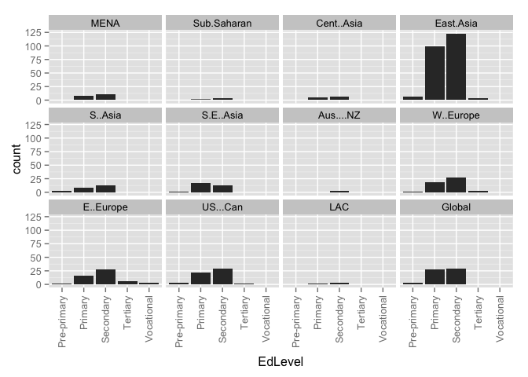
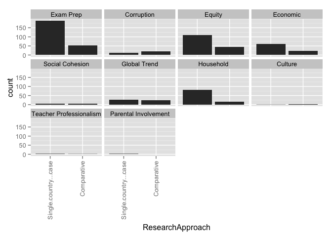
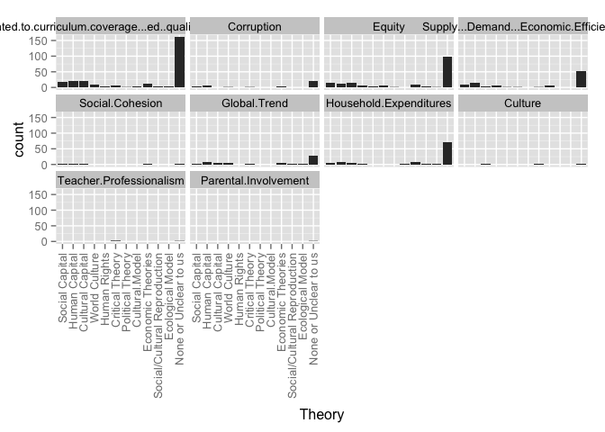
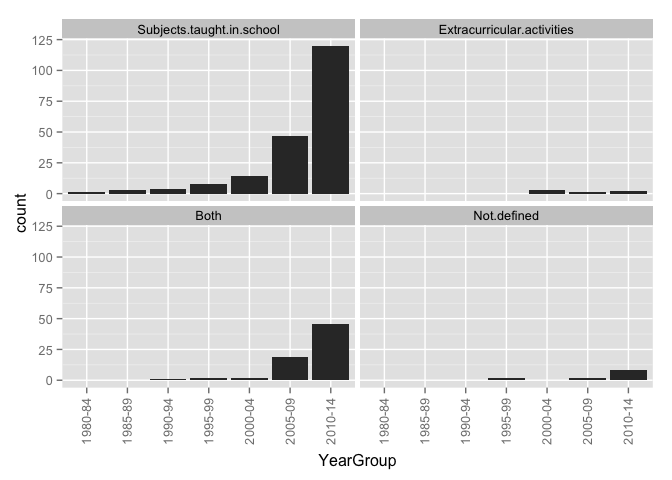
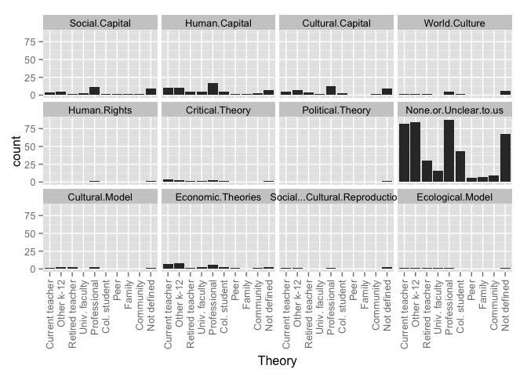

# Relationships for All Articles

# _Region by year group_ for all entries in the database:

### Graphs for all entries
 

### Counts for all entries

|        | MENA| Sub.Saharan| Cent..Asia| East.Asia| S..Asia| S.E..Asia| Aus....NZ| W..Europe| E..Europe| US...Can| LAC| Global|
|:-------|----:|-----------:|----------:|---------:|-------:|---------:|---------:|---------:|---------:|--------:|---:|------:|
|1985-89 |    1|           0|          0|         2|       0|         0|         0|         0|         0|        1|   0|      0|
|1990-94 |    0|           0|          0|         3|       1|         1|         0|         0|         0|        0|   0|      0|
|1995-99 |    0|           0|          0|         5|       0|         1|         0|         1|         0|        3|   0|      3|
|2000-04 |    0|           1|          0|         7|       1|         0|         0|         3|         0|        2|   0|      2|
|2005-09 |    2|           1|          2|        29|       5|         5|         0|         3|         6|        4|   0|      8|
|2010-14 |    1|           1|          4|       104|       4|        10|         1|        12|        13|       20|   2|     23|
|unclear |    0|           0|          0|         4|       0|         0|         0|         0|         0|        0|   0|      0|

# _Region by publication type_: 

### Graphs for all entries
 

### Counts for all entries

|                 | MENA| Sub.Saharan| Cent..Asia| East.Asia| S..Asia| S.E..Asia| Aus....NZ| W..Europe| E..Europe| US...Can| LAC| Global|
|:----------------|----:|-----------:|----------:|---------:|-------:|---------:|---------:|---------:|---------:|--------:|---:|------:|
|Book             |    0|           0|          3|         1|       1|         1|         0|         0|         1|        1|   0|      1|
|Book Chapter     |    0|           1|          1|         0|       0|         2|         0|         0|         2|        0|   0|      0|
|Discussion Paper |    0|           0|          0|         0|       0|         0|         0|         0|         2|        0|   0|      0|
|Dissertation     |    0|           1|          0|         6|       0|         0|         0|         0|         1|        0|   0|      1|
|Journal Article  |    2|           0|          2|       112|       8|        10|         1|        18|        11|       29|   2|     34|
|Master's Thesis  |    0|           0|          0|        32|       0|         0|         0|         0|         0|        0|   0|      0|
|Report           |    1|           0|          0|         1|       2|         1|         0|         1|         2|        0|   0|      0|
|Working Paper    |    1|           1|          0|         2|       0|         3|         0|         0|         0|        0|   0|      0|

# _Publication type by year group_ for all entries in the database:

### Graphs for all entries
 

### Counts for all entries

|        | Book| Book Chapter| Discussion Paper| Dissertation| Journal Article| Master's Thesis| Report| Working Paper|
|:-------|----:|------------:|----------------:|------------:|---------------:|---------------:|------:|-------------:|
|1985-89 |    0|            0|                0|            1|               3|               0|      0|             0|
|1990-94 |    0|            0|                0|            0|               5|               0|      0|             0|
|1995-99 |    0|            0|                0|            2|              10|               0|      2|             0|
|2000-04 |    0|            1|                0|            1|              12|               1|      0|             1|
|2005-09 |    3|            1|                2|            6|              44|               5|      2|             3|
|2010-14 |    3|           14|                0|            7|             138|              25|      3|             2|
|unclear |    0|            0|                0|            1|               1|               1|      0|             1|

# _Research type by region_ for all entries in the database

### Graphs for all entries
 

### Counts for all entries

|            | Original emperical| Review of other| Policy analysis| value|
|:-----------|------------------:|---------------:|---------------:|-----:|
|MENA        |                  3|               0|               0|     0|
|Sub.Saharan |                  2|               0|               1|     0|
|Cent..Asia  |                  5|               1|               1|     0|
|East.Asia   |                 91|              72|              11|     0|
|S..Asia     |                  3|               5|               1|     0|
|S.E..Asia   |                 11|               3|               2|     0|
|Aus....NZ   |                  1|               0|               0|     0|
|W..Europe   |                 11|               6|               1|     0|
|E..Europe   |                 13|               5|               2|     0|
|US...Can    |                 18|               9|               4|     0|
|LAC         |                  1|               1|               0|     0|
|Global      |                  8|              26|               1|     0|

# _Research type by year group_ for all entries in the database

### Graphs for all entries
 

### Counts for all entries

|        | Original.emperical.research| Review.of.other.research| Policy.analysis|
|:-------|---------------------------:|------------------------:|---------------:|
|1985-89 |                           4|                        0|               0|
|1990-94 |                           4|                        1|               0|
|1995-99 |                          12|                        2|               0|
|2000-04 |                           9|                        6|               0|
|2005-09 |                          38|                       21|               6|
|2010-14 |                         108|                       89|              13|
|unclear |                           1|                        2|               0|

# _Ed levels by region_ 

### Graphs for all entries
 

### Counts for all entries

|            | Pre-primary| Primary| Secondary| Tertiary| value|
|:-----------|-----------:|-------:|---------:|--------:|-----:|
|MENA        |           0|       3|         4|        0|     0|
|Sub.Saharan |           0|       1|         3|        1|     0|
|Cent..Asia  |           0|       4|         5|        0|     0|
|East.Asia   |           6|     104|       126|        3|     0|
|S..Asia     |           2|       7|         9|        0|     0|
|S.E..Asia   |           1|      15|        11|        0|     0|
|Aus....NZ   |           0|       0|         1|        0|     0|
|W..Europe   |           1|      11|        19|        1|     0|
|E..Europe   |           1|       9|        17|        1|     0|
|US...Can    |           4|      16|        26|        4|     0|
|LAC         |           0|       1|         2|        0|     0|
|Global      |           3|      32|        34|        0|     0|

# _Research approach by region_
### Graphs for all entries
 

### Counts for all entries

|            | Single-country| Comparative| value|
|:-----------|--------------:|-----------:|-----:|
|MENA        |              4|           0|     0|
|Sub.Saharan |              3|           0|     0|
|Cent..Asia  |              1|           5|     0|
|East.Asia   |            134|          18|     0|
|S..Asia     |              8|           3|     0|
|S.E..Asia   |             12|           5|     0|
|Aus....NZ   |              1|           0|     0|
|W..Europe   |             15|           4|     0|
|E..Europe   |              9|          10|     0|
|US...Can    |             22|           5|     0|
|LAC         |              2|           0|     0|
|Global      |              2|          31|     0|

# Research approach by year group
### Graphs for all entries
 

### Counts for all entries

|        | Single.country...case| Comparative|
|:-------|---------------------:|-----------:|
|1985-89 |                     4|           0|
|1990-94 |                     5|           0|
|1995-99 |                    10|           2|
|2000-04 |                    12|           4|
|2005-09 |                    52|          12|
|2010-14 |                   146|          42|
|unclear |                     4|           0|

# Research methods by year group
### Graphs for all entries
 

### Counts for all entries

|        | Mixed-methods| None or Unclear to us| Qualitative| Quantitative|
|:-------|-------------:|---------------------:|-----------:|------------:|
|1985-89 |             1|                     0|           1|            2|
|1990-94 |             1|                     0|           1|            3|
|1995-99 |             3|                     3|           2|            6|
|2000-04 |             2|                     0|           9|            5|
|2005-09 |             8|                     0|          28|           30|
|2010-14 |            30|                    22|          83|           57|
|unclear |             0|                     0|           1|            3|

# Research methods by region
### Graphs for all entries
 

### Counts for all entries

|            | Mixed-methods| None or Unclear to us| Qualitative| Quantitative|
|:-----------|-------------:|---------------------:|-----------:|------------:|
|MENA        |             1|                     0|           1|            2|
|Sub.Saharan |             0|                     0|           2|            1|
|Cent..Asia  |             3|                     0|           2|            1|
|East.Asia   |            28|                    14|          57|           55|
|S..Asia     |             3|                     2|           4|            2|
|S.E..Asia   |             3|                     0|           5|            9|
|Aus....NZ   |             0|                     0|           1|            0|
|W..Europe   |             2|                     1|          10|            6|
|E..Europe   |             3|                     2|           7|            7|
|US...Can    |             1|                     4|          15|           10|
|LAC         |             0|                     0|           1|            1|
|Global      |             1|                     7|          21|            7|

# Research methods by year group
### Graph for all entries
 

### Counts for all entries

|        | Mixed-methods| None or Unclear to us| Qualitative| Quantitative|
|:-------|-------------:|---------------------:|-----------:|------------:|
|1985-89 |             1|                     0|           1|            2|
|1990-94 |             1|                     0|           1|            3|
|1995-99 |             3|                     3|           2|            6|
|2000-04 |             2|                     0|           9|            5|
|2005-09 |             8|                     0|          28|           30|
|2010-14 |            30|                    22|          83|           57|
|unclear |             0|                     0|           1|            3|

# Research methods by publication type
### Graph for all entries
 

### Counts for all entries

|                 | Mixed-methods| None or Unclear to us| Qualitative| Quantitative|
|:----------------|-------------:|---------------------:|-----------:|------------:|
|Book             |             2|                     0|           4|            0|
|Book Chapter     |             1|                     0|          12|            3|
|Discussion Paper |             0|                     0|           0|            2|
|Dissertation     |             4|                     0|           3|           11|
|Journal Article  |            17|                    25|          91|           80|
|Master's Thesis  |            19|                     0|          12|            1|
|Report           |             2|                     0|           1|            4|
|Working Paper    |             0|                     0|           2|            5|

# Theoreortical framework by region
### Graphs for all entries
 

### Counts for all entries

|                      | MENA| Sub.Saharan| Cent..Asia| East.Asia| S..Asia| S.E..Asia| Aus....NZ| W..Europe| E..Europe| US...Can| LAC| Global|
|:---------------------|----:|-----------:|----------:|---------:|-------:|---------:|---------:|---------:|---------:|--------:|---:|------:|
|Social Capital        |    1|           1|          1|         8|       1|         2|         0|         0|         0|        2|   0|      2|
|Human Capital         |    0|           0|          1|        10|       1|         4|         0|         1|         1|        1|   0|      7|
|Cultural Capital      |    1|           1|          0|         7|       0|         0|         0|         2|         0|        2|   0|      6|
|World Culture         |    0|           0|          0|         1|       2|         0|         0|         0|         0|        2|   0|      6|
|Human Rights          |    0|           0|          0|         1|       0|         1|         0|         0|         1|        2|   0|      1|
|Critical Theory       |    0|           0|          1|         0|       0|         2|         0|         0|         2|        0|   0|      0|
|Political Theory      |    0|           0|          0|         2|       0|         0|         0|         1|         0|        0|   0|      0|
|None or Unclear to us |    3|           1|          4|       107|       8|         9|         1|        14|        14|       16|   2|     16|
|value                 |    0|           0|          0|         0|       0|         0|         0|         0|         0|        0|   0|      0|

# Theoreortical framework by year group
### Graphs for all entries
 

### Counts for all entries

|        | Social.Capital| Human.Capital| Cultural.Capital| World.Culture| Human.Rights| Critical.Theory| Political.Theory| None.or.Unclear.to.us|
|:-------|--------------:|-------------:|----------------:|-------------:|------------:|---------------:|----------------:|---------------------:|
|1985-89 |              0|             0|                0|             0|            0|               0|                0|                     3|
|1990-94 |              1|             0|                0|             0|            0|               0|                0|                     4|
|1995-99 |              0|             2|                1|             0|            1|               0|                0|                     9|
|2000-04 |              1|             0|                3|             1|            0|               0|                0|                    11|
|2005-09 |              6|             7|                4|             0|            1|               1|                0|                    40|
|2010-14 |             11|            17|               15|             7|            5|               4|                3|                   120|
|unclear |              0|             0|                0|             0|            0|               0|                0|                     3|

# Theoretical framework by research method
### Graphs for all entries
 

### Counts for all entries

|                      | Quantitative| Qualitative| Mixed| None.or.unclear|
|:---------------------|------------:|-----------:|-----:|---------------:|
|Social Capital        |            9|           9|     1|               0|
|Human Capital         |           15|           5|     3|               3|
|Cultural Capital      |            9|           9|     3|               2|
|World Culture         |            1|           1|     1|               5|
|Human Rights          |            2|           2|     1|               2|
|Critical Theory       |            0|           4|     1|               0|
|Political Theory      |            0|           1|     0|               2|
|None or Unclear to us |           58|          86|    35|              11|
|value                 |            0|           0|     0|               0|

# Theoretical framework by research approach
### Graphs for all entries
 

### Counts for all entries

|                      | Single.country...case| Comparative|
|:---------------------|---------------------:|-----------:|
|Social Capital        |                    14|           5|
|Human Capital         |                    17|           7|
|Cultural Capital      |                    15|           8|
|World Culture         |                     3|           5|
|Human Rights          |                     6|           1|
|Critical Theory       |                     3|           2|
|Political Theory      |                     1|           2|
|None or Unclear to us |                   156|          31|
|value                 |                     0|           0|

# Framing by region
### Graphs for all entries
 

### Counts for all entries

|                | MENA| Sub.Saharan| Cent..Asia| East.Asia| S..Asia| S.E..Asia| Aus....NZ| W..Europe| E..Europe| US...Can| LAC| Global|
|:---------------|----:|-----------:|----------:|---------:|-------:|---------:|---------:|---------:|---------:|--------:|---:|------:|
|Exam Prep       |    4|           3|          5|       132|      10|        12|         1|        13|        17|       25|   2|     33|
|Corruption      |    0|           1|          5|        11|       1|         5|         0|         1|         7|        0|   0|     11|
|Equity          |    3|           3|          6|        68|       6|        12|         0|        10|        17|       12|   2|     21|
|Economic        |    1|           1|          2|        40|       6|         8|         0|         5|         5|        5|   0|     11|
|Social Cohesion |    1|           0|          1|         4|       1|         1|         0|         1|         1|        0|   0|      2|
|Global Trend    |    0|           0|          1|        15|       6|         4|         0|         2|         6|        3|   1|     19|
|Household       |    2|           0|          1|        63|       5|         9|         0|         2|         5|        2|   0|     10|
|value           |    0|           0|          0|         0|       0|         0|         0|         0|         0|        0|   0|      0|

# Framing by year group
### Graphs for all entries
 

### Counts for all entries

|        | Related.to.curriculum.coverage...ed..quality...exam.prep| Corruption| Equity| Supply...Demand...Economic.Efficiency| X.Social.Cohesion| Global.Trend| Household.Expenditures|
|:-------|--------------------------------------------------------:|----------:|------:|-------------------------------------:|-----------------:|------------:|----------------------:|
|1985-89 |                                                        4|          0|      2|                                     0|                 1|            0|                      0|
|1990-94 |                                                        4|          0|      2|                                     1|                 0|            0|                      2|
|1995-99 |                                                        9|          1|      4|                                     3|                 0|            1|                      3|
|2000-04 |                                                       16|          0|      6|                                     3|                 0|            3|                      2|
|2005-09 |                                                       58|         11|     41|                                    20|                 4|           14|                     34|
|2010-14 |                                                      166|         21|    103|                                    46|                 4|           33|                     57|
|unclear |                                                        2|          0|      2|                                     1|                 0|            1|                      4|

# Framed by research method
### Graphs for all entries
 

### Counts for all entries

|                | Quantitative| Qualitative| Mixed| None.or.unclear|
|:---------------|------------:|-----------:|-----:|---------------:|
|Exam Prep       |           89|         106|    42|              22|
|Corruption      |            4|          16|     9|               4|
|Equity          |           57|          69|    26|               8|
|Economic        |           19|          41|     9|               5|
|Social Cohesion |            1|           7|     1|               0|
|Global Trend    |           17|          24|     5|               6|
|Household       |           53|          26|    22|               1|
|value           |            0|           0|     0|               0|

# Framed by research approach
### Graphs for all entries
 

### Counts for all entries

|                | Single.country...case| Comparative|
|:---------------|---------------------:|-----------:|
|Exam Prep       |                   198|          55|
|Corruption      |                    12|          20|
|Equity          |                   113|          43|
|Economic        |                    54|          17|
|Social Cohesion |                     5|           4|
|Global Trend    |                    25|          26|
|Household       |                    85|          14|
|value           |                     0|           0|

# Framed by theory
### Graphs for all entries
 

### Counts for all entries

|                                                         | Social Capital| Human Capital| Cultural Capital| World Culture| Human Rights| Critical Theory| Political Theory| None or Unclear to us| value|
|:--------------------------------------------------------|--------------:|-------------:|----------------:|-------------:|------------:|---------------:|----------------:|---------------------:|-----:|
|Related.to.curriculum.coverage...ed..quality...exam.prep |             16|            20|               21|             8|            6|               4|                2|                   166|     0|
|Corruption                                               |              2|             6|                0|             2|            1|               1|                0|                    18|     0|
|Equity                                                   |             13|            13|               12|             2|            5|               4|                2|                    99|     0|
|Supply...Demand...Economic.Efficiency                    |              7|            11|                3|             3|            0|               0|                0|                    48|     0|
|X.Social.Cohesion                                        |              3|             2|                1|             0|            0|               0|                0|                     4|     0|
|Global.Trend                                             |              2|             8|                3|             7|            0|               0|                0|                    26|     0|
|Household.Expenditures                                   |              7|            10|                5|             0|            0|               0|                0|                    68|     0|

# How Viewed by region
### Graphs for all entries
 

### Counts for all entries

|                   | MENA| Sub.Saharan| Cent..Asia| East.Asia| S..Asia| S.E..Asia| Aus....NZ| W..Europe| E..Europe| US...Can| LAC| Global|
|:------------------|----:|-----------:|----------:|---------:|-------:|---------:|---------:|---------:|---------:|--------:|---:|------:|
|Raises concerns    |    1|           0|          1|        34|       2|         3|         0|         3|         3|       10|   1|      2|
|Discusses benefits |    0|           0|          0|         9|       1|         3|         1|         4|         1|        6|   0|      3|
|Both               |    1|           2|          4|        82|       5|        10|         0|        10|        14|        7|   0|     26|
|Neither            |    1|           1|          0|        29|       3|         0|         0|         2|         0|        7|   0|      4|
|value              |    0|           0|          0|         0|       0|         0|         0|         0|         0|        0|   0|      0|

# How Viewed by year group
### Graphs for all entries
 

### Counts for all entries

|        | Raises.concerns| Discusses.benefits| Both| Neither|
|:-------|---------------:|------------------:|----:|-------:|
|1985-89 |               1|                  1|    1|       1|
|1990-94 |               0|                  0|    4|       1|
|1995-99 |               4|                  1|    7|       1|
|2000-04 |               6|                  3|    7|       0|
|2005-09 |               6|                  4|   46|       8|
|2010-14 |              52|                 10|   94|      33|
|unclear |               1|                  1|    1|       1|

# HowViewed by research method
### Graphs for all entries
 

### Counts for all entries

|                   | Quantitative| Qualitative| Mixed| None.or.unclear|
|:------------------|------------:|-----------:|-----:|---------------:|
|Raises concerns    |           23|          28|    10|               9|
|Discusses benefits |            9|           8|     2|               1|
|Both               |           57|          72|    22|               9|
|Neither            |           15|          16|     8|               6|
|value              |            0|           0|     0|               0|

# HowViewed by research approach
### Graphs for all entries
 

### Counts for all entries

|                   | Single.country...case| Comparative|
|:------------------|---------------------:|-----------:|
|Raises concerns    |                    61|           8|
|Discusses benefits |                    16|           4|
|Both               |                   113|          43|
|Neither            |                    39|           4|
|value              |                     0|           0|

# HowViewed by theory
### Graphs for all entries
 

### Counts for all entries

|                   | Social Capital| Human Capital| Cultural Capital| World Culture| Human Rights| Critical Theory| Political Theory| None or Unclear to us| value|
|:------------------|--------------:|-------------:|----------------:|-------------:|------------:|---------------:|----------------:|---------------------:|-----:|
|Raises.concerns    |              6|             6|                6|             1|            6|               1|                2|                    41|     0|
|Discusses.benefits |              1|             1|                2|             2|            0|               0|                0|                    14|     0|
|Both               |             11|            18|                9|             3|            1|               4|                1|                   101|     0|
|Neither            |              1|             1|                6|             2|            0|               0|                0|                    30|     0|

# How Viewed by Framed
### Graphs for all entries
 

### Counts for all entries

|                                                         | Raises concerns| Discusses benefits| Both| Neither| value|
|:--------------------------------------------------------|---------------:|------------------:|----:|-------:|-----:|
|Related.to.curriculum.coverage...ed..quality...exam.prep |              62|                 15|  136|      40|     0|
|Corruption                                               |               6|                  0|   25|       0|     0|
|Equity                                                   |              44|                  3|   99|      10|     0|
|Supply...Demand...Economic.Efficiency                    |              12|                  5|   48|       8|     0|
|X.Social.Cohesion                                        |               2|                  1|    6|       0|     0|
|Global.Trend                                             |               9|                  5|   32|       5|     0|
|Household.Expenditures                                   |              18|                  2|   66|      12|     0|

# Stakeholders by region
### Graphs for all entries
 

### Counts for all entries

|                   | MENA| Sub.Saharan| Cent..Asia| East.Asia| S..Asia| S.E..Asia| Aus....NZ| W..Europe| E..Europe| US...Can| LAC| Global|
|:------------------|----:|-----------:|----------:|---------:|-------:|---------:|---------:|---------:|---------:|--------:|---:|------:|
|Non-tutor teachers |    0|           0|          0|        20|       0|         3|         0|         1|         5|        1|   0|      1|
|Teachers who tutor |    1|           1|          0|        35|       0|         4|         0|         1|         5|        4|   0|      1|
|Tutors             |    1|           0|          0|         7|       1|         0|         0|         1|         1|        1|   0|      0|
|Parents            |    2|           1|          1|        55|       3|         8|         0|         3|         4|        5|   0|      1|
|Students           |    1|           1|          4|        81|       3|         7|         1|         7|         7|       12|   1|      4|
|Policymakers       |    0|           1|          0|         6|       0|         2|         0|         0|         1|        1|   0|      0|
|Documents          |    0|           0|          2|        52|       5|         3|         0|         6|         9|        8|   1|     27|
|value              |    0|           0|          0|         0|       0|         0|         0|         0|         0|        0|   0|      0|

# Stakeholders by year group
### Graphs for all entries
 

### Counts for all entries

|        | Teachers.who.do.not.tutor| Teachers.who.tutor| Tutors.who.are.not.teachers| Parents...household| Students| Policymakers| Documents|
|:-------|-------------------------:|------------------:|---------------------------:|-------------------:|--------:|------------:|---------:|
|1985-89 |                         1|                  2|                           0|                   0|        4|            0|         0|
|1990-94 |                         0|                  0|                           1|                   1|        4|            0|         1|
|1995-99 |                         3|                  4|                           0|                   4|        4|            3|         5|
|2000-04 |                         4|                  4|                           2|                   4|        6|            1|         4|
|2005-09 |                         9|                 14|                           2|                  21|       32|            1|        18|
|2010-14 |                        21|                 35|                           9|                  57|       82|            8|        76|
|unclear |                         0|                  0|                           0|                   2|        2|            0|         1|

# Stakeholders by theory
### Graphs for all entries
 

### Counts for all entries

|                      | Non-tutor teachers| Tutors who tutor| Tutors| Parents| Students| Policymakers| Documents| value|
|:---------------------|------------------:|----------------:|------:|-------:|--------:|------------:|---------:|-----:|
|Social.Capital        |                  2|                3|      1|       6|        9|            0|         5|     0|
|Human.Capital         |                  1|                2|      0|       7|       10|            1|         9|     0|
|Cultural.Capital      |                  3|                5|      3|       6|       11|            1|         6|     0|
|World.Culture         |                  0|                0|      0|       0|        1|            0|         7|     0|
|Human.Rights          |                  1|                2|      0|       1|        2|            0|         4|     0|
|Critical.Theory       |                  1|                1|      0|       0|        2|            0|         2|     0|
|Political.Theory      |                  0|                0|      0|       0|        0|            0|         3|     0|
|None.or.Unclear.to.us |                 20|               34|      8|      58|       80|            9|        68|     0|

# WhatTaught by region
### Graphs for all entries
 

### Counts for all entries

|                 | MENA| Sub.Saharan| Cent..Asia| East.Asia| S..Asia| S.E..Asia| Aus....NZ| W..Europe| E..Europe| US...Can| LAC| Global|
|:----------------|----:|-----------:|----------:|---------:|-------:|---------:|---------:|---------:|---------:|--------:|---:|------:|
|School subjects  |    3|           2|          4|        95|       9|        10|         1|        14|        16|       26|   2|     23|
|Extracurriculars |    0|           0|          0|         0|       0|         0|         0|         3|         0|        0|   0|      0|
|Both             |    0|           1|          2|        52|       2|         5|         0|         2|         3|        2|   0|     11|
|Not defined      |    1|           0|          0|         7|       0|         2|         0|         0|         0|        1|   0|      2|
|value            |    0|           0|          0|         0|       0|         0|         0|         0|         0|        0|   0|      0|

WhatTaught by year group
### Graphs for all entries
 

### Counts for all entries

|        | Subjects.taught.in.school| Extracurricular.activities..Dance..art..sports..music.| Both| Not.defined|
|:-------|-------------------------:|------------------------------------------------------:|----:|-----------:|
|1985-89 |                         4|                                                      0|    0|           0|
|1990-94 |                         4|                                                      0|    1|           0|
|1995-99 |                         9|                                                      0|    2|           2|
|2000-04 |                        13|                                                      1|    2|           0|
|2005-09 |                        46|                                                      1|   16|           3|
|2010-14 |                       132|                                                      1|   51|           8|
|unclear |                         3|                                                      0|    1|           0|

# WhatTaught by theory
### Graphs for all entries
 

### Counts for all entries

|                      | School subjects| Extracurriculars| Both| Not defined| value|
|:---------------------|---------------:|----------------:|----:|-----------:|-----:|
|Social.Capital        |              14|                0|    4|           1|     0|
|Human.Capital         |              20|                0|    4|           2|     0|
|Cultural.Capital      |              14|                2|    7|           0|     0|
|World.Culture         |               7|                0|    1|           0|     0|
|Human.Rights          |               6|                0|    1|           0|     0|
|Critical.Theory       |               4|                0|    1|           0|     0|
|Political.Theory      |               2|                0|    1|           0|     0|
|None.or.Unclear.to.us |             124|                1|   53|          11|     0|

# WhereOccur by region
### Graphs for all entries
 

### Counts for all entries

|                  | MENA| Sub.Saharan| Cent..Asia| East.Asia| S..Asia| S.E..Asia| Aus....NZ| W..Europe| E..Europe| US...Can| LAC| Global|
|:-----------------|----:|-----------:|----------:|---------:|-------:|---------:|---------:|---------:|---------:|--------:|---:|------:|
|On school grounds |    2|           1|          5|        26|       2|         8|         1|         2|         9|        4|   0|     12|
|Designated center |    2|           1|          1|        66|       4|         6|         1|         9|         7|       19|   1|     15|
|Web               |    0|           0|          1|        21|       3|         2|         0|         3|         3|        8|   0|     10|
|Student's home    |    3|           1|          5|        42|       5|         6|         1|         5|         9|        6|   0|     15|
|Outside school    |    1|           0|          0|        38|       4|         2|         1|         4|         5|        4|   1|     13|
|Not defined       |    1|           1|          1|        78|       4|         7|         0|         7|         6|        7|   1|     15|
|value             |    0|           0|          0|         0|       0|         0|         0|         0|         0|        0|   0|      0|

# WhereOccur by year group
### Graphs for all entries
 

### Counts for all entries

|        | On.school.grounds| Designated.tutoring.center.or.franchise| On.line...via.web| In.the.student.s.home| Other.outside.school..e.g..teacher.s.home..coffee.shop..library.| Not.defined|
|:-------|-----------------:|---------------------------------------:|-----------------:|---------------------:|----------------------------------------------------------------:|-----------:|
|1985-89 |                 0|                                       2|                 0|                     1|                                                                0|           2|
|1990-94 |                 0|                                       3|                 0|                     3|                                                                3|           1|
|1995-99 |                 2|                                       7|                 0|                     0|                                                                1|           7|
|2000-04 |                 4|                                       6|                 2|                     7|                                                                5|           3|
|2005-09 |                12|                                      19|                 5|                    16|                                                               12|          38|
|2010-14 |                48|                                      97|                41|                    64|                                                               58|          76|
|unclear |                 0|                                       0|                 0|                     0|                                                                0|           4|

# WhereOccur by theory
### Graphs for all entries
 

### Counts for all entries

|                      | On school grounds| Designated center| Web| Student's home| Outside school| Not defined| value|
|:---------------------|-----------------:|-----------------:|---:|--------------:|--------------:|-----------:|-----:|
|Social.Capital        |                 5|                 9|   3|              9|              3|           8|     0|
|Human.Capital         |                 8|                15|   6|              7|              7|           7|     0|
|Cultural.Capital      |                 4|                16|   2|              9|              5|           6|     0|
|World.Culture         |                 4|                 4|   4|              5|              4|           0|     0|
|Human.Rights          |                 3|                 5|   1|              3|              3|           1|     0|
|Critical.Theory       |                 3|                 1|   1|              2|              1|           2|     0|
|Political.Theory      |                 2|                 2|   1|              2|              2|           1|     0|
|None.or.Unclear.to.us |                38|                79|  29|             57|             51|          91|     0|

# WhoProvides by region
### Graphs for all entries
 

### Counts for all entries

|                | MENA| Sub.Saharan| Cent..Asia| East.Asia| S..Asia| S.E..Asia| Aus....NZ| W..Europe| E..Europe| US...Can| LAC| Global|
|:---------------|----:|-----------:|----------:|---------:|-------:|---------:|---------:|---------:|---------:|--------:|---:|------:|
|Current teacher |    2|           2|          1|        32|       5|         7|         0|         2|         9|        1|   0|     14|
|Other k-12      |    2|           2|          5|        64|       7|         8|         0|         3|        15|        4|   0|     25|
|Retired teacher |    0|           0|          1|        17|       4|         2|         0|         3|         5|        2|   0|     11|
|Univ. faculty   |    0|           0|          2|         6|       3|         2|         0|         1|         7|        0|   0|     10|
|Professional    |    2|           0|          1|        59|       5|         6|         0|         7|         7|        4|   0|     17|
|Col. student    |    0|           0|          1|        32|       3|         2|         0|         3|         4|        2|   0|     15|
|Peer            |    0|           0|          1|         2|       4|         1|         0|         1|         1|        0|   0|      0|
|Family          |    0|           0|          1|         4|       3|         1|         0|         0|         0|        1|   0|      0|
|Community       |    0|           0|          1|         1|       5|         1|         0|         1|         1|        3|   0|      5|
|Not defined     |    1|           0|          1|        65|       4|         7|         1|         8|         3|       14|   2|      7|
|value           |    0|           0|          0|         0|       0|         0|         0|         0|         0|        0|   0|      0|

# WhoProvides by year group
### Graphs for all entries
 

### Counts for all entries

|        | Current.classroom.teacher| Other.K.12.teachers| Retired.teacher| University.faculty| Institution...Professional.tutor| College.student| Peer.classmate| Parent.or.family.member| Community.member...volunteer| Not.defined|
|:-------|-------------------------:|-------------------:|---------------:|------------------:|--------------------------------:|---------------:|--------------:|-----------------------:|----------------------------:|-----------:|
|1985-89 |                         1|                   1|               1|                  0|                                1|               1|              0|                       1|                            0|           1|
|1990-94 |                         0|                   1|               0|                  0|                                3|               0|              0|                       1|                            1|           1|
|1995-99 |                         4|                   3|               1|                  0|                                5|               1|              1|                       0|                            0|           2|
|2000-04 |                         1|                   6|               3|                  1|                                5|               1|              0|                       1|                            0|           3|
|2005-09 |                        16|                  30|               7|                  9|                               17|              10|              3|                       1|                            5|          29|
|2010-14 |                        52|                  86|              31|                 17|                               77|              45|              4|                       3|                            9|          74|
|unclear |                         0|                   2|               0|                  0|                                2|               1|              0|                       0|                            0|           1|

# WhoProvides by theory
### Graphs for all entries
 

### Counts for all entries

|                      | Current teacher| Other k-12| Retired teacher| Univ. faculty| Professional| Col. student| Peer| Family| Community| Not defined| value|
|:---------------------|---------------:|----------:|---------------:|-------------:|------------:|------------:|----:|------:|---------:|-----------:|-----:|
|Social.Capital        |               3|          5|               2|             3|            4|            2|    1|      1|         1|          10|     0|
|Human.Capital         |               8|         12|               7|             6|           10|            7|    1|      1|         4|           9|     0|
|Cultural.Capital      |               6|          9|               7|             2|            9|            4|    0|      0|         1|           8|     0|
|World.Culture         |               4|          4|               4|             1|            3|            4|    0|      0|         1|           3|     0|
|Human.Rights          |               2|          2|               2|             0|            3|            1|    0|      0|         1|           2|     0|
|Critical.Theory       |               2|          3|               2|             1|            1|            1|    0|      0|         0|           1|     0|
|Political.Theory      |               2|          2|               2|             1|            1|            0|    0|      0|         0|           1|     0|
|None.or.Unclear.to.us |              42|         83|              20|            16|           71|           39|    5|      6|         9|          72|     0|

# DoesCharge by region
### Graphs for all entries
 

### Counts for all entries

|                             | MENA| Sub.Saharan| Cent..Asia| East.Asia| S..Asia| S.E..Asia| Aus....NZ| W..Europe| E..Europe| US...Can| LAC| Global|
|:----------------------------|----:|-----------:|----------:|---------:|-------:|---------:|---------:|---------:|---------:|--------:|---:|------:|
|                             |    0|           0|          0|         0|       0|         0|         0|         0|         0|        0|   0|      0|
|Both                         |    1|           1|          1|         4|       5|         2|         1|         1|         2|        5|   0|      2|
|No, they do not charge a fee |    0|           0|          0|         0|       0|         0|         0|         0|         0|        4|   0|      0|
|Not defined                  |    1|           0|          0|        14|       1|         2|         0|         1|         1|        6|   0|      5|
|Yes, they charge a fee       |    2|           2|          5|       132|       5|        13|         0|        17|        16|       15|   2|     29|

# DoesCharge by year group
### Graphs for all entries
 

### Counts for all entries

|        |   | Both| No, they do not charge a fee| Not defined| Yes, they charge a fee|
|:-------|--:|----:|----------------------------:|-----------:|----------------------:|
|1985-89 |  0|    0|                            1|           0|                      3|
|1990-94 |  0|    0|                            0|           0|                      5|
|1995-99 |  0|    0|                            1|           3|                     10|
|2000-04 |  0|    1|                            0|           3|                     12|
|2005-09 |  0|    4|                            0|           6|                     56|
|2010-14 |  0|   16|                            2|          17|                    153|
|unclear |  0|    0|                            0|           0|                      4|

# DoesCharge by WhoProvides
### Graphs for all entries
 

### Counts for all entries

|                             | Current.classroom.teacher| Other.K.12.teachers| Retired.teacher| University.faculty| Institution...Professional.tutor| College.student| Peer.classmate| Parent.or.family.member| Community.member...volunteer| Not.defined|
|:----------------------------|-------------------------:|-------------------:|---------------:|------------------:|--------------------------------:|---------------:|--------------:|-----------------------:|----------------------------:|-----------:|
|                             |                         0|                   0|               0|                  0|                                0|               0|              0|                       0|                            0|           0|
|Both                         |                        10|                  13|               7|                  3|                                8|               4|              2|                       1|                            4|           6|
|No, they do not charge a fee |                         1|                   0|               1|                  0|                                0|               1|              0|                       1|                            2|           0|
|Not defined                  |                         5|                   7|               2|                  1|                                3|               3|              0|                       1|                            0|          18|
|Yes, they charge a fee       |                        58|                 109|              33|                 23|                               99|              51|              6|                       4|                            9|          83|

# ClassSize by Region
### Graphs for all entries
 

### Counts for all entries

|                              | MENA| Sub.Saharan| Cent..Asia| East.Asia| S..Asia| S.E..Asia| Aus....NZ| W..Europe| E..Europe| US...Can| LAC| Global|
|:-----------------------------|----:|-----------:|----------:|---------:|-------:|---------:|---------:|---------:|---------:|--------:|---:|------:|
|                              |    0|           0|          0|         0|       0|         0|         0|         0|         0|        0|   0|      0|
|Individual 1-on-1 instruction |    0|           0|          0|         1|       0|         0|         0|         2|         0|        0|   0|      0|
|Large groups                  |    0|           0|          0|         0|       0|         0|         0|         0|         0|        1|   0|      0|
|Small groups                  |    0|           0|          0|         0|       1|         0|         0|         2|         0|        4|   0|      0|
|Unclear                       |    2|           1|          1|        65|       2|         5|         0|         6|         2|        9|   1|      9|
|Various class sizes discussed |    2|           2|          5|        87|       8|        12|         1|         9|        17|       15|   1|     27|

# OperationSize by region
### Graphs for all entries
 

### Counts for all entries

|            | MENA| Sub.Saharan| Cent..Asia| East.Asia| S..Asia| S.E..Asia| Aus....NZ| W..Europe| E..Europe| US...Can| LAC| Global|
|:-----------|----:|-----------:|----------:|---------:|-------:|---------:|---------:|---------:|---------:|--------:|---:|------:|
|Individual  |    0|           0|          0|         5|       1|         3|         0|         3|         3|        1|   0|      3|
|Small firms |    0|           0|          0|         7|       0|         1|         0|         2|         2|        2|   0|      2|
|Large firm  |    0|           0|          0|         6|       0|         0|         0|         0|         1|        5|   0|      2|
|Various     |    3|           2|          6|        99|       6|        11|         1|        12|        15|       16|   1|     31|
|value       |    0|           0|          0|         0|       0|         0|         0|         0|         0|        0|   0|      0|

# Why Taking by region
### Graphs for all entries
 

### Counts for all entries

|                              | MENA| Sub.Saharan| Cent..Asia| East.Asia| S..Asia| S.E..Asia| Aus....NZ| W..Europe| E..Europe| US...Can| LAC| Global|
|:-----------------------------|----:|-----------:|----------:|---------:|-------:|---------:|---------:|---------:|---------:|--------:|---:|------:|
|Student falls behind          |    0|           0|          0|         0|       0|         0|         0|         0|         0|        0|   0|      0|
|Preparation for exams         |    3|           3|          5|       142|      11|        11|         1|        10|        17|       22|   2|     31|
|Make up for perceived failure |    3|           2|          6|        92|      10|        12|         0|         8|        10|       15|   1|     31|
|For cultural reasons          |    0|           0|          1|        58|       4|         6|         0|         5|         2|        4|   0|     14|
|Enrichment activities         |    0|           1|          1|        23|       2|         3|         0|         1|         1|        2|   0|      4|
|Peer pressure                 |    0|           0|          1|        15|       1|         1|         0|         1|         1|        0|   0|      4|
|Teacher pressure              |    0|           0|          1|        11|       2|         3|         0|         1|         2|        0|   0|      3|
|Not stated or unclear         |    1|           0|          0|         0|       0|         1|         0|         1|         1|        1|   0|      1|
|value                         |    0|           0|          0|         0|       0|         0|         0|         0|         0|        0|   0|      0|

# Why Taking by year group
### Graphs for all entries
 

### Counts for all entries

|        | Student.falls.behind.and.needs.extra.help| Preparation.for.exams.to.make.student.more.competitive| Make.up.for.perceived.failure.in.the.mainstream.system...school| For.cultural.reasons| To.provide.extra.enrichment.activities| Peer.pressure| Teacher.pressure| Not.stated.or.unclear|
|:-------|-----------------------------------------:|------------------------------------------------------:|---------------------------------------------------------------:|--------------------:|--------------------------------------:|-------------:|----------------:|---------------------:|
|1985-89 |                                         0|                                                      4|                                                               2|                    0|                                      0|             1|                1|                     0|
|1990-94 |                                         0|                                                      5|                                                               3|                    0|                                      0|             0|                1|                     0|
|1995-99 |                                         0|                                                      8|                                                               7|                    2|                                      1|             0|                1|                     1|
|2000-04 |                                         0|                                                     11|                                                              11|                    7|                                      1|             3|                0|                     0|
|2005-09 |                                         0|                                                     54|                                                              45|                   22|                                      9|             5|                2|                     2|
|2010-14 |                                         0|                                                    171|                                                             112|                   60|                                     20|            17|               16|                     4|
|unclear |                                         0|                                                      4|                                                               3|                    1|                                      1|             1|                0|                     0|

# WhyTaking by research method
### Graphs for all entries
 

### Counts for all entries

|                              | Quantitative| Qualitative| Mixed| None.or.unclear|
|:-----------------------------|------------:|-----------:|-----:|---------------:|
|Student falls behind          |            0|           0|     0|               0|
|Preparation for exams         |           93|         101|    41|              22|
|Make up for perceived failure |           59|          80|    25|              19|
|For cultural reasons          |           27|          44|    18|               3|
|Enrichment activities         |            9|          14|     4|               5|
|Peer pressure                 |            9|          11|     7|               0|
|Teacher pressure              |            4|          11|     6|               0|
|Not stated or unclear         |            1|           2|     2|               2|
|value                         |            0|           0|     0|               0|

# WhyTaking by research approach
### Graphs for all entries
 

### Counts for all entries

|                              | Single.country...case| Comparative|
|:-----------------------------|---------------------:|-----------:|
|Student falls behind          |                     0|           0|
|Preparation for exams         |                   197|          55|
|Make up for perceived failure |                   131|          49|
|For cultural reasons          |                    68|          24|
|Enrichment activities         |                    25|           7|
|Peer pressure                 |                    20|           7|
|Teacher pressure              |                    10|          11|
|Not stated or unclear         |                     5|           2|
|value                         |                     0|           0|

# WhyTaking by theory
### Graphs for all entries
 

### Counts for all entries

|                              | Social.Capital| Human.Capital| Cultural.Capital| World.Culture| Human.Rights| Critical.Theory| Political.Theory| None.or.Unclear.to.us|
|:-----------------------------|--------------:|-------------:|----------------:|-------------:|------------:|---------------:|----------------:|---------------------:|
|Student falls behind          |              0|             0|                0|             0|            0|               0|                0|                     0|
|Preparation for exams         |             16|            24|               21|             7|            5|               3|                3|                   161|
|Make up for perceived failure |             11|            21|               12|             7|            3|               4|                3|                   107|
|For cultural reasons          |              4|             8|               11|             0|            0|               0|                0|                    62|
|Enrichment activities         |              1|             3|                3|             1|            2|               0|                1|                    21|
|Peer pressure                 |              3|             3|                1|             1|            0|               1|                1|                    17|
|Teacher pressure              |              2|             3|                0|             1|            0|               1|                1|                    14|
|Not stated or unclear         |              0|             0|                0|             0|            0|               1|                0|                     5|
|value                         |             19|            26|               23|             8|            7|               5|                3|                   190|

# Why Taking by Framed
### Graphs for all entries
 

### Counts for all entries

|                                                         | Student falls behind| Preparation for exams| Make up for perceived failure| For cultural reasons| Enrichment activities| Peer pressure| Teacher pressure| Not stated or unclear| value|
|:--------------------------------------------------------|--------------------:|---------------------:|-----------------------------:|--------------------:|---------------------:|-------------:|----------------:|---------------------:|-----:|
|Related.to.curriculum.coverage...ed..quality...exam.prep |                    0|                   229|                           165|                   83|                    26|            26|               21|                     7|     0|
|Corruption                                               |                    0|                    28|                            22|                   12|                     5|             6|                9|                     1|     0|
|Equity                                                   |                    0|                   140|                           106|                   51|                    16|            15|               16|                     4|     0|
|Supply...Demand...Economic.Efficiency                    |                    0|                    66|                            52|                   32|                     6|             8|                7|                     0|     0|
|X.Social.Cohesion                                        |                    0|                     8|                             8|                    5|                     3|             1|                1|                     0|     0|
|Global.Trend                                             |                    0|                    47|                            38|                   19|                     5|             9|               11|                     0|     0|
|Household.Expenditures                                   |                    0|                    92|                            64|                   44|                    11|            13|               11|                     2|     0|
