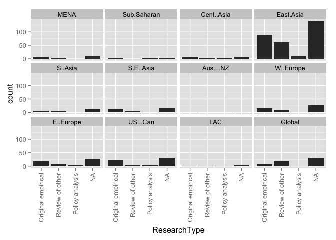

# Relationships for All Articles

# _Region by year group_ for all entries in the database:

### Graphs for all entries
 

### Counts for all entries

|        | MENA| Sub.Saharan| Cent..Asia| East.Asia| S..Asia| S.E..Asia| Aus....NZ| W..Europe| E..Europe| US...Can| LAC| Global|
|:-------|----:|-----------:|----------:|---------:|-------:|---------:|---------:|---------:|---------:|--------:|---:|------:|
|1985-89 |    1|           0|          0|         2|       0|         0|         0|         0|         0|        1|   0|      0|
|1990-94 |    0|           0|          0|         3|       1|         1|         0|         0|         0|        0|   0|      0|
|1995-99 |    0|           0|          0|         5|       0|         1|         0|         1|         0|        3|   0|      3|
|2000-04 |    0|           1|          0|         7|       1|         0|         0|         3|         0|        2|   0|      2|
|2005-09 |    2|           1|          2|        29|       5|         5|         0|         3|         6|        4|   0|      8|
|2010-14 |    1|           1|          4|       104|       4|        10|         1|        12|        13|       20|   2|     23|
|unclear |    0|           0|          0|         4|       0|         0|         0|         0|         0|        0|   0|      0|

# _Region by publication type_: 

### Graphs for all entries
 

### Counts for all entries

|                 | MENA| Sub.Saharan| Cent..Asia| East.Asia| S..Asia| S.E..Asia| Aus....NZ| W..Europe| E..Europe| US...Can| LAC| Global|
|:----------------|----:|-----------:|----------:|---------:|-------:|---------:|---------:|---------:|---------:|--------:|---:|------:|
|Book             |    0|           0|          3|         1|       1|         1|         0|         0|         1|        1|   0|      1|
|Book Chapter     |    0|           1|          1|         0|       0|         2|         0|         0|         2|        0|   0|      0|
|Discussion Paper |    0|           0|          0|         0|       0|         0|         0|         0|         2|        0|   0|      0|
|Dissertation     |    0|           1|          0|         6|       0|         0|         0|         0|         1|        0|   0|      1|
|Journal Article  |    2|           0|          2|       112|       8|        10|         1|        18|        11|       29|   2|     34|
|Master's Thesis  |    0|           0|          0|        32|       0|         0|         0|         0|         0|        0|   0|      0|
|Report           |    1|           0|          0|         1|       2|         1|         0|         1|         2|        0|   0|      0|
|Working Paper    |    1|           1|          0|         2|       0|         3|         0|         0|         0|        0|   0|      0|

# _Publication type by year group_ for all entries in the database:

### Graphs for all entries
 

### Counts for all entries

|        | Book| Book Chapter| Discussion Paper| Dissertation| Journal Article| Master's Thesis| Report| Working Paper|
|:-------|----:|------------:|----------------:|------------:|---------------:|---------------:|------:|-------------:|
|1985-89 |    0|            0|                0|            1|               3|               0|      0|             0|
|1990-94 |    0|            0|                0|            0|               5|               0|      0|             0|
|1995-99 |    0|            0|                0|            2|              10|               0|      2|             0|
|2000-04 |    0|            1|                0|            1|              12|               1|      0|             1|
|2005-09 |    3|            1|                2|            6|              44|               5|      2|             3|
|2010-14 |    3|           14|                0|            7|             138|              25|      3|             2|
|unclear |    0|            0|                0|            1|               1|               1|      0|             1|

# _Research type by region_ for all entries in the database

### Graphs for all entries
 

### Counts for all entries

|            | Original emperical| Review of other| Policy analysis| value|
|:-----------|------------------:|---------------:|---------------:|-----:|
|MENA        |                  3|               0|               0|     0|
|Sub.Saharan |                  2|               0|               1|     0|
|Cent..Asia  |                  5|               1|               1|     0|
|East.Asia   |                 91|              72|              11|     0|
|S..Asia     |                  3|               5|               1|     0|
|S.E..Asia   |                 11|               3|               2|     0|
|Aus....NZ   |                  1|               0|               0|     0|
|W..Europe   |                 11|               6|               1|     0|
|E..Europe   |                 13|               5|               2|     0|
|US...Can    |                 18|               9|               4|     0|
|LAC         |                  1|               1|               0|     0|
|Global      |                  8|              26|               1|     0|

# _Research type by year group_ for all entries in the database

### Graphs for all entries
 

### Counts for all entries

|        | Original.emperical.research| Review.of.other.research| Policy.analysis|
|:-------|---------------------------:|------------------------:|---------------:|
|1985-89 |                           4|                        0|               0|
|1990-94 |                           4|                        1|               0|
|1995-99 |                          12|                        2|               0|
|2000-04 |                           9|                        6|               0|
|2005-09 |                          38|                       21|               6|
|2010-14 |                         108|                       89|              13|
|unclear |                           1|                        2|               0|

# _Ed levels by region_ 

### Graphs for all entries
 

### Counts for all entries

|            | Pre-primary| Primary| Secondary| Tertiary| value|
|:-----------|-----------:|-------:|---------:|--------:|-----:|
|MENA        |           0|       3|         4|        0|     0|
|Sub.Saharan |           0|       1|         3|        1|     0|
|Cent..Asia  |           0|       4|         5|        0|     0|
|East.Asia   |           6|     104|       126|        3|     0|
|S..Asia     |           2|       7|         9|        0|     0|
|S.E..Asia   |           1|      15|        11|        0|     0|
|Aus....NZ   |           0|       0|         1|        0|     0|
|W..Europe   |           1|      11|        19|        1|     0|
|E..Europe   |           1|       9|        17|        1|     0|
|US...Can    |           4|      16|        26|        4|     0|
|LAC         |           0|       1|         2|        0|     0|
|Global      |           3|      32|        34|        0|     0|

# _Research approach by region_
### Graphs for all entries
 

### Counts for all entries

|            | Single-country| Comparative| value|
|:-----------|--------------:|-----------:|-----:|
|MENA        |              4|           0|     0|
|Sub.Saharan |              3|           0|     0|
|Cent..Asia  |              1|           5|     0|
|East.Asia   |            134|          18|     0|
|S..Asia     |              8|           3|     0|
|S.E..Asia   |             12|           5|     0|
|Aus....NZ   |              1|           0|     0|
|W..Europe   |             15|           4|     0|
|E..Europe   |              9|          10|     0|
|US...Can    |             22|           5|     0|
|LAC         |              2|           0|     0|
|Global      |              2|          31|     0|

# Research approach by year group
### Graphs for all entries
 

### Counts for all entries

|        | Single.country...case| Comparative|
|:-------|---------------------:|-----------:|
|1985-89 |                     4|           0|
|1990-94 |                     5|           0|
|1995-99 |                    10|           2|
|2000-04 |                    12|           4|
|2005-09 |                    52|          12|
|2010-14 |                   146|          42|
|unclear |                     4|           0|

# Research methods by year group
### Graphs for all entries
 

### Counts for all entries

|        | Mixed-methods| None or Unclear to us| Qualitative| Quantitative|
|:-------|-------------:|---------------------:|-----------:|------------:|
|1985-89 |             1|                     0|           1|            2|
|1990-94 |             1|                     0|           1|            3|
|1995-99 |             3|                     3|           2|            6|
|2000-04 |             2|                     0|           9|            5|
|2005-09 |             8|                     0|          28|           29|
|2010-14 |            30|                    22|          83|           57|
|unclear |             0|                     0|           1|            3|

# Research methods by region
### Graphs for all entries
 

### Counts for all entries

|            |   | Mixed-methods| None or Unclear to us| Qualitative| Quantitative|
|:-----------|--:|-------------:|---------------------:|-----------:|------------:|
|MENA        |  0|             1|                     0|           1|            2|
|Sub.Saharan |  0|             0|                     0|           2|            1|
|Cent..Asia  |  0|             3|                     0|           2|            1|
|East.Asia   |  0|            28|                    14|          57|           55|
|S..Asia     |  0|             3|                     2|           4|            2|
|S.E..Asia   |  0|             3|                     0|           5|            9|
|Aus....NZ   |  0|             0|                     0|           1|            0|
|W..Europe   |  0|             2|                     1|          10|            6|
|E..Europe   |  0|             3|                     2|           7|            7|
|US...Can    |  0|             1|                     4|          15|           10|
|LAC         |  0|             0|                     0|           1|            1|
|Global      |  0|             1|                     7|          21|            6|

# Research methods by year group
### Graph for all entries
 

### Counts for all entries

|        |   | Mixed-methods| None or Unclear to us| Qualitative| Quantitative|
|:-------|--:|-------------:|---------------------:|-----------:|------------:|
|1985-89 |  0|             1|                     0|           1|            2|
|1990-94 |  0|             1|                     0|           1|            3|
|1995-99 |  0|             3|                     3|           2|            6|
|2000-04 |  0|             2|                     0|           9|            5|
|2005-09 |  0|             8|                     0|          28|           29|
|2010-14 |  0|            30|                    22|          83|           57|
|unclear |  0|             0|                     0|           1|            3|

# Research methods by publication type
### Graph for all entries
 

### Counts for all entries

|                 |   | Mixed-methods| None or Unclear to us| Qualitative| Quantitative|
|:----------------|--:|-------------:|---------------------:|-----------:|------------:|
|Book             |  0|             2|                     0|           4|            0|
|Book Chapter     |  0|             1|                     0|          12|            3|
|Discussion Paper |  0|             0|                     0|           0|            2|
|Dissertation     |  0|             4|                     0|           3|           11|
|Journal Article  |  0|            17|                    25|          91|           79|
|Master's Thesis  |  0|            19|                     0|          12|            1|
|Report           |  0|             2|                     0|           1|            4|
|Working Paper    |  0|             0|                     0|           2|            5|
