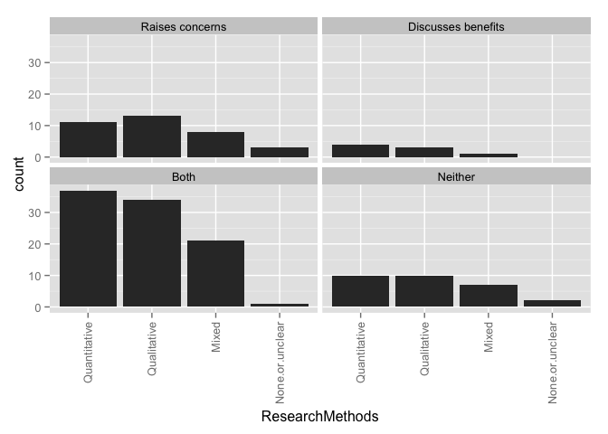
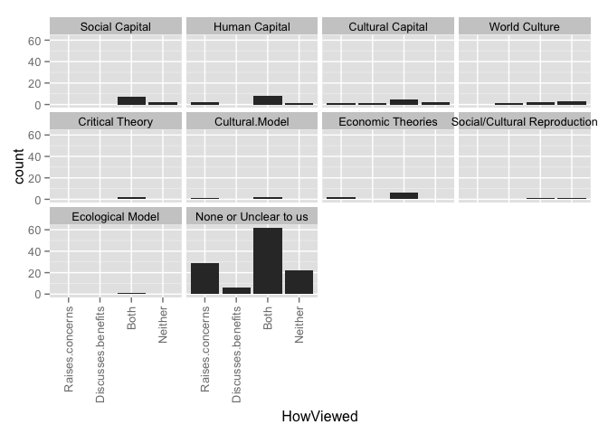
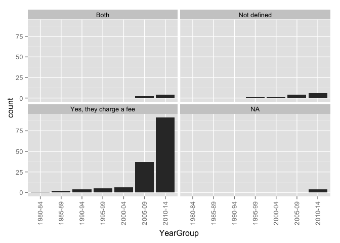
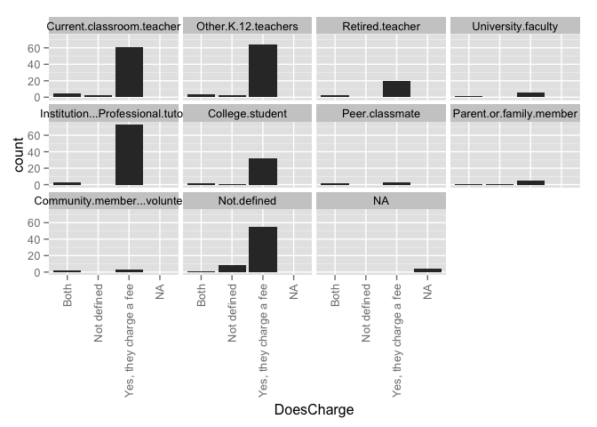
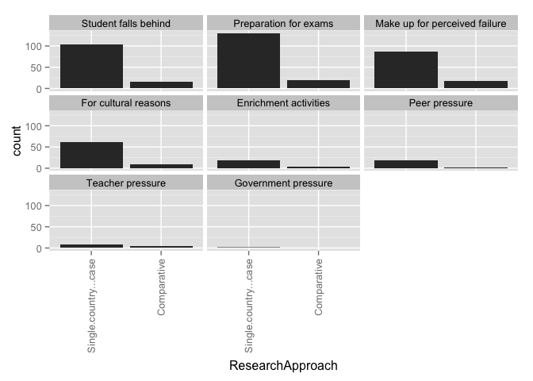
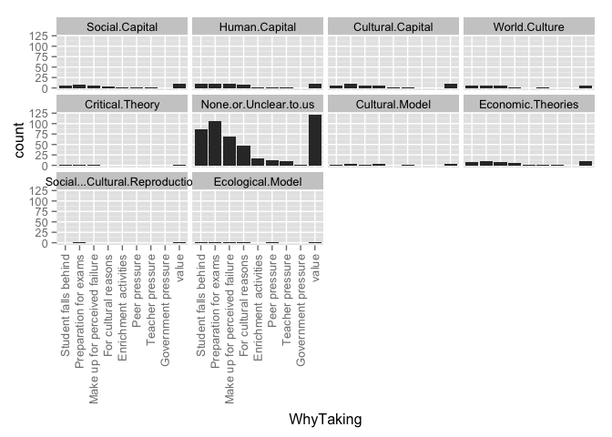

# Relationships for All Articles

### TOTAL NUMBER OF ARTICLES: 167
This number includes 0 articles with duplicate ID numbers. A full list of duplicate articles can be found [here](https://github.com/MikeRussellMcK/PTAnalysis/blob/master/Markdown%20and%20Output/Duplicates.md). 
Document was last updated on 2014-09-25 10:32:12.

# _Region by year group_ for all entries in the database:

### Graphs for all entries
 

### Counts for all entries

|        | MENA| Sub.Saharan| Cent..Asia| East.Asia| S..Asia| S.E..Asia| Aus....NZ| W..Europe| E..Europe| US...Can| LAC| Global|
|:-------|----:|-----------:|----------:|---------:|-------:|---------:|---------:|---------:|---------:|--------:|---:|------:|
|1985-89 |    0|           0|          0|         2|       0|         0|         0|         0|         0|        0|   0|      0|
|1990-94 |    0|           0|          0|         3|       1|         1|         0|         0|         0|        0|   0|      0|
|1995-99 |    0|           0|          0|         5|       0|         1|         0|         0|         0|        0|   0|      0|
|2000-04 |    0|           0|          0|         6|       2|         0|         0|         0|         0|        0|   0|      0|
|2005-09 |    0|           0|          2|        32|       5|         6|         0|         0|         1|        2|   0|      0|
|2010-14 |    0|           0|          4|        92|       4|        10|         0|         1|         4|        2|   0|      2|

# _Region by publication type_: 

### Graphs for all entries
 

### Counts for all entries

|                 | MENA| Sub.Saharan| Cent..Asia| East.Asia| S..Asia| S.E..Asia| Aus....NZ| W..Europe| E..Europe| US...Can| LAC| Global|
|:----------------|----:|-----------:|----------:|---------:|-------:|---------:|---------:|---------:|---------:|--------:|---:|------:|
|Book             |    0|           0|          3|         1|       1|         1|         0|         0|         1|        0|   0|      0|
|Book Chapter     |    0|           0|          1|         0|       0|         2|         0|         0|         1|        0|   0|      0|
|Discussion Paper |    0|           0|          0|         0|       0|         0|         0|         0|         0|        0|   0|      0|
|Dissertation     |    0|           0|          0|        10|       2|         1|         0|         0|         0|        0|   0|      0|
|Journal Article  |    0|           0|          2|        95|       7|        10|         0|         1|         3|        4|   0|      2|
|Master's Thesis  |    0|           0|          0|        32|       0|         0|         0|         0|         0|        0|   0|      0|
|Report           |    0|           0|          0|         1|       2|         1|         0|         0|         0|        0|   0|      0|
|Working Paper    |    0|           0|          0|         1|       0|         3|         0|         0|         0|        0|   0|      0|

# _Publication type by year group_ for all entries in the database:

### Graphs for all entries
 

### Counts for all entries

|        | Book| Book Chapter| Discussion Paper| Dissertation| Journal Article| Master's Thesis| Report| Working Paper|
|:-------|----:|------------:|----------------:|------------:|---------------:|---------------:|------:|-------------:|
|1985-89 |    0|            0|                0|            1|               1|               0|      0|             0|
|1990-94 |    0|            0|                0|            0|               5|               0|      0|             0|
|1995-99 |    0|            0|                0|            1|               3|               0|      2|             0|
|2000-04 |    0|            0|                0|            2|               4|               1|      0|             0|
|2005-09 |    2|            1|                0|            3|              29|               6|      1|             1|
|2010-14 |    1|            1|                0|            6|              67|              25|      1|             3|

# _Research type by region_ for all entries in the database

### Graphs for all entries
 

### Counts for all entries

|            | Original empirical| Review of other| Policy analysis| value|
|:-----------|------------------:|---------------:|---------------:|-----:|
|MENA        |                  0|               0|               0|     0|
|Sub.Saharan |                  0|               0|               0|     0|
|Cent..Asia  |                  5|               1|               1|     0|
|East.Asia   |                 88|              61|              11|     0|
|S..Asia     |                  6|               4|               1|     0|
|S.E..Asia   |                 13|               3|               2|     0|
|Aus....NZ   |                  0|               0|               0|     0|
|W..Europe   |                  0|               1|               0|     0|
|E..Europe   |                  4|               1|               1|     0|
|US...Can    |                  1|               1|               2|     0|
|LAC         |                  0|               0|               0|     0|
|Global      |                  2|               0|               0|     0|

# _Research type by year group_ for all entries in the database

### Graphs for all entries
 

### Counts for all entries

|        | Original.empirical.research| Review.of.other.research| Policy.analysis|
|:-------|---------------------------:|------------------------:|---------------:|
|1985-89 |                           2|                        0|               0|
|1990-94 |                           4|                        1|               0|
|1995-99 |                           5|                        2|               0|
|2000-04 |                           4|                        3|               0|
|2005-09 |                          25|                       14|               4|
|2010-14 |                          69|                       44|               9|

# _Ed levels by region_ 

### Graphs for all entries
 

### Counts for all entries

|            | Pre-primary| Primary| Secondary| Tertiary| value|
|:-----------|-----------:|-------:|---------:|--------:|-----:|
|MENA        |           0|       0|         0|        0|     0|
|Sub.Saharan |           0|       0|         0|        0|     0|
|Cent..Asia  |           0|       4|         5|        0|     0|
|East.Asia   |           6|      97|       122|        3|     0|
|S..Asia     |           2|       7|        10|        0|     0|
|S.E..Asia   |           1|      17|        13|        0|     0|
|Aus....NZ   |           0|       0|         0|        0|     0|
|W..Europe   |           0|       1|         1|        0|     0|
|E..Europe   |           0|       3|         4|        0|     0|
|US...Can    |           0|       2|         4|        0|     0|
|LAC         |           0|       0|         0|        0|     0|
|Global      |           0|       1|         2|        0|     0|

# _Research approach by region_
### Graphs for all entries
 

### Counts for all entries

|            | Single-country| Comparative| value|
|:-----------|--------------:|-----------:|-----:|
|MENA        |              0|           0|     0|
|Sub.Saharan |              0|           0|     0|
|Cent..Asia  |              1|           5|     0|
|East.Asia   |            124|          14|     0|
|S..Asia     |              9|           3|     0|
|S.E..Asia   |             13|           5|     0|
|Aus....NZ   |              0|           0|     0|
|W..Europe   |              0|           1|     0|
|E..Europe   |              0|           5|     0|
|US...Can    |              1|           3|     0|
|LAC         |              0|           0|     0|
|Global      |              1|           1|     0|

# Research approach by year group
### Graphs for all entries
 

### Counts for all entries

|        | Single.country...case| Comparative|
|:-------|---------------------:|-----------:|
|1985-89 |                     2|           0|
|1990-94 |                     5|           0|
|1995-99 |                     5|           1|
|2000-04 |                     5|           2|
|2005-09 |                    38|           4|
|2010-14 |                    92|          11|

# Research methods by year group
### Graphs for all entries
 

### Counts for all entries

|        | Mixed-methods| None or Unclear to us| Qualitative| Quantitative|
|:-------|-------------:|---------------------:|-----------:|------------:|
|1985-89 |             1|                     0|           1|            0|
|1990-94 |             1|                     0|           1|            3|
|1995-99 |             3|                     2|           0|            1|
|2000-04 |             2|                     0|           3|            2|
|2005-09 |             8|                     0|          15|           20|
|2010-14 |            23|                     4|          40|           37|

# Research methods by region
### Graphs for all entries
 

### Counts for all entries

|            | Mixed-methods| None or Unclear to us| Qualitative| Quantitative|
|:-----------|-------------:|---------------------:|-----------:|------------:|
|MENA        |             0|                     0|           0|            0|
|Sub.Saharan |             0|                     0|           0|            0|
|Cent..Asia  |             3|                     0|           2|            1|
|East.Asia   |            29|                     5|          56|           50|
|S..Asia     |             3|                     1|           5|            3|
|S.E..Asia   |             3|                     0|           5|           10|
|Aus....NZ   |             0|                     0|           0|            0|
|W..Europe   |             0|                     0|           1|            0|
|E..Europe   |             2|                     0|           2|            1|
|US...Can    |             0|                     1|           2|            1|
|LAC         |             0|                     0|           0|            0|
|Global      |             0|                     0|           1|            1|

# Research methods by year group
### Graph for all entries
 

### Counts for all entries

|        | Mixed-methods| None or Unclear to us| Qualitative| Quantitative|
|:-------|-------------:|---------------------:|-----------:|------------:|
|1985-89 |             1|                     0|           1|            0|
|1990-94 |             1|                     0|           1|            3|
|1995-99 |             3|                     2|           0|            1|
|2000-04 |             2|                     0|           3|            2|
|2005-09 |             8|                     0|          15|           20|
|2010-14 |            23|                     4|          40|           37|

# Research methods by publication type
### Graph for all entries
 

### Counts for all entries

|                 | Mixed-methods| None or Unclear to us| Qualitative| Quantitative|
|:----------------|-------------:|---------------------:|-----------:|------------:|
|Book             |             2|                     0|           1|            0|
|Book Chapter     |             1|                     0|           1|            0|
|Discussion Paper |             0|                     0|           0|            0|
|Dissertation     |             4|                     0|           1|            8|
|Journal Article  |            10|                     6|          45|           48|
|Master's Thesis  |            19|                     0|          12|            1|
|Report           |             2|                     0|           0|            2|
|Working Paper    |             0|                     0|           0|            4|

# Theoreortical framework by region
### Graphs for all entries
 

### Counts for all entries

|                      | MENA| Sub.Saharan| Cent..Asia| East.Asia| S..Asia| S.E..Asia| Aus....NZ| W..Europe| E..Europe| US...Can| LAC| Global|
|:---------------------|----:|-----------:|----------:|---------:|-------:|---------:|---------:|---------:|---------:|--------:|---:|------:|
|Social Capital        |    0|           0|          1|         8|       1|         2|         0|         0|         0|        0|   0|      0|
|Human Capital         |    0|           0|          1|         9|       1|         4|         0|         0|         0|        0|   0|      0|
|Cultural Capital      |    0|           0|          0|         7|       0|         0|         0|         0|         0|        1|   0|      0|
|World Culture         |    0|           0|          0|         1|       1|         0|         0|         0|         0|        1|   0|      1|
|Human Rights          |    0|           0|          0|         0|       0|         1|         0|         0|         0|        0|   0|      0|
|Critical Theory       |    0|           0|          1|         0|       0|         2|         0|         0|         1|        0|   0|      0|
|Political Theory      |    0|           0|          0|         0|       0|         0|         0|         0|         0|        0|   0|      0|
|None or Unclear to us |    0|           0|          4|        97|       9|         9|         0|         1|         4|        1|   0|      1|
|value                 |    0|           0|          0|         0|       0|         0|         0|         0|         0|        0|   0|      0|

# Theoreortical framework by year group
### Graphs for all entries
 

### Counts for all entries

|        | Social.Capital| Human.Capital| Cultural.Capital| World.Culture| Human.Rights| Critical.Theory| Political.Theory| None.or.Unclear.to.us|
|:-------|--------------:|-------------:|----------------:|-------------:|------------:|---------------:|----------------:|---------------------:|
|1985-89 |              0|             0|                0|             0|            0|               0|                0|                     1|
|1990-94 |              1|             0|                0|             0|            0|               0|                0|                     4|
|1995-99 |              0|             0|                0|             0|            0|               0|                0|                     6|
|2000-04 |              0|             0|                2|             0|            0|               0|                0|                     3|
|2005-09 |              3|             2|                1|             0|            1|               0|                0|                    31|
|2010-14 |              5|            10|                4|             2|            0|               2|                0|                    70|

# Theoretical framework by research method
### Graphs for all entries
 

### Counts for all entries

|                      | Quantitative| Qualitative| Mixed| None.or.unclear|
|:---------------------|------------:|-----------:|-----:|---------------:|
|Social Capital        |            6|           2|     1|               0|
|Human Capital         |            8|           2|     2|               0|
|Cultural Capital      |            3|           1|     3|               0|
|World Culture         |            0|           1|     0|               1|
|Human Rights          |            0|           0|     1|               0|
|Critical Theory       |            0|           1|     1|               0|
|Political Theory      |            0|           0|     0|               0|
|None or Unclear to us |           35|          47|    29|               4|
|value                 |            0|           0|     0|               0|

# Theoretical framework by research approach
### Graphs for all entries
 

### Counts for all entries

|                      | Single.country...case| Comparative|
|:---------------------|---------------------:|-----------:|
|Social Capital        |                     7|           2|
|Human Capital         |                    11|           1|
|Cultural Capital      |                     5|           2|
|World Culture         |                     2|           0|
|Human Rights          |                     1|           0|
|Critical Theory       |                     1|           1|
|Political Theory      |                     0|           0|
|None or Unclear to us |                   102|          11|
|value                 |                     0|           0|

# Framing by region
### Graphs for all entries
 

### Counts for all entries

|                | MENA| Sub.Saharan| Cent..Asia| East.Asia| S..Asia| S.E..Asia| Aus....NZ| W..Europe| E..Europe| US...Can| LAC| Global|
|:---------------|----:|-----------:|----------:|---------:|-------:|---------:|---------:|---------:|---------:|--------:|---:|------:|
|Exam Prep       |    0|           0|          5|       119|      11|        13|         0|         1|         4|        3|   0|      2|
|Corruption      |    0|           0|          5|         9|       1|         5|         0|         0|         2|        0|   0|      0|
|Equity          |    0|           0|          6|        66|       6|        12|         0|         1|         5|        1|   0|      1|
|Economic        |    0|           0|          2|        42|       5|         8|         0|         1|         1|        2|   0|      0|
|Social Cohesion |    0|           0|          1|         4|       1|         1|         0|         0|         0|        0|   0|      0|
|Global Trend    |    0|           0|          1|        17|       6|         4|         0|         0|         1|        1|   0|      2|
|Household       |    0|           0|          1|        66|       5|        10|         0|         0|         0|        0|   0|      0|
|value           |    0|           0|          0|         0|       0|         0|         0|         0|         0|        0|   0|      0|

# Framing by year group
### Graphs for all entries
 

### Counts for all entries

|        | Related.to.curriculum.coverage...ed..quality...exam.prep| Corruption| Equity| Supply...Demand...Economic.Efficiency| Social.Cohesion| Global.Trend| Household.Expenditures|
|:-------|--------------------------------------------------------:|----------:|------:|-------------------------------------:|---------------:|------------:|----------------------:|
|1985-89 |                                                        2|          0|      1|                                     0|               0|            0|                      0|
|1990-94 |                                                        4|          0|      2|                                     1|               0|            0|                      2|
|1995-99 |                                                        6|          1|      1|                                     1|               0|            1|                      3|
|2000-04 |                                                        7|          0|      2|                                     1|               0|            2|                      3|
|2005-09 |                                                       35|          5|     23|                                    14|               1|            7|                     26|
|2010-14 |                                                       88|         10|     54|                                    35|               3|           13|                     45|

# Framed by research method
### Graphs for all entries
 

### Counts for all entries

|                | Quantitative| Qualitative| Mixed| None.or.unclear|
|:---------------|------------:|-----------:|-----:|---------------:|
|Exam Prep       |           49|          49|    38|               6|
|Corruption      |            3|           6|     7|               0|
|Equity          |           31|          29|    22|               1|
|Economic        |           19|          23|     8|               2|
|Social Cohesion |            0|           3|     1|               0|
|Global Trend    |           11|           8|     3|               1|
|Household       |           43|          15|    20|               1|
|value           |            0|           0|     0|               0|

# Framed by research approach
### Graphs for all entries
 

### Counts for all entries

|                | Single.country...case| Comparative|
|:---------------|---------------------:|-----------:|
|Exam Prep       |                   125|          15|
|Corruption      |                     9|           7|
|Equity          |                    68|          14|
|Economic        |                    46|           6|
|Social Cohesion |                     2|           2|
|Global Trend    |                    17|           6|
|Household       |                    75|           4|
|value           |                     0|           0|

# Framed by theory
### Graphs for all entries
 

### Counts for all entries

|                                                         | Social Capital| Human Capital| Cultural Capital| World Culture| Human Rights| Critical Theory| Political Theory| None or Unclear to us| value|
|:--------------------------------------------------------|--------------:|-------------:|----------------:|-------------:|------------:|---------------:|----------------:|---------------------:|-----:|
|Related.to.curriculum.coverage...ed..quality...exam.prep |              6|             8|                7|             2|            1|               1|                0|                   100|     0|
|Corruption                                               |              1|             1|                0|             0|            1|               1|                0|                    11|     0|
|Equity                                                   |              6|             5|                3|             0|            1|               2|                0|                    56|     0|
|Supply...Demand...Economic.Efficiency                    |              6|             7|                2|             1|            0|               0|                0|                    34|     0|
|Social.Cohesion                                          |              2|             1|                0|             0|            0|               0|                0|                     2|     0|
|Global.Trend                                             |              2|             3|                0|             2|            0|               0|                0|                    13|     0|
|Household.Expenditures                                   |              6|             8|                3|             0|            0|               0|                0|                    52|     0|

# How Viewed by region
### Graphs for all entries
 

### Counts for all entries

|                   | MENA| Sub.Saharan| Cent..Asia| East.Asia| S..Asia| S.E..Asia| Aus....NZ| W..Europe| E..Europe| US...Can| LAC| Global|
|:------------------|----:|-----------:|----------:|---------:|-------:|---------:|---------:|---------:|---------:|--------:|---:|------:|
|Raises concerns    |    0|           0|          1|        28|       4|         3|         0|         0|         0|        0|   0|      0|
|Discusses benefits |    0|           0|          0|         7|       1|         3|         0|         0|         1|        1|   0|      2|
|Both               |    0|           0|          5|        76|       5|        10|         0|         1|         4|        2|   0|      0|
|Neither            |    0|           0|          0|        28|       2|         0|         0|         0|         0|        1|   0|      0|
|value              |    0|           0|          0|         0|       0|         0|         0|         0|         0|        0|   0|      0|

# How Viewed by year group
### Graphs for all entries
 

### Counts for all entries

|        | Raises.concerns| Discusses.benefits| Both| Neither|
|:-------|---------------:|------------------:|----:|-------:|
|1985-89 |               0|                  0|    1|       1|
|1990-94 |               0|                  0|    4|       1|
|1995-99 |               2|                  0|    2|       1|
|2000-04 |               3|                  0|    3|       1|
|2005-09 |               3|                  3|   29|       6|
|2010-14 |              27|                  5|   52|      20|

# HowViewed by research method
### Graphs for all entries
 

### Counts for all entries

|                   | Quantitative| Qualitative| Mixed| None.or.unclear|
|:------------------|------------:|-----------:|-----:|---------------:|
|Raises concerns    |           10|          14|     8|               3|
|Discusses benefits |            4|           3|     1|               0|
|Both               |           37|          32|    21|               1|
|Neither            |           11|          10|     7|               2|
|value              |            0|           0|     0|               0|

# HowViewed by research approach
### Graphs for all entries
 

### Counts for all entries

|                   | Single.country...case| Comparative|
|:------------------|---------------------:|-----------:|
|Raises concerns    |                    32|           3|
|Discusses benefits |                     6|           2|
|Both               |                    76|          13|
|Neither            |                    30|           0|
|value              |                     0|           0|

# HowViewed by theory
### Graphs for all entries
 

### Counts for all entries

|                   | Social Capital| Human Capital| Cultural Capital| World Culture| Human Rights| Critical Theory| Political Theory| None or Unclear to us| value|
|:------------------|--------------:|-------------:|----------------:|-------------:|------------:|---------------:|----------------:|---------------------:|-----:|
|Raises.concerns    |              1|             2|                1|             0|            1|               0|                0|                    25|     0|
|Discusses.benefits |              0|             0|                1|             1|            0|               0|                0|                     6|     0|
|Both               |              7|             9|                4|             0|            0|               2|                0|                    59|     0|
|Neither            |              1|             1|                1|             1|            0|               0|                0|                    23|     0|

# How Viewed by Framed
### Graphs for all entries
 

### Counts for all entries

|                                                         | Raises concerns| Discusses benefits| Both| Neither| value|
|:--------------------------------------------------------|---------------:|------------------:|----:|-------:|-----:|
|Related.to.curriculum.coverage...ed..quality...exam.prep |              31|                  5|   76|      27|     0|
|Corruption                                               |               6|                  0|   10|       0|     0|
|Equity                                                   |              19|                  3|   55|       5|     0|
|Supply...Demand...Economic.Efficiency                    |               8|                  5|   32|       7|     0|
|Social.Cohesion                                          |               1|                  0|    3|       0|     0|
|Global.Trend                                             |               6|                  3|   12|       2|     0|
|Household.Expenditures                                   |              13|                  2|   53|       9|     0|

# Stakeholders by region
### Graphs for all entries
 

### Counts for all entries

|                      | MENA| Sub.Saharan| Cent..Asia| East.Asia| S..Asia| S.E..Asia| Aus....NZ| W..Europe| E..Europe| US...Can| LAC| Global|
|:---------------------|----:|-----------:|----------:|---------:|-------:|---------:|---------:|---------:|---------:|--------:|---:|------:|
|Non-tutor teachers    |    0|           0|          0|        23|       2|         3|         0|         0|         1|        1|   0|      1|
|Teachers who tutor    |    0|           0|          0|        38|       2|         4|         0|         0|         1|        1|   0|      1|
|Tutors                |    0|           0|          0|         6|       1|         0|         0|         0|         0|        0|   0|      0|
|Parents               |    0|           0|          1|        60|       4|         9|         0|         0|         1|        0|   0|      1|
|Students              |    0|           0|          4|        77|       5|         7|         0|         0|         4|        1|   0|      1|
|School admin          |    0|           0|          0|         9|       0|         1|         0|         0|         0|        0|   0|      0|
|Tutoring center admin |    0|           0|          0|         1|       0|         0|         0|         0|         0|        0|   0|      0|
|Academic scholar(s)   |    0|           0|          0|         3|       0|         0|         0|         0|         0|        0|   0|      0|
|Policymakers          |    0|           0|          0|         7|       0|         2|         0|         0|         0|        0|   0|      0|
|Documents             |    0|           0|          2|        46|       5|         3|         0|         0|         1|        3|   0|      1|
|value                 |    0|           0|          0|         0|       0|         0|         0|         0|         0|        0|   0|      0|

# Stakeholders by year group
### Graphs for all entries
 

### Counts for all entries

|        | Teachers.who.do.not.tutor| Teachers.who.tutor| Tutors.who.are.not.teachers| School.administrators| Tutoring.center.admin| Academic.scholars| Parents...household| Students| Policymakers| Documents|
|:-------|-------------------------:|------------------:|---------------------------:|---------------------:|---------------------:|-----------------:|-------------------:|--------:|------------:|---------:|
|1985-89 |                         1|                  2|                           0|                     0|                     0|                 0|                   0|        2|            0|         0|
|1990-94 |                         0|                  0|                           1|                     0|                     0|                 0|                   1|        4|            0|         1|
|1995-99 |                         2|                  2|                           0|                     0|                     0|                 0|                   2|        2|            2|         1|
|2000-04 |                         3|                  4|                           2|                     2|                     1|                 1|                   3|        5|            1|         2|
|2005-09 |                         7|                 10|                           1|                     3|                     0|                 1|                  19|       26|            1|        13|
|2010-14 |                        13|                 24|                           3|                     5|                     0|                 1|                  47|       52|            5|        33|

# Stakeholders by theory
### Graphs for all entries
 

### Counts for all entries

|                      | Non-tutor teachers| Tutors who tutor| Tutors| Parents| Students| Policymakers| Documents| value|
|:---------------------|------------------:|----------------:|------:|-------:|--------:|------------:|---------:|-----:|
|Social.Capital        |                  0|                1|      0|       4|        5|            0|         2|     0|
|Human.Capital         |                  1|                2|      0|       7|        6|            1|         2|     0|
|Cultural.Capital      |                  2|                4|      2|       4|        6|            1|         0|     0|
|World.Culture         |                  0|                0|      0|       0|        0|            0|         2|     0|
|Human.Rights          |                  0|                1|      0|       0|        0|            0|         0|     0|
|Critical.Theory       |                  0|                0|      0|       0|        2|            0|         0|     0|
|Political.Theory      |                  0|                0|      0|       0|        0|            0|         0|     0|
|None.or.Unclear.to.us |                 16|               27|      4|      49|       58|            7|        40|     0|
|School.administrators |                  7|                8|      3|       9|        9|            2|         1|     0|
|Tutoring.center.admin |                  0|                1|      1|       1|        1|            1|         0|     0|
|Academic.scholars     |                  1|                3|      1|       3|        3|            2|         0|     0|

# WhatTaught by region
### Graphs for all entries
 

### Counts for all entries

|                 | MENA| Sub.Saharan| Cent..Asia| East.Asia| S..Asia| S.E..Asia| Aus....NZ| W..Europe| E..Europe| US...Can| LAC| Global|
|:----------------|----:|-----------:|----------:|---------:|-------:|---------:|---------:|---------:|---------:|--------:|---:|------:|
|School subjects  |    0|           0|          4|        85|      10|        11|         0|         0|         3|        3|   0|      2|
|Extracurriculars |    0|           0|          0|         0|       0|         0|         0|         0|         0|        0|   0|      0|
|Both             |    0|           0|          2|        48|       2|         5|         0|         1|         2|        1|   0|      0|
|Not defined      |    0|           0|          0|         7|       0|         2|         0|         0|         0|        0|   0|      0|
|value            |    0|           0|          0|         0|       0|         0|         0|         0|         0|        0|   0|      0|

WhatTaught by year group
### Graphs for all entries
 

### Counts for all entries

|        | Subjects.taught.in.school| Extracurricular.activities| Both| Not.defined|
|:-------|-------------------------:|--------------------------:|----:|-----------:|
|1985-89 |                         2|                          0|    0|           0|
|1990-94 |                         4|                          0|    1|           0|
|1995-99 |                         4|                          0|    2|           0|
|2000-04 |                         6|                          0|    1|           0|
|2005-09 |                        26|                          0|   15|           2|
|2010-14 |                        65|                          0|   32|           7|

# WhatTaught by theory
### Graphs for all entries
 

### Counts for all entries

|                      | School subjects| Extracurriculars| Both| Not defined| value|
|:---------------------|---------------:|----------------:|----:|-----------:|-----:|
|Social.Capital        |               4|                0|    4|           1|     0|
|Human.Capital         |              10|                0|    1|           1|     0|
|Cultural.Capital      |               5|                0|    2|           0|     0|
|World.Culture         |               2|                0|    0|           0|     0|
|Human.Rights          |               1|                0|    0|           0|     0|
|Critical.Theory       |               1|                0|    1|           0|     0|
|Political.Theory      |               0|                0|    0|           0|     0|
|None.or.Unclear.to.us |              67|                0|   40|           8|     0|

# WhereOccur by region
### Graphs for all entries
 

### Counts for all entries

|                  | MENA| Sub.Saharan| Cent..Asia| East.Asia| S..Asia| S.E..Asia| Aus....NZ| W..Europe| E..Europe| US...Can| LAC| Global|
|:-----------------|----:|-----------:|----------:|---------:|-------:|---------:|---------:|---------:|---------:|--------:|---:|------:|
|On school grounds |    0|           0|          5|        21|       2|         8|         0|         0|         3|        1|   0|      0|
|Designated center |    0|           0|          1|        60|       5|         7|         0|         0|         1|        1|   0|      2|
|Web               |    0|           0|          1|        20|       2|         2|         0|         0|         0|        1|   0|      0|
|Student's home    |    0|           0|          5|        35|       5|         6|         0|         0|         3|        1|   0|      0|
|Outside school    |    0|           0|          4|        39|       6|         4|         0|         0|         3|        1|   0|      0|
|Not defined       |    0|           0|          1|        71|       5|         8|         0|         1|         1|        2|   0|      0|
|value             |    0|           0|          0|         0|       0|         0|         0|         0|         0|        0|   0|      0|

# WhereOccur by year group
### Graphs for all entries
 

### Counts for all entries

|        | On.school.grounds| Designated.tutoring.center.or.franchise| On.line...via.web| In.the.student.s.home| Other.outside.school| Not.defined|
|:-------|-----------------:|---------------------------------------:|-----------------:|---------------------:|--------------------:|-----------:|
|1985-89 |                 0|                                       0|                 0|                     0|                    0|           2|
|1990-94 |                 0|                                       4|                 0|                     3|                    3|           1|
|1995-99 |                 2|                                       3|                 0|                     0|                    1|           3|
|2000-04 |                 2|                                       3|                 0|                     3|                    4|           2|
|2005-09 |                 8|                                       9|                 3|                    10|                   11|          30|
|2010-14 |                19|                                      50|                19|                    29|                   31|          45|

# WhereOccur by theory
### Graphs for all entries
 

### Counts for all entries

|                      | On school grounds| Designated center| Web| Student's home| Outside school| Not defined| value|
|:---------------------|-----------------:|-----------------:|---:|--------------:|--------------:|-----------:|-----:|
|Social.Capital        |                 1|                 2|   1|              2|              2|           6|     0|
|Human.Capital         |                 3|                 8|   4|              2|              1|           4|     0|
|Cultural.Capital      |                 1|                 6|   0|              3|              4|           1|     0|
|World.Culture         |                 0|                 1|   1|              0|              0|           0|     0|
|Human.Rights          |                 1|                 0|   0|              0|              0|           0|     0|
|Critical.Theory       |                 2|                 0|   0|              1|              1|           0|     0|
|Political.Theory      |                 0|                 0|   0|              0|              0|           0|     0|
|None.or.Unclear.to.us |                19|                46|  15|             33|             35|          61|     0|

# WhoProvides by region
### Graphs for all entries
 

### Counts for all entries

|                | MENA| Sub.Saharan| Cent..Asia| East.Asia| S..Asia| S.E..Asia| Aus....NZ| W..Europe| E..Europe| US...Can| LAC| Global|
|:---------------|----:|-----------:|----------:|---------:|-------:|---------:|---------:|---------:|---------:|--------:|---:|------:|
|Current teacher |    0|           0|          5|        53|       7|        11|         0|         0|         4|        0|   0|      1|
|Other k-12      |    0|           0|          5|        54|       8|         9|         0|         0|         4|        0|   0|      1|
|Retired teacher |    0|           0|          1|        18|       4|         2|         0|         0|         0|        0|   0|      0|
|Univ. faculty   |    0|           0|          2|         3|       3|         2|         0|         0|         1|        0|   0|      0|
|Professional    |    0|           0|          4|        64|       6|         6|         0|         0|         3|        0|   0|      1|
|Col. student    |    0|           0|          1|        31|       3|         2|         0|         0|         0|        0|   0|      0|
|Peer            |    0|           0|          1|         2|       4|         1|         0|         0|         0|        0|   0|      0|
|Family          |    0|           0|          1|         5|       3|         1|         0|         0|         0|        0|   0|      0|
|Community       |    0|           0|          1|         1|       5|         1|         0|         0|         0|        0|   0|      0|
|Not defined     |    0|           0|          1|        61|       3|         7|         0|         1|         1|        4|   0|      1|
|value           |    0|           0|          0|         0|       0|         0|         0|         0|         0|        0|   0|      0|

# WhoProvides by year group
### Graphs for all entries
 

### Counts for all entries

|        | Current.classroom.teacher| Other.K.12.teachers| Retired.teacher| University.faculty| Institution...Professional.tutor| College.student| Peer.classmate| Parent.or.family.member| Community.member...volunteer| Not.defined|
|:-------|-------------------------:|-------------------:|---------------:|------------------:|--------------------------------:|---------------:|--------------:|-----------------------:|----------------------------:|-----------:|
|1985-89 |                         1|                   1|               1|                  0|                                0|               1|              0|                       0|                            0|           1|
|1990-94 |                         0|                   1|               0|                  0|                                3|               0|              0|                       1|                            1|           1|
|1995-99 |                         3|                   3|               0|                  0|                                3|               0|              0|                       0|                            0|           1|
|2000-04 |                         4|                   5|               2|                  0|                                4|               2|              0|                       2|                            0|           1|
|2005-09 |                        18|                  17|               6|                  4|                               13|               7|              3|                       1|                            3|          24|
|2010-14 |                        43|                  42|              13|                  3|                               52|              24|              2|                       3|                            1|          42|

# WhoProvides by theory
### Graphs for all entries
 

### Counts for all entries

|                      | Current teacher| Other k-12| Retired teacher| Univ. faculty| Professional| Col. student| Peer| Family| Community| Not defined| value|
|:---------------------|---------------:|----------:|---------------:|-------------:|------------:|------------:|----:|------:|---------:|-----------:|-----:|
|Social.Capital        |               1|          1|               1|             1|            3|            1|    1|      1|         1|           6|     0|
|Human.Capital         |               5|          5|               3|             1|            5|            3|    1|      1|         1|           6|     0|
|Cultural.Capital      |               3|          4|               2|             0|            5|            1|    0|      0|         0|           2|     0|
|World.Culture         |               0|          0|               0|             0|            0|            0|    0|      0|         0|           2|     0|
|Human.Rights          |               1|          0|               0|             0|            0|            0|    0|      0|         0|           0|     0|
|Critical.Theory       |               2|          1|               0|             0|            0|            0|    0|      0|         0|           0|     0|
|Political.Theory      |               0|          0|               0|             0|            0|            0|    0|      0|         0|           0|     0|
|None.or.Unclear.to.us |              50|         51|              15|             5|           53|           26|    3|      6|         4|          46|     0|

# DoesCharge by region
### Graphs for all entries
 

### Counts for all entries

|                             | MENA| Sub.Saharan| Cent..Asia| East.Asia| S..Asia| S.E..Asia| Aus....NZ| W..Europe| E..Europe| US...Can| LAC| Global|
|:----------------------------|----:|-----------:|----------:|---------:|-------:|---------:|---------:|---------:|---------:|--------:|---:|------:|
|                             |    0|           0|          0|         0|       0|         0|         0|         0|         0|        0|   0|      0|
|Both                         |    0|           0|          1|         0|       3|         2|         0|         0|         1|        1|   0|      0|
|No, they do not charge a fee |    0|           0|          0|         0|       0|         0|         0|         0|         0|        0|   0|      0|
|Not defined                  |    0|           0|          0|        11|       1|         2|         0|         0|         0|        2|   0|      0|
|Yes, they charge a fee       |    0|           0|          5|       125|       8|        14|         0|         1|         4|        1|   0|      2|

# DoesCharge by year group
### Graphs for all entries
 

### Counts for all entries

|        |   | Both| No, they do not charge a fee| Not defined| Yes, they charge a fee|
|:-------|--:|----:|----------------------------:|-----------:|----------------------:|
|1985-89 |  0|    0|                            0|           0|                      2|
|1990-94 |  0|    0|                            0|           0|                      5|
|1995-99 |  0|    0|                            0|           1|                      5|
|2000-04 |  0|    0|                            0|           1|                      6|
|2005-09 |  0|    2|                            0|           4|                     37|
|2010-14 |  0|    3|                            0|           6|                     91|

# DoesCharge by WhoProvides
### Graphs for all entries
 

### Counts for all entries

|                             | Current.classroom.teacher| Other.K.12.teachers| Retired.teacher| University.faculty| Institution...Professional.tutor| College.student| Peer.classmate| Parent.or.family.member| Community.member...volunteer| Not.defined|
|:----------------------------|-------------------------:|-------------------:|---------------:|------------------:|--------------------------------:|---------------:|--------------:|-----------------------:|----------------------------:|-----------:|
|                             |                         0|                   0|               0|                  0|                                0|               0|              0|                       0|                            0|           0|
|Both                         |                         4|                   3|               1|                  1|                                2|               1|              2|                       1|                            2|           1|
|No, they do not charge a fee |                         0|                   0|               0|                  0|                                0|               0|              0|                       0|                            0|           0|
|Not defined                  |                         3|                   2|               0|                  0|                                0|               1|              0|                       1|                            0|           9|
|Yes, they charge a fee       |                        62|                  64|              21|                  6|                               73|              32|              3|                       5|                            3|          56|

# ClassSize by Region
### Graphs for all entries
 

### Counts for all entries

|                              | MENA| Sub.Saharan| Cent..Asia| East.Asia| S..Asia| S.E..Asia| Aus....NZ| W..Europe| E..Europe| US...Can| LAC| Global|
|:-----------------------------|----:|-----------:|----------:|---------:|-------:|---------:|---------:|---------:|---------:|--------:|---:|------:|
|                              |    0|           0|          0|         0|       0|         0|         0|         0|         0|        0|   0|      0|
|Individual 1-on-1 instruction |    0|           0|          0|         1|       0|         0|         0|         0|         0|        0|   0|      0|
|Large groups                  |    0|           0|          0|         0|       0|         0|         0|         0|         0|        0|   0|      0|
|Small groups                  |    0|           0|          0|         0|       1|         1|         0|         0|         0|        0|   0|      0|
|Unclear                       |    0|           0|          1|        58|       2|         5|         0|         1|         1|        2|   0|      0|
|Various class sizes discussed |    0|           0|          5|        80|       9|        12|         0|         0|         4|        2|   0|      2|

# OperationSize by region
### Graphs for all entries
 

### Counts for all entries

|            | Not.defined.or.unclear| MENA| Sub.Saharan| Cent..Asia| East.Asia| S..Asia| S.E..Asia| Aus....NZ| W..Europe| E..Europe| US...Can| LAC| Global|
|:-----------|----------------------:|----:|-----------:|----------:|---------:|-------:|---------:|---------:|---------:|---------:|--------:|---:|------:|
|Individual  |                      0|    0|           0|          0|         4|       1|         3|         0|         0|         0|        0|   0|      0|
|Small firms |                      0|    0|           0|          0|         7|       0|         1|         0|         0|         0|        0|   0|      0|
|Large firm  |                      0|    0|           0|          0|         5|       0|         0|         0|         0|         0|        0|   0|      0|
|Various     |                      0|    0|           0|          6|        95|       8|        12|         0|         1|         5|        2|   0|      2|
|value       |                      0|    0|           0|          0|         0|       0|         0|         0|         0|         0|        0|   0|      0|

# Why Taking by region
### Graphs for all entries
 

### Counts for all entries

|                              | MENA| Sub.Saharan| Cent..Asia| East.Asia| S..Asia| S.E..Asia| Aus....NZ| W..Europe| E..Europe| US...Can| LAC| Global|
|:-----------------------------|----:|-----------:|----------:|---------:|-------:|---------:|---------:|---------:|---------:|--------:|---:|------:|
|Student falls behind          |    0|           0|          4|       103|      10|        11|         0|         1|         4|        4|   0|      1|
|Preparation for exams         |    0|           0|          5|       129|      12|        12|         0|         1|         4|        4|   0|      2|
|Make up for perceived failure |    0|           0|          6|        83|      11|        13|         0|         1|         5|        4|   0|      2|
|For cultural reasons          |    0|           0|          1|        62|       5|         7|         0|         0|         0|        2|   0|      0|
|Enrichment activities         |    0|           0|          1|        19|       2|         3|         0|         0|         0|        1|   0|      0|
|Peer pressure                 |    0|           0|          1|        17|       2|         2|         0|         0|         0|        0|   0|      0|
|Teacher pressure              |    0|           0|          1|        11|       2|         3|         0|         0|         0|        0|   0|      0|
|Not stated or unclear         |    0|           0|          0|         0|       0|         1|         0|         0|         0|        0|   0|      0|
|value                         |    0|           0|          0|         0|       0|         0|         0|         0|         0|        0|   0|      0|

# Why Taking by year group
### Graphs for all entries
 

### Counts for all entries

|        | Student.falls.behind.and.needs.extra.help| Preparation.for.exams.to.make.student.more.competitive| Make.up.for.perceived.failure.in.the.mainstream.system...school| For.cultural.reasons| To.provide.extra.enrichment.activities| Peer.pressure| Teacher.pressure| Not.stated.or.unclear|
|:-------|-----------------------------------------:|------------------------------------------------------:|---------------------------------------------------------------:|--------------------:|--------------------------------------:|-------------:|----------------:|---------------------:|
|1985-89 |                                         1|                                                      2|                                                               0|                    0|                                      0|             1|                1|                     0|
|1990-94 |                                         3|                                                      5|                                                               3|                    0|                                      0|             1|                1|                     0|
|1995-99 |                                         2|                                                      4|                                                               1|                    1|                                      0|             0|                1|                     1|
|2000-04 |                                         6|                                                      7|                                                               6|                    5|                                      0|             2|                0|                     0|
|2005-09 |                                        32|                                                     35|                                                              32|                   15|                                      8|             3|                1|                     0|
|2010-14 |                                        76|                                                     97|                                                              62|                   48|                                     12|            12|                9|                     0|

# WhyTaking by research method
### Graphs for all entries
 

### Counts for all entries

|                              | Quantitative| Qualitative| Mixed| None.or.unclear|
|:-----------------------------|------------:|-----------:|-----:|---------------:|
|Student falls behind          |           44|          43|    29|               4|
|Preparation for exams         |           56|          53|    36|               5|
|Make up for perceived failure |           38|          38|    24|               4|
|For cultural reasons          |           23|          26|    18|               2|
|Enrichment activities         |            8|           8|     3|               1|
|Peer pressure                 |            9|           4|     6|               0|
|Teacher pressure              |            3|           5|     5|               0|
|Not stated or unclear         |            0|           0|     1|               0|
|value                         |            0|           0|     0|               0|

# WhyTaking by research approach
### Graphs for all entries
 

### Counts for all entries

|                              | Single.country...case| Comparative|
|:-----------------------------|---------------------:|-----------:|
|Student falls behind          |                   105|          15|
|Preparation for exams         |                   132|          17|
|Make up for perceived failure |                    89|          15|
|For cultural reasons          |                    61|           8|
|Enrichment activities         |                    17|           3|
|Peer pressure                 |                    18|           1|
|Teacher pressure              |                     9|           4|
|Not stated or unclear         |                     1|           0|
|value                         |                     0|           0|

# WhyTaking by theory
### Graphs for all entries
 

### Counts for all entries

|                              | Social.Capital| Human.Capital| Cultural.Capital| World.Culture| Human.Rights| Critical.Theory| Political.Theory| None.or.Unclear.to.us|
|:-----------------------------|--------------:|-------------:|----------------:|-------------:|------------:|---------------:|----------------:|---------------------:|
|Student falls behind          |              5|            10|                5|             1|            0|               1|                0|                    83|
|Preparation for exams         |              7|            11|                7|             2|            0|               1|                0|                   102|
|Make up for perceived failure |              6|            11|                5|             2|            0|               2|                0|                    66|
|For cultural reasons          |              3|             7|                6|             0|            0|               0|                0|                    46|
|Enrichment activities         |              2|             1|                1|             0|            0|               0|                0|                    15|
|Peer pressure                 |              1|             2|                1|             0|            0|               0|                0|                    12|
|Teacher pressure              |              1|             2|                0|             0|            0|               0|                0|                     9|
|Not stated or unclear         |              0|             0|                0|             0|            0|               0|                0|                     1|
|value                         |              9|            12|                7|             2|            1|               2|                0|                   115|

# Why Taking by Framed
### Graphs for all entries
 

### Counts for all entries

|                                                         | Student falls behind| Preparation for exams| Make up for perceived failure| For cultural reasons| Enrichment activities| Peer pressure| Teacher pressure| Not stated or unclear| value|
|:--------------------------------------------------------|--------------------:|---------------------:|-----------------------------:|--------------------:|---------------------:|-------------:|----------------:|---------------------:|-----:|
|Related.to.curriculum.coverage...ed..quality...exam.prep |                  109|                   132|                            92|                   62|                    16|            18|               13|                     1|     0|
|Corruption                                               |                   12|                    13|                             9|                    7|                     3|             3|                6|                     0|     0|
|Equity                                                   |                   66|                    74|                            61|                   35|                    10|             9|               10|                     0|     0|
|Supply...Demand...Economic.Efficiency                    |                   34|                    46|                            36|                   24|                     6|             4|                4|                     0|     0|
|Social.Cohesion                                          |                    3|                     4|                             4|                    3|                     1|             1|                1|                     0|     0|
|Global.Trend                                             |                   15|                    21|                            17|                   10|                     3|             5|                7|                     0|     0|
|Household.Expenditures                                   |                   59|                    70|                            50|                   36|                    10|            12|                9|                     1|     0|
