# Relationships for All Asian-region Articles

### TOTAL NUMBER OF ARTICLES: 174
Document was last updated on 2014-09-12 14:31:14.

# _Region by year group_ for all entries in the database:

### Graphs for all entries
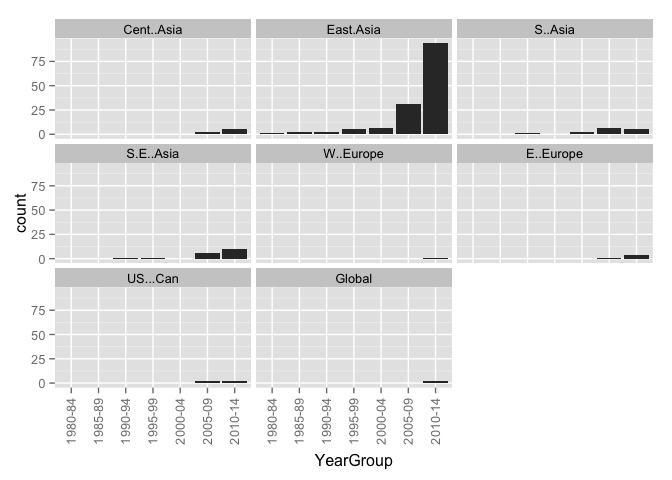 

### Counts for all entries

|        | MENA| Sub.Saharan| Cent..Asia| East.Asia| S..Asia| S.E..Asia| Aus....NZ| W..Europe| E..Europe| US...Can| LAC| Global|
|:-------|----:|-----------:|----------:|---------:|-------:|---------:|---------:|---------:|---------:|--------:|---:|------:|
|1985-89 |    0|           0|          0|         2|       0|         0|         0|         0|         0|        0|   0|      0|
|1990-94 |    0|           0|          0|         3|       1|         1|         0|         0|         0|        0|   0|      0|
|1995-99 |    0|           0|          0|         5|       0|         1|         0|         0|         0|        0|   0|      0|
|2000-04 |    0|           0|          0|         6|       1|         0|         0|         0|         0|        0|   0|      0|
|2005-09 |    0|           0|          2|        29|       5|         5|         0|         0|         1|        1|   0|      0|
|2010-14 |    0|           0|          4|       101|       3|        10|         0|         2|         6|        2|   0|      2|
|unclear |    0|           0|          0|         4|       0|         0|         0|         0|         0|        0|   0|      0|

# _Region by publication type_: 

### Graphs for all entries
 

### Counts for all entries

|                 | MENA| Sub.Saharan| Cent..Asia| East.Asia| S..Asia| S.E..Asia| Aus....NZ| W..Europe| E..Europe| US...Can| LAC| Global|
|:----------------|----:|-----------:|----------:|---------:|-------:|---------:|---------:|---------:|---------:|--------:|---:|------:|
|                 |    0|           0|          0|         0|       0|         0|         0|         0|         0|        0|   0|      0|
|Book             |    0|           0|          3|         1|       1|         1|         0|         0|         1|        0|   0|      0|
|Book Chapter     |    0|           0|          1|         0|       0|         2|         0|         0|         1|        0|   0|      0|
|Discussion Paper |    0|           0|          0|         0|       0|         0|         0|         0|         0|        0|   0|      0|
|Dissertation     |    0|           0|          0|         6|       0|         0|         0|         0|         0|        0|   0|      0|
|Journal Article  |    0|           0|          2|       109|       7|        10|         0|         2|         5|        3|   0|      2|
|Master's Thesis  |    0|           0|          0|        32|       0|         0|         0|         0|         0|        0|   0|      0|
|Report           |    0|           0|          0|         1|       2|         1|         0|         0|         0|        0|   0|      0|
|Working Paper    |    0|           0|          0|         1|       0|         3|         0|         0|         0|        0|   0|      0|

# _Publication type by year group_ for all entries in the database:

### Graphs for all entries
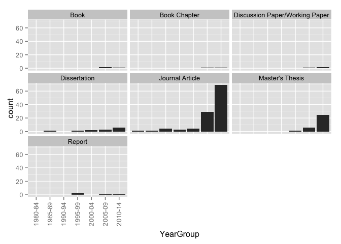 

### Counts for all entries

|        |   | Book| Book Chapter| Discussion Paper| Dissertation| Journal Article| Master's Thesis| Report| Working Paper|
|:-------|--:|----:|------------:|----------------:|------------:|---------------:|---------------:|------:|-------------:|
|1985-89 |  0|    0|            0|                0|            1|               1|               0|      0|             0|
|1990-94 |  0|    0|            0|                0|            0|               5|               0|      0|             0|
|1995-99 |  0|    0|            0|                0|            1|               3|               0|      2|             0|
|2000-04 |  0|    0|            0|                0|            0|               5|               1|      0|             0|
|2005-09 |  0|    2|            1|                0|            1|              28|               5|      1|             1|
|2010-14 |  0|    1|            1|                0|            2|              80|              25|      1|             2|
|unclear |  0|    0|            0|                0|            1|               1|               1|      0|             1|

# _Research type by region_ for all entries in the database

### Graphs for all entries
 

### Counts for all entries

|            | Original emperical| Review of other| Policy analysis| value|
|:-----------|------------------:|---------------:|---------------:|-----:|
|MENA        |                  0|               0|               0|     0|
|Sub.Saharan |                  0|               0|               0|     0|
|Cent..Asia  |                  5|               1|               1|     0|
|East.Asia   |                 87|              72|              11|     0|
|S..Asia     |                  3|               4|               1|     0|
|S.E..Asia   |                 11|               3|               2|     0|
|Aus....NZ   |                  0|               0|               0|     0|
|W..Europe   |                  0|               2|               0|     0|
|E..Europe   |                  4|               3|               1|     0|
|US...Can    |                  0|               1|               2|     0|
|LAC         |                  0|               0|               0|     0|
|Global      |                  2|               0|               0|     0|

# _Research type by year group_ for all entries in the database

### Graphs for all entries
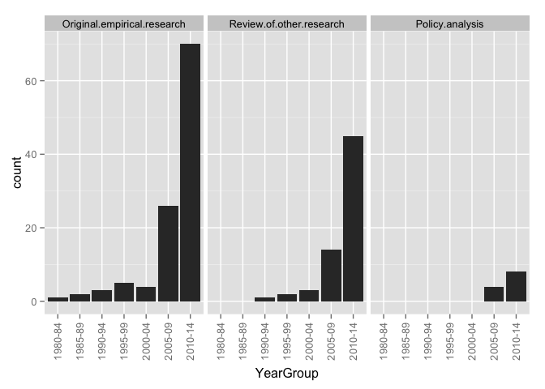 

### Counts for all entries

|        | Original.emperical.research| Review.of.other.research| Policy.analysis|
|:-------|---------------------------:|------------------------:|---------------:|
|1985-89 |                           2|                        0|               0|
|1990-94 |                           4|                        1|               0|
|1995-99 |                           5|                        2|               0|
|2000-04 |                           3|                        4|               0|
|2005-09 |                          22|                       13|               4|
|2010-14 |                          66|                       53|               9|
|unclear |                           1|                        2|               0|

# _Ed levels by region_ 

### Graphs for all entries
 

### Counts for all entries

|            | Pre-primary| Primary| Secondary| Tertiary| value|
|:-----------|-----------:|-------:|---------:|--------:|-----:|
|MENA        |           0|       0|         0|        0|     0|
|Sub.Saharan |           0|       0|         0|        0|     0|
|Cent..Asia  |           0|       4|         5|        0|     0|
|East.Asia   |           6|     103|       122|        3|     0|
|S..Asia     |           2|       7|         8|        0|     0|
|S.E..Asia   |           1|      15|        11|        0|     0|
|Aus....NZ   |           0|       0|         0|        0|     0|
|W..Europe   |           0|       2|         2|        0|     0|
|E..Europe   |           0|       4|         5|        0|     0|
|US...Can    |           0|       2|         3|        0|     0|
|LAC         |           0|       0|         0|        0|     0|
|Global      |           0|       1|         2|        0|     0|

# _Research approach by region_
### Graphs for all entries
 

### Counts for all entries

|            | Single-country| Comparative| value|
|:-----------|--------------:|-----------:|-----:|
|MENA        |              0|           0|     0|
|Sub.Saharan |              0|           0|     0|
|Cent..Asia  |              1|           5|     0|
|East.Asia   |            132|          16|     0|
|S..Asia     |              7|           3|     0|
|S.E..Asia   |             12|           5|     0|
|Aus....NZ   |              0|           0|     0|
|W..Europe   |              0|           2|     0|
|E..Europe   |              0|           7|     0|
|US...Can    |              1|           2|     0|
|LAC         |              0|           0|     0|
|Global      |              1|           1|     0|

# Research approach by year group
### Graphs for all entries
 

### Counts for all entries

|        | Single.country...case| Comparative|
|:-------|---------------------:|-----------:|
|1985-89 |                     2|           0|
|1990-94 |                     5|           0|
|1995-99 |                     5|           1|
|2000-04 |                     4|           2|
|2005-09 |                    35|           3|
|2010-14 |                    97|          14|
|unclear |                     4|           0|

# Research methods by year group
### Graphs for all entries
 

### Counts for all entries

|        |   | Mixed-methods| None or Unclear to us| Qualitative| Quantitative|
|:-------|--:|-------------:|---------------------:|-----------:|------------:|
|1985-89 |  0|             1|                     0|           1|            0|
|1990-94 |  0|             1|                     0|           1|            3|
|1995-99 |  0|             3|                     2|           0|            1|
|2000-04 |  0|             2|                     0|           4|            0|
|2005-09 |  0|             8|                     0|          14|           17|
|2010-14 |  0|            22|                    13|          39|           38|
|unclear |  0|             0|                     0|           1|            3|

# Research methods by region
### Graphs for all entries
 

### Counts for all entries

|            |   | Mixed-methods| None or Unclear to us| Qualitative| Quantitative|
|:-----------|--:|-------------:|---------------------:|-----------:|------------:|
|MENA        |  0|             0|                     0|           0|            0|
|Sub.Saharan |  0|             0|                     0|           0|            0|
|Cent..Asia  |  0|             3|                     0|           2|            1|
|East.Asia   |  0|            28|                    14|          57|           51|
|S..Asia     |  0|             3|                     1|           4|            2|
|S.E..Asia   |  0|             3|                     0|           5|            9|
|Aus....NZ   |  0|             0|                     0|           0|            0|
|W..Europe   |  0|             0|                     1|           1|            0|
|E..Europe   |  0|             2|                     2|           2|            1|
|US...Can    |  0|             0|                     1|           2|            0|
|LAC         |  0|             0|                     0|           0|            0|
|Global      |  0|             0|                     0|           1|            1|

# Research methods by year group
### Graph for all entries
 

### Counts for all entries

|        |   | Mixed-methods| None or Unclear to us| Qualitative| Quantitative|
|:-------|--:|-------------:|---------------------:|-----------:|------------:|
|1985-89 |  0|             1|                     0|           1|            0|
|1990-94 |  0|             1|                     0|           1|            3|
|1995-99 |  0|             3|                     2|           0|            1|
|2000-04 |  0|             2|                     0|           4|            0|
|2005-09 |  0|             8|                     0|          14|           17|
|2010-14 |  0|            22|                    13|          39|           38|
|unclear |  0|             0|                     0|           1|            3|

# Research methods by publication type
### Graph for all entries
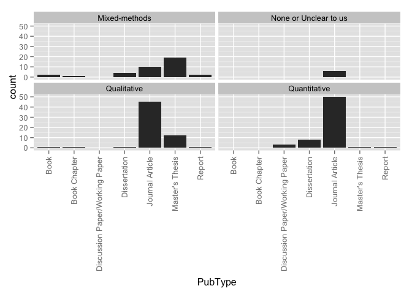 

### Counts for all entries

|                 |   | Mixed-methods| None or Unclear to us| Qualitative| Quantitative|
|:----------------|--:|-------------:|---------------------:|-----------:|------------:|
|                 |  0|             0|                     0|           0|            0|
|Book             |  0|             2|                     0|           1|            0|
|Book Chapter     |  0|             1|                     0|           1|            0|
|Discussion Paper |  0|             0|                     0|           0|            0|
|Dissertation     |  0|             3|                     0|           0|            3|
|Journal Article  |  0|            10|                    15|          46|           52|
|Master's Thesis  |  0|            19|                     0|          12|            1|
|Report           |  0|             2|                     0|           0|            2|
|Working Paper    |  0|             0|                     0|           0|            4|

# Theoreortical framework by region
### Graphs for all entries
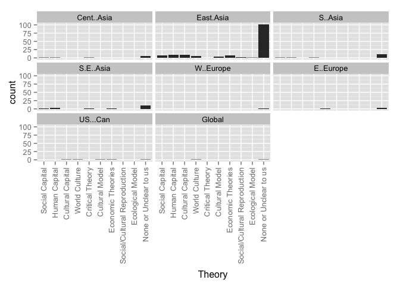 

### Counts for all entries

|                      | MENA| Sub.Saharan| Cent..Asia| East.Asia| S..Asia| S.E..Asia| Aus....NZ| W..Europe| E..Europe| US...Can| LAC| Global|
|:---------------------|----:|-----------:|----------:|---------:|-------:|---------:|---------:|---------:|---------:|--------:|---:|------:|
|Social Capital        |    0|           0|          1|         7|       1|         2|         0|         0|         0|        0|   0|      0|
|Human Capital         |    0|           0|          1|         9|       1|         4|         0|         0|         1|        0|   0|      0|
|Cultural Capital      |    0|           0|          0|         6|       0|         0|         0|         0|         0|        0|   0|      0|
|World Culture         |    0|           0|          0|         1|       1|         0|         0|         0|         0|        1|   0|      1|
|Human Rights          |    0|           0|          0|         1|       0|         1|         0|         0|         0|        0|   0|      0|
|Critical Theory       |    0|           0|          1|         0|       0|         2|         0|         0|         1|        0|   0|      0|
|Political Theory      |    0|           0|          0|         2|       0|         0|         0|         1|         0|        0|   0|      0|
|None or Unclear to us |    0|           0|          4|       106|       8|         9|         0|         1|         5|        1|   0|      1|
|value                 |    0|           0|          0|         0|       0|         0|         0|         0|         0|        0|   0|      0|

# Theoreortical framework by year group
### Graphs for all entries
 

### Counts for all entries

|        | Social.Capital| Human.Capital| Cultural.Capital| World.Culture| Human.Rights| Critical.Theory| Political.Theory| None.or.Unclear.to.us|
|:-------|--------------:|-------------:|----------------:|-------------:|------------:|---------------:|----------------:|---------------------:|
|1985-89 |              0|             0|                0|             0|            0|               0|                0|                     1|
|1990-94 |              1|             0|                0|             0|            0|               0|                0|                     4|
|1995-99 |              0|             0|                0|             0|            0|               0|                0|                     6|
|2000-04 |              0|             0|                2|             0|            0|               0|                0|                     4|
|2005-09 |              3|             2|                0|             0|            1|               0|                0|                    30|
|2010-14 |              4|            10|                4|             2|            1|               2|                2|                    75|
|unclear |              0|             0|                0|             0|            0|               0|                0|                     3|

# Theoretical framework by research method
### Graphs for all entries
 

### Counts for all entries

|                      | Quantitative| Qualitative| Mixed| None.or.unclear|
|:---------------------|------------:|-----------:|-----:|---------------:|
|Social Capital        |            5|           2|     1|               0|
|Human Capital         |            8|           2|     1|               1|
|Cultural Capital      |            2|           1|     3|               0|
|World Culture         |            0|           1|     0|               1|
|Human Rights          |            0|           0|     1|               1|
|Critical Theory       |            0|           1|     1|               0|
|Political Theory      |            0|           0|     0|               2|
|None or Unclear to us |           38|          47|    29|               9|
|value                 |            0|           0|     0|               0|

# Theoretical framework by research approach
### Graphs for all entries
 

### Counts for all entries

|                      | Single.country...case| Comparative|
|:---------------------|---------------------:|-----------:|
|Social Capital        |                     7|           1|
|Human Capital         |                    10|           2|
|Cultural Capital      |                     5|           1|
|World Culture         |                     2|           0|
|Human Rights          |                     2|           0|
|Critical Theory       |                     1|           1|
|Political Theory      |                     1|           1|
|None or Unclear to us |                   109|          12|
|value                 |                     0|           0|

# Framing by region
### Graphs for all entries
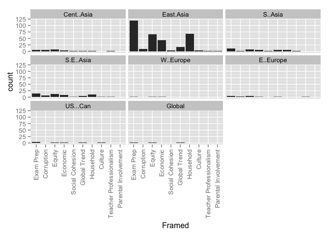 

### Counts for all entries

|                | MENA| Sub.Saharan| Cent..Asia| East.Asia| S..Asia| S.E..Asia| Aus....NZ| W..Europe| E..Europe| US...Can| LAC| Global|
|:---------------|----:|-----------:|----------:|---------:|-------:|---------:|---------:|---------:|---------:|--------:|---:|------:|
|Exam Prep       |    0|           0|          5|       128|       9|        12|         0|         1|         6|        2|   0|      2|
|Corruption      |    0|           0|          5|        11|       1|         5|         0|         0|         4|        0|   0|      0|
|Equity          |    0|           0|          6|        68|       6|        12|         0|         2|         6|        1|   0|      1|
|Economic        |    0|           0|          2|        39|       5|         8|         0|         1|         2|        2|   0|      0|
|Social Cohesion |    0|           0|          1|         4|       1|         1|         0|         0|         0|        0|   0|      0|
|Global Trend    |    0|           0|          1|        15|       5|         4|         0|         0|         3|        1|   0|      2|
|Household       |    0|           0|          1|        63|       5|         9|         0|         0|         0|        0|   0|      0|
|value           |    0|           0|          0|         0|       0|         0|         0|         0|         0|        0|   0|      0|

# Framing by year group
### Graphs for all entries
 

### Counts for all entries

|        | Related.to.curriculum.coverage...ed..quality...exam.prep| Corruption| Equity| Supply...Demand...Economic.Efficiency| X.Social.Cohesion| Global.Trend| Household.Expenditures|
|:-------|--------------------------------------------------------:|----------:|------:|-------------------------------------:|-----------------:|------------:|----------------------:|
|1985-89 |                                                        2|          0|      1|                                     0|                 0|            0|                      0|
|1990-94 |                                                        4|          0|      2|                                     1|                 0|            0|                      2|
|1995-99 |                                                        6|          1|      1|                                     1|                 0|            1|                      3|
|2000-04 |                                                        6|          0|      1|                                     1|                 0|            1|                      2|
|2005-09 |                                                       32|          5|     22|                                    13|                 1|            4|                     22|
|2010-14 |                                                       96|         12|     56|                                    32|                 3|           13|                     42|
|unclear |                                                        2|          0|      2|                                     1|                 0|            1|                      4|

# Framed by research method
### Graphs for all entries
 

### Counts for all entries

|                | Quantitative| Qualitative| Mixed| None.or.unclear|
|:---------------|------------:|-----------:|-----:|---------------:|
|Exam Prep       |           49|          49|    37|              13|
|Corruption      |            3|           6|     7|               2|
|Equity          |           30|          29|    21|               5|
|Economic        |           15|          23|     8|               3|
|Social Cohesion |            0|           3|     1|               0|
|Global Trend    |            8|           7|     2|               3|
|Household       |           40|          15|    19|               1|
|value           |            0|           0|     0|               0|

# Framed by research approach
### Graphs for all entries
 

### Counts for all entries

|                | Single.country...case| Comparative|
|:---------------|---------------------:|-----------:|
|Exam Prep       |                   129|          17|
|Corruption      |                     9|           9|
|Equity          |                    68|          16|
|Economic        |                    43|           6|
|Social Cohesion |                     2|           2|
|Global Trend    |                    12|           8|
|Household       |                    71|           4|
|value           |                     0|           0|

# Framed by theory
### Graphs for all entries
 

### Counts for all entries

|                                                         | Social Capital| Human Capital| Cultural Capital| World Culture| Human Rights| Critical Theory| Political Theory| None or Unclear to us| value|
|:--------------------------------------------------------|--------------:|-------------:|----------------:|-------------:|------------:|---------------:|----------------:|---------------------:|-----:|
|Related.to.curriculum.coverage...ed..quality...exam.prep |              6|             8|                6|             2|            2|               1|                1|                   107|     0|
|Corruption                                               |              1|             2|                0|             0|            1|               1|                0|                    12|     0|
|Equity                                                   |              5|             4|                3|             0|            1|               2|                1|                    58|     0|
|Supply...Demand...Economic.Efficiency                    |              5|             6|                1|             1|            0|               0|                0|                    35|     0|
|X.Social.Cohesion                                        |              2|             1|                0|             0|            0|               0|                0|                     2|     0|
|Global.Trend                                             |              1|             2|                0|             2|            0|               0|                0|                    13|     0|
|Household.Expenditures                                   |              6|             6|                3|             0|            0|               0|                0|                    52|     0|

# How Viewed by region
### Graphs for all entries
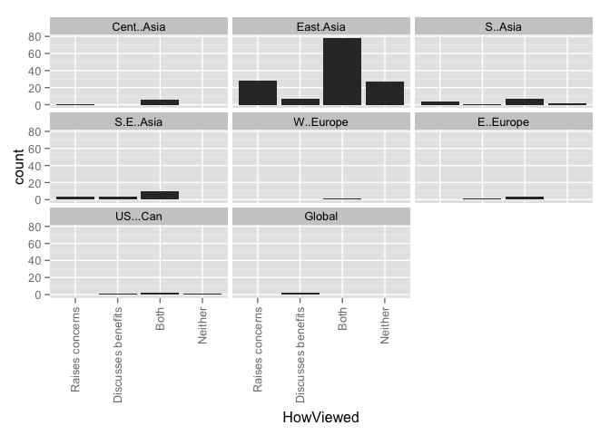 

### Counts for all entries

|                   | MENA| Sub.Saharan| Cent..Asia| East.Asia| S..Asia| S.E..Asia| Aus....NZ| W..Europe| E..Europe| US...Can| LAC| Global|
|:------------------|----:|-----------:|----------:|---------:|-------:|---------:|---------:|---------:|---------:|--------:|---:|------:|
|Raises concerns    |    0|           0|          1|        32|       2|         3|         0|         1|         0|        0|   0|      0|
|Discusses benefits |    0|           0|          0|         8|       1|         3|         0|         0|         1|        1|   0|      2|
|Both               |    0|           0|          4|        82|       5|        10|         0|         1|         5|        1|   0|      0|
|Neither            |    0|           0|          0|        28|       2|         0|         0|         0|         0|        1|   0|      0|
|value              |    0|           0|          0|         0|       0|         0|         0|         0|         0|        0|   0|      0|

# How Viewed by year group
### Graphs for all entries
 

### Counts for all entries

|        | Raises.concerns| Discusses.benefits| Both| Neither|
|:-------|---------------:|------------------:|----:|-------:|
|1985-89 |               0|                  0|    1|       1|
|1990-94 |               0|                  0|    4|       1|
|1995-99 |               2|                  0|    2|       1|
|2000-04 |               2|                  1|    3|       0|
|2005-09 |               3|                  2|   28|       6|
|2010-14 |              29|                  5|   57|      20|
|unclear |               1|                  1|    1|       1|

# HowViewed by research method
### Graphs for all entries
 

### Counts for all entries

|                   | Quantitative| Qualitative| Mixed| None.or.unclear|
|:------------------|------------:|-----------:|-----:|---------------:|
|Raises concerns    |            9|          13|     7|               8|
|Discusses benefits |            4|           4|     1|               0|
|Both               |           38|          33|    20|               5|
|Neither            |           11|          10|     7|               2|
|value              |            0|           0|     0|               0|

# HowViewed by research approach
### Graphs for all entries
 

### Counts for all entries

|                   | Single.country...case| Comparative|
|:------------------|---------------------:|-----------:|
|Raises concerns    |                    33|           4|
|Discusses benefits |                     7|           2|
|Both               |                    81|          13|
|Neither            |                    30|           0|
|value              |                     0|           0|

# HowViewed by theory
### Graphs for all entries
 

### Counts for all entries

|                   | Social Capital| Human Capital| Cultural Capital| World Culture| Human Rights| Critical Theory| Political Theory| None or Unclear to us| value|
|:------------------|--------------:|-------------:|----------------:|-------------:|------------:|---------------:|----------------:|---------------------:|-----:|
|Raises.concerns    |              1|             1|                1|             0|            2|               0|                1|                    27|     0|
|Discusses.benefits |              0|             0|                1|             1|            0|               0|                0|                     7|     0|
|Both               |              6|            10|                3|             0|            0|               2|                1|                    64|     0|
|Neither            |              1|             1|                1|             1|            0|               0|                0|                    23|     0|

# How Viewed by Framed
### Graphs for all entries
 

### Counts for all entries

|                                                         | Raises concerns| Discusses benefits| Both| Neither| value|
|:--------------------------------------------------------|---------------:|------------------:|----:|-------:|-----:|
|Related.to.curriculum.coverage...ed..quality...exam.prep |              31|                  6|   82|      27|     0|
|Corruption                                               |               6|                  0|   11|       0|     0|
|Equity                                                   |              20|                  3|   56|       5|     0|
|Supply...Demand...Economic.Efficiency                    |               8|                  4|   30|       7|     0|
|X.Social.Cohesion                                        |               1|                  0|    3|       0|     0|
|Global.Trend                                             |               4|                  3|   11|       2|     0|
|Household.Expenditures                                   |              12|                  2|   51|       9|     0|

# Stakeholders by region
### Graphs for all entries
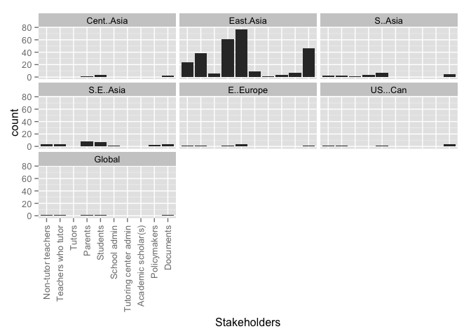 

### Counts for all entries

|                   | MENA| Sub.Saharan| Cent..Asia| East.Asia| S..Asia| S.E..Asia| Aus....NZ| W..Europe| E..Europe| US...Can| LAC| Global|
|:------------------|----:|-----------:|----------:|---------:|-------:|---------:|---------:|---------:|---------:|--------:|---:|------:|
|Non-tutor teachers |    0|           0|          0|        20|       0|         3|         0|         0|         1|        0|   0|      1|
|Teachers who tutor |    0|           0|          0|        36|       0|         4|         0|         0|         1|        0|   0|      1|
|Tutors             |    0|           0|          0|         7|       1|         0|         0|         0|         0|        0|   0|      0|
|Parents            |    0|           0|          1|        56|       3|         8|         0|         0|         1|        0|   0|      1|
|Students           |    0|           0|          4|        77|       3|         7|         0|         0|         4|        0|   0|      1|
|Policymakers       |    0|           0|          0|         6|       0|         2|         0|         0|         0|        0|   0|      0|
|Documents          |    0|           0|          2|        52|       4|         3|         0|         1|         3|        3|   0|      1|
|value              |    0|           0|          0|         0|       0|         0|         0|         0|         0|        0|   0|      0|

# Stakeholders by year group
### Graphs for all entries
 

### Counts for all entries

|        | Teachers.who.do.not.tutor| Teachers.who.tutor| Tutors.who.are.not.teachers| Parents...household| Students| Policymakers| Documents|
|:-------|-------------------------:|------------------:|---------------------------:|-------------------:|--------:|------------:|---------:|
|1985-89 |                         1|                  2|                           0|                   0|        2|            0|         0|
|1990-94 |                         0|                  0|                           1|                   1|        4|            0|         1|
|1995-99 |                         2|                  2|                           0|                   2|        2|            2|         1|
|2000-04 |                         2|                  3|                           2|                   3|        3|            1|         2|
|2005-09 |                         5|                  8|                           1|                  16|       23|            1|        11|
|2010-14 |                        11|                 23|                           4|                  42|       53|            4|        40|
|unclear |                         0|                  0|                           0|                   2|        2|            0|         1|

# Stakeholders by theory
### Graphs for all entries
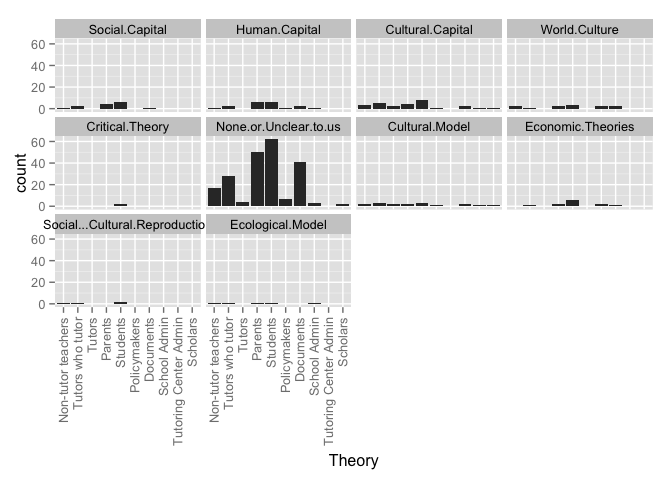 

### Counts for all entries

|                      | Non-tutor teachers| Tutors who tutor| Tutors| Parents| Students| Policymakers| Documents| value|
|:---------------------|------------------:|----------------:|------:|-------:|--------:|------------:|---------:|-----:|
|Social.Capital        |                  0|                1|      0|       3|        5|            0|         2|     0|
|Human.Capital         |                  1|                1|      0|       5|        5|            1|         3|     0|
|Cultural.Capital      |                  1|                3|      2|       4|        5|            1|         0|     0|
|World.Culture         |                  0|                0|      0|       0|        0|            0|         2|     0|
|Human.Rights          |                  0|                1|      0|       0|        0|            0|         1|     0|
|Critical.Theory       |                  0|                0|      0|       0|        2|            0|         0|     0|
|Political.Theory      |                  0|                0|      0|       0|        0|            0|         2|     0|
|None.or.Unclear.to.us |                 14|               27|      5|      47|       60|            6|        42|     0|

# WhatTaught by region
### Graphs for all entries
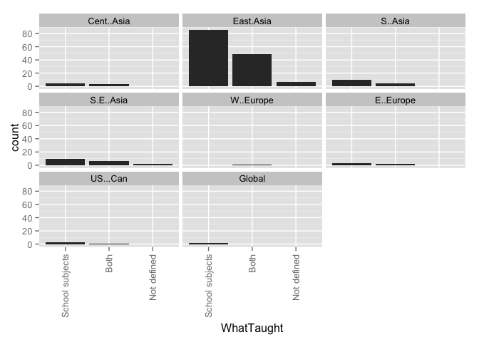 

### Counts for all entries

|                 | MENA| Sub.Saharan| Cent..Asia| East.Asia| S..Asia| S.E..Asia| Aus....NZ| W..Europe| E..Europe| US...Can| LAC| Global|
|:----------------|----:|-----------:|----------:|---------:|-------:|---------:|---------:|---------:|---------:|--------:|---:|------:|
|School subjects  |    0|           0|          4|        91|       8|        10|         0|         1|         5|        2|   0|      2|
|Extracurriculars |    0|           0|          0|         0|       0|         0|         0|         0|         0|        0|   0|      0|
|Both             |    0|           0|          2|        52|       2|         5|         0|         1|         2|        1|   0|      0|
|Not defined      |    0|           0|          0|         7|       0|         2|         0|         0|         0|        0|   0|      0|
|value            |    0|           0|          0|         0|       0|         0|         0|         0|         0|        0|   0|      0|

WhatTaught by year group
### Graphs for all entries
 

### Counts for all entries

|        | Subjects.taught.in.school| Extracurricular.activities| Both| Not.defined|
|:-------|-------------------------:|--------------------------:|----:|-----------:|
|1985-89 |                         2|                          0|    0|           0|
|1990-94 |                         4|                          0|    1|           0|
|1995-99 |                         4|                          0|    2|           0|
|2000-04 |                         4|                          0|    2|           0|
|2005-09 |                        24|                          0|   13|           2|
|2010-14 |                        69|                          0|   36|           7|
|unclear |                         3|                          0|    1|           0|

# WhatTaught by theory
### Graphs for all entries
 

### Counts for all entries

|                      | School subjects| Extracurriculars| Both| Not defined| value|
|:---------------------|---------------:|----------------:|----:|-----------:|-----:|
|Social.Capital        |               4|                0|    3|           1|     0|
|Human.Capital         |               9|                0|    2|           1|     0|
|Cultural.Capital      |               4|                0|    2|           0|     0|
|World.Culture         |               2|                0|    0|           0|     0|
|Human.Rights          |               2|                0|    0|           0|     0|
|Critical.Theory       |               1|                0|    1|           0|     0|
|Political.Theory      |               1|                0|    1|           0|     0|
|None.or.Unclear.to.us |              72|                0|   43|           8|     0|

# WhereOccur by region
### Graphs for all entries
 

### Counts for all entries

|                  | MENA| Sub.Saharan| Cent..Asia| East.Asia| S..Asia| S.E..Asia| Aus....NZ| W..Europe| E..Europe| US...Can| LAC| Global|
|:-----------------|----:|-----------:|----------:|---------:|-------:|---------:|---------:|---------:|---------:|--------:|---:|------:|
|On school grounds |    0|           0|          5|        26|       2|         8|         0|         0|         4|        1|   0|      0|
|Designated center |    0|           0|          1|        65|       4|         6|         0|         0|         2|        1|   0|      2|
|Web               |    0|           0|          1|        19|       2|         2|         0|         0|         0|        1|   0|      0|
|Student's home    |    0|           0|          5|        41|       5|         6|         0|         0|         3|        1|   0|      0|
|Outside school    |    0|           0|          4|        45|       5|         4|         0|         0|         4|        1|   0|      0|
|Not defined       |    0|           0|          1|        76|       4|         7|         0|         2|         2|        1|   0|      0|
|value             |    0|           0|          0|         0|       0|         0|         0|         0|         0|        0|   0|      0|

# WhereOccur by year group
### Graphs for all entries
 

### Counts for all entries

|        | On.school.grounds| Designated.tutoring.center.or.franchise| On.line...via.web| In.the.student.s.home| Other.outside.school| Not.defined|
|:-------|-----------------:|---------------------------------------:|-----------------:|---------------------:|--------------------:|-----------:|
|1985-89 |                 0|                                       0|                 0|                     0|                    0|           2|
|1990-94 |                 0|                                       3|                 0|                     3|                    3|           1|
|1995-99 |                 2|                                       3|                 0|                     0|                    1|           3|
|2000-04 |                 2|                                       2|                 0|                     3|                    3|           2|
|2005-09 |                 8|                                      10|                 3|                    11|                   12|          25|
|2010-14 |                24|                                      54|                18|                    34|                   36|          49|
|unclear |                 0|                                       0|                 0|                     0|                    0|           4|

# WhereOccur by theory
### Graphs for all entries
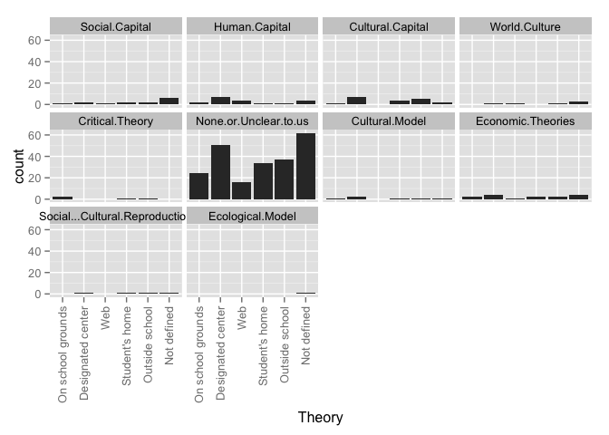 

### Counts for all entries

|                      | On school grounds| Designated center| Web| Student's home| Outside school| Not defined| value|
|:---------------------|-----------------:|-----------------:|---:|--------------:|--------------:|-----------:|-----:|
|Social.Capital        |                 1|                 2|   1|              2|              1|           6|     0|
|Human.Capital         |                 3|                 8|   3|              2|              3|           4|     0|
|Cultural.Capital      |                 1|                 6|   0|              3|              3|           0|     0|
|World.Culture         |                 0|                 1|   1|              0|              0|           0|     0|
|Human.Rights          |                 2|                 1|   0|              1|              1|           0|     0|
|Critical.Theory       |                 2|                 0|   0|              1|              1|           0|     0|
|Political.Theory      |                 1|                 1|   0|              1|              1|           1|     0|
|None.or.Unclear.to.us |                22|                48|  15|             37|             38|          66|     0|

# WhoProvides by region
### Graphs for all entries
 

### Counts for all entries

|                | MENA| Sub.Saharan| Cent..Asia| East.Asia| S..Asia| S.E..Asia| Aus....NZ| W..Europe| E..Europe| US...Can| LAC| Global|
|:---------------|----:|-----------:|----------:|---------:|-------:|---------:|---------:|---------:|---------:|--------:|---:|------:|
|Current teacher |    0|           0|          1|        31|       5|         7|         0|         1|         3|        0|   0|      1|
|Other k-12      |    0|           0|          5|        63|       7|         8|         0|         1|         6|        0|   0|      1|
|Retired teacher |    0|           0|          1|        16|       4|         2|         0|         1|         2|        0|   0|      0|
|Univ. faculty   |    0|           0|          2|         6|       3|         2|         0|         0|         3|        0|   0|      0|
|Professional    |    0|           0|          1|        58|       5|         6|         0|         0|         1|        0|   0|      1|
|Col. student    |    0|           0|          1|        32|       3|         2|         0|         0|         2|        0|   0|      0|
|Peer            |    0|           0|          1|         2|       4|         1|         0|         0|         0|        0|   0|      0|
|Family          |    0|           0|          1|         4|       3|         1|         0|         0|         0|        0|   0|      0|
|Community       |    0|           0|          1|         1|       5|         1|         0|         0|         0|        0|   0|      0|
|Not defined     |    0|           0|          1|        63|       3|         7|         0|         1|         1|        3|   0|      1|
|value           |    0|           0|          0|         0|       0|         0|         0|         0|         0|        0|   0|      0|

# WhoProvides by year group
### Graphs for all entries
 

### Counts for all entries

|        | Current.classroom.teacher| Other.K.12.teachers| Retired.teacher| University.faculty| Institution...Professional.tutor| College.student| Peer.classmate| Parent.or.family.member| Community.member...volunteer| Not.defined|
|:-------|-------------------------:|-------------------:|---------------:|------------------:|--------------------------------:|---------------:|--------------:|-----------------------:|----------------------------:|-----------:|
|1985-89 |                         1|                   1|               1|                  0|                                0|               1|              0|                       0|                            0|           1|
|1990-94 |                         0|                   1|               0|                  0|                                3|               0|              0|                       1|                            1|           1|
|1995-99 |                         3|                   3|               0|                  0|                                3|               0|              0|                       0|                            0|           1|
|2000-04 |                         1|                   5|               2|                  0|                                3|               1|              0|                       1|                            0|           1|
|2005-09 |                         7|                  15|               4|                  4|                                9|               6|              3|                       1|                            3|          22|
|2010-14 |                        27|                  49|              13|                  6|                               45|              26|              2|                       3|                            1|          45|
|unclear |                         0|                   2|               0|                  0|                                2|               1|              0|                       0|                            0|           1|

# WhoProvides by theory
### Graphs for all entries
 

### Counts for all entries

|                      | Current teacher| Other k-12| Retired teacher| Univ. faculty| Professional| Col. student| Peer| Family| Community| Not defined| value|
|:---------------------|---------------:|----------:|---------------:|-------------:|------------:|------------:|----:|------:|---------:|-----------:|-----:|
|Social.Capital        |               1|          1|               1|             1|            2|            1|    1|      1|         1|           6|     0|
|Human.Capital         |               4|          5|               3|             2|            3|            4|    1|      1|         1|           7|     0|
|Cultural.Capital      |               1|          4|               2|             0|            4|            1|    0|      0|         0|           1|     0|
|World.Culture         |               0|          0|               0|             0|            0|            0|    0|      0|         0|           2|     0|
|Human.Rights          |               1|          1|               1|             0|            1|            0|    0|      0|         0|           0|     0|
|Critical.Theory       |               0|          1|               0|             0|            0|            0|    0|      0|         0|           0|     0|
|Political.Theory      |               2|          2|               2|             1|            1|            0|    0|      0|         0|           0|     0|
|None.or.Unclear.to.us |              27|         56|              11|             6|           48|           26|    3|      5|         4|          49|     0|

# DoesCharge by region
### Graphs for all entries
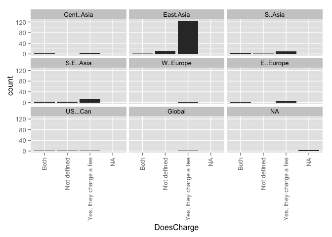 

### Counts for all entries

|                             | MENA| Sub.Saharan| Cent..Asia| East.Asia| S..Asia| S.E..Asia| Aus....NZ| W..Europe| E..Europe| US...Can| LAC| Global|
|:----------------------------|----:|-----------:|----------:|---------:|-------:|---------:|---------:|---------:|---------:|--------:|---:|------:|
|                             |    0|           0|          0|         0|       0|         0|         0|         0|         0|        0|   0|      0|
|Both                         |    0|           0|          1|         3|       4|         2|         0|         0|         1|        1|   0|      0|
|No, they do not charge a fee |    0|           0|          0|         0|       0|         0|         0|         0|         0|        0|   0|      0|
|Not defined                  |    0|           0|          0|        13|       1|         2|         0|         0|         1|        1|   0|      0|
|Yes, they charge a fee       |    0|           0|          5|       130|       5|        13|         0|         2|         5|        1|   0|      2|

# DoesCharge by year group
### Graphs for all entries
 

### Counts for all entries

|        |   | Both| No, they do not charge a fee| Not defined| Yes, they charge a fee|
|:-------|--:|----:|----------------------------:|-----------:|----------------------:|
|1985-89 |  0|    0|                            0|           0|                      2|
|1990-94 |  0|    0|                            0|           0|                      5|
|1995-99 |  0|    0|                            0|           1|                      5|
|2000-04 |  0|    1|                            0|           2|                      3|
|2005-09 |  0|    2|                            0|           3|                     34|
|2010-14 |  0|    5|                            0|           8|                     95|
|unclear |  0|    0|                            0|           0|                      4|

# DoesCharge by WhoProvides
### Graphs for all entries
 

### Counts for all entries

|                             | Current.classroom.teacher| Other.K.12.teachers| Retired.teacher| University.faculty| Institution...Professional.tutor| College.student| Peer.classmate| Parent.or.family.member| Community.member...volunteer| Not.defined|
|:----------------------------|-------------------------:|-------------------:|---------------:|------------------:|--------------------------------:|---------------:|--------------:|-----------------------:|----------------------------:|-----------:|
|                             |                         0|                   0|               0|                  0|                                0|               0|              0|                       0|                            0|           0|
|Both                         |                         4|                   6|               2|                  2|                                3|               1|              2|                       1|                            2|           1|
|No, they do not charge a fee |                         0|                   0|               0|                  0|                                0|               0|              0|                       0|                            0|           0|
|Not defined                  |                         4|                   4|               2|                  1|                                1|               1|              0|                       1|                            0|           9|
|Yes, they charge a fee       |                        31|                  66|              16|                  7|                               61|              33|              3|                       4|                            3|          58|

# ClassSize by Region
### Graphs for all entries
 

### Counts for all entries

|                              | MENA| Sub.Saharan| Cent..Asia| East.Asia| S..Asia| S.E..Asia| Aus....NZ| W..Europe| E..Europe| US...Can| LAC| Global|
|:-----------------------------|----:|-----------:|----------:|---------:|-------:|---------:|---------:|---------:|---------:|--------:|---:|------:|
|                              |    0|           0|          0|         0|       0|         0|         0|         0|         0|        0|   0|      0|
|Individual 1-on-1 instruction |    0|           0|          0|         1|       0|         0|         0|         0|         0|        0|   0|      0|
|Large groups                  |    0|           0|          0|         0|       0|         0|         0|         0|         0|        0|   0|      0|
|Small groups                  |    0|           0|          0|         0|       1|         0|         0|         0|         0|        0|   0|      0|
|Unclear                       |    0|           0|          1|        63|       2|         5|         0|         2|         1|        1|   0|      0|
|Various class sizes discussed |    0|           0|          5|        85|       7|        12|         0|         0|         6|        2|   0|      2|

# OperationSize by region
### Graphs for all entries
 

### Counts for all entries

|            | MENA| Sub.Saharan| Cent..Asia| East.Asia| S..Asia| S.E..Asia| Aus....NZ| W..Europe| E..Europe| US...Can| LAC| Global|
|:-----------|----:|-----------:|----------:|---------:|-------:|---------:|---------:|---------:|---------:|--------:|---:|------:|
|Individual  |    0|           0|          0|         4|       1|         3|         0|         0|         0|        0|   0|      0|
|Small firms |    0|           0|          0|         7|       0|         1|         0|         0|         0|        0|   0|      0|
|Large firm  |    0|           0|          0|         5|       0|         0|         0|         0|         0|        0|   0|      0|
|Various     |    0|           0|          6|        98|       6|        11|         0|         1|         7|        2|   0|      2|
|value       |    0|           0|          0|         0|       0|         0|         0|         0|         0|        0|   0|      0|

# Why Taking by region
### Graphs for all entries
 

### Counts for all entries

|                              | MENA| Sub.Saharan| Cent..Asia| East.Asia| S..Asia| S.E..Asia| Aus....NZ| W..Europe| E..Europe| US...Can| LAC| Global|
|:-----------------------------|----:|-----------:|----------:|---------:|-------:|---------:|---------:|---------:|---------:|--------:|---:|------:|
|Student falls behind          |    0|           0|          0|         0|       0|         0|         0|         0|         0|        0|   0|      0|
|Preparation for exams         |    0|           0|          5|       138|      10|        11|         0|         2|         6|        3|   0|      2|
|Make up for perceived failure |    0|           0|          6|        90|       9|        12|         0|         2|         6|        3|   0|      2|
|For cultural reasons          |    0|           0|          1|        58|       4|         6|         0|         0|         1|        1|   0|      0|
|Enrichment activities         |    0|           0|          1|        23|       2|         3|         0|         0|         0|        1|   0|      0|
|Peer pressure                 |    0|           0|          1|        15|       1|         1|         0|         0|         0|        0|   0|      0|
|Teacher pressure              |    0|           0|          1|        11|       2|         3|         0|         0|         0|        0|   0|      0|
|Not stated or unclear         |    0|           0|          0|         0|       0|         1|         0|         0|         0|        0|   0|      0|
|value                         |    0|           0|          0|         0|       0|         0|         0|         0|         0|        0|   0|      0|

# Why Taking by year group
### Graphs for all entries
 

### Counts for all entries

|        | Student.falls.behind.and.needs.extra.help| Preparation.for.exams.to.make.student.more.competitive| Make.up.for.perceived.failure.in.the.mainstream.system...school| For.cultural.reasons| To.provide.extra.enrichment.activities| Peer.pressure| Teacher.pressure| Not.stated.or.unclear|
|:-------|-----------------------------------------:|------------------------------------------------------:|---------------------------------------------------------------:|--------------------:|--------------------------------------:|-------------:|----------------:|---------------------:|
|1985-89 |                                         0|                                                      2|                                                               0|                    0|                                      0|             1|                1|                     0|
|1990-94 |                                         0|                                                      5|                                                               3|                    0|                                      0|             0|                1|                     0|
|1995-99 |                                         0|                                                      4|                                                               1|                    1|                                      0|             0|                1|                     1|
|2000-04 |                                         0|                                                      5|                                                               4|                    3|                                      1|             1|                0|                     0|
|2005-09 |                                         0|                                                     31|                                                              29|                   12|                                      7|             2|                1|                     0|
|2010-14 |                                         0|                                                    105|                                                              68|                   46|                                     15|            10|                9|                     0|
|unclear |                                         0|                                                      4|                                                               3|                    1|                                      1|             1|                0|                     0|

# WhyTaking by research method
### Graphs for all entries
 

### Counts for all entries

|                              | Quantitative| Qualitative| Mixed| None.or.unclear|
|:-----------------------------|------------:|-----------:|-----:|---------------:|
|Student falls behind          |            0|           0|     0|               0|
|Preparation for exams         |           55|          52|    35|              14|
|Make up for perceived failure |           37|          37|    23|              11|
|For cultural reasons          |           17|          26|    17|               3|
|Enrichment activities         |            9|           9|     3|               3|
|Peer pressure                 |            6|           4|     5|               0|
|Teacher pressure              |            4|           5|     4|               0|
|Not stated or unclear         |            0|           0|     1|               0|
|value                         |            0|           0|     0|               0|

# WhyTaking by research approach
### Graphs for all entries
 

### Counts for all entries

|                              | Single.country...case| Comparative|
|:-----------------------------|---------------------:|-----------:|
|Student falls behind          |                     0|           0|
|Preparation for exams         |                   136|          19|
|Make up for perceived failure |                    92|          16|
|For cultural reasons          |                    55|           8|
|Enrichment activities         |                    21|           3|
|Peer pressure                 |                    14|           1|
|Teacher pressure              |                     9|           4|
|Not stated or unclear         |                     1|           0|
|value                         |                     0|           0|

# WhyTaking by theory
### Graphs for all entries
 

### Counts for all entries

|                              | Social.Capital| Human.Capital| Cultural.Capital| World.Culture| Human.Rights| Critical.Theory| Political.Theory| None.or.Unclear.to.us|
|:-----------------------------|--------------:|-------------:|----------------:|-------------:|------------:|---------------:|----------------:|---------------------:|
|Student falls behind          |              0|             0|                0|             0|            0|               0|                0|                     0|
|Preparation for exams         |              6|            11|                6|             2|            1|               1|                2|                   109|
|Make up for perceived failure |              5|            11|                4|             2|            1|               2|                2|                    71|
|For cultural reasons          |              3|             5|                5|             0|            0|               0|                0|                    46|
|Enrichment activities         |              1|             2|                1|             0|            1|               0|                1|                    16|
|Peer pressure                 |              1|             1|                1|             0|            0|               0|                0|                    11|
|Teacher pressure              |              1|             1|                0|             0|            0|               0|                0|                    10|
|Not stated or unclear         |              0|             0|                0|             0|            0|               0|                0|                     1|
|value                         |              8|            12|                6|             2|            2|               2|                2|                   123|

# Why Taking by Framed
### Graphs for all entries
 

### Counts for all entries

|                                                         | Student falls behind| Preparation for exams| Make up for perceived failure| For cultural reasons| Enrichment activities| Peer pressure| Teacher pressure| Not stated or unclear| value|
|:--------------------------------------------------------|--------------------:|---------------------:|-----------------------------:|--------------------:|---------------------:|-------------:|----------------:|---------------------:|-----:|
|Related.to.curriculum.coverage...ed..quality...exam.prep |                    0|                   137|                            95|                   56|                    21|            14|               13|                     1|     0|
|Corruption                                               |                    0|                    15|                            10|                    8|                     3|             3|                6|                     0|     0|
|Equity                                                   |                    0|                    76|                            62|                   33|                    11|             6|                9|                     0|     0|
|Supply...Demand...Economic.Efficiency                    |                    0|                    43|                            32|                   23|                     5|             4|                4|                     0|     0|
|X.Social.Cohesion                                        |                    0|                     4|                             4|                    3|                     1|             1|                1|                     0|     0|
|Global.Trend                                             |                    0|                    18|                            13|                    8|                     3|             3|                6|                     0|     0|
|Household.Expenditures                                   |                    0|                    66|                            46|                   32|                    10|             9|                8|                     1|     0|
