# Relationships for All Chinese-language Articles

### TOTAL NUMBER OF ARTICLES: 119
Document was last updated on 2014-09-12 09:55:27.

# _Region by year group_ for all entries in the database:

### Graphs for all entries
 

### Counts for all entries

|        | MENA| Sub.Saharan| Cent..Asia| East.Asia| S..Asia| S.E..Asia| Aus....NZ| W..Europe| E..Europe| US...Can| LAC| Global|
|:-------|----:|-----------:|----------:|---------:|-------:|---------:|---------:|---------:|---------:|--------:|---:|------:|
|1995-99 |    0|           0|          0|         2|       0|         0|         0|         0|         0|        0|   0|      0|
|2000-04 |    0|           0|          0|         3|       0|         0|         0|         0|         0|        0|   0|      0|
|2005-09 |    0|           0|          0|        22|       0|         0|         0|         0|         0|        0|   0|      3|
|2010-14 |    0|           0|          0|        70|       0|         0|         0|         3|         4|        2|   0|     14|
|unclear |    0|           0|          0|         2|       0|         0|         0|         0|         0|        0|   0|      0|

# _Region by publication type_: 

### Graphs for all entries
 

### Counts for all entries

|                 | MENA| Sub.Saharan| Cent..Asia| East.Asia| S..Asia| S.E..Asia| Aus....NZ| W..Europe| E..Europe| US...Can| LAC| Global|
|:----------------|----:|-----------:|----------:|---------:|-------:|---------:|---------:|---------:|---------:|--------:|---:|------:|
|                 |    0|           0|          0|         0|       0|         0|         0|         0|         0|        0|   0|      0|
|Book             |    0|           0|          0|         0|       0|         0|         0|         0|         0|        0|   0|      0|
|Book Chapter     |    0|           0|          0|         0|       0|         0|         0|         0|         0|        0|   0|      0|
|Discussion Paper |    0|           0|          0|         0|       0|         0|         0|         0|         0|        0|   0|      0|
|Dissertation     |    0|           0|          0|         0|       0|         0|         0|         0|         0|        0|   0|      0|
|Journal Article  |    0|           0|          0|        67|       0|         0|         0|         3|         4|        2|   0|     17|
|Master's Thesis  |    0|           0|          0|        32|       0|         0|         0|         0|         0|        0|   0|      0|
|Report           |    0|           0|          0|         0|       0|         0|         0|         0|         0|        0|   0|      0|
|Working Paper    |    0|           0|          0|         0|       0|         0|         0|         0|         0|        0|   0|      0|

# _Publication type by year group_ for all entries in the database:

### Graphs for all entries
 

### Counts for all entries

|        |   | Book| Book Chapter| Discussion Paper| Dissertation| Journal Article| Master's Thesis| Report| Working Paper|
|:-------|--:|----:|------------:|----------------:|------------:|---------------:|---------------:|------:|-------------:|
|1995-99 |  0|    0|            0|                0|            0|               2|               0|      0|             0|
|2000-04 |  0|    0|            0|                0|            0|               2|               1|      0|             0|
|2005-09 |  0|    0|            0|                0|            0|              20|               5|      0|             0|
|2010-14 |  0|    0|            0|                0|            0|              62|              25|      0|             0|
|unclear |  0|    0|            0|                0|            0|               1|               1|      0|             0|

# _Research type by region_ for all entries in the database

### Graphs for all entries
 

### Counts for all entries

|            | Original emperical| Review of other| Policy analysis| value|
|:-----------|------------------:|---------------:|---------------:|-----:|
|MENA        |                  0|               0|               0|     0|
|Sub.Saharan |                  0|               0|               0|     0|
|Cent..Asia  |                  0|               0|               0|     0|
|East.Asia   |                 50|              62|               5|     0|
|S..Asia     |                  0|               0|               0|     0|
|S.E..Asia   |                  0|               0|               0|     0|
|Aus....NZ   |                  0|               0|               0|     0|
|W..Europe   |                  0|               3|               0|     0|
|E..Europe   |                  0|               4|               0|     0|
|US...Can    |                  0|               2|               0|     0|
|LAC         |                  0|               0|               0|     0|
|Global      |                  0|              17|               0|     0|

# _Research type by year group_ for all entries in the database

### Graphs for all entries
 

### Counts for all entries

|        | Original.emperical.research| Review.of.other.research| Policy.analysis|
|:-------|---------------------------:|------------------------:|---------------:|
|1995-99 |                           1|                        1|               0|
|2000-04 |                           1|                        3|               0|
|2005-09 |                          11|                       15|               1|
|2010-14 |                          36|                       62|               4|
|unclear |                           1|                        1|               0|

# _Ed levels by region_ 

### Graphs for all entries
 

### Counts for all entries

|            | Pre-primary| Primary| Secondary| Tertiary| value|
|:-----------|-----------:|-------:|---------:|--------:|-----:|
|MENA        |           0|       0|         0|        0|     0|
|Sub.Saharan |           0|       0|         0|        0|     0|
|Cent..Asia  |           0|       0|         0|        0|     0|
|East.Asia   |           4|      77|        73|        2|     0|
|S..Asia     |           0|       0|         0|        0|     0|
|S.E..Asia   |           0|       0|         0|        0|     0|
|Aus....NZ   |           0|       0|         0|        0|     0|
|W..Europe   |           0|       3|         3|        0|     0|
|E..Europe   |           0|       3|         3|        0|     0|
|US...Can    |           0|       2|         2|        0|     0|
|LAC         |           0|       0|         0|        0|     0|
|Global      |           0|      16|        16|        0|     0|

# _Research approach by region_
### Graphs for all entries
 

### Counts for all entries

|            | Single-country| Comparative| value|
|:-----------|--------------:|-----------:|-----:|
|MENA        |              0|           0|     0|
|Sub.Saharan |              0|           0|     0|
|Cent..Asia  |              0|           0|     0|
|East.Asia   |             91|           6|     0|
|S..Asia     |              0|           0|     0|
|S.E..Asia   |              0|           0|     0|
|Aus....NZ   |              0|           0|     0|
|W..Europe   |              0|           3|     0|
|E..Europe   |              0|           4|     0|
|US...Can    |              2|           0|     0|
|LAC         |              0|           0|     0|
|Global      |              0|          17|     0|

# Research approach by year group
### Graphs for all entries
 

### Counts for all entries

|        | Single.country...case| Comparative|
|:-------|---------------------:|-----------:|
|1995-99 |                     2|           0|
|2000-04 |                     3|           0|
|2005-09 |                    21|           3|
|2010-14 |                    65|          21|
|unclear |                     2|           0|

# Research methods by year group
### Graphs for all entries
 

### Counts for all entries

|        |   | Mixed-methods| None or Unclear to us| Qualitative| Quantitative|
|:-------|--:|-------------:|---------------------:|-----------:|------------:|
|1995-99 |  0|             0|                     1|           0|            1|
|2000-04 |  0|             1|                     0|           2|            0|
|2005-09 |  0|             3|                     0|          12|           10|
|2010-14 |  0|            15|                    18|          38|           16|
|unclear |  0|             0|                     0|           1|            1|

# Research methods by region
### Graphs for all entries
 

### Counts for all entries

|            |   | Mixed-methods| None or Unclear to us| Qualitative| Quantitative|
|:-----------|--:|-------------:|---------------------:|-----------:|------------:|
|MENA        |  0|             0|                     0|           0|            0|
|Sub.Saharan |  0|             0|                     0|           0|            0|
|Cent..Asia  |  0|             0|                     0|           0|            0|
|East.Asia   |  0|            19|                    12|          40|           28|
|S..Asia     |  0|             0|                     0|           0|            0|
|S.E..Asia   |  0|             0|                     0|           0|            0|
|Aus....NZ   |  0|             0|                     0|           0|            0|
|W..Europe   |  0|             0|                     1|           2|            0|
|E..Europe   |  0|             0|                     2|           2|            0|
|US...Can    |  0|             0|                     1|           1|            0|
|LAC         |  0|             0|                     0|           0|            0|
|Global      |  0|             0|                     6|          11|            0|

# Research methods by year group
### Graph for all entries
 

### Counts for all entries

|        |   | Mixed-methods| None or Unclear to us| Qualitative| Quantitative|
|:-------|--:|-------------:|---------------------:|-----------:|------------:|
|1995-99 |  0|             0|                     1|           0|            1|
|2000-04 |  0|             1|                     0|           2|            0|
|2005-09 |  0|             3|                     0|          12|           10|
|2010-14 |  0|            15|                    18|          38|           16|
|unclear |  0|             0|                     0|           1|            1|

# Research methods by publication type
### Graph for all entries
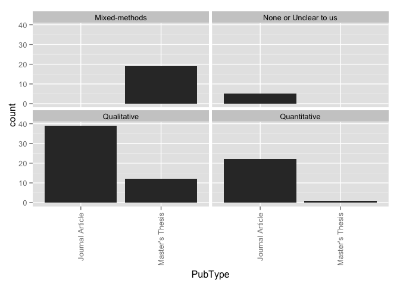 

### Counts for all entries

|                 |   | Mixed-methods| None or Unclear to us| Qualitative| Quantitative|
|:----------------|--:|-------------:|---------------------:|-----------:|------------:|
|                 |  0|             0|                     0|           0|            0|
|Book             |  0|             0|                     0|           0|            0|
|Book Chapter     |  0|             0|                     0|           0|            0|
|Discussion Paper |  0|             0|                     0|           0|            0|
|Dissertation     |  0|             0|                     0|           0|            0|
|Journal Article  |  0|             0|                    19|          41|           27|
|Master's Thesis  |  0|            19|                     0|          12|            1|
|Report           |  0|             0|                     0|           0|            0|
|Working Paper    |  0|             0|                     0|           0|            0|

# Theoreortical framework by region
### Graphs for all entries
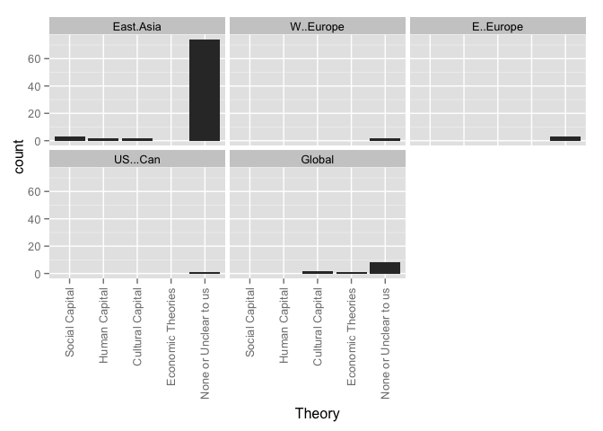 

### Counts for all entries

|                      | MENA| Sub.Saharan| Cent..Asia| East.Asia| S..Asia| S.E..Asia| Aus....NZ| W..Europe| E..Europe| US...Can| LAC| Global|
|:---------------------|----:|-----------:|----------:|---------:|-------:|---------:|---------:|---------:|---------:|--------:|---:|------:|
|Social Capital        |    0|           0|          0|         3|       0|         0|         0|         0|         0|        0|   0|      0|
|Human Capital         |    0|           0|          0|         4|       0|         0|         0|         0|         1|        0|   0|      1|
|Cultural Capital      |    0|           0|          0|         2|       0|         0|         0|         0|         0|        0|   0|      4|
|World Culture         |    0|           0|          0|         0|       0|         0|         0|         0|         0|        0|   0|      3|
|Human Rights          |    0|           0|          0|         1|       0|         0|         0|         0|         0|        0|   0|      1|
|Critical Theory       |    0|           0|          0|         0|       0|         0|         0|         0|         0|        0|   0|      0|
|Political Theory      |    0|           0|          0|         2|       0|         0|         0|         1|         0|        0|   0|      0|
|None or Unclear to us |    0|           0|          0|        81|       0|         0|         0|         2|         3|        2|   0|      8|
|value                 |    0|           0|          0|         0|       0|         0|         0|         0|         0|        0|   0|      0|

# Theoreortical framework by year group
### Graphs for all entries
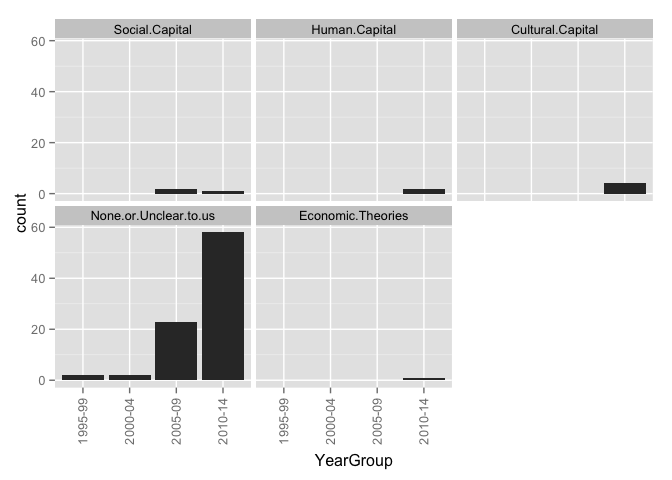 

### Counts for all entries

|        | Social.Capital| Human.Capital| Cultural.Capital| World.Culture| Human.Rights| Critical.Theory| Political.Theory| None.or.Unclear.to.us|
|:-------|--------------:|-------------:|----------------:|-------------:|------------:|---------------:|----------------:|---------------------:|
|1995-99 |              0|             0|                0|             0|            0|               0|                0|                     2|
|2000-04 |              0|             0|                0|             0|            0|               0|                0|                     3|
|2005-09 |              2|             0|                0|             0|            0|               0|                0|                    22|
|2010-14 |              1|             5|                6|             3|            2|               0|                2|                    63|
|unclear |              0|             0|                0|             0|            0|               0|                0|                     2|

# Theoretical framework by research method
### Graphs for all entries
 

### Counts for all entries

|                      | Quantitative| Qualitative| Mixed| None.or.unclear|
|:---------------------|------------:|-----------:|-----:|---------------:|
|Social Capital        |            2|           0|     1|               0|
|Human Capital         |            1|           1|     1|               2|
|Cultural Capital      |            0|           2|     2|               2|
|World Culture         |            0|           0|     0|               3|
|Human Rights          |            0|           0|     0|               2|
|Critical Theory       |            0|           0|     0|               0|
|Political Theory      |            0|           0|     0|               2|
|None or Unclear to us |           22|          46|    15|               9|
|value                 |            0|           0|     0|               0|

# Theoretical framework by research approach
### Graphs for all entries
 

### Counts for all entries

|                      | Single.country...case| Comparative|
|:---------------------|---------------------:|-----------:|
|Social Capital        |                     3|           0|
|Human Capital         |                     3|           2|
|Cultural Capital      |                     2|           4|
|World Culture         |                     0|           3|
|Human Rights          |                     1|           1|
|Critical Theory       |                     0|           0|
|Political Theory      |                     1|           1|
|None or Unclear to us |                    77|          13|
|value                 |                     0|           0|

# Framing by region
### Graphs for all entries
 

### Counts for all entries

|                | MENA| Sub.Saharan| Cent..Asia| East.Asia| S..Asia| S.E..Asia| Aus....NZ| W..Europe| E..Europe| US...Can| LAC| Global|
|:---------------|----:|-----------:|----------:|---------:|-------:|---------:|---------:|---------:|---------:|--------:|---:|------:|
|Exam Prep       |    0|           0|          0|        86|       0|         0|         0|         2|         4|        2|   0|     17|
|Corruption      |    0|           0|          0|         6|       0|         0|         0|         0|         2|        0|   0|      3|
|Equity          |    0|           0|          0|        46|       0|         0|         0|         3|         3|        0|   0|     10|
|Economic        |    0|           0|          0|        20|       0|         0|         0|         2|         3|        0|   0|      5|
|Social Cohesion |    0|           0|          0|         1|       0|         0|         0|         0|         0|        0|   0|      1|
|Global Trend    |    0|           0|          0|         5|       0|         0|         0|         0|         2|        0|   0|      7|
|Household       |    0|           0|          0|        43|       0|         0|         0|         1|         1|        0|   0|      4|
|value           |    0|           0|          0|         0|       0|         0|         0|         0|         0|        0|   0|      0|

# Framing by year group
### Graphs for all entries
 

### Counts for all entries

|        | Related.to.curriculum.coverage...ed..quality...exam.prep| Corruption| Equity| Supply...Demand...Economic.Efficiency| X.Social.Cohesion| Global.Trend| Household.Expenditures|
|:-------|--------------------------------------------------------:|----------:|------:|-------------------------------------:|-----------------:|------------:|----------------------:|
|1995-99 |                                                        2|          0|      0|                                     1|                 0|            0|                      1|
|2000-04 |                                                        3|          0|      0|                                     0|                 0|            0|                      1|
|2005-09 |                                                       22|          2|     15|                                     6|                 1|            2|                     15|
|2010-14 |                                                       78|          7|     41|                                    18|                 1|           10|                     29|
|unclear |                                                        1|          0|      1|                                     1|                 0|            0|                      2|

# Framed by research method
### Graphs for all entries
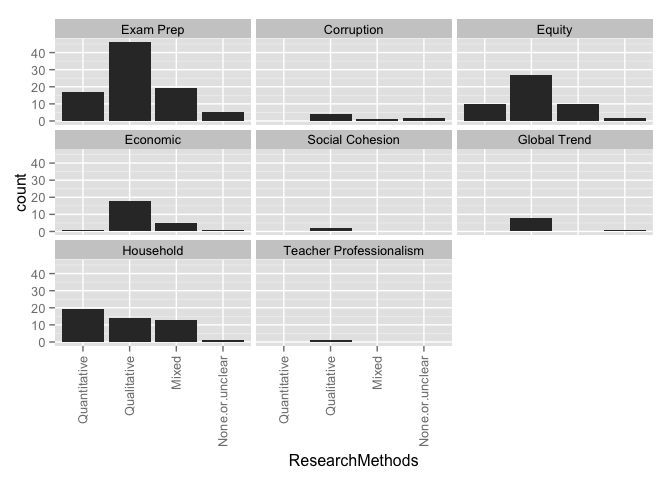 

### Counts for all entries

|                | Quantitative| Qualitative| Mixed| None.or.unclear|
|:---------------|------------:|-----------:|-----:|---------------:|
|Exam Prep       |           22|          48|    19|              17|
|Corruption      |            0|           4|     1|               4|
|Equity          |           11|          28|    12|               6|
|Economic        |            1|          19|     5|               1|
|Social Cohesion |            0|           2|     0|               0|
|Global Trend    |            0|           8|     0|               4|
|Household       |           19|          15|    13|               1|
|value           |            0|           0|     0|               0|

# Framed by research approach
### Graphs for all entries
 

### Counts for all entries

|                | Single.country...case| Comparative|
|:---------------|---------------------:|-----------:|
|Exam Prep       |                    81|          23|
|Corruption      |                     3|           6|
|Equity          |                    40|          16|
|Economic        |                    16|          10|
|Social Cohesion |                     1|           1|
|Global Trend    |                     1|          11|
|Household       |                    41|           7|
|value           |                     0|           0|

# Framed by theory
### Graphs for all entries
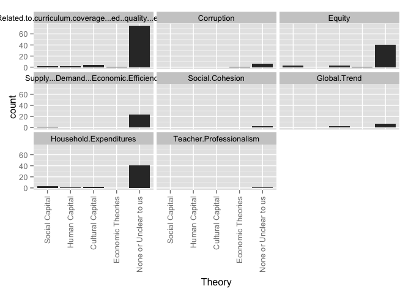 

### Counts for all entries

|                                                         | Social Capital| Human Capital| Cultural Capital| World Culture| Human Rights| Critical Theory| Political Theory| None or Unclear to us| value|
|:--------------------------------------------------------|--------------:|-------------:|----------------:|-------------:|------------:|---------------:|----------------:|---------------------:|-----:|
|Related.to.curriculum.coverage...ed..quality...exam.prep |              2|             5|                6|             3|            2|               0|                1|                    83|     0|
|Corruption                                               |              0|             1|                0|             1|            0|               0|                0|                     6|     0|
|Equity                                                   |              3|             2|                3|             1|            1|               0|                1|                    42|     0|
|Supply...Demand...Economic.Efficiency                    |              1|             0|                0|             0|            0|               0|                0|                    24|     0|
|X.Social.Cohesion                                        |              0|             0|                0|             0|            0|               0|                0|                     2|     0|
|Global.Trend                                             |              0|             1|                2|             2|            0|               0|                0|                     6|     0|
|Household.Expenditures                                   |              3|             1|                2|             0|            0|               0|                0|                    39|     0|

# How Viewed by region
### Graphs for all entries
 

### Counts for all entries

|                   | MENA| Sub.Saharan| Cent..Asia| East.Asia| S..Asia| S.E..Asia| Aus....NZ| W..Europe| E..Europe| US...Can| LAC| Global|
|:------------------|----:|-----------:|----------:|---------:|-------:|---------:|---------:|---------:|---------:|--------:|---:|------:|
|Raises concerns    |    0|           0|          0|        24|       0|         0|         0|         1|         0|        0|   0|      1|
|Discusses benefits |    0|           0|          0|         2|       0|         0|         0|         0|         0|        1|   0|      0|
|Both               |    0|           0|          0|        56|       0|         0|         0|         2|         4|        0|   0|     12|
|Neither            |    0|           0|          0|        17|       0|         0|         0|         0|         0|        1|   0|      4|
|value              |    0|           0|          0|         0|       0|         0|         0|         0|         0|        0|   0|      0|

# How Viewed by year group
### Graphs for all entries
 

### Counts for all entries

|        | Raises.concerns| Discusses.benefits| Both| Neither|
|:-------|---------------:|------------------:|----:|-------:|
|1995-99 |               1|                  0|    1|       0|
|2000-04 |               1|                  1|    1|       0|
|2005-09 |               0|                  0|   22|       3|
|2010-14 |              23|                  1|   44|      19|
|unclear |               0|                  1|    1|       0|

# HowViewed by research method
### Graphs for all entries
 

### Counts for all entries

|                   | Quantitative| Qualitative| Mixed| None.or.unclear|
|:------------------|------------:|-----------:|-----:|---------------:|
|Raises concerns    |            4|           9|     4|               8|
|Discusses benefits |            1|           1|     0|               1|
|Both               |           19|          31|    12|               7|
|Neither            |            4|          12|     3|               3|
|value              |            0|           0|     0|               0|

# HowViewed by research approach
### Graphs for all entries
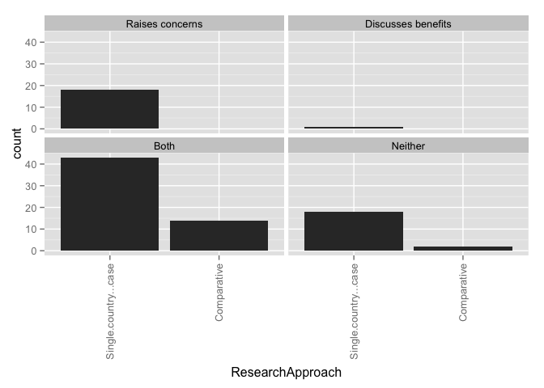 

### Counts for all entries

|                   | Single.country...case| Comparative|
|:------------------|---------------------:|-----------:|
|Raises concerns    |                    23|           2|
|Discusses benefits |                     3|           0|
|Both               |                    49|          18|
|Neither            |                    18|           4|
|value              |                     0|           0|

# HowViewed by theory
### Graphs for all entries
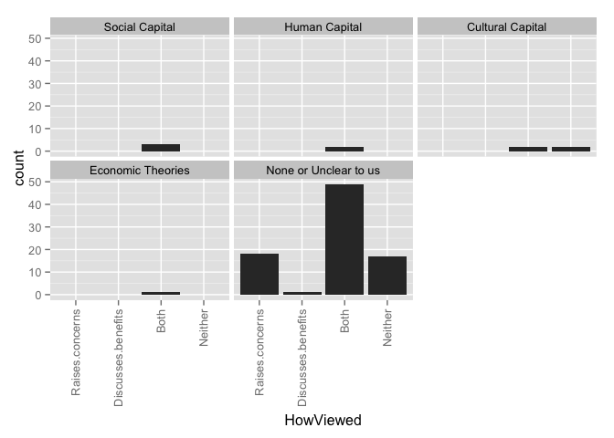 

### Counts for all entries

|                   | Social Capital| Human Capital| Cultural Capital| World Culture| Human Rights| Critical Theory| Political Theory| None or Unclear to us| value|
|:------------------|--------------:|-------------:|----------------:|-------------:|------------:|---------------:|----------------:|---------------------:|-----:|
|Raises.concerns    |              0|             0|                0|             1|            1|               0|                1|                    20|     0|
|Discusses.benefits |              0|             0|                0|             0|            0|               0|                0|                     3|     0|
|Both               |              3|             5|                2|             2|            1|               0|                1|                    52|     0|
|Neither            |              0|             0|                4|             0|            0|               0|                0|                    17|     0|

# How Viewed by Framed
### Graphs for all entries
 

### Counts for all entries

|                                                         | Raises concerns| Discusses benefits| Both| Neither| value|
|:--------------------------------------------------------|---------------:|------------------:|----:|-------:|-----:|
|Related.to.curriculum.coverage...ed..quality...exam.prep |              20|                  2|   65|      19|     0|
|Corruption                                               |               1|                  0|    8|       0|     0|
|Equity                                                   |              11|                  0|   41|       5|     0|
|Supply...Demand...Economic.Efficiency                    |               2|                  0|   21|       3|     0|
|X.Social.Cohesion                                        |               0|                  0|    2|       0|     0|
|Global.Trend                                             |               1|                  0|    9|       2|     0|
|Household.Expenditures                                   |               6|                  1|   36|       5|     0|

# Stakeholders by region
### Graphs for all entries
 

### Counts for all entries

|                   | MENA| Sub.Saharan| Cent..Asia| East.Asia| S..Asia| S.E..Asia| Aus....NZ| W..Europe| E..Europe| US...Can| LAC| Global|
|:------------------|----:|-----------:|----------:|---------:|-------:|---------:|---------:|---------:|---------:|--------:|---:|------:|
|Non-tutor teachers |    0|           0|          0|        10|       0|         0|         0|         0|         0|        0|   0|      0|
|Teachers who tutor |    0|           0|          0|        24|       0|         0|         0|         0|         0|        1|   0|      0|
|Tutors             |    0|           0|          0|         3|       0|         0|         0|         0|         0|        0|   0|      0|
|Parents            |    0|           0|          0|        41|       0|         0|         0|         0|         0|        0|   0|      0|
|Students           |    0|           0|          0|        51|       0|         0|         0|         0|         0|        0|   0|      0|
|Policymakers       |    0|           0|          0|         4|       0|         0|         0|         0|         0|        0|   0|      0|
|Documents          |    0|           0|          0|        42|       0|         0|         0|         2|         3|        1|   0|     15|
|value              |    0|           0|          0|         0|       0|         0|         0|         0|         0|        0|   0|      0|

# Stakeholders by year group
### Graphs for all entries
 

### Counts for all entries

|        | Teachers.who.do.not.tutor| Teachers.who.tutor| Tutors.who.are.not.teachers| Parents...household| Students| Policymakers| Documents|
|:-------|-------------------------:|------------------:|---------------------------:|-------------------:|--------:|------------:|---------:|
|1995-99 |                         1|                  1|                           0|                   1|        1|            0|         1|
|2000-04 |                         1|                  1|                           0|                   1|        1|            0|         2|
|2005-09 |                         2|                  4|                           0|                  10|       13|            0|        10|
|2010-14 |                         6|                 19|                           3|                  28|       35|            4|        45|
|unclear |                         0|                  0|                           0|                   1|        1|            0|         1|

# Stakeholders by theory
### Graphs for all entries
 

### Counts for all entries

|                      | Non-tutor teachers| Tutors who tutor| Tutors| Parents| Students| Policymakers| Documents| value|
|:---------------------|------------------:|----------------:|------:|-------:|--------:|------------:|---------:|-----:|
|Social.Capital        |                  0|                1|      0|       2|        3|            0|         0|     0|
|Human.Capital         |                  1|                1|      0|       1|        2|            0|         3|     0|
|Cultural.Capital      |                  0|                1|      0|       2|        2|            0|         4|     0|
|World.Culture         |                  0|                0|      0|       0|        0|            0|         3|     0|
|Human.Rights          |                  0|                0|      0|       0|        0|            0|         2|     0|
|Critical.Theory       |                  0|                0|      0|       0|        0|            0|         0|     0|
|Political.Theory      |                  0|                0|      0|       0|        0|            0|         2|     0|
|None.or.Unclear.to.us |                  9|               21|      3|      33|       40|            4|        43|     0|

# WhatTaught by region
### Graphs for all entries
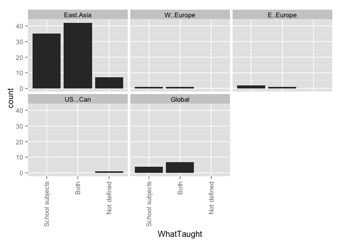 

### Counts for all entries

|                 | MENA| Sub.Saharan| Cent..Asia| East.Asia| S..Asia| S.E..Asia| Aus....NZ| W..Europe| E..Europe| US...Can| LAC| Global|
|:----------------|----:|-----------:|----------:|---------:|-------:|---------:|---------:|---------:|---------:|--------:|---:|------:|
|School subjects  |    0|           0|          0|        45|       0|         0|         0|         2|         3|        1|   0|      6|
|Extracurriculars |    0|           0|          0|         0|       0|         0|         0|         0|         0|        0|   0|      0|
|Both             |    0|           0|          0|        47|       0|         0|         0|         1|         1|        0|   0|     11|
|Not defined      |    0|           0|          0|         7|       0|         0|         0|         0|         0|        1|   0|      0|
|value            |    0|           0|          0|         0|       0|         0|         0|         0|         0|        0|   0|      0|

WhatTaught by year group
### Graphs for all entries
 

### Counts for all entries

|        | Subjects.taught.in.school| Extracurricular.activities| Both| Not.defined|
|:-------|-------------------------:|--------------------------:|----:|-----------:|
|1995-99 |                         1|                          0|    1|           0|
|2000-04 |                         1|                          0|    2|           0|
|2005-09 |                        11|                          0|   13|           1|
|2010-14 |                        39|                          0|   41|           7|
|unclear |                         1|                          0|    1|           0|

# WhatTaught by theory
### Graphs for all entries
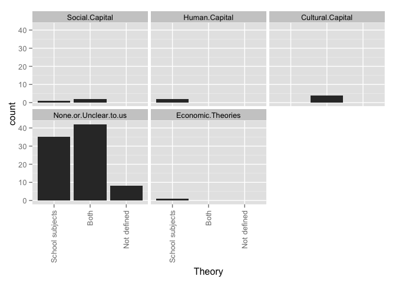 

### Counts for all entries

|                      | School subjects| Extracurriculars| Both| Not defined| value|
|:---------------------|---------------:|----------------:|----:|-----------:|-----:|
|Social.Capital        |               1|                0|    2|           0|     0|
|Human.Capital         |               3|                0|    2|           0|     0|
|Cultural.Capital      |               0|                0|    6|           0|     0|
|World.Culture         |               2|                0|    1|           0|     0|
|Human.Rights          |               1|                0|    1|           0|     0|
|Critical.Theory       |               0|                0|    0|           0|     0|
|Political.Theory      |               1|                0|    1|           0|     0|
|None.or.Unclear.to.us |              40|                0|   44|           8|     0|

# WhereOccur by region
### Graphs for all entries
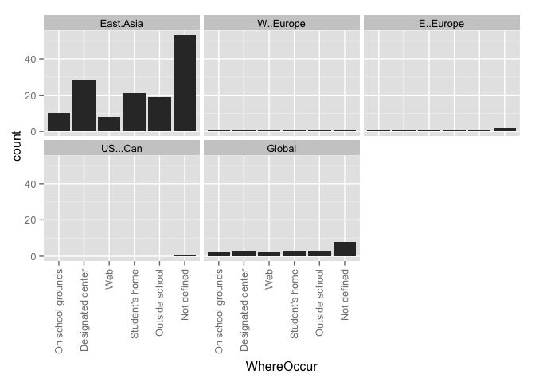 

### Counts for all entries

|                  | MENA| Sub.Saharan| Cent..Asia| East.Asia| S..Asia| S.E..Asia| Aus....NZ| W..Europe| E..Europe| US...Can| LAC| Global|
|:-----------------|----:|-----------:|----------:|---------:|-------:|---------:|---------:|---------:|---------:|--------:|---:|------:|
|On school grounds |    0|           0|          0|        16|       0|         0|         0|         1|         2|        0|   0|      5|
|Designated center |    0|           0|          0|        36|       0|         0|         0|         1|         2|        0|   0|      7|
|Web               |    0|           0|          0|         8|       0|         0|         0|         1|         1|        0|   0|      3|
|Student's home    |    0|           0|          0|        27|       0|         0|         0|         1|         1|        0|   0|      8|
|Outside school    |    0|           0|          0|        27|       0|         0|         0|         1|         2|        0|   0|      7|
|Not defined       |    0|           0|          0|        60|       0|         0|         0|         2|         2|        2|   0|      9|
|value             |    0|           0|          0|         0|       0|         0|         0|         0|         0|        0|   0|      0|

# WhereOccur by year group
### Graphs for all entries
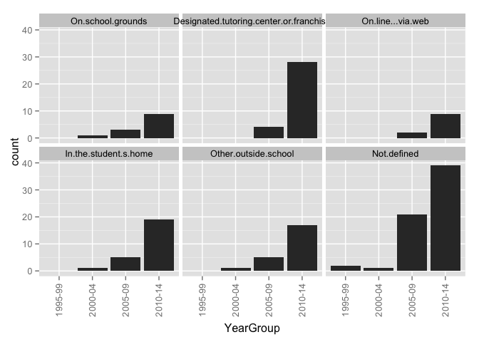 

### Counts for all entries

|        | On.school.grounds| Designated.tutoring.center.or.franchise| On.line...via.web| In.the.student.s.home| Other.outside.school| Not.defined|
|:-------|-----------------:|---------------------------------------:|-----------------:|---------------------:|--------------------:|-----------:|
|1995-99 |                 0|                                       0|                 0|                     0|                    0|           2|
|2000-04 |                 1|                                       0|                 0|                     1|                    1|           2|
|2005-09 |                 3|                                       5|                 2|                     6|                    6|          19|
|2010-14 |                18|                                      39|                10|                    29|                   28|          46|
|unclear |                 0|                                       0|                 0|                     0|                    0|           2|

# WhereOccur by theory
### Graphs for all entries
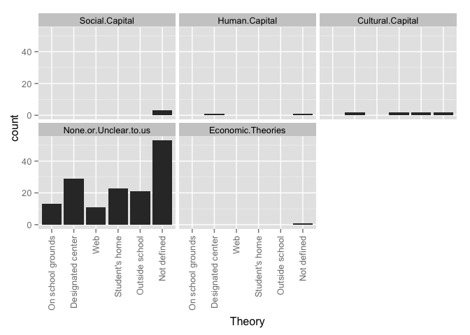 

### Counts for all entries

|                      | On school grounds| Designated center| Web| Student's home| Outside school| Not defined| value|
|:---------------------|-----------------:|-----------------:|---:|--------------:|--------------:|-----------:|-----:|
|Social.Capital        |                 0|                 0|   0|              0|              0|           3|     0|
|Human.Capital         |                 2|                 4|   0|              1|              3|           1|     0|
|Cultural.Capital      |                 1|                 4|   0|              4|              3|           2|     0|
|World.Culture         |                 2|                 2|   1|              3|              3|           0|     0|
|Human.Rights          |                 2|                 2|   0|              2|              2|           0|     0|
|Critical.Theory       |                 0|                 0|   0|              0|              0|           0|     0|
|Political.Theory      |                 1|                 1|   0|              1|              1|           1|     0|
|None.or.Unclear.to.us |                13|                30|  10|             24|             22|          59|     0|

# WhoProvides by region
### Graphs for all entries
 

### Counts for all entries

|                | MENA| Sub.Saharan| Cent..Asia| East.Asia| S..Asia| S.E..Asia| Aus....NZ| W..Europe| E..Europe| US...Can| LAC| Global|
|:---------------|----:|-----------:|----------:|---------:|-------:|---------:|---------:|---------:|---------:|--------:|---:|------:|
|Current teacher |    0|           0|          0|        19|       0|         0|         0|         1|         2|        0|   0|      6|
|Other k-12      |    0|           0|          0|        49|       0|         0|         0|         2|         3|        0|   0|     13|
|Retired teacher |    0|           0|          0|         9|       0|         0|         0|         1|         2|        0|   0|      5|
|Univ. faculty   |    0|           0|          0|         3|       0|         0|         0|         0|         2|        0|   0|      1|
|Professional    |    0|           0|          0|        38|       0|         0|         0|         1|         1|        0|   0|     10|
|Col. student    |    0|           0|          0|        24|       0|         0|         0|         1|         3|        0|   0|      9|
|Peer            |    0|           0|          0|         0|       0|         0|         0|         0|         0|        0|   0|      0|
|Family          |    0|           0|          0|         2|       0|         0|         0|         0|         0|        0|   0|      0|
|Community       |    0|           0|          0|         0|       0|         0|         0|         0|         0|        2|   0|      2|
|Not defined     |    0|           0|          0|        44|       0|         0|         0|         1|         1|        0|   0|      4|
|value           |    0|           0|          0|         0|       0|         0|         0|         0|         0|        0|   0|      0|

# WhoProvides by year group
### Graphs for all entries
 

### Counts for all entries

|        | Current.classroom.teacher| Other.K.12.teachers| Retired.teacher| University.faculty| Institution...Professional.tutor| College.student| Peer.classmate| Parent.or.family.member| Community.member...volunteer| Not.defined|
|:-------|-------------------------:|-------------------:|---------------:|------------------:|--------------------------------:|---------------:|--------------:|-----------------------:|----------------------------:|-----------:|
|1995-99 |                         1|                   1|               0|                  0|                                0|               0|              0|                       0|                            0|           1|
|2000-04 |                         0|                   2|               0|                  0|                                1|               1|              0|                       1|                            0|           1|
|2005-09 |                         2|                  11|               1|                  0|                                7|               6|              0|                       0|                            0|          14|
|2010-14 |                        22|                  47|              13|                  4|                               40|              26|              0|                       1|                            4|          32|
|unclear |                         0|                   2|               0|                  0|                                1|               1|              0|                       0|                            0|           0|

# WhoProvides by theory
### Graphs for all entries
 

### Counts for all entries

|                      | Current teacher| Other k-12| Retired teacher| Univ. faculty| Professional| Col. student| Peer| Family| Community| Not defined| value|
|:---------------------|---------------:|----------:|---------------:|-------------:|------------:|------------:|----:|------:|---------:|-----------:|-----:|
|Social.Capital        |               0|          0|               0|             0|            0|            0|    0|      0|         0|           3|     0|
|Human.Capital         |               2|          3|               2|             1|            3|            4|    0|      0|         1|           1|     0|
|Cultural.Capital      |               2|          4|               2|             0|            2|            1|    0|      0|         0|           2|     0|
|World.Culture         |               3|          3|               3|             1|            2|            3|    0|      0|         1|           0|     0|
|Human.Rights          |               2|          2|               2|             0|            2|            1|    0|      0|         1|           0|     0|
|Critical.Theory       |               0|          0|               0|             0|            0|            0|    0|      0|         0|           0|     0|
|Political.Theory      |               2|          2|               2|             1|            1|            0|    0|      0|         0|           0|     0|
|None.or.Unclear.to.us |              14|         45|               5|             1|           36|           24|    0|      2|         3|          40|     0|

# DoesCharge by region
### Graphs for all entries
 

### Counts for all entries

|                             | MENA| Sub.Saharan| Cent..Asia| East.Asia| S..Asia| S.E..Asia| Aus....NZ| W..Europe| E..Europe| US...Can| LAC| Global|
|:----------------------------|----:|-----------:|----------:|---------:|-------:|---------:|---------:|---------:|---------:|--------:|---:|------:|
|                             |    0|           0|          0|         0|       0|         0|         0|         0|         0|        0|   0|      0|
|Both                         |    0|           0|          0|         2|       0|         0|         0|         0|         0|        0|   0|      2|
|No, they do not charge a fee |    0|           0|          0|         0|       0|         0|         0|         0|         0|        2|   0|      0|
|Not defined                  |    0|           0|          0|         9|       0|         0|         0|         0|         1|        0|   0|      3|
|Yes, they charge a fee       |    0|           0|          0|        84|       0|         0|         0|         3|         3|        0|   0|     12|

# DoesCharge by year group
### Graphs for all entries
 

### Counts for all entries

|        |   | Both| No, they do not charge a fee| Not defined| Yes, they charge a fee|
|:-------|--:|----:|----------------------------:|-----------:|----------------------:|
|1995-99 |  0|    0|                            0|           1|                      1|
|2000-04 |  0|    0|                            0|           2|                      1|
|2005-09 |  0|    0|                            0|           1|                     24|
|2010-14 |  0|    4|                            2|           8|                     69|
|unclear |  0|    0|                            0|           0|                      2|

# DoesCharge by WhoProvides
### Graphs for all entries
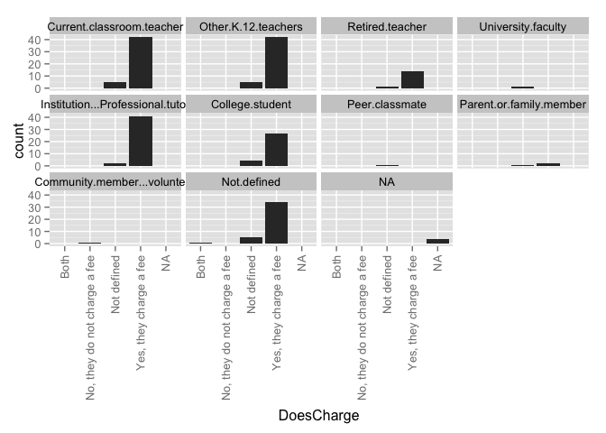 

### Counts for all entries

|                             | Current.classroom.teacher| Other.K.12.teachers| Retired.teacher| University.faculty| Institution...Professional.tutor| College.student| Peer.classmate| Parent.or.family.member| Community.member...volunteer| Not.defined|
|:----------------------------|-------------------------:|-------------------:|---------------:|------------------:|--------------------------------:|---------------:|--------------:|-----------------------:|----------------------------:|-----------:|
|                             |                         0|                   0|               0|                  0|                                0|               0|              0|                       0|                            0|           0|
|Both                         |                         3|                   3|               2|                  1|                                2|               1|              0|                       0|                            1|           1|
|No, they do not charge a fee |                         0|                   0|               0|                  0|                                0|               0|              0|                       0|                            2|           0|
|Not defined                  |                         3|                   6|               2|                  1|                                3|               3|              0|                       1|                            0|           6|
|Yes, they charge a fee       |                        19|                  54|              10|                  2|                               44|              30|              0|                       1|                            1|          37|

# ClassSize by Region
### Graphs for all entries
 

### Counts for all entries

|                              | MENA| Sub.Saharan| Cent..Asia| East.Asia| S..Asia| S.E..Asia| Aus....NZ| W..Europe| E..Europe| US...Can| LAC| Global|
|:-----------------------------|----:|-----------:|----------:|---------:|-------:|---------:|---------:|---------:|---------:|--------:|---:|------:|
|                              |    0|           0|          0|         0|       0|         0|         0|         0|         0|        0|   0|      0|
|Individual 1-on-1 instruction |    0|           0|          0|         1|       0|         0|         0|         0|         0|        0|   0|      0|
|Large groups                  |    0|           0|          0|         0|       0|         0|         0|         0|         0|        0|   0|      0|
|Small groups                  |    0|           0|          0|         0|       0|         0|         0|         0|         0|        0|   0|      0|
|Unclear                       |    0|           0|          0|        51|       0|         0|         0|         2|         1|        1|   0|      7|
|Various class sizes discussed |    0|           0|          0|        47|       0|         0|         0|         1|         3|        1|   0|     10|

# OperationSize by region
### Graphs for all entries
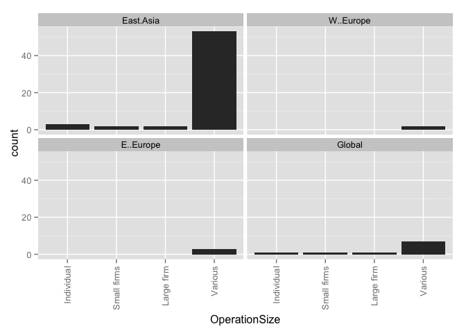 

### Counts for all entries

|            | MENA| Sub.Saharan| Cent..Asia| East.Asia| S..Asia| S.E..Asia| Aus....NZ| W..Europe| E..Europe| US...Can| LAC| Global|
|:-----------|----:|-----------:|----------:|---------:|-------:|---------:|---------:|---------:|---------:|--------:|---:|------:|
|Individual  |    0|           0|          0|         3|       0|         0|         0|         0|         0|        0|   0|      2|
|Small firms |    0|           0|          0|         2|       0|         0|         0|         0|         0|        0|   0|      2|
|Large firm  |    0|           0|          0|         2|       0|         0|         0|         0|         0|        0|   0|      2|
|Various     |    0|           0|          0|        61|       0|         0|         0|         2|         4|        1|   0|     13|
|value       |    0|           0|          0|         0|       0|         0|         0|         0|         0|        0|   0|      0|

# Why Taking by region
### Graphs for all entries
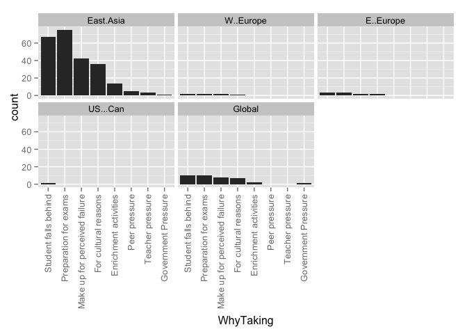 

### Counts for all entries

|                              | MENA| Sub.Saharan| Cent..Asia| East.Asia| S..Asia| S.E..Asia| Aus....NZ| W..Europe| E..Europe| US...Can| LAC| Global|
|:-----------------------------|----:|-----------:|----------:|---------:|-------:|---------:|---------:|---------:|---------:|--------:|---:|------:|
|Student falls behind          |    0|           0|          0|         0|       0|         0|         0|         0|         0|        0|   0|      0|
|Preparation for exams         |    0|           0|          0|        89|       0|         0|         0|         3|         4|        1|   0|     16|
|Make up for perceived failure |    0|           0|          0|        54|       0|         0|         0|         3|         3|        1|   0|     14|
|For cultural reasons          |    0|           0|          0|        37|       0|         0|         0|         1|         2|        0|   0|      8|
|Enrichment activities         |    0|           0|          0|        18|       0|         0|         0|         0|         0|        0|   0|      4|
|Peer pressure                 |    0|           0|          0|         6|       0|         0|         0|         0|         0|        0|   0|      0|
|Teacher pressure              |    0|           0|          0|         4|       0|         0|         0|         0|         0|        0|   0|      0|
|Not stated or unclear         |    0|           0|          0|         0|       0|         0|         0|         0|         0|        0|   0|      1|
|value                         |    0|           0|          0|         0|       0|         0|         0|         0|         0|        0|   0|      0|

# Why Taking by year group
### Graphs for all entries
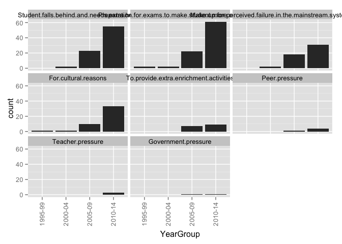 

### Counts for all entries

|        | Student.falls.behind.and.needs.extra.help| Preparation.for.exams.to.make.student.more.competitive| Make.up.for.perceived.failure.in.the.mainstream.system...school| For.cultural.reasons| To.provide.extra.enrichment.activities| Peer.pressure| Teacher.pressure| Not.stated.or.unclear|
|:-------|-----------------------------------------:|------------------------------------------------------:|---------------------------------------------------------------:|--------------------:|--------------------------------------:|-------------:|----------------:|---------------------:|
|1995-99 |                                         0|                                                      2|                                                               0|                    1|                                      0|             0|                0|                     0|
|2000-04 |                                         0|                                                      2|                                                               2|                    1|                                      1|             0|                0|                     0|
|2005-09 |                                         0|                                                     21|                                                              18|                   10|                                      6|             1|                0|                     0|
|2010-14 |                                         0|                                                     80|                                                              49|                   34|                                     14|             5|                4|                     1|
|unclear |                                         0|                                                      2|                                                               1|                    0|                                      1|             0|                0|                     0|

# WhyTaking by research method
### Graphs for all entries
 

### Counts for all entries

|                              | Quantitative| Qualitative| Mixed| None.or.unclear|
|:-----------------------------|------------:|-----------:|-----:|---------------:|
|Student falls behind          |            0|           0|     0|               0|
|Preparation for exams         |           25|          45|    19|              18|
|Make up for perceived failure |           13|          32|    11|              14|
|For cultural reasons          |            5|          27|    11|               3|
|Enrichment activities         |            6|           8|     3|               5|
|Peer pressure                 |            2|           2|     2|               0|
|Teacher pressure              |            1|           2|     1|               0|
|Not stated or unclear         |            0|           0|     0|               1|
|value                         |            0|           0|     0|               0|

# WhyTaking by research approach
### Graphs for all entries
 

### Counts for all entries

|                              | Single.country...case| Comparative|
|:-----------------------------|---------------------:|-----------:|
|Student falls behind          |                     0|           0|
|Preparation for exams         |                    83|          23|
|Make up for perceived failure |                    51|          19|
|For cultural reasons          |                    34|          12|
|Enrichment activities         |                    18|           4|
|Peer pressure                 |                     6|           0|
|Teacher pressure              |                     3|           1|
|Not stated or unclear         |                     0|           1|
|value                         |                     0|           0|

# WhyTaking by theory
### Graphs for all entries
 

### Counts for all entries

|                              | Social.Capital| Human.Capital| Cultural.Capital| World.Culture| Human.Rights| Critical.Theory| Political.Theory| None.or.Unclear.to.us|
|:-----------------------------|--------------:|-------------:|----------------:|-------------:|------------:|---------------:|----------------:|---------------------:|
|Student falls behind          |              0|             0|                0|             0|            0|               0|                0|                     0|
|Preparation for exams         |              2|             5|                6|             3|            2|               0|                2|                    82|
|Make up for perceived failure |              2|             5|                3|             3|            2|               0|                2|                    52|
|For cultural reasons          |              1|             1|                2|             0|            0|               0|                0|                    38|
|Enrichment activities         |              0|             2|                2|             1|            2|               0|                1|                    15|
|Peer pressure                 |              0|             0|                0|             0|            0|               0|                0|                     6|
|Teacher pressure              |              0|             0|                0|             0|            0|               0|                0|                     4|
|Not stated or unclear         |              0|             0|                0|             0|            0|               0|                0|                     0|
|value                         |              3|             5|                6|             3|            2|               0|                2|                    92|

# Why Taking by Framed
### Graphs for all entries
 

### Counts for all entries

|                                                         | Student falls behind| Preparation for exams| Make up for perceived failure| For cultural reasons| Enrichment activities| Peer pressure| Teacher pressure| Not stated or unclear| value|
|:--------------------------------------------------------|--------------------:|---------------------:|-----------------------------:|--------------------:|---------------------:|-------------:|----------------:|---------------------:|-----:|
|Related.to.curriculum.coverage...ed..quality...exam.prep |                    0|                    99|                            66|                   43|                    21|             6|                4|                     1|     0|
|Corruption                                               |                    0|                     7|                             5|                    5|                     1|             1|                1|                     1|     0|
|Equity                                                   |                    0|                    51|                            40|                   30|                    11|             3|                2|                     1|     0|
|Supply...Demand...Economic.Efficiency                    |                    0|                    24|                            18|                   17|                     2|             1|                2|                     0|     0|
|X.Social.Cohesion                                        |                    0|                     2|                             2|                    2|                     1|             0|                0|                     0|     0|
|Global.Trend                                             |                    0|                    12|                             8|                    6|                     2|             0|                1|                     0|     0|
|Household.Expenditures                                   |                    0|                    44|                            29|                   25|                     8|             2|                1|                     0|     0|
