# Relationships for All Chinese-language Articles

### TOTAL NUMBER OF ARTICLES: 98
This number includes 0 articles with duplicate ID numbers. A full list of duplicate articles can be found [here](https://github.com/MikeRussellMcK/PTAnalysis/blob/master/Markdown%20and%20Output/Duplicates.md). 
Document was last updated on 2014-09-25 10:35:45.

# _Region by year group_ for all entries in the database:

### Graphs for all entries
 

### Counts for all entries

|        | MENA| Sub.Saharan| Cent..Asia| East.Asia| S..Asia| S.E..Asia| Aus....NZ| W..Europe| E..Europe| US...Can| LAC| Global|
|:-------|----:|-----------:|----------:|---------:|-------:|---------:|---------:|---------:|---------:|--------:|---:|------:|
|1995-99 |    0|           0|          0|         2|       0|         0|         0|         0|         0|        0|   0|      0|
|2000-04 |    0|           0|          0|         2|       0|         0|         0|         0|         0|        0|   0|      0|
|2005-09 |    0|           0|          0|        23|       0|         0|         0|         0|         0|        0|   0|      3|
|2010-14 |    0|           0|          0|        57|       0|         0|         0|         2|         3|        1|   0|      8|

# _Region by publication type_: 

### Graphs for all entries
 

### Counts for all entries

|                 | MENA| Sub.Saharan| Cent..Asia| East.Asia| S..Asia| S.E..Asia| Aus....NZ| W..Europe| E..Europe| US...Can| LAC| Global|
|:----------------|----:|-----------:|----------:|---------:|-------:|---------:|---------:|---------:|---------:|--------:|---:|------:|
|Book             |    0|           0|          0|         0|       0|         0|         0|         0|         0|        0|   0|      0|
|Book Chapter     |    0|           0|          0|         0|       0|         0|         0|         0|         0|        0|   0|      0|
|Discussion Paper |    0|           0|          0|         0|       0|         0|         0|         0|         0|        0|   0|      0|
|Dissertation     |    0|           0|          0|         0|       0|         0|         0|         0|         0|        0|   0|      0|
|Journal Article  |    0|           0|          0|        52|       0|         0|         0|         2|         3|        1|   0|     11|
|Master's Thesis  |    0|           0|          0|        32|       0|         0|         0|         0|         0|        0|   0|      0|
|Report           |    0|           0|          0|         0|       0|         0|         0|         0|         0|        0|   0|      0|
|Working Paper    |    0|           0|          0|         0|       0|         0|         0|         0|         0|        0|   0|      0|

# _Publication type by year group_ for all entries in the database:

### Graphs for all entries
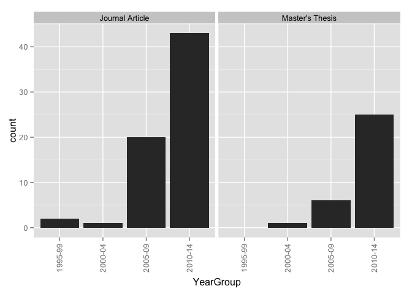 

### Counts for all entries

|        | Book| Book Chapter| Discussion Paper| Dissertation| Journal Article| Master's Thesis| Report| Working Paper|
|:-------|----:|------------:|----------------:|------------:|---------------:|---------------:|------:|-------------:|
|1995-99 |    0|            0|                0|            0|               2|               0|      0|             0|
|2000-04 |    0|            0|                0|            0|               1|               1|      0|             0|
|2005-09 |    0|            0|                0|            0|              20|               6|      0|             0|
|2010-14 |    0|            0|                0|            0|              43|              25|      0|             0|

# _Research type by region_ for all entries in the database

### Graphs for all entries
 

### Counts for all entries

|            | Original empirical| Review of other| Policy analysis| value|
|:-----------|------------------:|---------------:|---------------:|-----:|
|MENA        |                  0|               0|               0|     0|
|Sub.Saharan |                  0|               0|               0|     0|
|Cent..Asia  |                  0|               0|               0|     0|
|East.Asia   |                 46|              51|               5|     0|
|S..Asia     |                  0|               0|               0|     0|
|S.E..Asia   |                  0|               0|               0|     0|
|Aus....NZ   |                  0|               0|               0|     0|
|W..Europe   |                  0|               2|               0|     0|
|E..Europe   |                  0|               3|               0|     0|
|US...Can    |                  0|               1|               0|     0|
|LAC         |                  0|               0|               0|     0|
|Global      |                  0|              11|               0|     0|

# _Research type by year group_ for all entries in the database

### Graphs for all entries
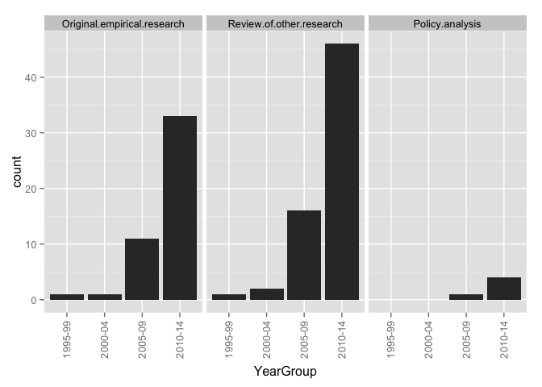 

### Counts for all entries

|        | Original.empirical.research| Review.of.other.research| Policy.analysis|
|:-------|---------------------------:|------------------------:|---------------:|
|1995-99 |                           1|                        1|               0|
|2000-04 |                           1|                        2|               0|
|2005-09 |                          11|                       16|               1|
|2010-14 |                          33|                       46|               4|

# _Ed levels by region_ 

### Graphs for all entries
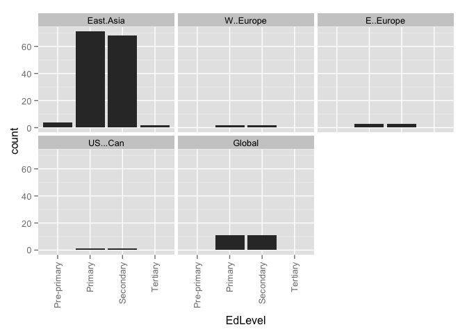 

### Counts for all entries

|            | Pre-primary| Primary| Secondary| Tertiary| value|
|:-----------|-----------:|-------:|---------:|--------:|-----:|
|MENA        |           0|       0|         0|        0|     0|
|Sub.Saharan |           0|       0|         0|        0|     0|
|Cent..Asia  |           0|       0|         0|        0|     0|
|East.Asia   |           4|      71|        68|        2|     0|
|S..Asia     |           0|       0|         0|        0|     0|
|S.E..Asia   |           0|       0|         0|        0|     0|
|Aus....NZ   |           0|       0|         0|        0|     0|
|W..Europe   |           0|       2|         2|        0|     0|
|E..Europe   |           0|       3|         3|        0|     0|
|US...Can    |           0|       1|         1|        0|     0|
|LAC         |           0|       0|         0|        0|     0|
|Global      |           0|      11|        11|        0|     0|

# _Research approach by region_
### Graphs for all entries
 

### Counts for all entries

|            | Single-country| Comparative| value|
|:-----------|--------------:|-----------:|-----:|
|MENA        |              0|           0|     0|
|Sub.Saharan |              0|           0|     0|
|Cent..Asia  |              0|           0|     0|
|East.Asia   |             79|           3|     0|
|S..Asia     |              0|           0|     0|
|S.E..Asia   |              0|           0|     0|
|Aus....NZ   |              0|           0|     0|
|W..Europe   |              0|           2|     0|
|E..Europe   |              0|           3|     0|
|US...Can    |              1|           0|     0|
|LAC         |              0|           0|     0|
|Global      |              0|          11|     0|

# Research approach by year group
### Graphs for all entries
 

### Counts for all entries

|        | Single.country...case| Comparative|
|:-------|---------------------:|-----------:|
|1995-99 |                     2|           0|
|2000-04 |                     2|           0|
|2005-09 |                    22|           3|
|2010-14 |                    54|          13|

# Research methods by year group
### Graphs for all entries
 

### Counts for all entries

|        | Mixed-methods| None or Unclear to us| Qualitative| Quantitative|
|:-------|-------------:|---------------------:|-----------:|------------:|
|1995-99 |             0|                     1|           0|            1|
|2000-04 |             1|                     0|           1|            0|
|2005-09 |             3|                     0|          13|           10|
|2010-14 |            15|                     4|          37|           12|

# Research methods by region
### Graphs for all entries
 

### Counts for all entries

|            | Mixed-methods| None or Unclear to us| Qualitative| Quantitative|
|:-----------|-------------:|---------------------:|-----------:|------------:|
|MENA        |             0|                     0|           0|            0|
|Sub.Saharan |             0|                     0|           0|            0|
|Cent..Asia  |             0|                     0|           0|            0|
|East.Asia   |            19|                     3|          39|           23|
|S..Asia     |             0|                     0|           0|            0|
|S.E..Asia   |             0|                     0|           0|            0|
|Aus....NZ   |             0|                     0|           0|            0|
|W..Europe   |             0|                     0|           2|            0|
|E..Europe   |             0|                     1|           2|            0|
|US...Can    |             0|                     0|           1|            0|
|LAC         |             0|                     0|           0|            0|
|Global      |             0|                     1|          10|            0|

# Research methods by year group
### Graph for all entries
 

### Counts for all entries

|        | Mixed-methods| None or Unclear to us| Qualitative| Quantitative|
|:-------|-------------:|---------------------:|-----------:|------------:|
|1995-99 |             0|                     1|           0|            1|
|2000-04 |             1|                     0|           1|            0|
|2005-09 |             3|                     0|          13|           10|
|2010-14 |            15|                     4|          37|           12|

# Research methods by publication type
### Graph for all entries
 

### Counts for all entries

|                 | Mixed-methods| None or Unclear to us| Qualitative| Quantitative|
|:----------------|-------------:|---------------------:|-----------:|------------:|
|Book             |             0|                     0|           0|            0|
|Book Chapter     |             0|                     0|           0|            0|
|Discussion Paper |             0|                     0|           0|            0|
|Dissertation     |             0|                     0|           0|            0|
|Journal Article  |             0|                     5|          39|           22|
|Master's Thesis  |            19|                     0|          12|            1|
|Report           |             0|                     0|           0|            0|
|Working Paper    |             0|                     0|           0|            0|

# Theoreortical framework by region
### Graphs for all entries
 

### Counts for all entries

|                      | MENA| Sub.Saharan| Cent..Asia| East.Asia| S..Asia| S.E..Asia| Aus....NZ| W..Europe| E..Europe| US...Can| LAC| Global|
|:---------------------|----:|-----------:|----------:|---------:|-------:|---------:|---------:|---------:|---------:|--------:|---:|------:|
|Social Capital        |    0|           0|          0|         3|       0|         0|         0|         0|         0|        0|   0|      0|
|Human Capital         |    0|           0|          0|         2|       0|         0|         0|         0|         0|        0|   0|      0|
|Cultural Capital      |    0|           0|          0|         2|       0|         0|         0|         0|         0|        0|   0|      2|
|World Culture         |    0|           0|          0|         0|       0|         0|         0|         0|         0|        0|   0|      0|
|Human Rights          |    0|           0|          0|         0|       0|         0|         0|         0|         0|        0|   0|      0|
|Critical Theory       |    0|           0|          0|         0|       0|         0|         0|         0|         0|        0|   0|      0|
|Political Theory      |    0|           0|          0|         0|       0|         0|         0|         0|         0|        0|   0|      0|
|None or Unclear to us |    0|           0|          0|        71|       0|         0|         0|         2|         3|        1|   0|      7|
|value                 |    0|           0|          0|         0|       0|         0|         0|         0|         0|        0|   0|      0|

# Theoreortical framework by year group
### Graphs for all entries
 

### Counts for all entries

|        | Social.Capital| Human.Capital| Cultural.Capital| World.Culture| Human.Rights| Critical.Theory| Political.Theory| None.or.Unclear.to.us|
|:-------|--------------:|-------------:|----------------:|-------------:|------------:|---------------:|----------------:|---------------------:|
|1995-99 |              0|             0|                0|             0|            0|               0|                0|                     2|
|2000-04 |              0|             0|                0|             0|            0|               0|                0|                     2|
|2005-09 |              2|             0|                0|             0|            0|               0|                0|                    23|
|2010-14 |              1|             2|                4|             0|            0|               0|                0|                    54|

# Theoretical framework by research method
### Graphs for all entries
 

### Counts for all entries

|                      | Quantitative| Qualitative| Mixed| None.or.unclear|
|:---------------------|------------:|-----------:|-----:|---------------:|
|Social Capital        |            2|           0|     1|               0|
|Human Capital         |            0|           1|     1|               0|
|Cultural Capital      |            0|           2|     2|               0|
|World Culture         |            0|           0|     0|               0|
|Human Rights          |            0|           0|     0|               0|
|Critical Theory       |            0|           0|     0|               0|
|Political Theory      |            0|           0|     0|               0|
|None or Unclear to us |           18|          44|    15|               4|
|value                 |            0|           0|     0|               0|

# Theoretical framework by research approach
### Graphs for all entries
 

### Counts for all entries

|                      | Single.country...case| Comparative|
|:---------------------|---------------------:|-----------:|
|Social Capital        |                     3|           0|
|Human Capital         |                     2|           0|
|Cultural Capital      |                     2|           2|
|World Culture         |                     0|           0|
|Human Rights          |                     0|           0|
|Critical Theory       |                     0|           0|
|Political Theory      |                     0|           0|
|None or Unclear to us |                    67|          12|
|value                 |                     0|           0|

# Framing by region
### Graphs for all entries
 

### Counts for all entries

|                | MENA| Sub.Saharan| Cent..Asia| East.Asia| S..Asia| S.E..Asia| Aus....NZ| W..Europe| E..Europe| US...Can| LAC| Global|
|:---------------|----:|-----------:|----------:|---------:|-------:|---------:|---------:|---------:|---------:|--------:|---:|------:|
|Exam Prep       |    0|           0|          0|        73|       0|         0|         0|         2|         3|        1|   0|     11|
|Corruption      |    0|           0|          0|         4|       0|         0|         0|         0|         1|        0|   0|      2|
|Equity          |    0|           0|          0|        41|       0|         0|         0|         2|         3|        0|   0|      8|
|Economic        |    0|           0|          0|        19|       0|         0|         0|         2|         3|        0|   0|      4|
|Social Cohesion |    0|           0|          0|         1|       0|         0|         0|         0|         0|        0|   0|      1|
|Global Trend    |    0|           0|          0|         3|       0|         0|         0|         0|         1|        0|   0|      5|
|Household       |    0|           0|          0|        43|       0|         0|         0|         1|         1|        0|   0|      3|
|value           |    0|           0|          0|         0|       0|         0|         0|         0|         0|        0|   0|      0|

# Framing by year group
### Graphs for all entries
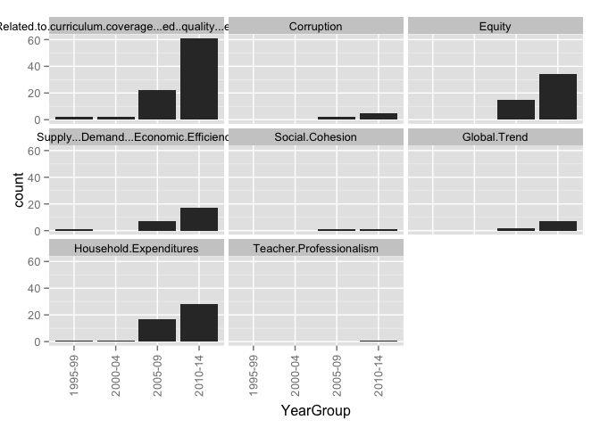 

### Counts for all entries

|        | Related.to.curriculum.coverage...ed..quality...exam.prep| Corruption| Equity| Supply...Demand...Economic.Efficiency| Social.Cohesion| Global.Trend| Household.Expenditures|
|:-------|--------------------------------------------------------:|----------:|------:|-------------------------------------:|---------------:|------------:|----------------------:|
|1995-99 |                                                        2|          0|      0|                                     1|               0|            0|                      1|
|2000-04 |                                                        2|          0|      0|                                     0|               0|            0|                      1|
|2005-09 |                                                       22|          2|     16|                                     7|               1|            2|                     17|
|2010-14 |                                                       61|          5|     35|                                    17|               1|            7|                     28|

# Framed by research method
### Graphs for all entries
 

### Counts for all entries

|                | Quantitative| Qualitative| Mixed| None.or.unclear|
|:---------------|------------:|-----------:|-----:|---------------:|
|Exam Prep       |           17|          46|    19|               5|
|Corruption      |            0|           4|     1|               2|
|Equity          |           10|          27|    12|               2|
|Economic        |            1|          18|     5|               1|
|Social Cohesion |            0|           2|     0|               0|
|Global Trend    |            0|           8|     0|               1|
|Household       |           19|          14|    13|               1|
|value           |            0|           0|     0|               0|

# Framed by research approach
### Graphs for all entries
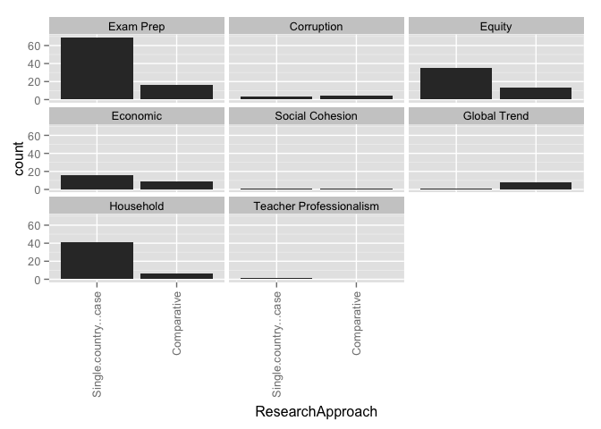 

### Counts for all entries

|                | Single.country...case| Comparative|
|:---------------|---------------------:|-----------:|
|Exam Prep       |                    69|          16|
|Corruption      |                     3|           4|
|Equity          |                    37|          13|
|Economic        |                    16|           9|
|Social Cohesion |                     1|           1|
|Global Trend    |                     1|           8|
|Household       |                    41|           6|
|value           |                     0|           0|

# Framed by theory
### Graphs for all entries
 

### Counts for all entries

|                                                         | Social Capital| Human Capital| Cultural Capital| World Culture| Human Rights| Critical Theory| Political Theory| None or Unclear to us| value|
|:--------------------------------------------------------|--------------:|-------------:|----------------:|-------------:|------------:|---------------:|----------------:|---------------------:|-----:|
|Related.to.curriculum.coverage...ed..quality...exam.prep |              2|             2|                4|             0|            0|               0|                0|                    73|     0|
|Corruption                                               |              0|             0|                0|             0|            0|               0|                0|                     6|     0|
|Equity                                                   |              3|             0|                3|             0|            0|               0|                0|                    39|     0|
|Supply...Demand...Economic.Efficiency                    |              1|             0|                0|             0|            0|               0|                0|                    23|     0|
|Social.Cohesion                                          |              0|             0|                0|             0|            0|               0|                0|                     2|     0|
|Global.Trend                                             |              0|             0|                2|             0|            0|               0|                0|                     6|     0|
|Household.Expenditures                                   |              3|             1|                2|             0|            0|               0|                0|                    38|     0|

# How Viewed by region
### Graphs for all entries
 

### Counts for all entries

|                   | MENA| Sub.Saharan| Cent..Asia| East.Asia| S..Asia| S.E..Asia| Aus....NZ| W..Europe| E..Europe| US...Can| LAC| Global|
|:------------------|----:|-----------:|----------:|---------:|-------:|---------:|---------:|---------:|---------:|--------:|---:|------:|
|Raises concerns    |    0|           0|          0|        18|       0|         0|         0|         0|         0|        0|   0|      0|
|Discusses benefits |    0|           0|          0|         1|       0|         0|         0|         0|         0|        0|   0|      0|
|Both               |    0|           0|          0|        48|       0|         0|         0|         2|         3|        0|   0|      9|
|Neither            |    0|           0|          0|        17|       0|         0|         0|         0|         0|        1|   0|      2|
|value              |    0|           0|          0|         0|       0|         0|         0|         0|         0|        0|   0|      0|

# How Viewed by year group
### Graphs for all entries
 

### Counts for all entries

|        | Raises.concerns| Discusses.benefits| Both| Neither|
|:-------|---------------:|------------------:|----:|-------:|
|1995-99 |               1|                  0|    1|       0|
|2000-04 |               1|                  0|    1|       0|
|2005-09 |               0|                  1|   22|       3|
|2010-14 |              16|                  0|   35|      17|

# HowViewed by research method
### Graphs for all entries
 

### Counts for all entries

|                   | Quantitative| Qualitative| Mixed| None.or.unclear|
|:------------------|------------:|-----------:|-----:|---------------:|
|Raises concerns    |            3|           9|     4|               2|
|Discusses benefits |            1|           0|     0|               0|
|Both               |           15|          30|    12|               2|
|Neither            |            4|          12|     3|               1|
|value              |            0|           0|     0|               0|

# HowViewed by research approach
### Graphs for all entries
 

### Counts for all entries

|                   | Single.country...case| Comparative|
|:------------------|---------------------:|-----------:|
|Raises concerns    |                    18|           0|
|Discusses benefits |                     1|           0|
|Both               |                    43|          14|
|Neither            |                    18|           2|
|value              |                     0|           0|

# HowViewed by theory
### Graphs for all entries
 

### Counts for all entries

|                   | Social Capital| Human Capital| Cultural Capital| World Culture| Human Rights| Critical Theory| Political Theory| None or Unclear to us| value|
|:------------------|--------------:|-------------:|----------------:|-------------:|------------:|---------------:|----------------:|---------------------:|-----:|
|Raises.concerns    |              0|             0|                0|             0|            0|               0|                0|                    16|     0|
|Discusses.benefits |              0|             0|                0|             0|            0|               0|                0|                     1|     0|
|Both               |              3|             2|                2|             0|            0|               0|                0|                    47|     0|
|Neither            |              0|             0|                2|             0|            0|               0|                0|                    17|     0|

# How Viewed by Framed
### Graphs for all entries
 

### Counts for all entries

|                                                         | Raises concerns| Discusses benefits| Both| Neither| value|
|:--------------------------------------------------------|---------------:|------------------:|----:|-------:|-----:|
|Related.to.curriculum.coverage...ed..quality...exam.prep |              15|                  0|   55|      17|     0|
|Corruption                                               |               1|                  0|    6|       0|     0|
|Equity                                                   |               8|                  0|   38|       5|     0|
|Supply...Demand...Economic.Efficiency                    |               2|                  0|   20|       3|     0|
|Social.Cohesion                                          |               0|                  0|    2|       0|     0|
|Global.Trend                                             |               0|                  0|    7|       2|     0|
|Household.Expenditures                                   |               6|                  1|   35|       5|     0|

# Stakeholders by region
### Graphs for all entries
 

### Counts for all entries

|                      | MENA| Sub.Saharan| Cent..Asia| East.Asia| S..Asia| S.E..Asia| Aus....NZ| W..Europe| E..Europe| US...Can| LAC| Global|
|:---------------------|----:|-----------:|----------:|---------:|-------:|---------:|---------:|---------:|---------:|--------:|---:|------:|
|Non-tutor teachers    |    0|           0|          0|        10|       0|         0|         0|         0|         0|        0|   0|      0|
|Teachers who tutor    |    0|           0|          0|        22|       0|         0|         0|         0|         0|        0|   0|      0|
|Tutors                |    0|           0|          0|         2|       0|         0|         0|         0|         0|        0|   0|      0|
|Parents               |    0|           0|          0|        39|       0|         0|         0|         0|         0|        0|   0|      0|
|Students              |    0|           0|          0|        45|       0|         0|         0|         0|         0|        0|   0|      0|
|School admin          |    0|           0|          0|         0|       0|         0|         0|         0|         0|        0|   0|      0|
|Tutoring center admin |    0|           0|          0|         0|       0|         0|         0|         0|         0|        0|   0|      0|
|Academic scholar(s)   |    0|           0|          0|         2|       0|         0|         0|         0|         0|        0|   0|      0|
|Policymakers          |    0|           0|          0|         4|       0|         0|         0|         0|         0|        0|   0|      0|
|Documents             |    0|           0|          0|        33|       0|         0|         0|         1|         2|        1|   0|     10|
|value                 |    0|           0|          0|         0|       0|         0|         0|         0|         0|        0|   0|      0|

# Stakeholders by year group
### Graphs for all entries
 

### Counts for all entries

|        | Teachers.who.do.not.tutor| Teachers.who.tutor| Tutors.who.are.not.teachers| School.administrators| Tutoring.center.admin| Academic.scholars| Parents...household| Students| Policymakers| Documents|
|:-------|-------------------------:|------------------:|---------------------------:|---------------------:|---------------------:|-----------------:|-------------------:|--------:|------------:|---------:|
|1995-99 |                         1|                  1|                           0|                     0|                     0|                 0|                   1|        1|            0|         1|
|2000-04 |                         1|                  1|                           0|                     0|                     0|                 0|                   1|        1|            0|         1|
|2005-09 |                         2|                  4|                           0|                     0|                     0|                 1|                  11|       13|            0|        11|
|2010-14 |                         6|                 16|                           2|                     0|                     0|                 1|                  26|       30|            4|        33|

# Stakeholders by theory
### Graphs for all entries
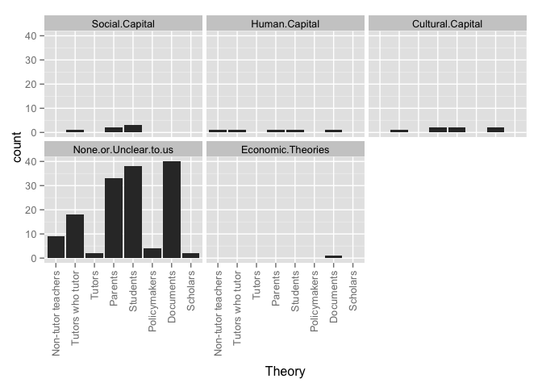 

### Counts for all entries

|                      | Non-tutor teachers| Tutors who tutor| Tutors| Parents| Students| Policymakers| Documents| value|
|:---------------------|------------------:|----------------:|------:|-------:|--------:|------------:|---------:|-----:|
|Social.Capital        |                  0|                1|      0|       2|        3|            0|         0|     0|
|Human.Capital         |                  1|                1|      0|       1|        1|            0|         1|     0|
|Cultural.Capital      |                  0|                1|      0|       2|        2|            0|         2|     0|
|World.Culture         |                  0|                0|      0|       0|        0|            0|         0|     0|
|Human.Rights          |                  0|                0|      0|       0|        0|            0|         0|     0|
|Critical.Theory       |                  0|                0|      0|       0|        0|            0|         0|     0|
|Political.Theory      |                  0|                0|      0|       0|        0|            0|         0|     0|
|None.or.Unclear.to.us |                  9|               18|      2|      31|       35|            4|        39|     0|
|School.administrators |                  0|                0|      0|       0|        0|            0|         0|     0|
|Tutoring.center.admin |                  0|                0|      0|       0|        0|            0|         0|     0|
|Academic.scholars     |                  1|                2|      0|       2|        2|            1|         0|     0|

# WhatTaught by region
### Graphs for all entries
 

### Counts for all entries

|                 | MENA| Sub.Saharan| Cent..Asia| East.Asia| S..Asia| S.E..Asia| Aus....NZ| W..Europe| E..Europe| US...Can| LAC| Global|
|:----------------|----:|-----------:|----------:|---------:|-------:|---------:|---------:|---------:|---------:|--------:|---:|------:|
|School subjects  |    0|           0|          0|        35|       0|         0|         0|         1|         2|        0|   0|      4|
|Extracurriculars |    0|           0|          0|         0|       0|         0|         0|         0|         0|        0|   0|      0|
|Both             |    0|           0|          0|        42|       0|         0|         0|         1|         1|        0|   0|      7|
|Not defined      |    0|           0|          0|         7|       0|         0|         0|         0|         0|        1|   0|      0|
|value            |    0|           0|          0|         0|       0|         0|         0|         0|         0|        0|   0|      0|

WhatTaught by year group
### Graphs for all entries
 

### Counts for all entries

|        | Subjects.taught.in.school| Extracurricular.activities| Both| Not.defined|
|:-------|-------------------------:|--------------------------:|----:|-----------:|
|1995-99 |                         1|                          0|    1|           0|
|2000-04 |                         1|                          0|    1|           0|
|2005-09 |                        11|                          0|   14|           1|
|2010-14 |                        28|                          0|   33|           7|

# WhatTaught by theory
### Graphs for all entries
 

### Counts for all entries

|                      | School subjects| Extracurriculars| Both| Not defined| value|
|:---------------------|---------------:|----------------:|----:|-----------:|-----:|
|Social.Capital        |               1|                0|    2|           0|     0|
|Human.Capital         |               2|                0|    0|           0|     0|
|Cultural.Capital      |               0|                0|    4|           0|     0|
|World.Culture         |               0|                0|    0|           0|     0|
|Human.Rights          |               0|                0|    0|           0|     0|
|Critical.Theory       |               0|                0|    0|           0|     0|
|Political.Theory      |               0|                0|    0|           0|     0|
|None.or.Unclear.to.us |              33|                0|   40|           8|     0|

# WhereOccur by region
### Graphs for all entries
 

### Counts for all entries

|                  | MENA| Sub.Saharan| Cent..Asia| East.Asia| S..Asia| S.E..Asia| Aus....NZ| W..Europe| E..Europe| US...Can| LAC| Global|
|:-----------------|----:|-----------:|----------:|---------:|-------:|---------:|---------:|---------:|---------:|--------:|---:|------:|
|On school grounds |    0|           0|          0|        10|       0|         0|         0|         1|         1|        0|   0|      2|
|Designated center |    0|           0|          0|        28|       0|         0|         0|         1|         1|        0|   0|      3|
|Web               |    0|           0|          0|         8|       0|         0|         0|         1|         1|        0|   0|      2|
|Student's home    |    0|           0|          0|        21|       0|         0|         0|         1|         1|        0|   0|      3|
|Outside school    |    0|           0|          0|        19|       0|         0|         0|         1|         1|        0|   0|      3|
|Not defined       |    0|           0|          0|        53|       0|         0|         0|         1|         2|        1|   0|      8|
|value             |    0|           0|          0|         0|       0|         0|         0|         0|         0|        0|   0|      0|

# WhereOccur by year group
### Graphs for all entries
 

### Counts for all entries

|        | On.school.grounds| Designated.tutoring.center.or.franchise| On.line...via.web| In.the.student.s.home| Other.outside.school| Not.defined|
|:-------|-----------------:|---------------------------------------:|-----------------:|---------------------:|--------------------:|-----------:|
|1995-99 |                 0|                                       0|                 0|                     0|                    0|           2|
|2000-04 |                 1|                                       0|                 0|                     1|                    1|           1|
|2005-09 |                 3|                                       4|                 2|                     5|                    5|          21|
|2010-14 |                 9|                                      28|                 9|                    19|                   17|          39|

# WhereOccur by theory
### Graphs for all entries
 

### Counts for all entries

|                      | On school grounds| Designated center| Web| Student's home| Outside school| Not defined| value|
|:---------------------|-----------------:|-----------------:|---:|--------------:|--------------:|-----------:|-----:|
|Social.Capital        |                 0|                 0|   0|              0|              0|           3|     0|
|Human.Capital         |                 0|                 1|   0|              0|              0|           1|     0|
|Cultural.Capital      |                 0|                 2|   0|              2|              2|           2|     0|
|World.Culture         |                 0|                 0|   0|              0|              0|           0|     0|
|Human.Rights          |                 0|                 0|   0|              0|              0|           0|     0|
|Critical.Theory       |                 0|                 0|   0|              0|              0|           0|     0|
|Political.Theory      |                 0|                 0|   0|              0|              0|           0|     0|
|None.or.Unclear.to.us |                10|                26|  10|             20|             18|          52|     0|

# WhoProvides by region
### Graphs for all entries
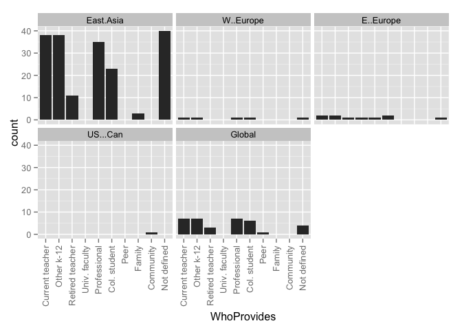 

### Counts for all entries

|                | MENA| Sub.Saharan| Cent..Asia| East.Asia| S..Asia| S.E..Asia| Aus....NZ| W..Europe| E..Europe| US...Can| LAC| Global|
|:---------------|----:|-----------:|----------:|---------:|-------:|---------:|---------:|---------:|---------:|--------:|---:|------:|
|Current teacher |    0|           0|          0|        38|       0|         0|         0|         1|         2|        0|   0|      7|
|Other k-12      |    0|           0|          0|        38|       0|         0|         0|         1|         2|        0|   0|      7|
|Retired teacher |    0|           0|          0|        11|       0|         0|         0|         0|         1|        0|   0|      3|
|Univ. faculty   |    0|           0|          0|         0|       0|         0|         0|         0|         1|        0|   0|      0|
|Professional    |    0|           0|          0|        35|       0|         0|         0|         1|         1|        0|   0|      7|
|Col. student    |    0|           0|          0|        23|       0|         0|         0|         1|         2|        0|   0|      6|
|Peer            |    0|           0|          0|         0|       0|         0|         0|         0|         0|        0|   0|      1|
|Family          |    0|           0|          0|         3|       0|         0|         0|         0|         0|        0|   0|      0|
|Community       |    0|           0|          0|         0|       0|         0|         0|         0|         0|        1|   0|      0|
|Not defined     |    0|           0|          0|        40|       0|         0|         0|         1|         1|        0|   0|      4|
|value           |    0|           0|          0|         0|       0|         0|         0|         0|         0|        0|   0|      0|

# WhoProvides by year group
### Graphs for all entries
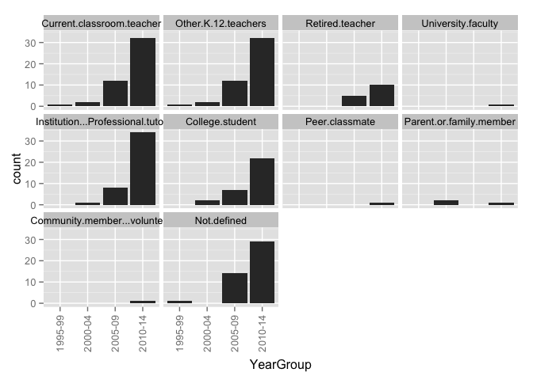 

### Counts for all entries

|        | Current.classroom.teacher| Other.K.12.teachers| Retired.teacher| University.faculty| Institution...Professional.tutor| College.student| Peer.classmate| Parent.or.family.member| Community.member...volunteer| Not.defined|
|:-------|-------------------------:|-------------------:|---------------:|------------------:|--------------------------------:|---------------:|--------------:|-----------------------:|----------------------------:|-----------:|
|1995-99 |                         1|                   1|               0|                  0|                                0|               0|              0|                       0|                            0|           1|
|2000-04 |                         2|                   2|               0|                  0|                                1|               2|              0|                       2|                            0|           0|
|2005-09 |                        12|                  12|               5|                  0|                                8|               7|              0|                       0|                            0|          14|
|2010-14 |                        32|                  32|              10|                  1|                               34|              22|              1|                       1|                            1|          29|

# WhoProvides by theory
### Graphs for all entries
 

### Counts for all entries

|                      | Current teacher| Other k-12| Retired teacher| Univ. faculty| Professional| Col. student| Peer| Family| Community| Not defined| value|
|:---------------------|---------------:|----------:|---------------:|-------------:|------------:|------------:|----:|------:|---------:|-----------:|-----:|
|Social.Capital        |               0|          0|               0|             0|            0|            0|    0|      0|         0|           3|     0|
|Human.Capital         |               1|          1|               1|             0|            2|            2|    0|      0|         0|           0|     0|
|Cultural.Capital      |               2|          2|               0|             0|            2|            1|    0|      0|         0|           2|     0|
|World.Culture         |               0|          0|               0|             0|            0|            0|    0|      0|         0|           0|     0|
|Human.Rights          |               0|          0|               0|             0|            0|            0|    0|      0|         0|           0|     0|
|Critical.Theory       |               0|          0|               0|             0|            0|            0|    0|      0|         0|           0|     0|
|Political.Theory      |               0|          0|               0|             0|            0|            0|    0|      0|         0|           0|     0|
|None.or.Unclear.to.us |              38|         38|              13|             1|           34|           25|    0|      3|         1|          37|     0|

# DoesCharge by region
### Graphs for all entries
 

### Counts for all entries

|                             | MENA| Sub.Saharan| Cent..Asia| East.Asia| S..Asia| S.E..Asia| Aus....NZ| W..Europe| E..Europe| US...Can| LAC| Global|
|:----------------------------|----:|-----------:|----------:|---------:|-------:|---------:|---------:|---------:|---------:|--------:|---:|------:|
|                             |    0|           0|          0|         0|       0|         0|         0|         0|         0|        0|   0|      0|
|Both                         |    0|           0|          0|         0|       0|         0|         0|         0|         0|        0|   0|      1|
|No, they do not charge a fee |    0|           0|          0|         0|       0|         0|         0|         0|         0|        1|   0|      0|
|Not defined                  |    0|           0|          0|         6|       0|         0|         0|         0|         1|        0|   0|      3|
|Yes, they charge a fee       |    0|           0|          0|        74|       0|         0|         0|         2|         2|        0|   0|      7|

# DoesCharge by year group
### Graphs for all entries
 

### Counts for all entries

|        |   | Both| No, they do not charge a fee| Not defined| Yes, they charge a fee|
|:-------|--:|----:|----------------------------:|-----------:|----------------------:|
|1995-99 |  0|    0|                            0|           1|                      1|
|2000-04 |  0|    0|                            0|           1|                      1|
|2005-09 |  0|    0|                            0|           1|                     25|
|2010-14 |  0|    1|                            1|           7|                     55|

# DoesCharge by WhoProvides
### Graphs for all entries
 

### Counts for all entries

|                             | Current.classroom.teacher| Other.K.12.teachers| Retired.teacher| University.faculty| Institution...Professional.tutor| College.student| Peer.classmate| Parent.or.family.member| Community.member...volunteer| Not.defined|
|:----------------------------|-------------------------:|-------------------:|---------------:|------------------:|--------------------------------:|---------------:|--------------:|-----------------------:|----------------------------:|-----------:|
|                             |                         0|                   0|               0|                  0|                                0|               0|              0|                       0|                            0|           0|
|Both                         |                         0|                   0|               0|                  0|                                0|               0|              0|                       0|                            0|           1|
|No, they do not charge a fee |                         0|                   0|               0|                  0|                                0|               0|              0|                       0|                            1|           0|
|Not defined                  |                         5|                   5|               1|                  1|                                2|               4|              1|                       1|                            0|           5|
|Yes, they charge a fee       |                        42|                  42|              14|                  0|                               41|              27|              0|                       2|                            0|          34|

# ClassSize by Region
### Graphs for all entries
 

### Counts for all entries

|                              | MENA| Sub.Saharan| Cent..Asia| East.Asia| S..Asia| S.E..Asia| Aus....NZ| W..Europe| E..Europe| US...Can| LAC| Global|
|:-----------------------------|----:|-----------:|----------:|---------:|-------:|---------:|---------:|---------:|---------:|--------:|---:|------:|
|                              |    0|           0|          0|         0|       0|         0|         0|         0|         0|        0|   0|      0|
|Individual 1-on-1 instruction |    0|           0|          0|         1|       0|         0|         0|         0|         0|        0|   0|      0|
|Large groups                  |    0|           0|          0|         0|       0|         0|         0|         0|         0|        0|   0|      0|
|Small groups                  |    0|           0|          0|         0|       0|         0|         0|         0|         0|        0|   0|      0|
|Unclear                       |    0|           0|          0|        45|       0|         0|         0|         1|         1|        1|   0|      6|
|Various class sizes discussed |    0|           0|          0|        38|       0|         0|         0|         1|         2|        0|   0|      5|

# OperationSize by region
### Graphs for all entries
 

### Counts for all entries

|            | Not.defined.or.unclear| MENA| Sub.Saharan| Cent..Asia| East.Asia| S..Asia| S.E..Asia| Aus....NZ| W..Europe| E..Europe| US...Can| LAC| Global|
|:-----------|----------------------:|----:|-----------:|----------:|---------:|-------:|---------:|---------:|---------:|---------:|--------:|---:|------:|
|Individual  |                      0|    0|           0|          0|         3|       0|         0|         0|         0|         0|        0|   0|      1|
|Small firms |                      0|    0|           0|          0|         2|       0|         0|         0|         0|         0|        0|   0|      1|
|Large firm  |                      0|    0|           0|          0|         2|       0|         0|         0|         0|         0|        0|   0|      1|
|Various     |                      0|    0|           0|          0|        53|       0|         0|         0|         2|         3|        0|   0|      7|
|value       |                      0|    0|           0|          0|         0|       0|         0|         0|         0|         0|        0|   0|      0|

# Why Taking by region
### Graphs for all entries
 

### Counts for all entries

|                              | MENA| Sub.Saharan| Cent..Asia| East.Asia| S..Asia| S.E..Asia| Aus....NZ| W..Europe| E..Europe| US...Can| LAC| Global|
|:-----------------------------|----:|-----------:|----------:|---------:|-------:|---------:|---------:|---------:|---------:|--------:|---:|------:|
|Student falls behind          |    0|           0|          0|        67|       0|         0|         0|         2|         3|        1|   0|     10|
|Preparation for exams         |    0|           0|          0|        75|       0|         0|         0|         2|         3|        0|   0|     10|
|Make up for perceived failure |    0|           0|          0|        42|       0|         0|         0|         2|         2|        0|   0|      8|
|For cultural reasons          |    0|           0|          0|        36|       0|         0|         0|         1|         2|        0|   0|      7|
|Enrichment activities         |    0|           0|          0|        14|       0|         0|         0|         0|         0|        0|   0|      2|
|Peer pressure                 |    0|           0|          0|         5|       0|         0|         0|         0|         0|        0|   0|      0|
|Teacher pressure              |    0|           0|          0|         3|       0|         0|         0|         0|         0|        0|   0|      0|
|Not stated or unclear         |    0|           0|          0|         0|       0|         0|         0|         0|         0|        0|   0|      1|
|value                         |    0|           0|          0|         0|       0|         0|         0|         0|         0|        0|   0|      0|

# Why Taking by year group
### Graphs for all entries
 

### Counts for all entries

|        | Student.falls.behind.and.needs.extra.help| Preparation.for.exams.to.make.student.more.competitive| Make.up.for.perceived.failure.in.the.mainstream.system...school| For.cultural.reasons| To.provide.extra.enrichment.activities| Peer.pressure| Teacher.pressure| Not.stated.or.unclear|
|:-------|-----------------------------------------:|------------------------------------------------------:|---------------------------------------------------------------:|--------------------:|--------------------------------------:|-------------:|----------------:|---------------------:|
|1995-99 |                                         0|                                                      2|                                                               0|                    1|                                      0|             0|                0|                     0|
|2000-04 |                                         2|                                                      2|                                                               2|                    1|                                      0|             0|                0|                     0|
|2005-09 |                                        23|                                                     22|                                                              18|                   10|                                      7|             1|                0|                     0|
|2010-14 |                                        55|                                                     61|                                                              31|                   33|                                      9|             4|                3|                     1|

# WhyTaking by research method
### Graphs for all entries
 

### Counts for all entries

|                              | Quantitative| Qualitative| Mixed| None.or.unclear|
|:-----------------------------|------------:|-----------:|-----:|---------------:|
|Student falls behind          |           19|          42|    17|               2|
|Preparation for exams         |           20|          44|    19|               4|
|Make up for perceived failure |            8|          31|    11|               1|
|For cultural reasons          |            5|          26|    11|               3|
|Enrichment activities         |            5|           7|     3|               1|
|Peer pressure                 |            1|           2|     2|               0|
|Teacher pressure              |            0|           2|     1|               0|
|Not stated or unclear         |            0|           0|     0|               1|
|value                         |            0|           0|     0|               0|

# WhyTaking by research approach
### Graphs for all entries
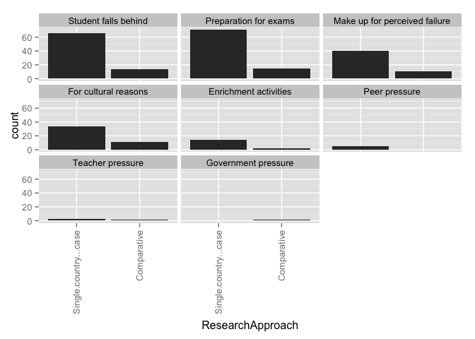 

### Counts for all entries

|                              | Single.country...case| Comparative|
|:-----------------------------|---------------------:|-----------:|
|Student falls behind          |                    66|          14|
|Preparation for exams         |                    71|          15|
|Make up for perceived failure |                    40|          11|
|For cultural reasons          |                    34|          11|
|Enrichment activities         |                    14|           2|
|Peer pressure                 |                     5|           0|
|Teacher pressure              |                     2|           1|
|Not stated or unclear         |                     0|           1|
|value                         |                     0|           0|

# WhyTaking by theory
### Graphs for all entries
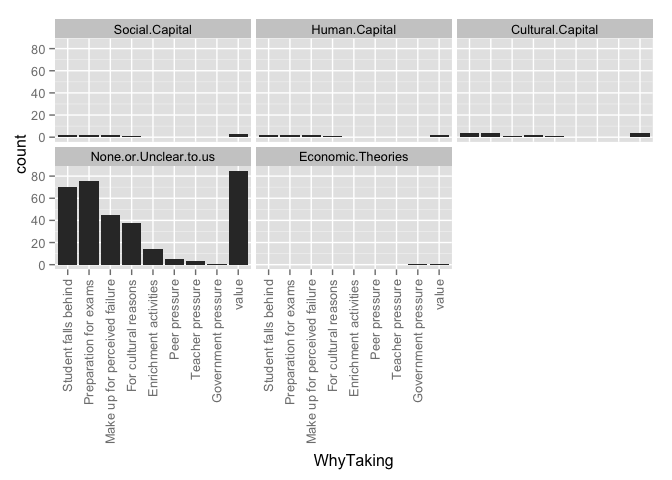 

### Counts for all entries

|                              | Social.Capital| Human.Capital| Cultural.Capital| World.Culture| Human.Rights| Critical.Theory| Political.Theory| None.or.Unclear.to.us|
|:-----------------------------|--------------:|-------------:|----------------:|-------------:|------------:|---------------:|----------------:|---------------------:|
|Student falls behind          |              2|             2|                4|             0|            0|               0|                0|                    66|
|Preparation for exams         |              2|             2|                4|             0|            0|               0|                0|                    72|
|Make up for perceived failure |              2|             2|                1|             0|            0|               0|                0|                    43|
|For cultural reasons          |              1|             1|                2|             0|            0|               0|                0|                    37|
|Enrichment activities         |              0|             0|                1|             0|            0|               0|                0|                    14|
|Peer pressure                 |              0|             0|                0|             0|            0|               0|                0|                     5|
|Teacher pressure              |              0|             0|                0|             0|            0|               0|                0|                     3|
|Not stated or unclear         |              0|             0|                0|             0|            0|               0|                0|                     0|
|value                         |              3|             2|                4|             0|            0|               0|                0|                    81|

# Why Taking by Framed
### Graphs for all entries
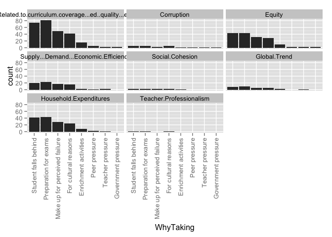 

### Counts for all entries

|                                                         | Student falls behind| Preparation for exams| Make up for perceived failure| For cultural reasons| Enrichment activities| Peer pressure| Teacher pressure| Not stated or unclear| value|
|:--------------------------------------------------------|--------------------:|---------------------:|-----------------------------:|--------------------:|---------------------:|-------------:|----------------:|---------------------:|-----:|
|Related.to.curriculum.coverage...ed..quality...exam.prep |                   74|                    81|                            49|                   42|                    15|             5|                3|                     1|     0|
|Corruption                                               |                    5|                     5|                             3|                    5|                     1|             1|                1|                     1|     0|
|Equity                                                   |                   45|                    45|                            34|                   29|                     9|             3|                2|                     1|     0|
|Supply...Demand...Economic.Efficiency                    |                   20|                    23|                            17|                   16|                     2|             1|                2|                     0|     0|
|Social.Cohesion                                          |                    2|                     2|                             2|                    2|                     1|             0|                0|                     0|     0|
|Global.Trend                                             |                    8|                     9|                             5|                    6|                     2|             0|                1|                     0|     0|
|Household.Expenditures                                   |                   42|                    43|                            28|                   24|                     8|             2|                1|                     0|     0|
