# Relationships for All English-language Articles

### TOTAL NUMBER OF ARTICLES: 170
This number includes 0 articles with duplicate ID numbers. A full list of duplicate articles can be found [here](https://github.com/MikeRussellMcK/PTAnalysis/blob/master/Markdown%20and%20Output/Duplicates.md). 
Document was last updated on 2014-09-25 10:34:26.

# _Region by year group_ for all entries in the database:

### Graphs for all entries
 

### Counts for all entries

|        | MENA| Sub.Saharan| Cent..Asia| East.Asia| S..Asia| S.E..Asia| Aus....NZ| W..Europe| E..Europe| US...Can| LAC| Global|
|:-------|----:|-----------:|----------:|---------:|-------:|---------:|---------:|---------:|---------:|--------:|---:|------:|
|1985-89 |    1|           0|          0|         2|       0|         0|         0|         0|         0|        0|   0|      0|
|1990-94 |    0|           0|          0|         3|       1|         1|         0|         0|         0|        0|   0|      0|
|1995-99 |    1|           0|          0|         3|       0|         1|         0|         1|         0|        3|   0|      3|
|2000-04 |    0|           1|          0|         4|       2|         0|         0|         3|         0|        2|   0|      2|
|2005-09 |    1|           1|          2|         9|       5|         6|         1|         3|         6|        6|   0|      5|
|2010-14 |    9|           1|          4|        35|       4|        10|         1|        17|        12|       12|   3|      9|

# _Region by publication type_: 

### Graphs for all entries
 

### Counts for all entries

|                 | MENA| Sub.Saharan| Cent..Asia| East.Asia| S..Asia| S.E..Asia| Aus....NZ| W..Europe| E..Europe| US...Can| LAC| Global|
|:----------------|----:|-----------:|----------:|---------:|-------:|---------:|---------:|---------:|---------:|--------:|---:|------:|
|Book             |    1|           0|          3|         1|       1|         1|         0|         1|         2|        1|   0|      1|
|Book Chapter     |    5|           1|          1|         0|       0|         2|         0|         8|         5|        0|   0|      0|
|Discussion Paper |    0|           0|          0|         0|       0|         0|         0|         0|         2|        0|   0|      0|
|Dissertation     |    1|           1|          0|        10|       2|         1|         0|         0|         1|        1|   0|      1|
|Journal Article  |    3|           0|          2|        43|       7|        10|         2|        14|         7|       21|   3|     17|
|Master's Thesis  |    0|           0|          0|         0|       0|         0|         0|         0|         0|        0|   0|      0|
|Report           |    2|           0|          0|         1|       2|         1|         0|         1|         1|        0|   0|      0|
|Working Paper    |    0|           1|          0|         1|       0|         3|         0|         0|         0|        0|   0|      0|

# _Publication type by year group_ for all entries in the database:

### Graphs for all entries
 

### Counts for all entries

|        | Book| Book Chapter| Discussion Paper| Dissertation| Journal Article| Master's Thesis| Report| Working Paper|
|:-------|----:|------------:|----------------:|------------:|---------------:|---------------:|------:|-------------:|
|1985-89 |    0|            0|                0|            1|               2|               0|      0|             0|
|1990-94 |    0|            0|                0|            0|               5|               0|      0|             0|
|1995-99 |    0|            0|                0|            2|               8|               0|      2|             0|
|2000-04 |    0|            1|                0|            2|              10|               0|      0|             0|
|2005-09 |    3|            1|                2|            6|              24|               0|      2|             2|
|2010-14 |    3|           14|                0|            7|              67|               0|      3|             3|

# _Research type by region_ for all entries in the database

### Graphs for all entries
 

### Counts for all entries

|            | Original empirical| Review of other| Policy analysis| value|
|:-----------|------------------:|---------------:|---------------:|-----:|
|MENA        |                  9|               4|               0|     0|
|Sub.Saharan |                  2|               0|               1|     0|
|Cent..Asia  |                  5|               1|               1|     0|
|East.Asia   |                 42|              10|               6|     0|
|S..Asia     |                  6|               4|               1|     0|
|S.E..Asia   |                 13|               3|               2|     0|
|Aus....NZ   |                  1|               0|               0|     0|
|W..Europe   |                 14|               8|               1|     0|
|E..Europe   |                 15|               4|               2|     0|
|US...Can    |                 16|               4|               4|     0|
|LAC         |                  2|               2|               0|     0|
|Global      |                  8|               9|               0|     0|

# _Research type by year group_ for all entries in the database

### Graphs for all entries
 

### Counts for all entries

|        | Original.empirical.research| Review.of.other.research| Policy.analysis|
|:-------|---------------------------:|------------------------:|---------------:|
|1985-89 |                           3|                        0|               0|
|1990-94 |                           4|                        1|               0|
|1995-99 |                          11|                        1|               0|
|2000-04 |                           7|                        3|               0|
|2005-09 |                          29|                        5|               4|
|2010-14 |                          67|                       26|               8|

# _Ed levels by region_ 

### Graphs for all entries
 

### Counts for all entries

|            | Pre-primary| Primary| Secondary| Tertiary| value|
|:-----------|-----------:|-------:|---------:|--------:|-----:|
|MENA        |           0|       8|        12|        0|     0|
|Sub.Saharan |           0|       1|         3|        0|     0|
|Cent..Asia  |           0|       4|         5|        0|     0|
|East.Asia   |           2|      26|        54|        1|     0|
|S..Asia     |           2|       7|        10|        0|     0|
|S.E..Asia   |           1|      17|        13|        0|     0|
|Aus....NZ   |           0|       0|         2|        0|     0|
|W..Europe   |           1|      17|        24|        2|     0|
|E..Europe   |           1|      10|        17|        2|     0|
|US...Can    |           4|      14|        19|        2|     0|
|LAC         |           0|       2|         3|        0|     0|
|Global      |           3|      16|        18|        0|     0|

# _Research approach by region_
### Graphs for all entries
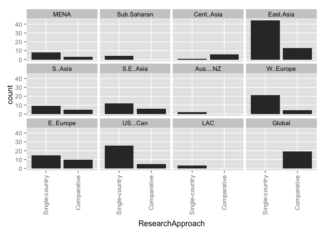 

### Counts for all entries

|            | Single-country| Comparative| value|
|:-----------|--------------:|-----------:|-----:|
|MENA        |              9|           3|     0|
|Sub.Saharan |              3|           0|     0|
|Cent..Asia  |              1|           5|     0|
|East.Asia   |             45|          11|     0|
|S..Asia     |              9|           3|     0|
|S.E..Asia   |             13|           5|     0|
|Aus....NZ   |              2|           0|     0|
|W..Europe   |             20|           4|     0|
|E..Europe   |              9|           9|     0|
|US...Can    |             18|           5|     0|
|LAC         |              3|           0|     0|
|Global      |              2|          15|     0|

# Research approach by year group
### Graphs for all entries
 

### Counts for all entries

|        | Single.country...case| Comparative|
|:-------|---------------------:|-----------:|
|1985-89 |                     3|           0|
|1990-94 |                     5|           0|
|1995-99 |                     8|           2|
|2000-04 |                     9|           4|
|2005-09 |                    30|          10|
|2010-14 |                    77|          20|

# Research methods by year group
### Graphs for all entries
 

### Counts for all entries

|        | Mixed-methods| None or Unclear to us| Qualitative| Quantitative|
|:-------|-------------:|---------------------:|-----------:|------------:|
|1985-89 |             1|                     0|           1|            1|
|1990-94 |             1|                     0|           1|            3|
|1995-99 |             3|                     2|           2|            5|
|2000-04 |             1|                     0|           7|            5|
|2005-09 |             5|                     0|          15|           20|
|2010-14 |            15|                     2|          43|           37|

# Research methods by region
### Graphs for all entries
 

### Counts for all entries

|            | Mixed-methods| None or Unclear to us| Qualitative| Quantitative|
|:-----------|-------------:|---------------------:|-----------:|------------:|
|MENA        |             1|                     0|           7|            4|
|Sub.Saharan |             0|                     0|           2|            1|
|Cent..Asia  |             3|                     0|           2|            1|
|East.Asia   |            10|                     2|          17|           27|
|S..Asia     |             3|                     1|           5|            3|
|S.E..Asia   |             3|                     0|           5|           10|
|Aus....NZ   |             0|                     0|           2|            0|
|W..Europe   |             2|                     0|          14|            8|
|E..Europe   |             3|                     0|           9|            6|
|US...Can    |             1|                     1|          14|            7|
|LAC         |             1|                     0|           1|            1|
|Global      |             1|                     1|          10|            7|

# Research methods by year group
### Graph for all entries
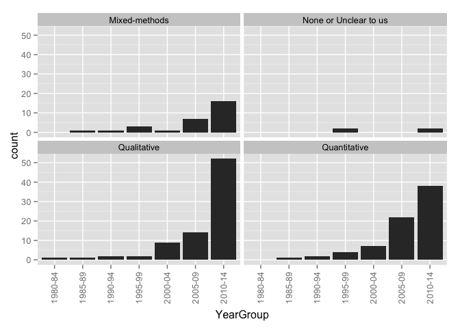 

### Counts for all entries

|        | Mixed-methods| None or Unclear to us| Qualitative| Quantitative|
|:-------|-------------:|---------------------:|-----------:|------------:|
|1985-89 |             1|                     0|           1|            1|
|1990-94 |             1|                     0|           1|            3|
|1995-99 |             3|                     2|           2|            5|
|2000-04 |             1|                     0|           7|            5|
|2005-09 |             5|                     0|          15|           20|
|2010-14 |            15|                     2|          43|           37|

# Research methods by publication type
### Graph for all entries
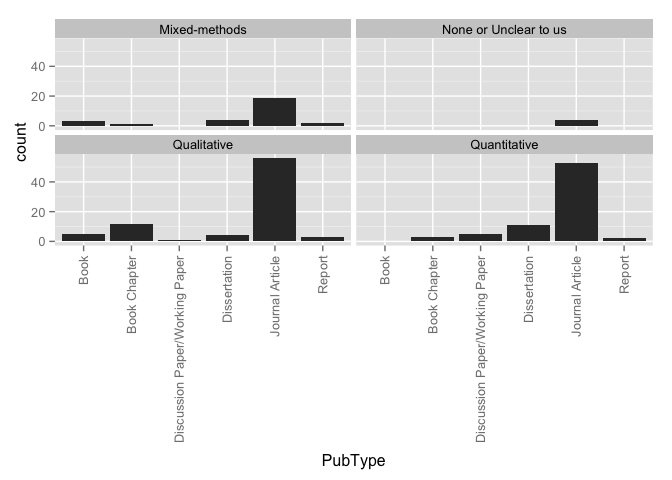 

### Counts for all entries

|                 | Mixed-methods| None or Unclear to us| Qualitative| Quantitative|
|:----------------|-------------:|---------------------:|-----------:|------------:|
|Book             |             2|                     0|           4|            0|
|Book Chapter     |             1|                     0|          12|            3|
|Discussion Paper |             0|                     0|           0|            2|
|Dissertation     |             4|                     0|           3|           11|
|Journal Article  |            17|                     4|          48|           47|
|Master's Thesis  |             0|                     0|           0|            0|
|Report           |             2|                     0|           1|            4|
|Working Paper    |             0|                     0|           1|            4|

# Theoreortical framework by region
### Graphs for all entries
 

### Counts for all entries

|                      | MENA| Sub.Saharan| Cent..Asia| East.Asia| S..Asia| S.E..Asia| Aus....NZ| W..Europe| E..Europe| US...Can| LAC| Global|
|:---------------------|----:|-----------:|----------:|---------:|-------:|---------:|---------:|---------:|---------:|--------:|---:|------:|
|Social Capital        |    3|           1|          1|         5|       1|         2|         1|         2|         1|        2|   0|      2|
|Human Capital         |    0|           0|          1|         7|       1|         4|         0|         2|         0|        2|   0|      6|
|Cultural Capital      |    2|           1|          0|         5|       0|         0|         0|         3|         0|        3|   0|      2|
|World Culture         |    0|           0|          0|         1|       1|         0|         0|         0|         0|        1|   0|      3|
|Human Rights          |    1|           0|          0|         0|       0|         1|         0|         1|         0|        2|   0|      0|
|Critical Theory       |    1|           0|          1|         0|       0|         2|         0|         2|         3|        0|   0|      0|
|Political Theory      |    1|           0|          0|         0|       0|         0|         0|         1|         1|        0|   0|      0|
|None or Unclear to us |    5|           1|          4|        26|       9|         9|         1|        15|        13|        9|   3|      8|
|value                 |    0|           0|          0|         0|       0|         0|         0|         0|         0|        0|   0|      0|

# Theoreortical framework by year group
### Graphs for all entries
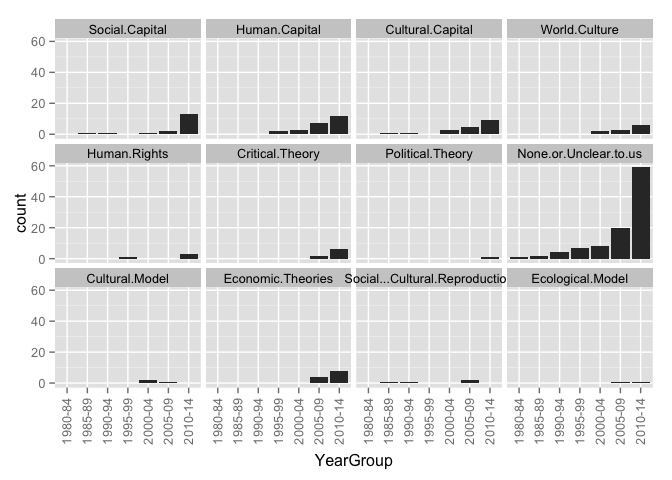 

### Counts for all entries

|        | Social.Capital| Human.Capital| Cultural.Capital| World.Culture| Human.Rights| Critical.Theory| Political.Theory| None.or.Unclear.to.us|
|:-------|--------------:|-------------:|----------------:|-------------:|------------:|---------------:|----------------:|---------------------:|
|1985-89 |              0|             0|                0|             0|            0|               0|                0|                     2|
|1990-94 |              1|             0|                0|             0|            0|               0|                0|                     4|
|1995-99 |              0|             2|                1|             0|            1|               0|                0|                     7|
|2000-04 |              1|             0|                3|             1|            0|               0|                0|                     7|
|2005-09 |              3|             7|                3|             0|            1|               1|                0|                    17|
|2010-14 |             11|            11|                8|             3|            3|               4|                1|                    54|

# Theoretical framework by research method
### Graphs for all entries
 

### Counts for all entries

|                      | Quantitative| Qualitative| Mixed| None.or.unclear|
|:---------------------|------------:|-----------:|-----:|---------------:|
|Social Capital        |            8|           8|     0|               0|
|Human Capital         |           13|           4|     2|               1|
|Cultural Capital      |            8|           6|     1|               0|
|World Culture         |            1|           1|     1|               1|
|Human Rights          |            2|           2|     1|               0|
|Critical Theory       |            0|           4|     1|               0|
|Political Theory      |            0|           1|     0|               0|
|None or Unclear to us |           32|          38|    20|               1|
|value                 |            0|           0|     0|               0|

# Theoretical framework by research approach
### Graphs for all entries
 

### Counts for all entries

|                      | Single.country...case| Comparative|
|:---------------------|---------------------:|-----------:|
|Social Capital        |                    11|           5|
|Human Capital         |                    13|           5|
|Cultural Capital      |                    11|           4|
|World Culture         |                     2|           2|
|Human Rights          |                     5|           0|
|Critical Theory       |                     3|           2|
|Political Theory      |                     0|           1|
|None or Unclear to us |                    74|          17|
|value                 |                     0|           0|

# Framing by region
### Graphs for all entries
 

### Counts for all entries

|                | MENA| Sub.Saharan| Cent..Asia| East.Asia| S..Asia| S.E..Asia| Aus....NZ| W..Europe| E..Europe| US...Can| LAC| Global|
|:---------------|----:|-----------:|----------:|---------:|-------:|---------:|---------:|---------:|---------:|--------:|---:|------:|
|Exam Prep       |   11|           3|          5|        46|      11|        13|         2|        18|        16|       18|   2|     16|
|Corruption      |    0|           0|          5|         5|       1|         5|         0|         1|         5|        0|   0|      8|
|Equity          |   12|           2|          6|        25|       6|        12|         1|        16|        16|        9|   3|     11|
|Economic        |    0|           1|          2|        23|       5|         8|         0|         5|         3|        7|   0|      7|
|Social Cohesion |    1|           0|          1|         3|       1|         1|         0|         1|         1|        0|   0|      1|
|Global Trend    |    2|           0|          1|        14|       6|         4|         0|         3|         4|        2|   2|     12|
|Household       |    2|           0|          1|        23|       5|        10|         0|         2|         4|        1|   1|      6|
|value           |    0|           0|          0|         0|       0|         0|         0|         0|         0|        0|   0|      0|

# Framing by year group
### Graphs for all entries
 

### Counts for all entries

|        | Related.to.curriculum.coverage...ed..quality...exam.prep| Corruption| Equity| Supply...Demand...Economic.Efficiency| Social.Cohesion| Global.Trend| Household.Expenditures|
|:-------|--------------------------------------------------------:|----------:|------:|-------------------------------------:|---------------:|------------:|----------------------:|
|1985-89 |                                                        3|          0|      2|                                     0|               1|            0|                      0|
|1990-94 |                                                        4|          0|      2|                                     1|               0|            0|                      2|
|1995-99 |                                                        7|          1|      4|                                     3|               0|            1|                      2|
|2000-04 |                                                       13|          0|      7|                                     2|               0|            4|                      2|
|2005-09 |                                                       35|          8|     25|                                    17|               3|           14|                     19|
|2010-14 |                                                       78|         14|     59|                                    30|               3|           21|                     27|

# Framed by research method
### Graphs for all entries
 

### Counts for all entries

|                | Quantitative| Qualitative| Mixed| None.or.unclear|
|:---------------|------------:|-----------:|-----:|---------------:|
|Exam Prep       |           59|          55|    23|               3|
|Corruption      |            4|          11|     8|               0|
|Equity          |           44|          40|    14|               1|
|Economic        |           23|          23|     4|               3|
|Social Cohesion |            1|           5|     1|               0|
|Global Trend    |           18|          16|     5|               1|
|Household       |           33|          10|     9|               0|
|value           |            0|           0|     0|               0|

# Framed by research approach
### Graphs for all entries
 

### Counts for all entries

|                | Single.country...case| Comparative|
|:---------------|---------------------:|-----------:|
|Exam Prep       |                   109|          30|
|Corruption      |                     8|          15|
|Equity          |                    72|          27|
|Economic        |                    40|          12|
|Social Cohesion |                     4|           3|
|Global Trend    |                    25|          15|
|Household       |                    44|           8|
|value           |                     0|           0|

# Framed by theory
### Graphs for all entries
 

### Counts for all entries

|                                                         | Social Capital| Human Capital| Cultural Capital| World Culture| Human Rights| Critical Theory| Political Theory| None or Unclear to us| value|
|:--------------------------------------------------------|--------------:|-------------:|----------------:|-------------:|------------:|---------------:|----------------:|---------------------:|-----:|
|Related.to.curriculum.coverage...ed..quality...exam.prep |             13|            14|               13|             4|            4|               4|                1|                    76|     0|
|Corruption                                               |              2|             5|                0|             1|            1|               1|                0|                    12|     0|
|Equity                                                   |             12|            11|                9|             1|            4|               4|                1|                    53|     0|
|Supply...Demand...Economic.Efficiency                    |              6|            13|                3|             2|            1|               0|                0|                    24|     0|
|Social.Cohesion                                          |              3|             2|                1|             0|            0|               0|                0|                     2|     0|
|Global.Trend                                             |              3|             7|                1|             4|            0|               0|                0|                    21|     0|
|Household.Expenditures                                   |              4|             8|                3|             0|            0|               0|                0|                    29|     0|

# How Viewed by region
### Graphs for all entries
 

### Counts for all entries

|                   | MENA| Sub.Saharan| Cent..Asia| East.Asia| S..Asia| S.E..Asia| Aus....NZ| W..Europe| E..Europe| US...Can| LAC| Global|
|:------------------|----:|-----------:|----------:|---------:|-------:|---------:|---------:|---------:|---------:|--------:|---:|------:|
|Raises concerns    |    6|           0|          1|        10|       4|         3|         0|         5|         3|       10|   2|      1|
|Discusses benefits |    0|           0|          0|         6|       1|         3|         1|         4|         1|        3|   0|      3|
|Both               |    4|           2|          5|        28|       5|        10|         1|        13|        14|        7|   0|     14|
|Neither            |    1|           1|          0|        11|       2|         0|         0|         2|         0|        3|   0|      0|
|value              |    0|           0|          0|         0|       0|         0|         0|         0|         0|        0|   0|      0|

# How Viewed by year group
### Graphs for all entries
 

### Counts for all entries

|        | Raises.concerns| Discusses.benefits| Both| Neither|
|:-------|---------------:|------------------:|----:|-------:|
|1985-89 |               1|                  0|    1|       1|
|1990-94 |               0|                  0|    4|       1|
|1995-99 |               3|                  1|    6|       1|
|2000-04 |               4|                  2|    6|       1|
|2005-09 |               6|                  4|   22|       5|
|2010-14 |              28|                  8|   49|      10|

# HowViewed by research method
### Graphs for all entries
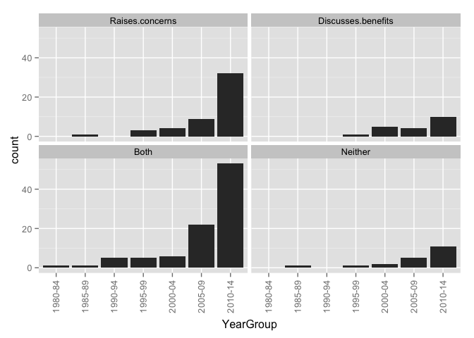 

### Counts for all entries

|                   | Quantitative| Qualitative| Mixed| None.or.unclear|
|:------------------|------------:|-----------:|-----:|---------------:|
|Raises concerns    |           16|          19|     6|               1|
|Discusses benefits |            6|           7|     2|               0|
|Both               |           38|          37|    11|               2|
|Neither            |            9|           4|     5|               1|
|value              |            0|           0|     0|               0|

# HowViewed by research approach
### Graphs for all entries
 

### Counts for all entries

|                   | Single.country...case| Comparative|
|:------------------|---------------------:|-----------:|
|Raises concerns    |                    36|           6|
|Discusses benefits |                    12|           3|
|Both               |                    61|          25|
|Neither            |                    18|           1|
|value              |                     0|           0|

# HowViewed by theory
### Graphs for all entries
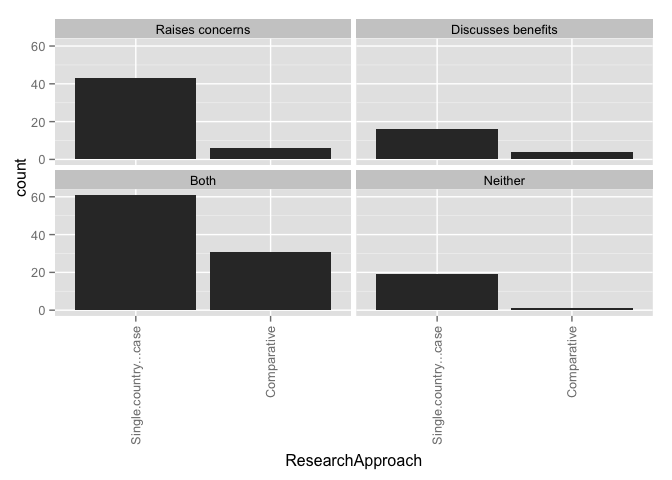 

### Counts for all entries

|                   | Social Capital| Human Capital| Cultural Capital| World Culture| Human Rights| Critical Theory| Political Theory| None or Unclear to us| value|
|:------------------|--------------:|-------------:|----------------:|-------------:|------------:|---------------:|----------------:|---------------------:|-----:|
|Raises.concerns    |              6|             5|                6|             0|            5|               1|                1|                    19|     0|
|Discusses.benefits |              0|             1|                2|             2|            0|               0|                0|                    10|     0|
|Both               |              9|            13|                6|             1|            0|               4|                0|                    46|     0|
|Neither            |              1|             1|                1|             1|            0|               0|                0|                    12|     0|

# How Viewed by Framed
### Graphs for all entries
 

### Counts for all entries

|                                                         | Raises concerns| Discusses benefits| Both| Neither| value|
|:--------------------------------------------------------|---------------:|------------------:|----:|-------:|-----:|
|Related.to.curriculum.coverage...ed..quality...exam.prep |              39|                 11|   67|      17|     0|
|Corruption                                               |               5|                  0|   17|       0|     0|
|Equity                                                   |              32|                  3|   57|       3|     0|
|Supply...Demand...Economic.Efficiency                    |              10|                  6|   31|       5|     0|
|Social.Cohesion                                          |               2|                  1|    4|       0|     0|
|Global.Trend                                             |               9|                  5|   23|       2|     0|
|Household.Expenditures                                   |              10|                  1|   30|       6|     0|

# Stakeholders by region
### Graphs for all entries
 

### Counts for all entries

|                      | MENA| Sub.Saharan| Cent..Asia| East.Asia| S..Asia| S.E..Asia| Aus....NZ| W..Europe| E..Europe| US...Can| LAC| Global|
|:---------------------|----:|-----------:|----------:|---------:|-------:|---------:|---------:|---------:|---------:|--------:|---:|------:|
|Non-tutor teachers    |    4|           0|          0|        13|       2|         3|         1|         2|         5|        2|   1|      1|
|Teachers who tutor    |    5|           1|          0|        16|       2|         4|         1|         3|         5|        4|   1|      1|
|Tutors                |    2|           1|          0|         4|       1|         0|         0|         2|         2|        1|   0|      0|
|Parents               |    5|           2|          1|        21|       4|         9|         1|         6|         4|        6|   1|      1|
|Students              |    5|           0|          4|        32|       5|         7|         2|        10|         8|       10|   2|      4|
|School admin          |    1|           0|          0|         9|       0|         1|         0|         0|         0|        2|   0|      0|
|Tutoring center admin |    0|           0|          0|         1|       0|         0|         0|         1|         0|        1|   0|      0|
|Academic scholar(s)   |    0|           0|          0|         1|       0|         0|         0|         0|         0|        0|   0|      0|
|Policymakers          |    1|           1|          0|         3|       0|         2|         0|         0|         1|        1|   0|      0|
|Documents             |    4|           0|          2|        13|       5|         3|         0|        12|         8|        9|   1|     14|
|value                 |    0|           0|          0|         0|       0|         0|         0|         0|         0|        0|   0|      0|

# Stakeholders by year group
### Graphs for all entries
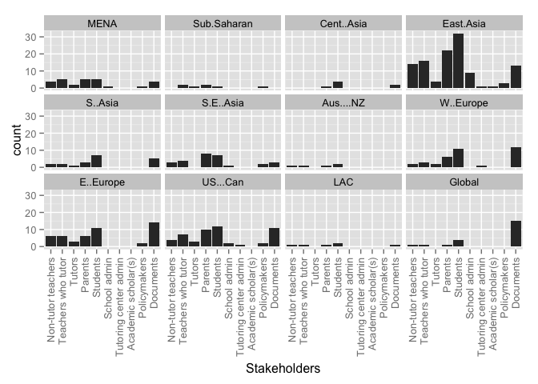 

### Counts for all entries

|        | Teachers.who.do.not.tutor| Teachers.who.tutor| Tutors.who.are.not.teachers| School.administrators| Tutoring.center.admin| Academic.scholars| Parents...household| Students| Policymakers| Documents|
|:-------|-------------------------:|------------------:|---------------------------:|---------------------:|---------------------:|-----------------:|-------------------:|--------:|------------:|---------:|
|1985-89 |                         1|                  2|                           0|                     0|                     0|                 0|                   0|        3|            0|         0|
|1990-94 |                         0|                  0|                           1|                     0|                     0|                 0|                   1|        4|            0|         1|
|1995-99 |                         2|                  3|                           0|                     1|                     0|                 0|                   3|        3|            3|         5|
|2000-04 |                         2|                  3|                           2|                     2|                     1|                 1|                   3|        7|            1|         4|
|2005-09 |                         8|                 11|                           2|                     4|                     2|                 0|                  12|       20|            1|        11|
|2010-14 |                        14|                 17|                           6|                     6|                     0|                 0|                  36|       42|            4|        34|

# Stakeholders by theory
### Graphs for all entries
 

### Counts for all entries

|                      | Non-tutor teachers| Tutors who tutor| Tutors| Parents| Students| Policymakers| Documents| value|
|:---------------------|------------------:|----------------:|------:|-------:|--------:|------------:|---------:|-----:|
|Social.Capital        |                  2|                1|      0|       5|        6|            0|         5|     0|
|Human.Capital         |                  0|                1|      0|       7|        7|            1|         7|     0|
|Cultural.Capital      |                  3|                4|      2|       4|        8|            1|         3|     0|
|World.Culture         |                  0|                0|      0|       0|        1|            0|         3|     0|
|Human.Rights          |                  1|                2|      0|       2|        2|            0|         3|     0|
|Critical.Theory       |                  1|                1|      0|       0|        2|            0|         2|     0|
|Political.Theory      |                  0|                0|      0|       0|        0|            0|         1|     0|
|None.or.Unclear.to.us |                 10|               15|      5|      28|       41|            5|        31|     0|
|School.administrators |                  8|                9|      3|      10|       10|            3|         2|     0|
|Tutoring.center.admin |                  0|                2|      1|       1|        1|            1|         0|     0|
|Academic.scholars     |                  0|                1|      1|       1|        1|            1|         0|     0|

# WhatTaught by region
### Graphs for all entries
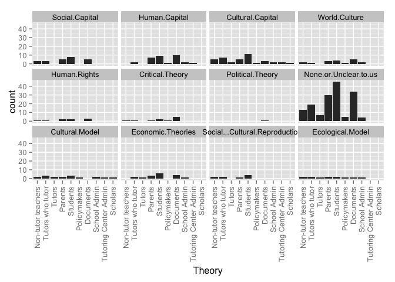 

### Counts for all entries

|                 | MENA| Sub.Saharan| Cent..Asia| East.Asia| S..Asia| S.E..Asia| Aus....NZ| W..Europe| E..Europe| US...Can| LAC| Global|
|:----------------|----:|-----------:|----------:|---------:|-------:|---------:|---------:|---------:|---------:|--------:|---:|------:|
|School subjects  |   11|           2|          4|        50|      10|        11|         2|        18|        16|       20|   3|     17|
|Extracurriculars |    0|           0|          0|         0|       0|         0|         0|         3|         0|        0|   0|      0|
|Both             |    0|           1|          2|         6|       2|         5|         0|         3|         2|        2|   0|      0|
|Not defined      |    1|           0|          0|         0|       0|         2|         0|         0|         0|        0|   0|      2|
|value            |    0|           0|          0|         0|       0|         0|         0|         0|         0|        0|   0|      0|

WhatTaught by year group
### Graphs for all entries
 

### Counts for all entries

|        | Subjects.taught.in.school| Extracurricular.activities| Both| Not.defined|
|:-------|-------------------------:|--------------------------:|----:|-----------:|
|1985-89 |                         3|                          0|    0|           0|
|1990-94 |                         4|                          0|    1|           0|
|1995-99 |                         8|                          0|    1|           2|
|2000-04 |                        12|                          1|    0|           0|
|2005-09 |                        34|                          1|    3|           2|
|2010-14 |                        85|                          1|   10|           1|

# WhatTaught by theory
### Graphs for all entries
 

### Counts for all entries

|                      | School subjects| Extracurriculars| Both| Not defined| value|
|:---------------------|---------------:|----------------:|----:|-----------:|-----:|
|Social.Capital        |              12|                0|    3|           1|     0|
|Human.Capital         |              16|                0|    2|           2|     0|
|Cultural.Capital      |              12|                2|    1|           0|     0|
|World.Culture         |               4|                0|    0|           0|     0|
|Human.Rights          |               5|                0|    0|           0|     0|
|Critical.Theory       |               4|                0|    1|           0|     0|
|Political.Theory      |               1|                0|    0|           0|     0|
|None.or.Unclear.to.us |              77|                1|    9|           3|     0|

# WhereOccur by region
### Graphs for all entries
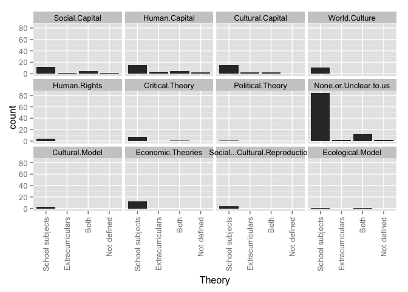 

### Counts for all entries

|                  | MENA| Sub.Saharan| Cent..Asia| East.Asia| S..Asia| S.E..Asia| Aus....NZ| W..Europe| E..Europe| US...Can| LAC| Global|
|:-----------------|----:|-----------:|----------:|---------:|-------:|---------:|---------:|---------:|---------:|--------:|---:|------:|
|On school grounds |    4|           2|          5|        11|       2|         8|         1|         5|        10|        4|   1|      7|
|Designated center |    8|           1|          1|        32|       5|         7|         1|        14|         7|       17|   2|      8|
|Web               |    3|           0|          1|        12|       2|         2|         0|         5|         6|        5|   0|      7|
|Student's home    |    6|           2|          5|        14|       5|         6|         1|         9|        11|        5|   0|      7|
|Outside school    |    5|           0|          4|        20|       6|         4|         1|        10|        11|        7|   2|     10|
|Not defined       |    3|           1|          1|        18|       5|         8|         1|         7|         4|        3|   1|      6|
|value             |    0|           0|          0|         0|       0|         0|         0|         0|         0|        0|   0|      0|

# WhereOccur by year group
### Graphs for all entries
 

### Counts for all entries

|        | On.school.grounds| Designated.tutoring.center.or.franchise| On.line...via.web| In.the.student.s.home| Other.outside.school| Not.defined|
|:-------|-----------------:|---------------------------------------:|-----------------:|---------------------:|--------------------:|-----------:|
|1985-89 |                 0|                                       1|                 0|                     1|                    0|           2|
|1990-94 |                 0|                                       4|                 0|                     3|                    3|           1|
|1995-99 |                 2|                                       7|                 0|                     0|                    2|           5|
|2000-04 |                 3|                                       7|                 2|                     6|                    8|           1|
|2005-09 |                 9|                                      13|                 3|                    10|                   12|          19|
|2010-14 |                30|                                      56|                27|                    34|                   41|          26|

# WhereOccur by theory
### Graphs for all entries
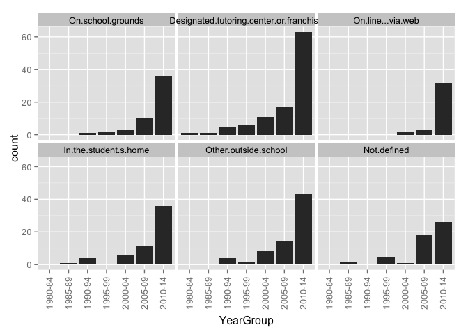 

### Counts for all entries

|                      | On school grounds| Designated center| Web| Student's home| Outside school| Not defined| value|
|:---------------------|-----------------:|-----------------:|---:|--------------:|--------------:|-----------:|-----:|
|Social.Capital        |                 4|                 8|   3|              8|              6|           5|     0|
|Human.Capital         |                 6|                11|   6|              6|              7|           5|     0|
|Cultural.Capital      |                 2|                11|   1|              4|              3|           3|     0|
|World.Culture         |                 2|                 2|   2|              2|              2|           0|     0|
|Human.Rights          |                 1|                 2|   0|              0|              1|           2|     0|
|Critical.Theory       |                 3|                 1|   1|              2|              2|           2|     0|
|Political.Theory      |                 1|                 1|   1|              1|              1|           0|     0|
|None.or.Unclear.to.us |                25|                49|  19|             33|             41|          28|     0|

# WhoProvides by region
### Graphs for all entries
 

### Counts for all entries

|                | MENA| Sub.Saharan| Cent..Asia| East.Asia| S..Asia| S.E..Asia| Aus....NZ| W..Europe| E..Europe| US...Can| LAC| Global|
|:---------------|----:|-----------:|----------:|---------:|-------:|---------:|---------:|---------:|---------:|--------:|---:|------:|
|Current teacher |    4|           2|          5|        15|       7|        11|         1|         5|        13|        1|   1|     14|
|Other k-12      |    5|           2|          5|        16|       8|         9|         1|         6|        14|        4|   1|     12|
|Retired teacher |    1|           0|          1|         7|       4|         2|         0|         7|         4|        2|   1|      6|
|Univ. faculty   |    1|           0|          2|         3|       3|         2|         0|         4|         6|        0|   0|      9|
|Professional    |    7|           1|          4|        29|       6|         6|         0|        14|        11|       11|   0|     12|
|Col. student    |    1|           0|          1|         8|       3|         2|         0|         6|         2|        2|   0|      6|
|Peer            |    2|           0|          1|         2|       4|         1|         0|         2|         2|        0|   0|      0|
|Family          |    0|           0|          1|         2|       3|         1|         0|         0|         0|        0|   0|      0|
|Community       |    0|           0|          1|         1|       5|         1|         0|         1|         1|        1|   0|      3|
|Not defined     |    3|           0|          1|        21|       3|         7|         1|         9|         4|       10|   2|      4|
|value           |    0|           0|          0|         0|       0|         0|         0|         0|         0|        0|   0|      0|

# WhoProvides by year group
### Graphs for all entries
 

### Counts for all entries

|        | Current.classroom.teacher| Other.K.12.teachers| Retired.teacher| University.faculty| Institution...Professional.tutor| College.student| Peer.classmate| Parent.or.family.member| Community.member...volunteer| Not.defined|
|:-------|-------------------------:|-------------------:|---------------:|------------------:|--------------------------------:|---------------:|--------------:|-----------------------:|----------------------------:|-----------:|
|1985-89 |                         1|                   1|               1|                  0|                                1|               1|              0|                       0|                            0|           1|
|1990-94 |                         0|                   1|               0|                  0|                                3|               0|              0|                       1|                            1|           1|
|1995-99 |                         5|                   2|               1|                  0|                                6|               1|              1|                       0|                            0|           1|
|2000-04 |                         4|                   5|               4|                  1|                                9|               0|              0|                       0|                            0|           3|
|2005-09 |                        19|                  18|               6|                  9|                               18|               4|              3|                       1|                            5|          15|
|2010-14 |                        33|                  39|              17|                 13|                               50|              19|              4|                       2|                            5|          35|

# WhoProvides by theory
### Graphs for all entries
 

### Counts for all entries

|                      | Current teacher| Other k-12| Retired teacher| Univ. faculty| Professional| Col. student| Peer| Family| Community| Not defined| value|
|:---------------------|---------------:|----------:|---------------:|-------------:|------------:|------------:|----:|------:|---------:|-----------:|-----:|
|Social.Capital        |               3|          4|               2|             3|            8|            2|    1|      1|         1|           7|     0|
|Human.Capital         |               9|          9|               4|             5|           10|            3|    1|      1|         3|           8|     0|
|Cultural.Capital      |               3|          4|               5|             2|            9|            3|    0|      0|         1|           5|     0|
|World.Culture         |               1|          1|               1|             0|            1|            1|    0|      0|         0|           3|     0|
|Human.Rights          |               1|          0|               0|             0|            2|            0|    0|      0|         0|           2|     0|
|Critical.Theory       |               4|          3|               2|             1|            1|            1|    0|      0|         0|           1|     0|
|Political.Theory      |               0|          0|               0|             0|            0|            0|    0|      0|         0|           1|     0|
|None.or.Unclear.to.us |              36|         39|              16|            15|           50|           15|    5|      3|         6|          27|     0|

# DoesCharge by region
### Graphs for all entries
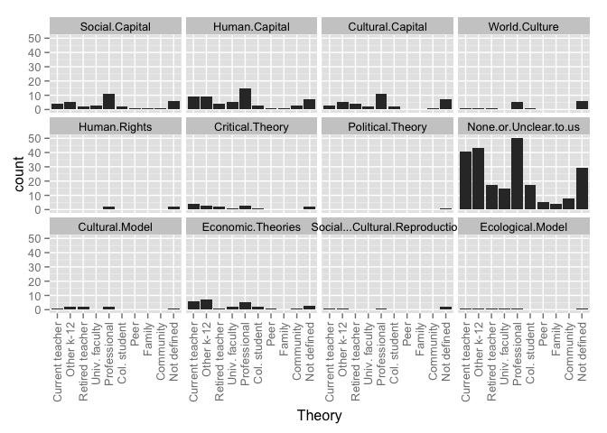 

### Counts for all entries

|                             | MENA| Sub.Saharan| Cent..Asia| East.Asia| S..Asia| S.E..Asia| Aus....NZ| W..Europe| E..Europe| US...Can| LAC| Global|
|:----------------------------|----:|-----------:|----------:|---------:|-------:|---------:|---------:|---------:|---------:|--------:|---:|------:|
|                             |    0|           0|          0|         0|       0|         0|         0|         0|         0|        0|   0|      0|
|Both                         |    1|           1|          1|         0|       3|         2|         1|         3|         2|        3|   0|      1|
|No, they do not charge a fee |    0|           0|          0|         0|       0|         0|         0|         0|         0|        1|   0|      0|
|Not defined                  |    2|           0|          0|         5|       1|         2|         0|         1|         0|        4|   0|      2|
|Yes, they charge a fee       |    9|           2|          5|        51|       8|        14|         1|        20|        16|       15|   3|     16|

# DoesCharge by year group
### Graphs for all entries
 

### Counts for all entries

|        |   | Both| No, they do not charge a fee| Not defined| Yes, they charge a fee|
|:-------|--:|----:|----------------------------:|-----------:|----------------------:|
|1985-89 |  0|    0|                            0|           0|                      3|
|1990-94 |  0|    0|                            0|           0|                      5|
|1995-99 |  0|    0|                            1|           2|                      9|
|2000-04 |  0|    1|                            0|           1|                     11|
|2005-09 |  0|    5|                            0|           5|                     30|
|2010-14 |  0|    9|                            0|           5|                     83|

# DoesCharge by WhoProvides
### Graphs for all entries
 

### Counts for all entries

|                             | Current.classroom.teacher| Other.K.12.teachers| Retired.teacher| University.faculty| Institution...Professional.tutor| College.student| Peer.classmate| Parent.or.family.member| Community.member...volunteer| Not.defined|
|:----------------------------|-------------------------:|-------------------:|---------------:|------------------:|--------------------------------:|---------------:|--------------:|-----------------------:|----------------------------:|-----------:|
|                             |                         0|                   0|               0|                  0|                                0|               0|              0|                       0|                            0|           0|
|Both                         |                        10|                  10|               5|                  3|                                8|               3|              2|                       1|                            4|           3|
|No, they do not charge a fee |                         1|                   0|               1|                  0|                                0|               1|              0|                       0|                            0|           0|
|Not defined                  |                         3|                   1|               0|                  0|                                1|               0|              0|                       0|                            0|           9|
|Yes, they charge a fee       |                        48|                  55|              23|                 20|                               78|              21|              6|                       3|                            7|          44|

# ClassSize by Region
### Graphs for all entries
 

### Counts for all entries

|                              | MENA| Sub.Saharan| Cent..Asia| East.Asia| S..Asia| S.E..Asia| Aus....NZ| W..Europe| E..Europe| US...Can| LAC| Global|
|:-----------------------------|----:|-----------:|----------:|---------:|-------:|---------:|---------:|---------:|---------:|--------:|---:|------:|
|                              |    0|           0|          0|         0|       0|         0|         0|         0|         0|        0|   0|      0|
|Individual 1-on-1 instruction |    0|           0|          0|         0|       0|         0|         0|         1|         0|        0|   0|      0|
|Large groups                  |    0|           0|          0|         0|       0|         0|         0|         0|         0|        1|   0|      0|
|Small groups                  |    0|           0|          0|         0|       1|         1|         0|         2|         0|        4|   0|      0|
|Unclear                       |    3|           1|          1|        13|       2|         5|         0|         4|         1|        6|   1|      2|
|Various class sizes discussed |    9|           2|          5|        42|       9|        12|         2|        17|        17|       12|   2|     17|

# OperationSize by region
### Graphs for all entries
 

### Counts for all entries

|            | Not.defined.or.unclear| MENA| Sub.Saharan| Cent..Asia| East.Asia| S..Asia| S.E..Asia| Aus....NZ| W..Europe| E..Europe| US...Can| LAC| Global|
|:-----------|----------------------:|----:|-----------:|----------:|---------:|-------:|---------:|---------:|---------:|---------:|--------:|---:|------:|
|Individual  |                      0|    1|           0|          0|         1|       1|         3|         0|         2|         3|        1|   0|      1|
|Small firms |                      0|    2|           0|          0|         5|       0|         1|         0|         3|         1|        2|   0|      0|
|Large firm  |                      0|    1|           0|          0|         3|       0|         0|         0|         1|         0|        5|   0|      0|
|Various     |                      0|    9|           2|          6|        42|       8|        12|         2|        18|        15|       14|   2|     18|
|value       |                      0|    0|           0|          0|         0|       0|         0|         0|         0|         0|        0|   0|      0|

# Why Taking by region
### Graphs for all entries
 

### Counts for all entries

|                              | MENA| Sub.Saharan| Cent..Asia| East.Asia| S..Asia| S.E..Asia| Aus....NZ| W..Europe| E..Europe| US...Can| LAC| Global|
|:-----------------------------|----:|-----------:|----------:|---------:|-------:|---------:|---------:|---------:|---------:|--------:|---:|------:|
|Student falls behind          |    8|           2|          4|        36|      10|        11|         1|        13|        11|       18|   2|     15|
|Preparation for exams         |   10|           3|          5|        54|      12|        12|         1|        15|        15|       17|   3|     15|
|Make up for perceived failure |    8|           2|          6|        41|      11|        13|         0|        10|        10|       14|   1|     17|
|For cultural reasons          |    0|           0|          1|        26|       5|         7|         0|         4|         0|        5|   0|      7|
|Enrichment activities         |    0|           1|          1|         5|       2|         3|         0|         1|         1|        2|   0|      0|
|Peer pressure                 |    1|           0|          1|        12|       2|         2|         1|         3|         2|        0|   0|      4|
|Teacher pressure              |    2|           0|          1|         8|       2|         3|         0|         3|         4|        0|   0|      3|
|Not stated or unclear         |    2|           0|          0|         0|       0|         1|         0|         2|         2|        0|   0|      0|
|value                         |    0|           0|          0|         0|       0|         0|         0|         0|         0|        0|   0|      0|

# Why Taking by year group
### Graphs for all entries
 

### Counts for all entries

|        | Student.falls.behind.and.needs.extra.help| Preparation.for.exams.to.make.student.more.competitive| Make.up.for.perceived.failure.in.the.mainstream.system...school| For.cultural.reasons| To.provide.extra.enrichment.activities| Peer.pressure| Teacher.pressure| Not.stated.or.unclear|
|:-------|-----------------------------------------:|------------------------------------------------------:|---------------------------------------------------------------:|--------------------:|--------------------------------------:|-------------:|----------------:|---------------------:|
|1985-89 |                                         2|                                                      3|                                                               1|                    0|                                      0|             1|                1|                     0|
|1990-94 |                                         3|                                                      5|                                                               3|                    0|                                      0|             1|                1|                     0|
|1995-99 |                                         5|                                                      6|                                                               8|                    1|                                      1|             0|                1|                     1|
|2000-04 |                                        11|                                                     10|                                                               9|                    7|                                      0|             3|                0|                     0|
|2005-09 |                                        23|                                                     31|                                                              27|                   12|                                      3|             4|                2|                     2|
|2010-14 |                                        66|                                                     85|                                                              61|                   27|                                      6|            13|               12|                     2|

# WhyTaking by research method
### Graphs for all entries
 

### Counts for all entries

|                              | Quantitative| Qualitative| Mixed| None.or.unclear|
|:-----------------------------|------------:|-----------:|-----:|---------------:|
|Student falls behind          |           39|          50|    17|               4|
|Preparation for exams         |           61|          54|    22|               3|
|Make up for perceived failure |           44|          47|    14|               4|
|For cultural reasons          |           23|          17|     7|               0|
|Enrichment activities         |            3|           6|     1|               0|
|Peer pressure                 |            8|           9|     5|               0|
|Teacher pressure              |            3|           9|     5|               0|
|Not stated or unclear         |            1|           2|     2|               0|
|value                         |            0|           0|     0|               0|

# WhyTaking by research approach
### Graphs for all entries
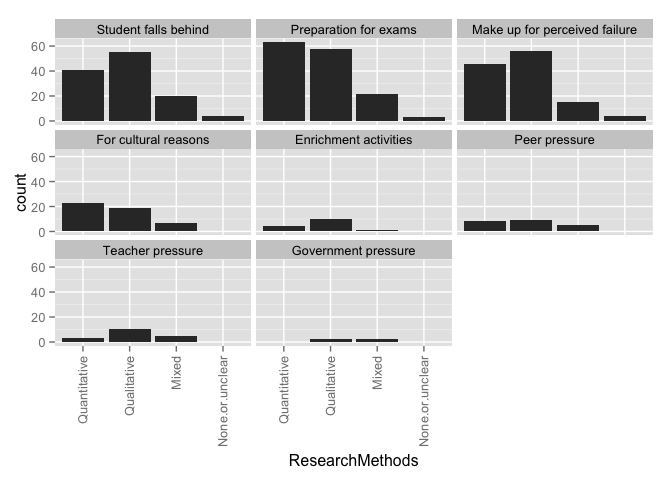 

### Counts for all entries

|                              | Single.country...case| Comparative|
|:-----------------------------|---------------------:|-----------:|
|Student falls behind          |                    78|          31|
|Preparation for exams         |                   108|          31|
|Make up for perceived failure |                    78|          29|
|For cultural reasons          |                    34|          13|
|Enrichment activities         |                     7|           3|
|Peer pressure                 |                    15|           7|
|Teacher pressure              |                     7|          10|
|Not stated or unclear         |                     4|           1|
|value                         |                     0|           0|

# WhyTaking by theory
### Graphs for all entries
 

### Counts for all entries

|                              | Social.Capital| Human.Capital| Cultural.Capital| World.Culture| Human.Rights| Critical.Theory| Political.Theory| None.or.Unclear.to.us|
|:-----------------------------|--------------:|-------------:|----------------:|-------------:|------------:|---------------:|----------------:|---------------------:|
|Student falls behind          |             10|            16|                8|             3|            1|               3|                1|                    57|
|Preparation for exams         |             14|            18|               13|             3|            3|               3|                1|                    74|
|Make up for perceived failure |              9|            15|                8|             3|            2|               4|                1|                    53|
|For cultural reasons          |              4|             7|               10|             0|            0|               0|                0|                    23|
|Enrichment activities         |              2|             1|                1|             0|            0|               0|                0|                     6|
|Peer pressure                 |              3|             3|                1|             1|            0|               1|                1|                    12|
|Teacher pressure              |              2|             3|                0|             1|            0|               1|                1|                    10|
|Not stated or unclear         |              0|             0|                0|             0|            0|               1|                0|                     4|
|value                         |             16|            20|               15|             4|            5|               5|                1|                    91|

# Why Taking by Framed
### Graphs for all entries
 

### Counts for all entries

|                                                         | Student falls behind| Preparation for exams| Make up for perceived failure| For cultural reasons| Enrichment activities| Peer pressure| Teacher pressure| Not stated or unclear| value|
|:--------------------------------------------------------|--------------------:|---------------------:|-----------------------------:|--------------------:|---------------------:|-------------:|----------------:|---------------------:|-----:|
|Related.to.curriculum.coverage...ed..quality...exam.prep |                   98|                   119|                            93|                   41|                     4|            21|               17|                     5|     0|
|Corruption                                               |                   19|                    20|                            16|                    7|                     4|             5|                8|                     0|     0|
|Equity                                                   |                   68|                    86|                            66|                   22|                     5|            13|               14|                     2|     0|
|Supply...Demand...Economic.Efficiency                    |                   36|                    46|                            39|                   17|                     5|             7|                5|                     0|     0|
|Social.Cohesion                                          |                    5|                     6|                             6|                    3|                     2|             1|                1|                     0|     0|
|Global.Trend                                             |                   31|                    35|                            30|                   13|                     3|             9|               10|                     0|     0|
|Household.Expenditures                                   |                   29|                    45|                            35|                   20|                     3|            12|               10|                     2|     0|
