# Relationships for All English-language Articles

### TOTAL NUMBER OF ARTICLES: 188
This number includes 153 articles with duplicate ID numbers. A full list of duplicate articles can be found [here](https://github.com/MikeRussellMcK/PTAnalysis/blob/master/Markdown%20and%20Output/Duplicates.md). 
Document was last updated on 2015-01-24 07:12:30.

# _Region by year group_ for all entries in the database:

### Graphs for all entries
 

### Counts for all entries

|        | MENA| Sub.Saharan| Cent..Asia| East.Asia| S..Asia| S.E..Asia| Aus....NZ| W..Europe| E..Europe| US...Can| LAC| Global|
|:-------|----:|-----------:|----------:|---------:|-------:|---------:|---------:|---------:|---------:|--------:|---:|------:|
|1980-84 |    0|           0|          0|         1|       0|         0|         0|         0|         0|        0|   0|      0|
|1985-89 |    1|           0|          0|         2|       0|         0|         0|         0|         0|        0|   0|      0|
|1990-94 |    0|           0|          0|         2|       1|         1|         0|         0|         0|        0|   0|      1|
|1995-99 |    1|           0|          0|         3|       0|         1|         0|         1|         0|        2|   0|      3|
|2000-04 |    0|           1|          0|         4|       2|         0|         0|         3|         3|        3|   0|      2|
|2005-09 |    0|           1|          2|         8|       6|         6|         1|         4|         6|        9|   0|      5|
|2010-14 |    9|           2|          5|        37|       5|        10|         1|        17|        16|       17|   3|      9|

# _Region by publication type_: 

### Graphs for all entries
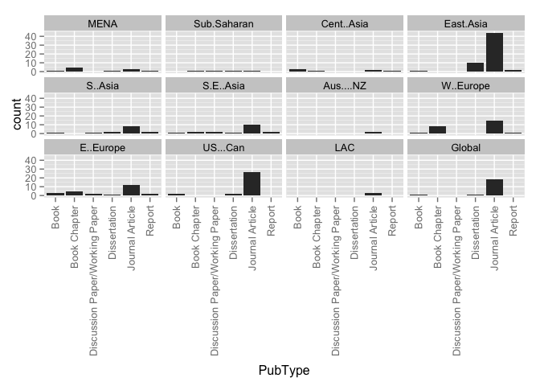 

### Counts for all entries

|                               | MENA| Sub.Saharan| Cent..Asia| East.Asia| S..Asia| S.E..Asia| Aus....NZ| W..Europe| E..Europe| US...Can| LAC| Global|
|:------------------------------|----:|-----------:|----------:|---------:|-------:|---------:|---------:|---------:|---------:|--------:|---:|------:|
|Book                           |    1|           0|          3|         1|       1|         1|         0|         1|         3|        2|   0|      1|
|Book Chapter                   |    5|           1|          1|         0|       0|         2|         0|         8|         5|        0|   0|      0|
|Discussion Paper/Working Paper |    0|           1|          0|         0|       1|         2|         0|         0|         2|        0|   0|      0|
|Dissertation                   |    1|           1|          0|        10|       2|         1|         0|         0|         1|        2|   0|      1|
|Journal Article                |    3|           1|          2|        44|       8|        10|         2|        15|        12|       27|   3|     18|
|Master's Thesis                |    0|           0|          0|         0|       0|         0|         0|         0|         0|        0|   0|      0|
|Report                         |    1|           0|          1|         2|       2|         2|         0|         1|         2|        0|   0|      0|

# _Publication type by year group_ for all entries in the database:

### Graphs for all entries
 

### Counts for all entries

|        | Book| Book Chapter| Discussion Paper/Working Paper| Dissertation| Journal Article| Master's Thesis| Report|
|:-------|----:|------------:|------------------------------:|------------:|---------------:|---------------:|------:|
|1980-84 |    0|            0|                              0|            0|               1|               0|      0|
|1985-89 |    0|            0|                              0|            1|               2|               0|      0|
|1990-94 |    0|            0|                              0|            0|               5|               0|      0|
|1995-99 |    0|            0|                              0|            2|               7|               0|      2|
|2000-04 |    0|            1|                              0|            2|              14|               0|      0|
|2005-09 |    3|            1|                              4|            6|              28|               0|      1|
|2010-14 |    5|           14|                              2|            8|              75|               0|      4|

# _Research type by region_ for all entries in the database

### Graphs for all entries
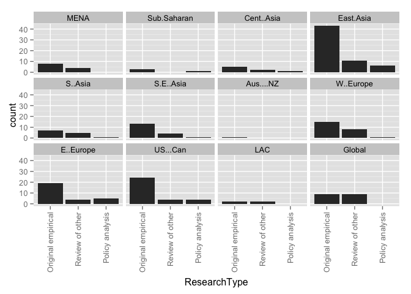 

### Counts for all entries

|            | Original empirical| Review of other| Policy analysis| value|
|:-----------|------------------:|---------------:|---------------:|-----:|
|MENA        |                  8|               4|               0|     0|
|Sub.Saharan |                  3|               0|               1|     0|
|Cent..Asia  |                  5|               2|               1|     0|
|East.Asia   |                 43|              11|               6|     0|
|S..Asia     |                  7|               5|               1|     0|
|S.E..Asia   |                 13|               4|               1|     0|
|Aus....NZ   |                  1|               0|               0|     0|
|W..Europe   |                 15|               8|               1|     0|
|E..Europe   |                 19|               4|               5|     0|
|US...Can    |                 24|               4|               4|     0|
|LAC         |                  2|               2|               0|     0|
|Global      |                  9|               9|               0|     0|

# _Research type by year group_ for all entries in the database

### Graphs for all entries
 

### Counts for all entries

|        | Original.empirical.research| Review.of.other.research| Policy.analysis|
|:-------|---------------------------:|------------------------:|---------------:|
|1980-84 |                           1|                        0|               0|
|1985-89 |                           3|                        0|               0|
|1990-94 |                           4|                        1|               0|
|1995-99 |                          10|                        1|               0|
|2000-04 |                           9|                        3|               2|
|2005-09 |                          33|                        5|               4|
|2010-14 |                          77|                       27|               8|

# _Ed levels by region_ 

### Graphs for all entries
 

### Counts for all entries

|            | Pre-primary| Primary| Secondary| Tertiary| Vocational| value|
|:-----------|-----------:|-------:|---------:|--------:|----------:|-----:|
|MENA        |           0|       8|        11|        0|          0|     0|
|Sub.Saharan |           0|       1|         4|        0|          0|     0|
|Cent..Asia  |           0|       5|         6|        0|          0|     0|
|East.Asia   |           2|      28|        55|        1|          0|     0|
|S..Asia     |           3|       8|        12|        0|          0|     0|
|S.E..Asia   |           1|      17|        13|        0|          0|     0|
|Aus....NZ   |           0|       0|         2|        0|          0|     0|
|W..Europe   |           1|      17|        25|        2|          0|     0|
|E..Europe   |           1|      13|        24|        6|          3|     0|
|US...Can    |           3|      21|        28|        2|          0|     0|
|LAC         |           0|       2|         3|        0|          0|     0|
|Global      |           3|      17|        18|        0|          0|     0|

# _Research approach by region_
### Graphs for all entries
 

### Counts for all entries

|            | Single-country| Comparative| value|
|:-----------|--------------:|-----------:|-----:|
|MENA        |              8|           3|     0|
|Sub.Saharan |              4|           0|     0|
|Cent..Asia  |              1|           6|     0|
|East.Asia   |             44|          13|     0|
|S..Asia     |              9|           5|     0|
|S.E..Asia   |             12|           6|     0|
|Aus....NZ   |              2|           0|     0|
|W..Europe   |             21|           4|     0|
|E..Europe   |             15|          10|     0|
|US...Can    |             26|           5|     0|
|LAC         |              3|           0|     0|
|Global      |              0|          19|     0|

# Research approach by year group
### Graphs for all entries
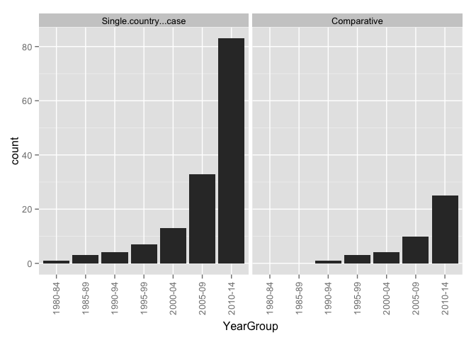 

### Counts for all entries

|        | Single.country...case| Comparative|
|:-------|---------------------:|-----------:|
|1980-84 |                     1|           0|
|1985-89 |                     3|           0|
|1990-94 |                     4|           1|
|1995-99 |                     7|           3|
|2000-04 |                    13|           4|
|2005-09 |                    33|          10|
|2010-14 |                    83|          25|

# Research methods by year group
### Graphs for all entries
 

### Counts for all entries

|        | Mixed-methods| None or Unclear to us| Qualitative| Quantitative|
|:-------|-------------:|---------------------:|-----------:|------------:|
|1980-84 |             0|                     0|           1|            0|
|1985-89 |             1|                     0|           1|            1|
|1990-94 |             1|                     0|           2|            2|
|1995-99 |             3|                     2|           2|            4|
|2000-04 |             1|                     0|           9|            7|
|2005-09 |             7|                     0|          14|           22|
|2010-14 |            16|                     2|          52|           38|

# Research methods by region
### Graphs for all entries
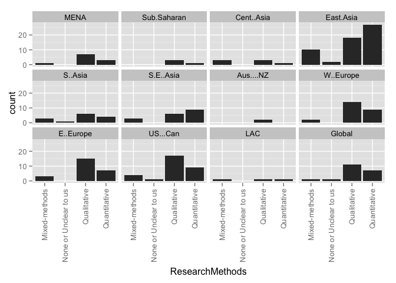 

### Counts for all entries

|            | Mixed-methods| None or Unclear to us| Qualitative| Quantitative|
|:-----------|-------------:|---------------------:|-----------:|------------:|
|MENA        |             1|                     0|           7|            3|
|Sub.Saharan |             0|                     0|           3|            1|
|Cent..Asia  |             3|                     0|           3|            1|
|East.Asia   |            10|                     2|          18|           27|
|S..Asia     |             3|                     1|           6|            4|
|S.E..Asia   |             3|                     0|           6|            9|
|Aus....NZ   |             0|                     0|           2|            0|
|W..Europe   |             2|                     0|          14|            9|
|E..Europe   |             3|                     0|          15|            7|
|US...Can    |             4|                     1|          17|            9|
|LAC         |             1|                     0|           1|            1|
|Global      |             1|                     1|          11|            7|

# Research methods by year group
### Graph for all entries
 

### Counts for all entries

|        | Mixed-methods| None or Unclear to us| Qualitative| Quantitative|
|:-------|-------------:|---------------------:|-----------:|------------:|
|1980-84 |             0|                     0|           1|            0|
|1985-89 |             1|                     0|           1|            1|
|1990-94 |             1|                     0|           2|            2|
|1995-99 |             3|                     2|           2|            4|
|2000-04 |             1|                     0|           9|            7|
|2005-09 |             7|                     0|          14|           22|
|2010-14 |            16|                     2|          52|           38|

# Research methods by publication type
### Graph for all entries
 

### Counts for all entries

|                               | Mixed-methods| None or Unclear to us| Qualitative| Quantitative|
|:------------------------------|-------------:|---------------------:|-----------:|------------:|
|Book                           |             3|                     0|           5|            0|
|Book Chapter                   |             1|                     0|          12|            3|
|Discussion Paper/Working Paper |             0|                     0|           1|            5|
|Dissertation                   |             4|                     0|           4|           11|
|Journal Article                |            19|                     4|          56|           53|
|Master's Thesis                |             0|                     0|           0|            0|
|Report                         |             2|                     0|           3|            2|

# Theoreortical framework by region
### Graphs for all entries
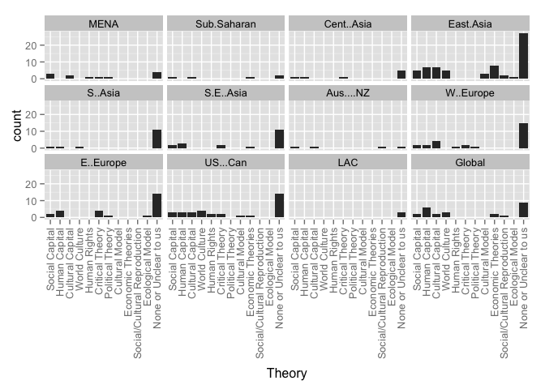 

### Counts for all entries

|                             | MENA| Sub.Saharan| Cent..Asia| East.Asia| S..Asia| S.E..Asia| Aus....NZ| W..Europe| E..Europe| US...Can| LAC| Global|
|:----------------------------|----:|-----------:|----------:|---------:|-------:|---------:|---------:|---------:|---------:|--------:|---:|------:|
|Social Capital               |    3|           1|          1|         5|       1|         2|         1|         2|         2|        3|   0|      2|
|Human Capital                |    0|           0|          1|         7|       1|         3|         0|         2|         4|        3|   0|      6|
|Cultural Capital             |    2|           1|          0|         7|       0|         0|         1|         4|         0|        3|   0|      2|
|World Culture                |    0|           0|          0|         5|       1|         0|         0|         0|         0|        4|   0|      3|
|Human Rights                 |    1|           0|          0|         0|       0|         0|         0|         1|         0|        2|   0|      0|
|Critical Theory              |    1|           0|          1|         0|       0|         2|         0|         2|         4|        2|   0|      0|
|Political Theory             |    1|           0|          0|         0|       0|         0|         0|         1|         1|        0|   0|      0|
|Cultural Model               |    0|           0|          0|         3|       0|         0|         0|         0|         0|        1|   0|      0|
|Economic Theories            |    0|           1|          0|         8|       0|         1|         0|         0|         0|        1|   0|      2|
|Social/Cultural Reproduction |    0|           0|          0|         2|       0|         0|         1|         0|         0|        0|   0|      1|
|Ecological Model             |    0|           0|          0|         1|       0|         0|         0|         0|         1|        0|   0|      0|
|None or Unclear to us        |    4|           2|          5|        27|      11|        11|         1|        15|        14|       14|   3|      9|
|value                        |    0|           0|          0|         0|       0|         0|         0|         0|         0|        0|   0|      0|

# Theoreortical framework by year group
### Graphs for all entries
 

### Counts for all entries

|        | Social.Capital| Human.Capital| Cultural.Capital| World.Culture| Human.Rights| Critical.Theory| Political.Theory| None.or.Unclear.to.us| Cultural.Model| Economic.Theories| Social...Cultural.Reproduction| Ecological.Model|
|:-------|--------------:|-------------:|----------------:|-------------:|------------:|---------------:|----------------:|---------------------:|--------------:|-----------------:|------------------------------:|----------------:|
|1980-84 |              0|             0|                0|             0|            0|               0|                0|                     1|              0|                 0|                              0|                0|
|1985-89 |              1|             0|                1|             0|            0|               0|                0|                     2|              0|                 0|                              1|                0|
|1990-94 |              1|             0|                1|             0|            0|               0|                0|                     4|              0|                 0|                              1|                0|
|1995-99 |              0|             2|                0|             0|            1|               0|                0|                     7|              0|                 0|                              0|                0|
|2000-04 |              1|             3|                3|             2|            0|               0|                0|                     8|              2|                 0|                              0|                0|
|2005-09 |              2|             7|                5|             3|            0|               2|                0|                    20|              1|                 4|                              2|                1|
|2010-14 |             13|            12|                9|             6|            3|               6|                1|                    59|              0|                 8|                              0|                1|

# Theoretical framework by research method
### Graphs for all entries
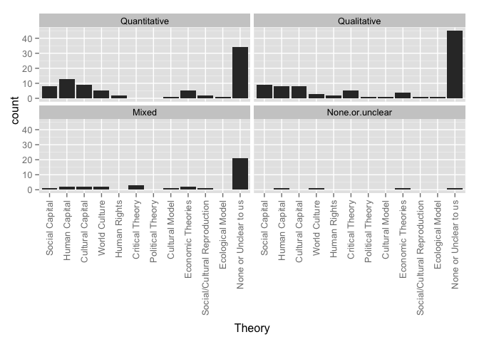 

### Counts for all entries

|                             | Quantitative| Qualitative| Mixed| None.or.unclear|
|:----------------------------|------------:|-----------:|-----:|---------------:|
|Social Capital               |            8|           9|     1|               0|
|Human Capital                |           13|           8|     2|               1|
|Cultural Capital             |            9|           8|     2|               0|
|World Culture                |            5|           3|     2|               1|
|Human Rights                 |            2|           2|     0|               0|
|Critical Theory              |            0|           5|     3|               0|
|Political Theory             |            0|           1|     0|               0|
|Cultural Model               |            1|           1|     1|               0|
|Economic Theories            |            5|           4|     2|               1|
|Social/Cultural Reproduction |            2|           1|     1|               0|
|Ecological Model             |            1|           1|     0|               0|
|None or Unclear to us        |           34|          45|    21|               1|
|value                        |            0|           0|     0|               0|

# Theoretical framework by research approach
### Graphs for all entries
 

### Counts for all entries

|                             | Single.country...case| Comparative|
|:----------------------------|---------------------:|-----------:|
|Social Capital               |                    13|           5|
|Human Capital                |                    17|           6|
|Cultural Capital             |                    15|           4|
|World Culture                |                     7|           4|
|Human Rights                 |                     4|           0|
|Critical Theory              |                     6|           2|
|Political Theory             |                     0|           1|
|Cultural Model               |                     1|           2|
|Economic Theories            |                     8|           4|
|Social/Cultural Reproduction |                     3|           1|
|Ecological Model             |                     1|           1|
|None or Unclear to us        |                    81|          20|
|value                        |                     0|           0|

# Framing by region
### Graphs for all entries
     

### Counts for all entries

|                        | MENA| Sub.Saharan| Cent..Asia| East.Asia| S..Asia| S.E..Asia| Aus....NZ| W..Europe| E..Europe| US...Can| LAC| Global|
|:-----------------------|----:|-----------:|----------:|---------:|-------:|---------:|---------:|---------:|---------:|--------:|---:|------:|
|Exam Prep               |   10|           4|          6|        47|      12|        14|         2|        19|        22|       25|   2|     17|
|Corruption              |    0|           1|          6|         6|       2|         6|         0|         1|         5|        0|   0|      8|
|Equity                  |   11|           3|          7|        27|       7|        13|         1|        16|        17|       12|   3|     11|
|Economic                |    0|           2|          3|        24|       6|         9|         0|         5|         6|       10|   0|      7|
|Social Cohesion         |    1|           0|          1|         2|       1|         1|         0|         1|         2|        0|   0|      1|
|Global Trend            |    2|           0|          2|        14|       6|         5|         0|         3|         6|        4|   2|     12|
|Household               |    1|           0|          2|        24|       6|        10|         0|         2|         4|        2|   1|      6|
|Culture                 |    0|           0|          0|         3|       1|         1|         0|         0|         0|        1|   0|      0|
|Teacher Professionalism |    0|           0|          1|         0|       0|         1|         0|         0|         2|        0|   0|      0|
|Parental Involvement    |    0|           0|          0|         1|       0|         0|         0|         1|         0|        0|   0|      0|
|value                   |    0|           0|          0|         0|       0|         0|         0|         0|         0|        0|   0|      0|

  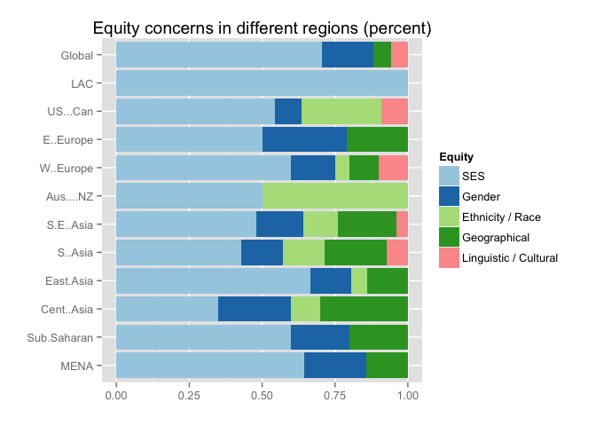   

|                      | MENA| Sub.Saharan| Cent..Asia| East.Asia| S..Asia| S.E..Asia| Aus....NZ| W..Europe| E..Europe| US...Can| LAC| Global|
|:---------------------|----:|-----------:|----------:|---------:|-------:|---------:|---------:|---------:|---------:|--------:|---:|------:|
|SES                   |    9|           3|          7|        24|       6|        12|         1|        12|        12|        6|   3|     12|
|Gender                |    3|           1|          5|         5|       2|         4|         0|         3|         7|        1|   0|      3|
|Ethnicity / Race      |    0|           0|          2|         2|       2|         3|         1|         1|         0|        3|   0|      0|
|Geographical          |    2|           1|          6|         5|       3|         5|         0|         2|         5|        0|   0|      1|
|Linguistic / Cultural |    0|           0|          0|         0|       1|         1|         0|         2|         0|        1|   0|      1|
|value                 |    0|           0|          0|         0|       0|         0|         0|         0|         0|        0|   0|      0|

# Framing by year group
### Graphs for all entries
 

### Counts for all entries

|        | Related.to.curriculum.coverage...ed..quality...exam.prep| Corruption| Equity| Supply...Demand...Economic.Efficiency| Social.Cohesion| Global.Trend| Household.Expenditures| Culture| Teacher.Professionalism| Parental.Involvement|
|:-------|--------------------------------------------------------:|----------:|------:|-------------------------------------:|---------------:|------------:|----------------------:|-------:|-----------------------:|--------------------:|
|1980-84 |                                                        1|          0|      1|                                     0|               0|            0|                      0|       0|                       0|                    0|
|1985-89 |                                                        3|          0|      2|                                     0|               1|            0|                      0|       0|                       0|                    0|
|1990-94 |                                                        4|          0|      2|                                     1|               0|            0|                      2|       0|                       0|                    0|
|1995-99 |                                                        6|          1|      5|                                     3|               0|            1|                      2|       0|                       0|                    0|
|2000-04 |                                                       16|          0|      7|                                     5|               0|            6|                      3|       1|                       0|                    0|
|2005-09 |                                                       37|          8|     25|                                    17|               2|           13|                     17|       1|                       1|                    0|
|2010-14 |                                                       89|         16|     63|                                    35|               4|           23|                     28|       1|                       1|                    2|

# Framed by research method
### Graphs for all entries
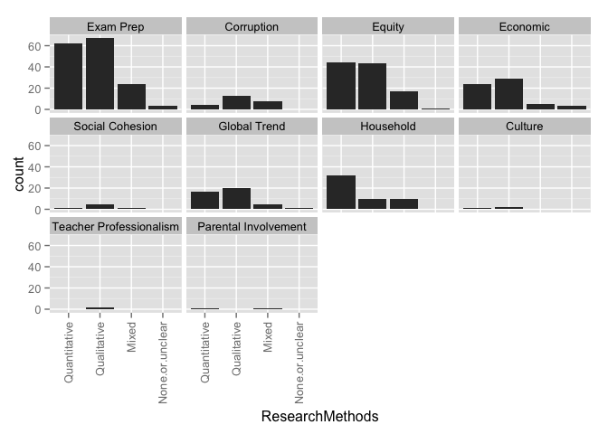 

### Counts for all entries

|                        | Quantitative| Qualitative| Mixed| None.or.unclear|
|:-----------------------|------------:|-----------:|-----:|---------------:|
|Exam Prep               |           62|          67|    24|               3|
|Corruption              |            4|          13|     8|               0|
|Equity                  |           44|          43|    17|               1|
|Economic                |           24|          29|     5|               3|
|Social Cohesion         |            1|           5|     1|               0|
|Global Trend            |           17|          20|     5|               1|
|Household               |           32|          10|    10|               0|
|Culture                 |            1|           2|     0|               0|
|Teacher Professionalism |            0|           2|     0|               0|
|Parental Involvement    |            1|           0|     1|               0|
|value                   |            0|           0|     0|               0|

# Framed by research approach
### Graphs for all entries
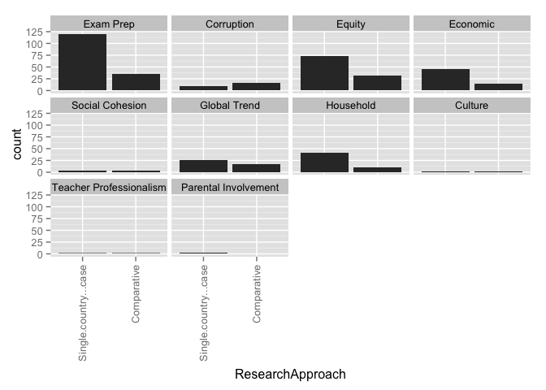 

### Counts for all entries

|                        | Single.country...case| Comparative|
|:-----------------------|---------------------:|-----------:|
|Exam Prep               |                   120|          36|
|Corruption              |                     9|          16|
|Equity                  |                    74|          31|
|Economic                |                    46|          14|
|Social Cohesion         |                     4|           3|
|Global Trend            |                    26|          17|
|Household               |                    41|          11|
|Culture                 |                     1|           2|
|Teacher Professionalism |                     1|           1|
|Parental Involvement    |                     2|           0|
|value                   |                     0|           0|

# Framed by theory
### Graphs for all entries
 

### Counts for all entries

|                                                         | Social Capital| Human Capital| Cultural Capital| World Culture| Human Rights| Critical Theory| Political Theory| Cultural.Model| Economic Theories| Social/Cultural Reproduction| Ecological Model| None or Unclear to us| value|
|:--------------------------------------------------------|--------------:|-------------:|----------------:|-------------:|------------:|---------------:|----------------:|--------------:|-----------------:|----------------------------:|----------------:|---------------------:|-----:|
|Related.to.curriculum.coverage...ed..quality...exam.prep |             15|            18|               17|            10|            3|               5|                1|              3|                12|                            4|                2|                    86|     0|
|Corruption                                               |              2|             5|                0|             1|            0|               1|                0|              0|                 3|                            0|                0|                    15|     0|
|Equity                                                   |             11|            11|               11|             6|            3|               6|                1|              0|                 8|                            2|                1|                    56|     0|
|Supply...Demand...Economic.Efficiency                    |              7|            16|                4|             5|            1|               1|                0|              1|                 6|                            0|                0|                    28|     0|
|Social.Cohesion                                          |              3|             3|                1|             0|            0|               0|                0|              0|                 1|                            0|                0|                     1|     0|
|Global.Trend                                             |              3|             9|                2|             5|            0|               1|                0|              0|                 5|                            1|                1|                    22|     0|
|Household.Expenditures                                   |              3|             7|                3|             2|            0|               0|                0|              1|                 8|                            1|                1|                    30|     0|
|Culture                                                  |              0|             0|                1|             0|            0|               0|                0|              1|                 0|                            0|                0|                     2|     0|
|Teacher.Professionalism                                  |              0|             0|                0|             0|            0|               2|                0|              0|                 0|                            0|                0|                     0|     0|
|Parental.Involvement                                     |              0|             0|                0|             0|            0|               0|                0|              0|                 0|                            0|                0|                     1|     0|

# How Viewed by region
### Graphs for all entries
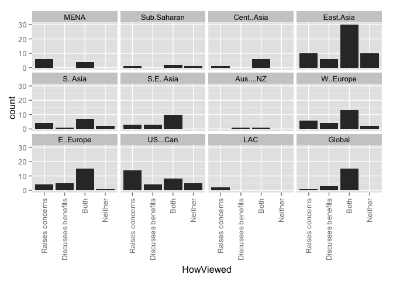 

### Counts for all entries

|                   | MENA| Sub.Saharan| Cent..Asia| East.Asia| S..Asia| S.E..Asia| Aus....NZ| W..Europe| E..Europe| US...Can| LAC| Global|
|:------------------|----:|-----------:|----------:|---------:|-------:|---------:|---------:|---------:|---------:|--------:|---:|------:|
|Raises concerns    |    6|           1|          1|        10|       4|         3|         0|         6|         4|       14|   2|      1|
|Discusses benefits |    0|           0|          0|         6|       1|         3|         1|         4|         5|        4|   0|      3|
|Both               |    4|           2|          6|        30|       7|        10|         1|        13|        15|        8|   0|     15|
|Neither            |    0|           1|          0|        10|       2|         0|         0|         2|         1|        5|   0|      0|
|value              |    0|           0|          0|         0|       0|         0|         0|         0|         0|        0|   0|      0|

# How Viewed by year group
### Graphs for all entries
 

### Counts for all entries

|        | Raises.concerns| Discusses.benefits| Both| Neither|
|:-------|---------------:|------------------:|----:|-------:|
|1980-84 |               0|                  0|    1|       0|
|1985-89 |               1|                  0|    1|       1|
|1990-94 |               0|                  0|    5|       0|
|1995-99 |               3|                  1|    5|       1|
|2000-04 |               4|                  5|    6|       2|
|2005-09 |               9|                  4|   22|       5|
|2010-14 |              32|                 10|   53|      11|

# HowViewed by research method
### Graphs for all entries
 

### Counts for all entries

|                   | Quantitative| Qualitative| Mixed| None.or.unclear|
|:------------------|------------:|-----------:|-----:|---------------:|
|Raises concerns    |           19|          20|     9|               1|
|Discusses benefits |            7|          11|     2|               0|
|Both               |           37|          43|    11|               2|
|Neither            |            9|           5|     5|               1|
|value              |            0|           0|     0|               0|

# HowViewed by research approach
### Graphs for all entries
 

### Counts for all entries

|                   | Single.country...case| Comparative|
|:------------------|---------------------:|-----------:|
|Raises concerns    |                    43|           6|
|Discusses benefits |                    16|           4|
|Both               |                    61|          31|
|Neither            |                    19|           1|
|value              |                     0|           0|

# HowViewed by theory
### Graphs for all entries
 

### Counts for all entries

|                   | Social Capital| Human Capital| Cultural Capital| World Culture| Human Rights| Critical Theory| Political Theory| Cultural.Model| Economic Theories| Social/Cultural Reproduction| Ecological Model| None or Unclear to us| value|
|:------------------|--------------:|-------------:|----------------:|-------------:|------------:|---------------:|----------------:|--------------:|-----------------:|----------------------------:|----------------:|---------------------:|-----:|
|Raises.concerns    |              5|             5|                7|             2|            4|               4|                1|              1|                 2|                            0|                0|                    23|     0|
|Discusses.benefits |              1|             5|                2|             2|            0|               0|                0|              0|                 0|                            0|                0|                    11|     0|
|Both               |             10|            13|                8|             4|            0|               4|                0|              2|                 8|                            3|                2|                    50|     0|
|Neither            |              2|             1|                2|             3|            0|               0|                0|              0|                 0|                            1|                0|                    13|     0|

# How Viewed by Framed
### Graphs for all entries
 

### Counts for all entries

|                                                         | Raises concerns| Discusses benefits| Both| Neither| value|
|:--------------------------------------------------------|---------------:|------------------:|----:|-------:|-----:|
|Related.to.curriculum.coverage...ed..quality...exam.prep |              44|                 15|   73|      18|     0|
|Corruption                                               |               6|                  0|   18|       0|     0|
|Equity                                                   |              33|                  4|   62|       2|     0|
|Supply...Demand...Economic.Efficiency                    |              12|                  8|   34|       6|     0|
|Social.Cohesion                                          |               1|                  2|    4|       0|     0|
|Global.Trend                                             |               9|                  6|   25|       2|     0|
|Household.Expenditures                                   |               8|                  1|   32|       6|     0|
|Culture                                                  |               2|                  1|    0|       0|     0|
|Teacher.Professionalism                                  |               0|                  0|    2|       0|     0|
|Parental.Involvement                                     |               0|                  0|    1|       1|     0|

# Stakeholders by region
### Graphs for all entries
 

### Counts for all entries

|                      | MENA| Sub.Saharan| Cent..Asia| East.Asia| S..Asia| S.E..Asia| Aus....NZ| W..Europe| E..Europe| US...Can| LAC| Global|
|:---------------------|----:|-----------:|----------:|---------:|-------:|---------:|---------:|---------:|---------:|--------:|---:|------:|
|Non-tutor teachers    |    4|           0|          0|        14|       2|         3|         1|         2|         6|        4|   1|      1|
|Teachers who tutor    |    5|           2|          0|        16|       2|         4|         1|         3|         6|        7|   1|      1|
|Tutors                |    2|           1|          0|         4|       1|         0|         0|         2|         3|        3|   0|      0|
|Parents               |    5|           2|          1|        22|       3|         8|         1|         6|         6|       10|   1|      1|
|Students              |    5|           1|          4|        32|       7|         7|         2|        11|        11|       12|   2|      4|
|School admin          |    1|           0|          0|         9|       0|         1|         0|         0|         0|        2|   0|      0|
|Tutoring center admin |    0|           0|          0|         1|       0|         0|         0|         1|         0|        1|   0|      0|
|Academic scholar(s)   |    0|           0|          0|         1|       0|         0|         0|         0|         0|        0|   0|      0|
|Policymakers          |    1|           1|          0|         3|       0|         2|         0|         0|         2|        2|   0|      0|
|Documents             |    4|           0|          2|        13|       5|         3|         0|        12|        14|       11|   1|     15|
|value                 |    0|           0|          0|         0|       0|         0|         0|         0|         0|        0|   0|      0|

# Stakeholders by year group
### Graphs for all entries
 

### Counts for all entries

|        | Teachers.who.do.not.tutor| Teachers.who.tutor| Tutors.who.are.not.teachers| School.administrators| Tutoring.center.admin| Academic.scholars| Parents...household| Students| Policymakers| Documents|
|:-------|-------------------------:|------------------:|---------------------------:|---------------------:|---------------------:|-----------------:|-------------------:|--------:|------------:|---------:|
|1980-84 |                         0|                  0|                           0|                     0|                     0|                 0|                   0|        0|            0|         1|
|1985-89 |                         1|                  2|                           0|                     0|                     0|                 0|                   0|        3|            0|         0|
|1990-94 |                         0|                  0|                           1|                     0|                     0|                 0|                   1|        3|            0|         2|
|1995-99 |                         2|                  3|                           0|                     1|                     0|                 0|                   3|        2|            3|         5|
|2000-04 |                         2|                  3|                           2|                     2|                     1|                 1|                   5|        8|            1|         6|
|2005-09 |                        10|                 13|                           3|                     4|                     2|                 0|                  14|       24|            1|        11|
|2010-14 |                        16|                 20|                           8|                     6|                     0|                 0|                  37|       48|            6|        39|

# Stakeholders by theory
### Graphs for all entries
 

### Counts for all entries

|                               | Non-tutor teachers| Tutors who tutor| Tutors| Parents| Students| Policymakers| Documents| School Admin| Tutoring Center Admin| Scholars| value|
|:------------------------------|------------------:|----------------:|------:|-------:|--------:|------------:|---------:|------------:|---------------------:|--------:|-----:|
|Social.Capital                 |                  3|                3|      0|       5|        8|            0|         5|            0|                     0|        0|     0|
|Human.Capital                  |                  0|                2|      0|       7|        9|            1|        10|            2|                     1|        0|     0|
|Cultural.Capital               |                  5|                7|      2|       5|       11|            1|         3|            2|                     2|        1|     0|
|World.Culture                  |                  2|                1|      0|       3|        4|            1|         5|            2|                     0|        0|     0|
|Human.Rights                   |                  1|                1|      0|       2|        2|            0|         3|            0|                     0|        0|     0|
|Critical.Theory                |                  1|                1|      0|       1|        2|            1|         5|            0|                     0|        0|     0|
|Political.Theory               |                  0|                0|      0|       0|        0|            0|         1|            0|                     0|        0|     0|
|None.or.Unclear.to.us          |                 13|               19|      7|      30|       45|            5|        34|            4|                     0|        0|     0|
|Cultural.Model                 |                  2|                3|      2|       2|        3|            1|         0|            2|                     1|        1|     0|
|Economic.Theories              |                  0|                2|      1|       3|        6|            0|         4|            1|                     0|        0|     0|
|Social...Cultural.Reproduction |                  2|                2|      0|       1|        4|            0|         0|            0|                     0|        0|     0|
|Ecological.Model               |                  2|                2|      1|       2|        2|            1|         1|            1|                     0|        0|     0|

# WhatTaught by region
### Graphs for all entries
 

### Counts for all entries

|                 | MENA| Sub.Saharan| Cent..Asia| East.Asia| S..Asia| S.E..Asia| Aus....NZ| W..Europe| E..Europe| US...Can| LAC| Global|
|:----------------|----:|-----------:|----------:|---------:|-------:|---------:|---------:|---------:|---------:|--------:|---:|------:|
|School subjects  |   11|           3|          4|        50|      10|        10|         2|        19|        19|       25|   3|     18|
|Extracurriculars |    0|           0|          0|         0|       0|         0|         0|         3|         3|        0|   0|      0|
|Both             |    0|           1|          3|         7|       4|         6|         0|         3|         3|        5|   0|      0|
|Not defined      |    0|           0|          0|         0|       0|         2|         0|         0|         0|        0|   0|      2|
|value            |    0|           0|          0|         0|       0|         0|         0|         0|         0|        0|   0|      0|

# WhatTaught by year group
### Graphs for all entries
 

### Counts for all entries

|        | Subjects.taught.in.school| Extracurricular.activities| Both| Not.defined|
|:-------|-------------------------:|--------------------------:|----:|-----------:|
|1980-84 |                         1|                          0|    0|           0|
|1985-89 |                         3|                          0|    0|           0|
|1990-94 |                         4|                          0|    1|           0|
|1995-99 |                         7|                          0|    1|           2|
|2000-04 |                        13|                          3|    1|           0|
|2005-09 |                        36|                          1|    5|           1|
|2010-14 |                        92|                          2|   13|           1|

# WhatTaught by theory
### Graphs for all entries
 

### Counts for all entries

|                               | School subjects| Extracurriculars| Both| Not defined| value|
|:------------------------------|---------------:|----------------:|----:|-----------:|-----:|
|Social.Capital                 |              12|                1|    4|           1|     0|
|Human.Capital                  |              15|                3|    4|           2|     0|
|Cultural.Capital               |              15|                2|    2|           0|     0|
|World.Culture                  |              11|                0|    0|           0|     0|
|Human.Rights                   |               4|                0|    0|           0|     0|
|Critical.Theory                |               7|                0|    1|           0|     0|
|Political.Theory               |               1|                0|    0|           0|     0|
|None.or.Unclear.to.us          |              84|                1|   13|           2|     0|
|Cultural.Model                 |               3|                0|    0|           0|     0|
|Economic.Theories              |              12|                0|    0|           0|     0|
|Social...Cultural.Reproduction |               4|                0|    0|           0|     0|
|Ecological.Model               |               1|                0|    1|           0|     0|

# WhereOccur by region
### Graphs for all entries
 

### Counts for all entries

|                  | MENA| Sub.Saharan| Cent..Asia| East.Asia| S..Asia| S.E..Asia| Aus....NZ| W..Europe| E..Europe| US...Can| LAC| Global|
|:-----------------|----:|-----------:|----------:|---------:|-------:|---------:|---------:|---------:|---------:|--------:|---:|------:|
|On school grounds |    4|           3|          6|        13|       3|         8|         1|         5|        11|        8|   1|      8|
|Designated center |    8|           1|          2|        35|       6|         7|         1|        15|        12|       24|   2|      9|
|Web               |    3|           0|          2|        13|       3|         3|         0|         5|         8|        7|   0|      7|
|Student's home    |    6|           2|          6|        15|       5|         6|         1|         9|        12|        8|   0|      8|
|Outside school    |    5|           0|          5|        22|       6|         5|         1|        10|        12|        9|   2|     11|
|Not defined       |    2|           1|          1|        16|       6|         8|         1|         7|         4|        3|   1|      6|
|value             |    0|           0|          0|         0|       0|         0|         0|         0|         0|        0|   0|      0|

# WhereOccur by year group
### Graphs for all entries
 

### Counts for all entries

|        | On.school.grounds| Designated.tutoring.center.or.franchise| On.line...via.web| In.the.student.s.home| Other.outside.school| Not.defined|
|:-------|-----------------:|---------------------------------------:|-----------------:|---------------------:|--------------------:|-----------:|
|1980-84 |                 0|                                       1|                 0|                     0|                    0|           0|
|1985-89 |                 0|                                       1|                 0|                     1|                    0|           2|
|1990-94 |                 1|                                       5|                 0|                     4|                    4|           0|
|1995-99 |                 2|                                       6|                 0|                     0|                    2|           5|
|2000-04 |                 3|                                      11|                 2|                     6|                    8|           1|
|2005-09 |                10|                                      17|                 3|                    11|                   14|          18|
|2010-14 |                36|                                      63|                32|                    36|                   43|          26|

# WhereOccur by theory
### Graphs for all entries
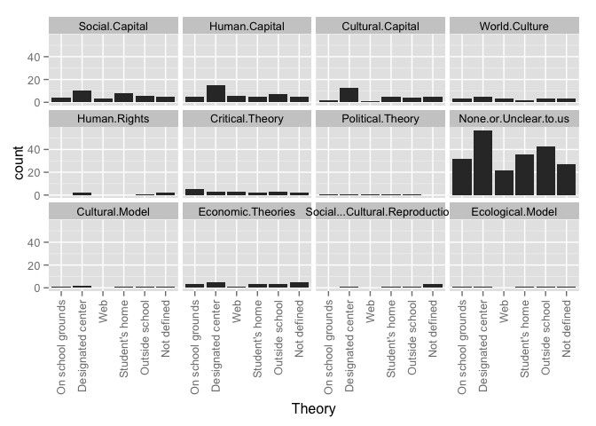 

### Counts for all entries

|                               | On school grounds| Designated center| Web| Student's home| Outside school| Not defined| value|
|:------------------------------|-----------------:|-----------------:|---:|--------------:|--------------:|-----------:|-----:|
|Social.Capital                 |                 4|                10|   3|              8|              6|           5|     0|
|Human.Capital                  |                 5|                15|   6|              5|              7|           5|     0|
|Cultural.Capital               |                 2|                13|   1|              5|              4|           5|     0|
|World.Culture                  |                 3|                 5|   3|              2|              3|           3|     0|
|Human.Rights                   |                 0|                 2|   0|              0|              1|           2|     0|
|Critical.Theory                |                 5|                 3|   3|              2|              3|           2|     0|
|Political.Theory               |                 1|                 1|   1|              1|              1|           0|     0|
|None.or.Unclear.to.us          |                32|                57|  22|             36|             43|          27|     0|
|Cultural.Model                 |                 1|                 2|   0|              1|              1|           1|     0|
|Economic.Theories              |                 3|                 5|   1|              3|              3|           5|     0|
|Social...Cultural.Reproduction |                 0|                 1|   0|              1|              1|           3|     0|
|Ecological.Model               |                 1|                 1|   0|              1|              1|           1|     0|

# WhoProvides by region
### Graphs for all entries
 

### Counts for all entries

|                | MENA| Sub.Saharan| Cent..Asia| East.Asia| S..Asia| S.E..Asia| Aus....NZ| W..Europe| E..Europe| US...Can| LAC| Global|
|:---------------|----:|-----------:|----------:|---------:|-------:|---------:|---------:|---------:|---------:|--------:|---:|------:|
|Current teacher |    4|           3|          6|        16|       7|        12|         1|         5|        14|        2|   1|     15|
|Other k-12      |    5|           3|          6|        18|       8|        10|         1|         6|        15|        7|   1|     13|
|Retired teacher |    1|           0|          2|         8|       4|         3|         0|         7|         5|        2|   1|      6|
|Univ. faculty   |    1|           0|          2|         3|       3|         2|         0|         4|         7|        0|   0|      9|
|Professional    |    7|           1|          5|        30|       6|         8|         0|        14|        14|       16|   0|     12|
|Col. student    |    1|           0|          2|         9|       4|         3|         0|         6|         2|        2|   0|      6|
|Peer            |    2|           0|          1|         2|       4|         1|         0|         2|         2|        0|   0|      0|
|Family          |    0|           0|          1|         2|       3|         1|         0|         0|         0|        0|   0|      1|
|Community       |    0|           0|          1|         1|       5|         1|         0|         1|         1|        2|   0|      4|
|Not defined     |    2|           0|          1|        20|       5|         5|         1|        10|         7|       10|   2|      4|
|value           |    0|           0|          0|         0|       0|         0|         0|         0|         0|        0|   0|      0|

# WhoProvides by year group
### Graphs for all entries
 

### Counts for all entries

|        | Current.classroom.teacher| Other.K.12.teachers| Retired.teacher| University.faculty| Institution...Professional.tutor| College.student| Peer.classmate| Parent.or.family.member| Community.member...volunteer| Not.defined|
|:-------|-------------------------:|-------------------:|---------------:|------------------:|--------------------------------:|---------------:|--------------:|-----------------------:|----------------------------:|-----------:|
|1980-84 |                         0|                   1|               0|                  0|                                0|               0|              0|                       0|                            0|           0|
|1985-89 |                         1|                   1|               1|                  0|                                1|               1|              0|                       0|                            0|           1|
|1990-94 |                         1|                   2|               0|                  0|                                3|               0|              0|                       2|                            2|           0|
|1995-99 |                         4|                   2|               0|                  0|                                6|               0|              1|                       0|                            0|           1|
|2000-04 |                         4|                   5|               4|                  1|                               12|               0|              0|                       0|                            0|           4|
|2005-09 |                        20|                  19|               6|                  9|                               19|               4|              3|                       1|                            6|          15|
|2010-14 |                        36|                  43|              19|                 14|                               55|              21|              4|                       2|                            5|          37|

# WhoProvides by theory
### Graphs for all entries
 

### Counts for all entries

|                               | Current teacher| Other k-12| Retired teacher| Univ. faculty| Professional| Col. student| Peer| Family| Community| Not defined| value|
|:------------------------------|---------------:|----------:|---------------:|-------------:|------------:|------------:|----:|------:|---------:|-----------:|-----:|
|Social.Capital                 |               4|          5|               2|             3|           11|            2|    1|      1|         1|           6|     0|
|Human.Capital                  |               9|          9|               4|             5|           15|            3|    1|      1|         3|           7|     0|
|Cultural.Capital               |               3|          5|               4|             2|           11|            2|    0|      0|         1|           7|     0|
|World.Culture                  |               1|          1|               1|             0|            5|            1|    0|      0|         0|           6|     0|
|Human.Rights                   |               0|          0|               0|             0|            2|            0|    0|      0|         0|           2|     0|
|Critical.Theory                |               4|          3|               2|             1|            3|            1|    0|      0|         0|           2|     0|
|Political.Theory               |               0|          0|               0|             0|            0|            0|    0|      0|         0|           1|     0|
|None.or.Unclear.to.us          |              41|         43|              17|            15|           50|           17|    5|      4|         8|          29|     0|
|Cultural.Model                 |               1|          2|               2|             0|            2|            0|    0|      0|         0|           1|     0|
|Economic.Theories              |               6|          7|               1|             2|            5|            2|    1|      0|         1|           3|     0|
|Social...Cultural.Reproduction |               1|          1|               0|             0|            1|            0|    0|      0|         0|           2|     0|
|Ecological.Model               |               1|          1|               1|             1|            1|            0|    0|      0|         0|           1|     0|

# DoesCharge by region
### Graphs for all entries
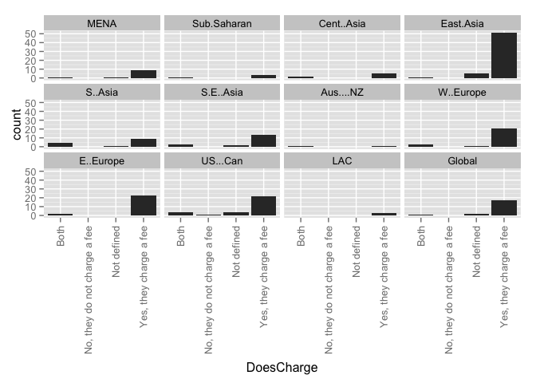 

### Counts for all entries

|                             | MENA| Sub.Saharan| Cent..Asia| East.Asia| S..Asia| S.E..Asia| Aus....NZ| W..Europe| E..Europe| US...Can| LAC| Global|
|:----------------------------|----:|-----------:|----------:|---------:|-------:|---------:|---------:|---------:|---------:|--------:|---:|------:|
|                             |    0|           0|          0|         0|       0|         0|         0|         0|         0|        0|   0|      0|
|Both                         |    1|           1|          2|         1|       4|         3|         1|         3|         2|        4|   0|      1|
|No, they do not charge a fee |    0|           0|          0|         0|       0|         0|         0|         0|         0|        1|   0|      0|
|Not defined                  |    1|           0|          0|         5|       1|         2|         0|         1|         0|        4|   0|      2|
|Yes, they charge a fee       |    9|           3|          5|        51|       9|        13|         1|        21|        23|       22|   3|     17|

# DoesCharge by year group
### Graphs for all entries
 

### Counts for all entries

|        |   | Both| No, they do not charge a fee| Not defined| Yes, they charge a fee|
|:-------|--:|----:|----------------------------:|-----------:|----------------------:|
|1980-84 |  0|    0|                            0|           0|                      1|
|1985-89 |  0|    0|                            0|           0|                      3|
|1990-94 |  0|    0|                            0|           0|                      5|
|1995-99 |  0|    0|                            0|           2|                      9|
|2000-04 |  0|    1|                            0|           1|                     15|
|2005-09 |  0|    5|                            0|           4|                     34|
|2010-14 |  0|   11|                            1|           5|                     91|

# DoesCharge by WhoProvides
### Graphs for all entries
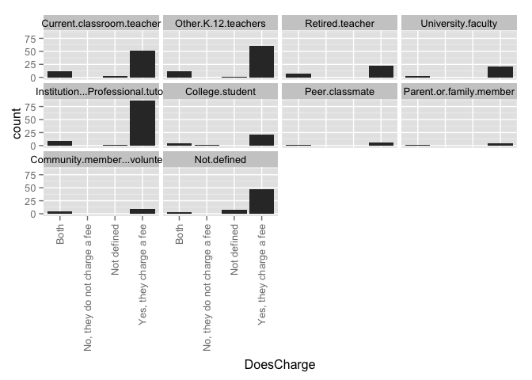 

### Counts for all entries

|                             | Current.classroom.teacher| Other.K.12.teachers| Retired.teacher| University.faculty| Institution...Professional.tutor| College.student| Peer.classmate| Parent.or.family.member| Community.member...volunteer| Not.defined|
|:----------------------------|-------------------------:|-------------------:|---------------:|------------------:|--------------------------------:|---------------:|--------------:|-----------------------:|----------------------------:|-----------:|
|                             |                         0|                   0|               0|                  0|                                0|               0|              0|                       0|                            0|           0|
|Both                         |                        12|                  12|               7|                  3|                                9|               4|              2|                       1|                            4|           3|
|No, they do not charge a fee |                         0|                   0|               0|                  0|                                0|               1|              0|                       0|                            0|           0|
|Not defined                  |                         3|                   1|               0|                  0|                                1|               0|              0|                       0|                            0|           8|
|Yes, they charge a fee       |                        51|                  60|              23|                 21|                               86|              21|              6|                       4|                            9|          47|

# ClassSize by Region
### Graphs for all entries
 

### Counts for all entries

|                              | MENA| Sub.Saharan| Cent..Asia| East.Asia| S..Asia| S.E..Asia| Aus....NZ| W..Europe| E..Europe| US...Can| LAC| Global|
|:-----------------------------|----:|-----------:|----------:|---------:|-------:|---------:|---------:|---------:|---------:|--------:|---:|------:|
|                              |    0|           0|          0|         0|       0|         0|         0|         0|         0|        0|   0|      0|
|Individual 1-on-1 instruction |    0|           0|          0|         0|       0|         0|         0|         1|         1|        1|   0|      0|
|Large groups                  |    0|           1|          0|         0|       0|         0|         0|         0|         0|        0|   0|      0|
|Small groups                  |    0|           0|          0|         0|       1|         1|         0|         2|         0|        5|   0|      1|
|Unclear                       |    2|           1|          1|        12|       4|         4|         0|         5|         3|        7|   1|      2|
|Various class sizes discussed |    9|           2|          6|        44|       9|        13|         2|        17|        21|       17|   2|     17|

# OperationSize by region
### Graphs for all entries
 

### Counts for all entries

|            | Not.defined.or.unclear| MENA| Sub.Saharan| Cent..Asia| East.Asia| S..Asia| S.E..Asia| Aus....NZ| W..Europe| E..Europe| US...Can| LAC| Global|
|:-----------|----------------------:|----:|-----------:|----------:|---------:|-------:|---------:|---------:|---------:|---------:|--------:|---:|------:|
|Individual  |                      0|    1|           0|          0|         1|       0|         3|         0|         2|         3|        1|   0|      1|
|Small firms |                      0|    2|           0|          0|         5|       0|         1|         0|         3|         1|        2|   0|      0|
|Large firm  |                      0|    1|           0|          0|         3|       0|         0|         0|         1|         1|        5|   0|      0|
|Various     |                      0|    9|           2|          7|        44|      11|        12|         2|        18|        21|       22|   2|     19|
|value       |                      0|    0|           0|          0|         0|       0|         0|         0|         0|         0|        0|   0|      0|

# Why Taking by region
### Graphs for all entries
 

### Counts for all entries

|                              | MENA| Sub.Saharan| Cent..Asia| East.Asia| S..Asia| S.E..Asia| Aus....NZ| W..Europe| E..Europe| US...Can| LAC| Global|
|:-----------------------------|----:|-----------:|----------:|---------:|-------:|---------:|---------:|---------:|---------:|--------:|---:|------:|
|Student falls behind          |    8|           3|          5|        37|      11|        11|         1|        14|        13|       24|   2|     15|
|Preparation for exams         |   10|           4|          6|        55|      13|        12|         1|        17|        18|       17|   3|     15|
|Make up for perceived failure |    8|           3|          7|        42|      13|        13|         0|        10|        16|       17|   1|     18|
|For cultural reasons          |    0|           0|          2|        29|       6|         8|         0|         4|         0|        5|   0|      7|
|Enrichment activities         |    0|           1|          2|         6|       4|         4|         0|         1|         3|        3|   0|      0|
|Peer pressure                 |    1|           0|          1|        12|       2|         2|         1|         3|         2|        0|   0|      4|
|Teacher pressure              |    2|           1|          1|         8|       2|         3|         0|         3|         4|        0|   0|      3|
|Government Pressure           |    1|           0|          0|         0|       0|         1|         0|         2|         2|        0|   0|      0|
|Not stated or unclear         |    0|           0|          0|         0|       0|         0|         0|         0|         0|        0|   0|      0|
|value                         |    0|           0|          0|         0|       0|         0|         0|         0|         0|        0|   0|      0|

# Why Taking by year group
### Graphs for all entries
 

### Counts for all entries

|        | Student.falls.behind.and.needs.extra.help| Preparation.for.exams.to.make.student.more.competitive| Make.up.for.perceived.failure.in.the.mainstream.system...school| For.cultural.reasons| To.provide.extra.enrichment.activities| Peer.pressure| Teacher.pressure| Government.pressure| Not.stated.or.unclear|
|:-------|-----------------------------------------:|------------------------------------------------------:|---------------------------------------------------------------:|--------------------:|--------------------------------------:|-------------:|----------------:|-------------------:|---------------------:|
|1980-84 |                                         0|                                                      1|                                                               0|                    0|                                      0|             0|                0|                   0|                     0|
|1985-89 |                                         2|                                                      3|                                                               1|                    0|                                      0|             1|                1|                   0|                     0|
|1990-94 |                                         2|                                                      4|                                                               4|                    0|                                      0|             1|                1|                   0|                     0|
|1995-99 |                                         4|                                                      5|                                                               7|                    0|                                      1|             0|                1|                   1|                     0|
|2000-04 |                                        12|                                                     12|                                                              12|                    7|                                      1|             3|                0|                   0|                     0|
|2005-09 |                                        27|                                                     32|                                                              27|                   12|                                      4|             4|                2|                   1|                     0|
|2010-14 |                                        73|                                                     89|                                                              70|                   30|                                      9|            13|               13|                   2|                     0|

# WhyTaking by research method
### Graphs for all entries
 

### Counts for all entries

|                              | Quantitative| Qualitative| Mixed| None.or.unclear|
|:-----------------------------|------------:|-----------:|-----:|---------------:|
|Student falls behind          |           41|          55|    20|               4|
|Preparation for exams         |           63|          58|    22|               3|
|Make up for perceived failure |           46|          56|    15|               4|
|For cultural reasons          |           23|          19|     7|               0|
|Enrichment activities         |            4|          10|     1|               0|
|Peer pressure                 |            8|           9|     5|               0|
|Teacher pressure              |            3|          10|     5|               0|
|Government pressure           |            0|           2|     2|               0|
|Not stated or unclear         |            0|           0|     0|               0|
|value                         |            0|           0|     0|               0|

# WhyTaking by research approach
### Graphs for all entries
 

### Counts for all entries

|                              | Single.country...case| Comparative|
|:-----------------------------|---------------------:|-----------:|
|Student falls behind          |                    86|          33|
|Preparation for exams         |                   111|          34|
|Make up for perceived failure |                    83|          37|
|For cultural reasons          |                    34|          15|
|Enrichment activities         |                    11|           4|
|Peer pressure                 |                    15|           7|
|Teacher pressure              |                     8|          10|
|Government pressure           |                     3|           1|
|Not stated or unclear         |                     0|           0|
|value                         |                     0|           0|

# WhyTaking by theory
### Graphs for all entries
 

### Counts for all entries

|                              | Social.Capital| Human.Capital| Cultural.Capital| World.Culture| Human.Rights| Critical.Theory| Political.Theory| None.or.Unclear.to.us| Cultural.Model| Economic.Theories| Social...Cultural.Reproduction| Ecological.Model|
|:-----------------------------|--------------:|-------------:|----------------:|-------------:|------------:|---------------:|----------------:|---------------------:|--------------:|-----------------:|------------------------------:|----------------:|
|Student falls behind          |             11|            16|               10|            10|            1|               6|                1|                    62|              2|                10|                              2|                2|
|Preparation for exams         |             15|            19|               16|             9|            3|               4|                1|                    77|              3|                11|                              3|                2|
|Make up for perceived failure |              9|            17|                7|             9|            2|               5|                1|                    61|              2|                10|                              0|                2|
|For cultural reasons          |              4|             7|                9|             2|            0|               0|                0|                    24|              3|                 5|                              1|                1|
|Enrichment activities         |              3|             3|                1|             0|            0|               0|                0|                     9|              0|                 1|                              0|                0|
|Peer pressure                 |              3|             3|                2|             2|            0|               1|                1|                    12|              1|                 2|                              1|                1|
|Teacher pressure              |              2|             3|                0|             1|            0|               1|                1|                    11|              0|                 2|                              0|                0|
|Government pressure           |              0|             0|                0|             0|            0|               1|                0|                     3|              0|                 0|                              0|                0|
|Not stated or unclear         |              0|             0|                0|             0|            0|               0|                0|                     0|              0|                 0|                              0|                0|
|value                         |             18|            24|               19|            11|            4|               8|                1|                   101|              3|                12|                              4|                2|

# Why Taking by Framed
### Graphs for all entries
 

### Counts for all entries

|                                                         | Student falls behind| Preparation for exams| Make up for perceived failure| For cultural reasons| Enrichment activities| Peer pressure| Teacher pressure| Government pressure| Not stated or unclear| value|
|:--------------------------------------------------------|--------------------:|---------------------:|-----------------------------:|--------------------:|---------------------:|-------------:|----------------:|-------------------:|---------------------:|-----:|
|Related.to.curriculum.coverage...ed..quality...exam.prep |                  109|                   126|                           104|                   43|                     8|            21|               18|                   4|                     0|     0|
|Corruption                                               |                   21|                    22|                            18|                    8|                     5|             5|                9|                   0|                     0|     0|
|Equity                                                   |                   75|                    90|                            69|                   25|                     7|            13|               15|                   1|                     0|     0|
|Supply...Demand...Economic.Efficiency                    |                   42|                    51|                            47|                   19|                     8|             7|                6|                   0|                     0|     0|
|Social.Cohesion                                          |                    5|                     5|                             6|                    3|                     3|             1|                1|                   0|                     0|     0|
|Global.Trend                                             |                   35|                    37|                            32|                   14|                     5|             9|               10|                   0|                     0|     0|
|Household.Expenditures                                   |                   31|                    45|                            37|                   22|                     4|            12|               10|                   1|                     0|     0|
|Culture                                                  |                    2|                     3|                             2|                    3|                     1|             0|                0|                   0|                     0|     0|
|Teacher.Professionalism                                  |                    0|                     0|                             1|                    0|                     0|             0|                0|                   1|                     0|     0|
|Parental.Involvement                                     |                    0|                     2|                             1|                    0|                     0|             0|                0|                   0|                     0|     0|
